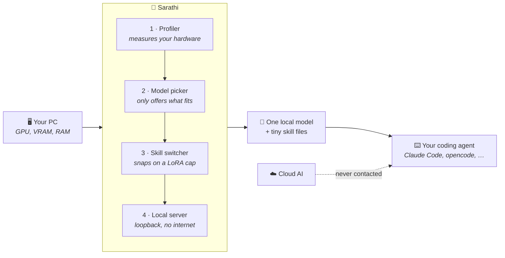
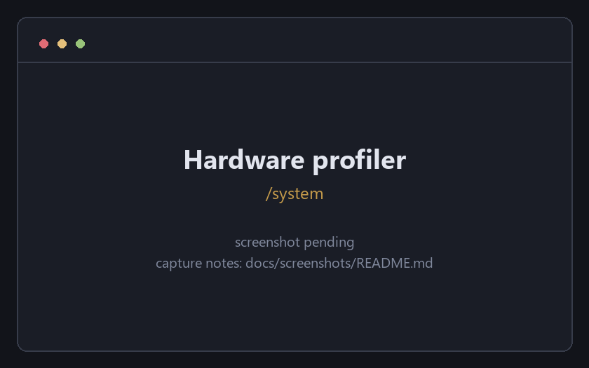
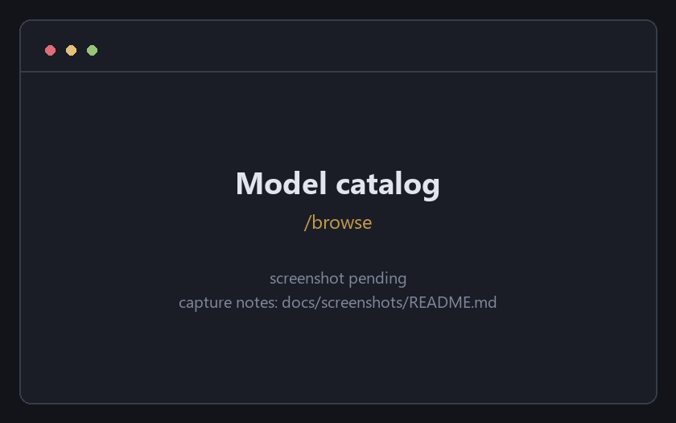
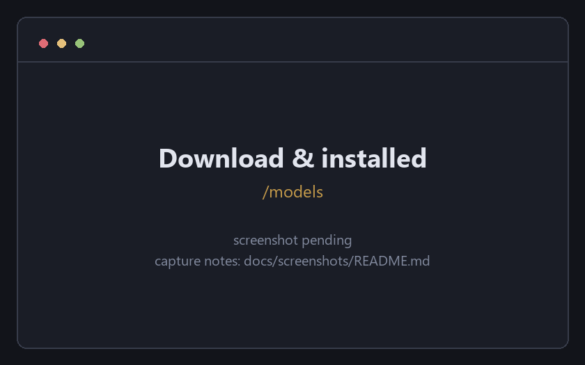
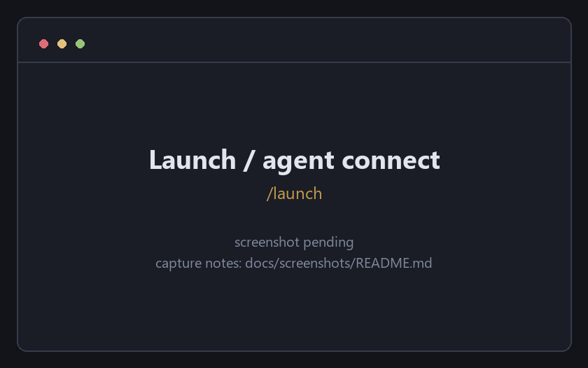
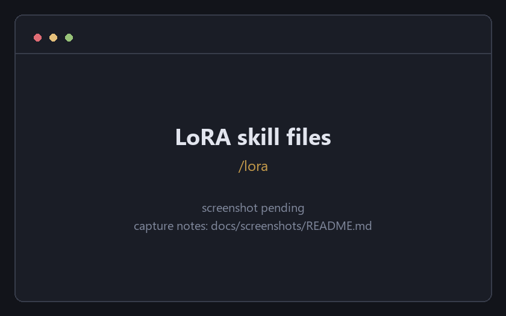
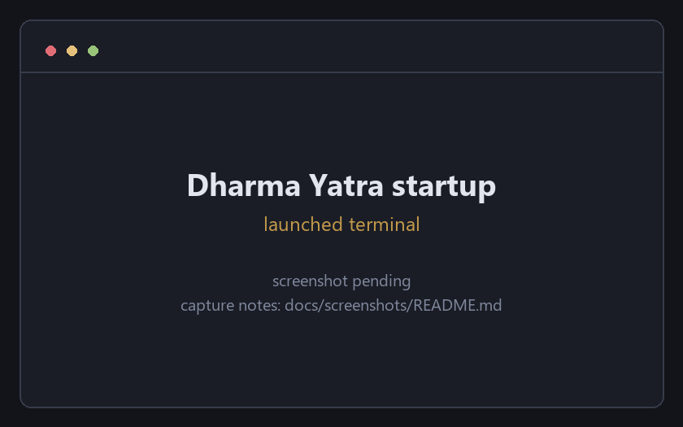
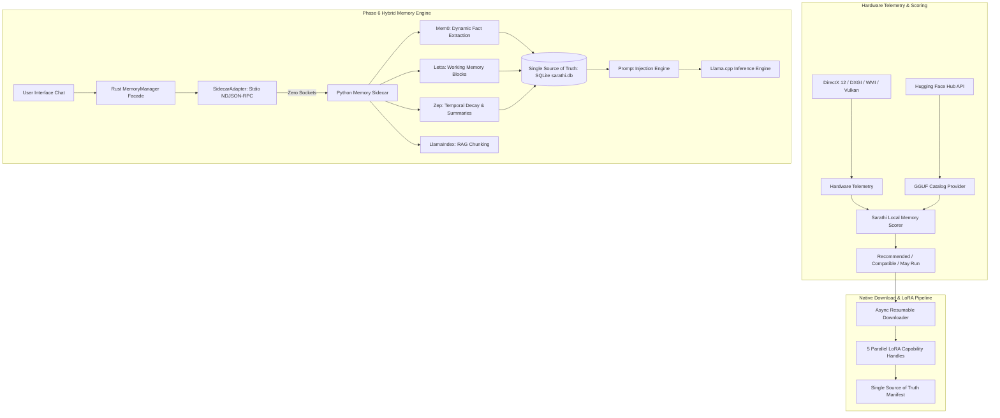

<div align="center">

#  Sarathi (सारथी)

### Your private AI, on your own PC.

**Sarathi lets you run AI coding assistants entirely on your own computer — no cloud, no subscription, and no internet needed once it's set up.**

[](https://tauri.app/)
[](https://www.rust-lang.org/)
[](https://react.dev/)
[](https://www.typescriptlang.org/)
[](https://www.python.org/)

*Smart India Hackathon 2026 · Team Sankalp · Pimpri Chinchwad University, Pune*

</div>

---

## Contents

- [Why this matters](#why-this-matters)
- [What works today vs. what's planned](#what-works-today-vs-whats-planned)
- [How it works](#how-it-works)
- [Screenshots](#screenshots)
- [Verified claims / key commits](#verified-claims--key-commits)
- [How to verify these claims yourself](#how-to-verify-these-claims-yourself)
- [For developers](#for-developers)
  - [Architecture](#architecture)
  - [System features in detail](#system-features-in-detail)
  - [Tech stack](#tech-stack)
  - [Getting started](#getting-started)
  - [GPU-accelerated builds](#gpu-accelerated-builds)
  - [Verification harnesses](#verification-harnesses)

---

## Why this matters

**AI coding tools charge you by the word.** Every question you ask a cloud AI
assistant costs money — a few paise here, a few rupees there — and it never
stops. For a student or a solo developer, a tool that bills per use is a tool
you learn to avoid using. The work itself hasn't got harder; the meter has just
been switched on.

**The obvious fix — run the AI on your own machine — hits a wall.** Good AI
models are large, and they have to fit inside your graphics card's memory
(VRAM) to run at a usable speed. A typical gaming laptop has 8 GB. A serious
coding model plus a maths model plus a writing model do not fit in 8 GB at the
same time. Try it and the machine stalls, swaps to disk, or simply refuses. So
most people give up and go back to the cloud.

**And there's a third cost that doesn't show up on a bill: your code leaves the
building.** Every prompt you send to a cloud assistant carries your source code,
your client's data, or your patient records to someone else's server. For a
small firm under contract, or anyone working with regulated data, that alone
rules the tool out.

Sarathi's answer is to hold **one** modestly-sized AI model in memory and snap
small, specialised "skill files" onto it — a coding skill, a maths skill, a
reasoning skill — swapping them as the task changes. The skill files are a tiny
fraction of the size of a full model, so a machine that could hold one model can
now behave like it holds several. Before any of that, Sarathi measures your
actual hardware and only offers you models it has calculated will genuinely fit.

---

## What works today vs. what's planned

This table is deliberately conservative. ✅ means it is built, wired into the
running app, and covered by a test you can run yourself (see
[How to verify](#how-to-verify-these-claims-yourself)). 🔧 means it exists but
is partial or not yet wired everywhere. ❌ means it is designed but not built.

| Capability | Status | Notes |
| :--- | :---: | :--- |
| **Hardware profiler** — reads your real GPU, VRAM, RAM and OS | ✅ | Windows WMI/CIM, DirectX 12 (DXGI) and Vulkan. Separates dedicated VRAM from shared memory. |
| **Model catalog matched to your PC** — sorts models into Recommended / Compatible / May Run | ✅ | Live Hugging Face sweep, cached on disk. Sizing is computed from the real GGUF header, not the filename. |
| **Resumable model downloads** | ✅ | HTTP Range resume for interrupted files; no zero-byte resets. |
| **Runs the model on your GPU** — in-process GGUF inference | ✅ | `llama-cpp-2`. Layer offload decided at runtime from measured VRAM. |
| **LoRA skill files: download + validation** | ✅ | Structural validation and a manifest registry, so a corrupt or non-LoRA file is refused before it is used. See [`24b9547`](#verified-claims--key-commits). |
| **LoRA skill files: applied to the running model** | ✅ | Real `llama_adapter_lora_init` / `llama_set_adapters_lora` binding via [`lora_binding.rs`](src-tauri/src/ai_engine/lora_binding.rs), with an adapter cache. |
| **Picking the right skill for a prompt** — intent classifier | ✅ | Weighted, confidence-scored classifier ([`capability/classifier.rs`](src-tauri/src/capability/classifier.rs)); won't switch skills on a single weak keyword. |
| **Converting community PEFT adapters to loadable GGUF** | ✅ | [`src-tauri/src/lora/convert/`](src-tauri/src/lora/convert/). DoRA and non-LoRA adapters are refused early rather than half-converted. |
| **Local server your coding agent connects to** | ✅ | OpenAI- **and** Anthropic-compatible endpoints on a loopback address. Tool calls are carried through to the chat template and parsed back out. |
| **Launching coding agents from Sarathi** | ✅ | Each tool gets its own terminal window and its own startup screen showing what actually loaded. |
| **MCP capability layer** — one registry, every tool | ✅ | A server declared once in `mcp.json` is written into each launched tool's own config dialect. |
| **Hybrid memory (Mem0 · Letta · Zep · LlamaIndex)** | 🔧 | Python sidecar and SQLite store are built and wired into Sarathi's own chat. **Not yet injected into the gateway**, so an external coding agent does not get memory yet. |
| **Adapter hot-swap without rebuilding the context** | 🔧 | The adapter is bound per generation against a freshly created context. Correct, but not the zero-cost mid-conversation swap the design targets. |
| **Training / fine-tuning your own skill files** | ❌ | Out of scope by design — adapters are fine-tuned externally. Sarathi orchestrates and serves them. |
| **Linux and macOS builds** | ❌ | The hardware profiler is Windows-first (WMI/DXGI). The Vulkan and CPU inference paths are cross-platform; the profiler is not. |

> **On the deck's headline numbers.** The *~78% less VRAM* and *~99% smaller
> skill files* figures in the SIH deck come from the project synopsis, not from
> a benchmark in this repository. What this repository *does* measure is
> reported under [Verification harnesses](#verification-harnesses): on an
> RTX 5060 (8 GB) CUDA build, every installed model placed **all** its layers on
> the GPU — including a mixture-of-experts model at 32 experts / 4 active — with
> VRAM moving 955 → 6971 MiB and GPU utilisation peaking at 88%.

---

## How it works



**In plain language:**

1. **Sarathi looks at your computer first.** It reads your graphics card, how
   much video memory it really has, and how much system RAM you have — then
   works out, in bytes, what will actually fit.
2. **It shows you only the AI models that will run on your machine**, sorted
   into Recommended, Compatible and May Run. It checks each model's real file
   header before downloading, so you don't get a surprise.
3. **It keeps one model loaded and snaps small skill files onto it.** Ask a
   coding question and the coding skill is applied; ask a maths question and it
   swaps. The skill files are small, so this doesn't need more memory.
4. **It runs as a quiet local server that your coding tool talks to.** Point
   Claude Code, opencode, or anything that speaks the OpenAI or Anthropic API at
   a loopback address, and it works exactly as if it were talking to the cloud —
   except nothing leaves your machine.

---

## Screenshots

> **These are placeholder tiles.** Sarathi is a native Windows desktop
> application and could not be launched and captured from the automated
> environment this README was written in. **Overwrite** the files in
> `docs/screenshots/` — same filenames — and the real captures appear here with
> no README edit. See [`docs/screenshots/README.md`](docs/screenshots/README.md)
> for what each shot should show and how to compress it.

| | |
| :---: | :---: |
|  |  |
| **Hardware profiler** — the GPU, VRAM and RAM Sarathi actually detected. | **Model catalog** — models sorted by whether they fit *this* machine. |
|  |  |
| **Download & load** — resumable downloads and the installed model shelf. | **Launch** — starting a coding agent against the local gateway. |
|  |  |
| **LoRA skill files** — discovered and validated capability adapters. | **Dharma Yatra** — the launch terminal reporting what really loaded. |

---

## Verified claims / key commits

These are the exact commits referenced in the SIH 2026 deck. Both resolve on
GitHub and can be inspected directly.

| Commit | What it proves |
| :--- | :--- |
| [`6b37eaa`](https://github.com/Straw-hat-Luffy26/Sarathi/commit/6b37eaa960d25b533940d1d692cdcff2e4503bd6) | **Four-model load / unload / reload audit.** Runtime model load, GPU offloading, tensor binding, unloading and reloading verified against real 4.2 GB GGUF binaries — not mocks. Adds [`src-tauri/tests/verify_llama_runtime.rs`](src-tauri/tests/verify_llama_runtime.rs). |
| [`24b9547`](https://github.com/Straw-hat-Luffy26/Sarathi/commit/24b9547175f65c88a88526c709dc42fd0b045758) | **Fixed adapter downloads producing 1 KB placeholder files.** Rebuilds real LoRA weight streaming, adds structural validation and a single-source-of-truth manifest registry, so an adapter is either genuinely on disk or reported as failed. |

> **Note on branches.** Both commits live on the side branches
> `fix/discover-hardware-and-downloads`, `feat/lora-end-to-end` and
> `chore/require-gstack` — they are **not** ancestors of `main`, because `main`
> was rewritten at some point (the pre-rewrite state is preserved on the local
> `backup-before-author-rewrite` branch). The equivalent commits on `main` are
> [`631b090`](https://github.com/Straw-hat-Luffy26/Sarathi/commit/631b090) and
> [`8fcb71d`](https://github.com/Straw-hat-Luffy26/Sarathi/commit/8fcb71d),
> with identical subjects. The deck's hashes still resolve on GitHub, so the
> links above work as written.

---

## How to verify these claims yourself

Nothing here asks you to take the table above on trust. The suites under
`src-tauri/tests/` exercise the real thing — they load installed GGUFs through
the same call the gateway makes, and resolve real repositories against the live
Hugging Face Hub.

```bash
cd src-tauri
cargo test
```

| Claim from the table | Check it with |
| :--- | :--- |
| Models genuinely load *and* answer | [`verify_llama_runtime.rs`](src-tauri/tests/verify_llama_runtime.rs) |
| GPU placement is decided at runtime, not hardcoded | [`verify_real_world_model_switching.rs`](src-tauri/tests/verify_real_world_model_switching.rs) |
| Every installed GGUF is classified correctly | [`verify_certification_system.rs`](src-tauri/tests/verify_certification_system.rs) |
| No model is auto-loaded behind your back | [`verify_auto_load_disabled.rs`](src-tauri/tests/verify_auto_load_disabled.rs) |
| Catalog progress reports real phases, not a fake spinner | [`verify_progress_reporting.rs`](src-tauri/tests/verify_progress_reporting.rs) |
| One MCP registry reaches every launched tool | [`mcp_reaches_every_provider.rs`](src-tauri/tests/mcp_reaches_every_provider.rs) |
| The UI never freezes on a sync command | [`ui_thread_stays_free.rs`](src-tauri/tests/ui_thread_stays_free.rs) |
| A failed request is an error, never a blank answer | [`a_failed_request_never_looks_like_an_empty_answer.rs`](src-tauri/tests/a_failed_request_never_looks_like_an_empty_answer.rs) |
| Offload decisions and layer sweeps | [`examples/verify_offload_evidence.rs`](src-tauri/examples/verify_offload_evidence.rs), [`examples/sweep_offload_layers.rs`](src-tauri/examples/sweep_offload_layers.rs) |
| Catalog size numbers match the real files | [`examples/verify_catalog_sizes.rs`](src-tauri/examples/verify_catalog_sizes.rs) |

---

# For developers

Everything below is the technical description. If you only wanted to know what
Sarathi is, you can stop here.

## Architecture



## System features in detail

### 1. Deep physical system telemetry
- **Hardware Telemetry**: Scans Windows WMI/CIM, DirectX 12 (DXGI), Vulkan, and System APIs.
- **Memory Domain Separation**: Distinguishes Dedicated Video RAM (VRAM) from Shared System Memory and Physical System RAM.
- **Multi-GPU & iGPU Awareness**: Tailored offloading calculations across NVIDIA CUDA, AMD ROCm/Vulkan, Intel Arc/OneAPI, and CPU-only setups.

### 2. Hardware-matched model recommendation engine
- **Live Hugging Face Catalog**: Dynamic retrieval of open-weight GGUF architectures (Qwen, Llama, Gemma, Mistral, Phi, DeepSeek, etc.).
- **Deterministic Memory Budgeting**: Calculates model weight footprint ($W_{\text{bytes}} = \frac{N_{\text{params}} \times \text{bpw}}{8} \times 1.06$) and KV-cache overhead (accounting for MHA/GQA, layer depth, head dimensions, and context windows up to 128k).

### 3. Parallel resumable downloader & LoRA adapter pipeline
- **Concurrent LoRA Capability Discovery**: Spawns 5 independent async `tokio::spawn` tasks for capabilities (`coding`, `reasoning`, `tool-calling`, `mathematics`, `research`) running in parallel with the base model GGUF download.
- **HTTP Range Header Resume**: Automatic resume for interrupted `.part` weight files. Zero zero-byte resets.
- **Single Source of Truth Manifest**: Prevents accidental adapter deletion or re-download loops.

### 4. In-process LLM inference engine (`llama-cpp-2`)
- **Direct GPU Offloading**: Configurable GPU layer offloading and thread allocation.
- **Dynamic Prompt Formatting**: Built-in Jinja/ChatML, Llama 3, Gemma, and Mistral template formatting.
- **Leak-Proof Stream Parser**: Real-time filtering of special control tokens (`<|im_end|>`, `<|im_start|>`) and reasoning tags (`<think>...</think>`).
- **LoRA Binding**: `llama_adapter_lora_init` / `llama_set_adapters_lora` through [`lora_binding.rs`](src-tauri/src/ai_engine/lora_binding.rs), bound before prefill so the prompt is processed against the adapted weights. A bind failure logs and falls back to the base model rather than failing the request.

### 5. Phase 6 hybrid local memory engine
- **Direct Framework Integration**: Integrates proven open-source memory systems (**Mem0**, **Letta**, **Zep**, **LlamaIndex**) directly within a plugin-based Python sidecar.
- **Zero-Firewall Stdio IPC**: Operates over newline-delimited JSON-RPC 2.0 via `stdin`/`stdout`. Zero listening ports, zero firewall authorization prompts, 100% child process lifetime coupling.
- **Strict Storage Ownership**: Frameworks act strictly as pure processors. Sarathi owns 100% of storage, transactions, and schema migrations in `sqlite:sarathi.db`.
- **Model-Switch Context Preservation**: User context, user profiles, project memories, and summaries persist across model switches (e.g. Qwen → Mistral) and application restarts.
- **Known gap**: this is wired into Sarathi's own chat command, not into the OpenAI/Anthropic gateway — an external coding agent does not yet receive injected memory.

### 6. Agent capability layer (MCP)
- **One Shared Registry**: Every MCP server is declared once in `mcp.json` and written into each launched tool's config in that tool's own dialect. A server added once reaches Claude Code, opencode and anything else — and the same file works for clients Sarathi never launched.
- **No External API Keys**: Self-hosted **SearxNG** for search, **Crawl4AI** for static-first scraping with a headless browser only when a page demands it, plain `git clone` for repositories. Nothing is billed and nothing leaves the machine.
- **Source-Grounded Research**: Web pages and repository files land in one local `sqlite-vec` index over ONNX embeddings, so a single query spans both and every passage cites back to a URL or a file and line range.
- **Real Tool Calls**: The gateway carries `tools` through to the chat template and parses ChatML, Llama 3.1 and Mistral tool-call syntax back into `tool_calls` / `tool_use`, so a registered server is actually invoked rather than merely listed.

See [docs/agent-capabilities.md](docs/agent-capabilities.md).

### 7. A model library that reads the file, not the label
- **Header-Verified Resolution**: Before a download is committed to, each candidate's real GGUF header is read over an HTTP range request (~2 MB against a download that would otherwise be wasted in full). The recorded quantization comes from the file that arrived, not the one that was asked for.
- **Every GGML Weight Type**: The catalog covers the GGML type families (`Q`, `IQ`, `TQ`, `MXFP`, `BF`, `F`) rather than four hardcoded prefixes, so MXFP4 builds such as `gpt-oss` stop disappearing from the listing.
- **Side-Cars Refused Before Loading**: Vision projectors, MTP heads and EAGLE-3 speculative-decoding drafts are valid GGUFs that `llama.cpp` cannot load. They are now classified from what they declare about themselves (`general.type`, a declared target model, `clip.*` keys) and refused with a reason, instead of surfacing as `NullResult` and reading like a hardware fault.
- **Offloadable MoE Tagged Per Machine**: Mixture-of-experts models get their own category, decided by asking the same `plan_moe_offload` planner the loader uses whether a placement exists for the detected VRAM, RAM budget and real file size. Nothing is marked runnable without a plan.
- **Cached Sweep, Honest Progress**: A full authenticated Hub sweep is ~2,000 requests, so it is now cached on disk — served directly under an hour old, served instantly and refreshed behind the user up to a week old. Only Hub data is stored; every hardware-dependent answer is recomputed on read. The loading state reports its phase and moving counts rather than one unchanging sentence.
- **Storage Shelved by File Content**: Installed models are filed by what their headers actually hold — routed experts give MoE, a declared pooling strategy gives Embedding, vision keys or a multimodal architecture give Vision — so `is_ready` means loadable rather than merely present.

### 8. Launching coding agents
- **A Terminal of Its Own**: Release builds carry `windows_subsystem = "windows"`, so a child spawned from Sarathi inherits no console and a terminal agent exits at once or runs invisibly. Each tool now runs through a generated script in its own window via `cmd /c start`. A non-zero exit holds the window open so a tool that dies immediately shows its error.
- **The Dharma Yatra Startup Screen**: The launch terminal states the whole system at once, drawn from the live `LaunchContext` — *Ratha* the chariot (the gateway and the port it really bound), *Yoddha* the warrior (the model actually loaded, with its quantization), *Astra* the weapons (the MCP servers actually handed to this provider), *Sena* the army (backend, card, VRAM and placement achieved), *Chakra* the wheel. Unknowns print as unknowns; a build with no GPU backend says so however much VRAM the machine has.
- **One Window Per Tool**: Launching a tool that is already running returns the existing process rather than opening a second window against the same workspace.

### 9. Sarathi's own surfaces
- **Glass Confirm Dialogs**: `window.confirm` — captioned *"localhost:1420 says"*, unthemed, string-only — is replaced by a promise-shaped `useConfirm()` over a dark glassmorphism surface. Focus starts on Cancel and is trapped, because the dialog appears when something irreversible is about to happen. A command awaiting approval renders in monospace, exactly as it will run.
- **Explicit Loading Only**: No model is auto-loaded on startup. Both mechanisms are off — `auto_load_on_startup = false` in config, `auto_restore_enabled = false` in saved sessions — and the selected model is persisted for UI convenience only.

## Tech stack

| Component | Technologies Used |
| :--- | :--- |
| **Desktop Core** | [Tauri v2](https://tauri.app/) (Native C++ / Rust Window Manager) |
| **Backend Core** | [Rust 1.93](https://www.rust-lang.org/) (Async Tokio, Rusqlite, Reqwest, Sysinfo, WinAPI, Serde) |
| **Inference Engine** | `llama-cpp-2` (CUDA / Vulkan / CPU native bindings) |
| **Memory Sidecar** | [Python 3.11](https://www.python.org/) (Stdio NDJSON-RPC, Mem0, Letta, Zep, LlamaIndex) |
| **Frontend UI** | [React 19](https://react.dev/), [TypeScript 5.7](https://www.typescriptlang.org/), [Vite](https://vitejs.dev/) |
| **Database** | SQLite (`sqlite:sarathi.db` with Migration V2) |

## Getting started

### Prerequisites

- **Node.js**: v18+
- **Rust Toolchain**: 1.75+
- **Python**: 3.10+ (for embedded memory sidecar)
- **Build Tools**: Visual Studio 2022 Build Tools (with C++ and Windows SDK)

### Installation & local setup

1. **Clone the repository**:
   ```bash
   git clone https://github.com/Straw-hat-Luffy26/Sarathi.git
   cd Sarathi
   ```

2. **Install frontend dependencies**:
   ```bash
   npm install
   ```

3. **Run Sarathi** — this probes the machine, picks a GPU backend and builds release:
   ```bash
   npm start
   ```

4. **Run Unit Tests**:
   ```bash
   cd src-tauri
   cargo test --lib memory_engine::tests
   ```

5. **Build Release Binary**:
   ```bash
   npm run build:auto
   ```

## GPU-accelerated builds

**Recommended — let Sarathi pick the backend for the machine it is on:**

```bash
npm start
```

```bash
npm run build:auto
```

`npm start` and `npm run dev:auto` are the same thing, and both build with the
release profile so what is run is what ships.

`scripts/select-backend.mjs` probes the host and selects the fastest backend it
can actually build: CUDA when an NVIDIA GPU *and* the toolkit (`nvcc`) are both
present, Vulkan when the SDK is installed, CPU otherwise. On Windows it also
locates the Visual Studio C++ environment and switches CMake to the Ninja
generator, because the CUDA MSBuild integration the toolkit ships is frequently
not registered. Override the probe with `SARATHI_BACKEND=cuda|vulkan|cpu`.

Why a build step rather than runtime detection: **backend selection in
llama.cpp is compile-time**. `llama-cpp-sys-2` links GGML with `GGML_CUDA=OFF`
unless the feature is set, so a CPU-built binary cannot start using a GPU later
no matter what hardware it finds — every `n_gpu_layers` value is silently
ignored. Once a GPU-enabled binary exists, how much to offload *is* decided at
runtime from measured VRAM.

A CUDA build also needs kernels the installed card can actually run.
`llama-cpp-sys-2` never sets `CMAKE_CUDA_ARCHITECTURES`, so a GPU newer than
llama.cpp's own default list gets a binary with no runnable kernels: CUDA
initialisation fails, llama.cpp falls back to CPU, and nothing says so. The
backend selector reads the compute capability from the GPUs present and passes
it as `CUDAARCHS` — every distinct capability found, and llama.cpp's default
left alone where the capability cannot be read.

The manual equivalents below remain available; the default `cargo build`
(no features) is still CPU-only so the project compiles anywhere.
`npm run dev:debug-cpu` is the bare CPU-only debug run, kept for the rare case
it is wanted rather than as something to reach for by accident.

**NVIDIA on WSL2 / Linux (CUDA)** — needs the CUDA Toolkit (`nvcc`) inside the
WSL2 distro, not just the Windows driver; verify with `nvidia-smi` and
`nvcc --version` first:

```bash
npm run dev:cuda
```

```bash
npm run build:cuda
```

**Generic / cross-vendor (Vulkan)** — AMD, Intel Arc, or NVIDIA without the
CUDA Toolkit; needs the Vulkan SDK (`vulkaninfo` to verify):

```bash
npm run dev:vulkan
```

```bash
npm run build:vulkan
```

Equivalent raw cargo invocations from `src-tauri/`:

```bash
cargo build --release --features cuda
```

```bash
cargo build --release --features vulkan
```

> **Windows + CUDA caveat**: `nvcc` rejects MSVC newer than Visual Studio 2022.
> If the build fails with *"unsupported Microsoft Visual Studio version"*,
> install the VS 2022 Build Tools and point CMake at that host compiler via
> `CMAKE_CUDA_HOST_COMPILER`, or use `--features vulkan`, which has no
> host-compiler constraint.

## Verification harnesses

The suites under `src-tauri/tests/` check the real thing rather than a model of
it — they load installed GGUFs through the same call the gateway makes and
resolve real repositories against the live Hub.

```bash
cd src-tauri
cargo test
```

| Harness | What it establishes |
| :--- | :--- |
| `verify_llama_runtime` | Loads each installed model through `LlamaCppRuntime` and asks it a question, so a file the library calls loadable has to load *and* answer |
| `verify_real_world_model_switching` | Device placement through `load_installed_model_direct` with no layer count set anywhere — detection, GPU selection and the offload planner, end to end |
| `verify_certification_system` | Runs the loader's own classification over every installed GGUF and reports the shelf each lands on |
| `verify_auto_load_disabled` | No model is auto-loaded on startup, through every path (config default, session flag, single-model fallback) |
| `verify_progress_reporting` | Catalog progress carries real phases and moving counts from the Hub sweep |
| `mcp_reaches_every_provider` | A server declared once in `mcp.json` is rendered into each launched tool's own dialect |
| `ui_thread_stays_free` | Sync Tauri commands never block the main thread |
| `a_failed_request_never_looks_like_an_empty_answer` | Gateway failures surface as errors rather than empty completions |

Observed on a CUDA build (RTX 5060, 8 GB), sampling `nvidia-smi` throughout:
every installed model placed **all** its layers on the GPU — including an MoE
model at 32 experts / 4 active — with VRAM moving 955 → 6971 MiB and GPU
utilisation peaking at 88%.
