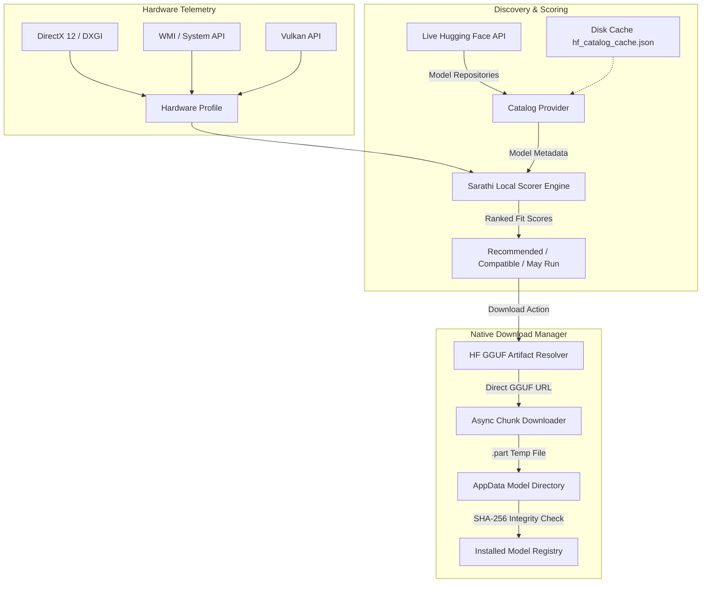

<div align="center">

# 🪷 Sarathi (सारथी)

### *Universal Local AI Orchestrator & Hardware-Matched LLM Recommendation Engine*

[](https://tauri.app/)
[](https://www.rust-lang.org/)
[](https://react.dev/)
[](https://www.typescriptlang.org/)
[](LICENSE)

<p align="center">
  <b>Sarathi</b> is an intelligent, hardware-aware desktop platform designed to discover, evaluate, recommend, and manage local Large Language Models (LLMs) tailored specifically to your PC's exact physical capabilities.
</p>

---

</div>

## ✨ Key Features

### 🔬 Deep Physical System Analyzer
- **Native Hardware Profiling**: Hardware telemetry scanning via Windows WMI/CIM, DirectX 12 (DXGI), Vulkan, and System API.
- **Memory Domain Separation**: Distinguishes Dedicated Video Memory (VRAM) from Shared System Memory and System RAM.
- **Multi-GPU & iGPU Awareness**: Supports NVIDIA CUDA, AMD ROCm/Vulkan, Intel Arc/OneAPI, iGPU shared memory configurations, and CPU-only systems.

### 🧠 Dynamic Local LLM Recommendation Engine
- **Live Hugging Face Discovery**: Dynamically queries the Hugging Face Hub for popular open-weight GGUF models.
- **Local Deterministic Memory Budgeting**: Calculates model weight memory ($W_{bytes} = \frac{N_{params} \times bpw}{8} \times 1.06$) and KV-cache overhead (accounting for MHA/GQA, layer depth, head dimensions, and context lengths up to 128k tokens).
- **Privacy-First Compatibility Decision**: Your hardware specs are **never** uploaded to external servers. Recommendations are computed 100% locally.
- **Clear Categorization**:
  - 🟢 **Recommended**: Optimal performance with safe VRAM/RAM headroom ($\ge 15\%$).
  - 🟡 **Compatible**: High quality models requiring slight offloading or memory trade-offs.
  - 🟠 **May Run**: Featherweight or CPU-offloaded configurations for tight resource budgets.

### ⚡ Native Async Model Download & Storage Manager
- **Exact HF Artifact Resolution**: Resolves exact GGUF artifacts, quantizations, and size metadata directly from Hugging Face Hub.
- **Resumable Downloads**: Supports pause, resume, cancel, and interrupted download recovery using `.part` temporary chunk buffers.
- **Storage Management**: Integrated model registry tracking installed models, disk consumption, SHA-256 verification, and quick deletion.

---

## 🏗 Architecture Overview



---

## 🛠 Tech Stack

| Domain | Technology |
| :--- | :--- |
| **Desktop Shell** | [Tauri v2](https://tauri.app/) (Native C++ / Rust Window Manager) |
| **Backend Core** | [Rust](https://www.rust-lang.org/) (Async Tokio, Reqwest, Sysinfo, WinAPI, Serde) |
| **Frontend UI** | [React 19](https://react.dev/), [TypeScript](https://www.typescriptlang.org/), [Vite](https://vitejs.dev/) |
| **Styling** | Vanilla CSS Tokens (Dark Glassmorphism, Responsive Grid System) |
| **LLM Catalog** | [Hugging Face Hub API](https://huggingface.co/docs/hub/api) |

---

## 🚀 Getting Started

### Prerequisites

- **Node.js** (v18 or higher)
- **Rust Toolchain** (1.75 or higher)
- **C++ Build Tools** (Visual Studio Build Tools for Windows)

### Installation & Development

1. **Clone the repository**:
   ```bash
   git clone https://github.com/ShreyashPatil123/Sarathi.git
   cd Sarathi
   ```

2. **Install frontend dependencies**:
   ```bash
   npm install
   ```

3. **Run in Development Mode**:
   ```bash
   npm run tauri dev
   ```

4. **Build Production Release Executable**:
   ```bash
   npm run build
   cd src-tauri
   cargo build --release
   ```

---

## 📄 License

Distributed under the MIT License. See `LICENSE` for details.
