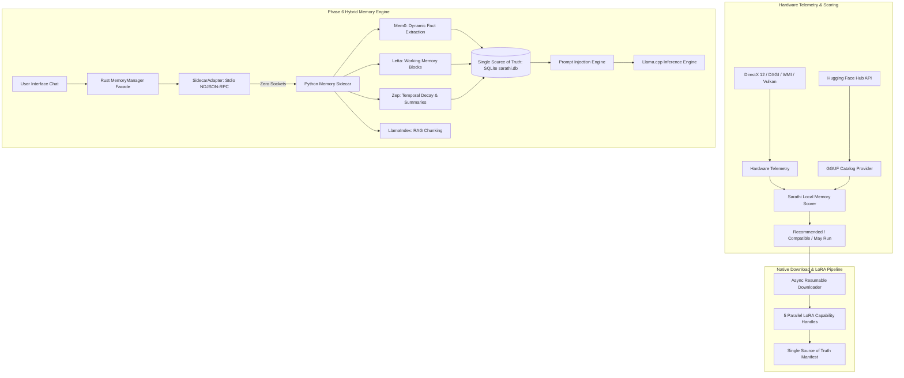

<div align="center">

#  Sarathi (सारथी)

### *Universal Local AI Orchestrator, Hardware-Matched LLM Engine & Hybrid Memory Platform*

[](https://tauri.app/)
[](https://www.rust-lang.org/)
[](https://react.dev/)
[](https://www.typescriptlang.org/)
[](https://www.python.org/)

<p align="center">
  <b>Sarathi</b> is an intelligent, hardware-aware local AI desktop orchestrator. It combines real-time physical system profiling, deterministic memory budgeting, parallel LoRA capability adapter discovery, in-process GGUF inference via <code>llama.cpp</code>, and a production-grade <b>Hybrid Local Memory Engine</b>.
</p>

---

</div>

## 🌟 Highlights & Architecture Matrix



---

## ✨ System Features

### 🔬 1. Deep Physical System Telemetry
- **Hardware Telemetry**: Scans Windows WMI/CIM, DirectX 12 (DXGI), Vulkan, and System APIs.
- **Memory Domain Separation**: Distinguishes Dedicated Video RAM (VRAM) from Shared System Memory and Physical System RAM.
- **Multi-GPU & iGPU Awareness**: Tailored offloading calculations across NVIDIA CUDA, AMD ROCm/Vulkan, Intel Arc/OneAPI, and CPU-only setups.

### 🧠 2. Hardware-Matched Model Recommendation Engine
- **Live Hugging Face Catalog**: Dynamic retrieval of open-weight GGUF architectures (Qwen, Llama, Gemma, Mistral, Phi, DeepSeek, etc.).
- **Deterministic Memory Budgeting**: Calculates model weight footprint ($W_{\text{bytes}} = \frac{N_{\text{params}} \times \text{bpw}}{8} \times 1.06$) and KV-cache overhead (accounting for MHA/GQA, layer depth, head dimensions, and context windows up to 128k).

### ⚡ 3. Parallel Resumable Downloader & LoRA Adapter Pipeline
- **Concurrent LoRA Capability Discovery**: Spawns 5 independent async `tokio::spawn` tasks for capabilities (`coding`, `reasoning`, `tool-calling`, `mathematics`, `research`) running in parallel with the base model GGUF download.
- **HTTP Range Header Resume**: Automatic resume for interrupted `.part` weight files. Zero zero-byte resets.
- **Single Source of Truth Manifest**: Prevents accidental adapter deletion or re-download loops.

### 🔮 4. In-Process LLM Inference Engine (`llama-cpp-2`)
- **Direct GPU Offloading**: Configurable GPU layer offloading and thread allocation.
- **Dynamic Prompt Formatting**: Built-in Jinja/ChatML, Llama 3, Gemma, and Mistral template formatting.
- **Leak-Proof Stream Parser**: Real-time filtering of special control tokens (`<|im_end|>`, `<|im_start|>`) and reasoning tags (`<think>...</think>`).

### 🪷 5. Phase 6 Production Hybrid Local Memory Engine
- **Direct Framework Integration**: Integrates proven open-source memory systems (**Mem0**, **Letta**, **Zep**, **LlamaIndex**) directly within a plugin-based Python sidecar.
- **Zero-Firewall Stdio IPC**: Operates over newline-delimited JSON-RPC 2.0 via `stdin`/`stdout`. Zero listening ports, zero firewall authorization prompts, 100% child process lifetime coupling.
- **Strict Storage Ownership**: Frameworks act strictly as pure processors. Sarathi owns 100% of storage, transactions, and schema migrations in `sqlite:sarathi.db`.
- **Model-Switch Context Preservation**: User context, user profiles, project memories, and summaries persist across model switches (e.g. Qwen $\rightarrow$ Mistral) and application restarts.

### 🔎 6. Agent Capability Layer (MCP)

- **One Shared Registry**: Every MCP server is declared once in `mcp.json` and written into each launched tool's config in that tool's own dialect. A server added once reaches Claude Code, opencode and anything else — and the same file works for clients Sarathi never launched.
- **No External API Keys**: Self-hosted **SearxNG** for search, **Crawl4AI** for static-first scraping with a headless browser only when a page demands it, plain `git clone` for repositories. Nothing is billed and nothing leaves the machine.
- **Source-Grounded Research**: Web pages and repository files land in one local `sqlite-vec` index over ONNX embeddings, so a single query spans both and every passage cites back to a URL or a file and line range.
- **Real Tool Calls**: The gateway carries `tools` through to the chat template and parses ChatML, Llama 3.1 and Mistral tool-call syntax back into `tool_calls` / `tool_use`, so a registered server is actually invoked rather than merely listed.

See [docs/agent-capabilities.md](docs/agent-capabilities.md).

### 📚 7. A Model Library That Reads the File, Not the Label

- **Header-Verified Resolution**: Before a download is committed to, each candidate's real GGUF header is read over an HTTP range request (~2 MB against a download that would otherwise be wasted in full). The recorded quantization comes from the file that arrived, not the one that was asked for.
- **Every GGML Weight Type**: The catalog covers the GGML type families (`Q`, `IQ`, `TQ`, `MXFP`, `BF`, `F`) rather than four hardcoded prefixes, so MXFP4 builds such as `gpt-oss` stop disappearing from the listing.
- **Side-Cars Refused Before Loading**: Vision projectors, MTP heads and EAGLE-3 speculative-decoding drafts are valid GGUFs that `llama.cpp` cannot load. They are now classified from what they declare about themselves (`general.type`, a declared target model, `clip.*` keys) and refused with a reason, instead of surfacing as `NullResult` and reading like a hardware fault.
- **Offloadable MoE Tagged Per Machine**: Mixture-of-experts models get their own category, decided by asking the same `plan_moe_offload` planner the loader uses whether a placement exists for the detected VRAM, RAM budget and real file size. Nothing is marked runnable without a plan.
- **Cached Sweep, Honest Progress**: A full authenticated Hub sweep is ~2,000 requests, so it is now cached on disk — served directly under an hour old, served instantly and refreshed behind the user up to a week old. Only Hub data is stored; every hardware-dependent answer is recomputed on read. The loading state reports its phase and moving counts rather than one unchanging sentence.
- **Storage Shelved by File Content**: Installed models are filed by what their headers actually hold — routed experts give MoE, a declared pooling strategy gives Embedding, vision keys or a multimodal architecture give Vision — so `is_ready` means loadable rather than merely present.

### 🛕 8. Launching Coding Agents

- **A Terminal of Its Own**: Release builds carry `windows_subsystem = "windows"`, so a child spawned from Sarathi inherits no console and a terminal agent exits at once or runs invisibly. Each tool now runs through a generated script in its own window via `cmd /c start`. A non-zero exit holds the window open so a tool that dies immediately shows its error.
- **The Dharma Yatra Startup Screen**: The launch terminal states the whole system at once, drawn from the live `LaunchContext` — *Ratha* the chariot (the gateway and the port it really bound), *Yoddha* the warrior (the model actually loaded, with its quantization), *Astra* the weapons (the MCP servers actually handed to this provider), *Sena* the army (backend, card, VRAM and placement achieved), *Chakra* the wheel. Unknowns print as unknowns; a build with no GPU backend says so however much VRAM the machine has.
- **One Window Per Tool**: Launching a tool that is already running returns the existing process rather than opening a second window against the same workspace.

### 🪟 9. Sarathi's Own Surfaces

- **Glass Confirm Dialogs**: `window.confirm` — captioned *"localhost:1420 says"*, unthemed, string-only — is replaced by a promise-shaped `useConfirm()` over a dark glassmorphism surface. Focus starts on Cancel and is trapped, because the dialog appears when something irreversible is about to happen. A command awaiting approval renders in monospace, exactly as it will run.
- **Explicit Loading Only**: No model is auto-loaded on startup. Both mechanisms are off — `auto_load_on_startup = false` in config, `auto_restore_enabled = false` in saved sessions — and the selected model is persisted for UI convenience only.

---

## 🛠 Tech Stack

| Component | Technologies Used |
| :--- | :--- |
| **Desktop Core** | [Tauri v2](https://tauri.app/) (Native C++ / Rust Window Manager) |
| **Backend Core** | [Rust 1.93](https://www.rust-lang.org/) (Async Tokio, Rusqlite, Reqwest, Sysinfo, WinAPI, Serde) |
| **Inference Engine** | `llama-cpp-2` (CUDA / Vulkan / CPU native bindings) |
| **Memory Sidecar** | [Python 3.11](https://www.python.org/) (Stdio NDJSON-RPC, Mem0, Letta, Zep, LlamaIndex) |
| **Frontend UI** | [React 19](https://react.dev/), [TypeScript 5.7](https://www.typescriptlang.org/), [Vite](https://vitejs.dev/) |
| **Database** | SQLite (`sqlite:sarathi.db` with Migration V2) |

---

## 🚀 Getting Started

### Prerequisites

- **Node.js**: v18+
- **Rust Toolchain**: 1.75+
- **Python**: 3.10+ (for embedded memory sidecar)
- **Build Tools**: Visual Studio 2022 Build Tools (with C++ and Windows SDK)

### Installation & Local Setup

1. **Clone the repository**:
   ```bash
   git clone https://github.com/Straw-hat-Luffy26/Sarathi.git
   cd Sarathi
   ```

2. **Install frontend dependencies**:
   ```bash
   npm install
   ```

3. **Run Sarathi** — this probes the machine, picks a GPU backend and builds release:
   ```bash
   npm start
   ```

4. **Run Unit Tests**:
   ```bash
   cd src-tauri
   cargo test --lib memory_engine::tests
   ```

5. **Build Release Binary**:
   ```bash
   npm run build:auto
   ```

### ⚡ GPU-Accelerated Builds

**Recommended — let Sarathi pick the backend for the machine it is on:**

```bash
npm start
```

```bash
npm run build:auto
```

`npm start` and `npm run dev:auto` are the same thing, and both build with the
release profile so what is run is what ships.

`scripts/select-backend.mjs` probes the host and selects the fastest backend it
can actually build: CUDA when an NVIDIA GPU *and* the toolkit (`nvcc`) are both
present, Vulkan when the SDK is installed, CPU otherwise. On Windows it also
locates the Visual Studio C++ environment and switches CMake to the Ninja
generator, because the CUDA MSBuild integration the toolkit ships is frequently
not registered. Override the probe with `SARATHI_BACKEND=cuda|vulkan|cpu`.

Why a build step rather than runtime detection: **backend selection in
llama.cpp is compile-time**. `llama-cpp-sys-2` links GGML with `GGML_CUDA=OFF`
unless the feature is set, so a CPU-built binary cannot start using a GPU later
no matter what hardware it finds — every `n_gpu_layers` value is silently
ignored. Once a GPU-enabled binary exists, how much to offload *is* decided at
runtime from measured VRAM.

A CUDA build also needs kernels the installed card can actually run.
`llama-cpp-sys-2` never sets `CMAKE_CUDA_ARCHITECTURES`, so a GPU newer than
llama.cpp's own default list gets a binary with no runnable kernels: CUDA
initialisation fails, llama.cpp falls back to CPU, and nothing says so. The
backend selector reads the compute capability from the GPUs present and passes
it as `CUDAARCHS` — every distinct capability found, and llama.cpp's default
left alone where the capability cannot be read.

The manual equivalents below remain available; the default `cargo build`
(no features) is still CPU-only so the project compiles anywhere.
`npm run dev:debug-cpu` is the bare CPU-only debug run, kept for the rare case
it is wanted rather than as something to reach for by accident.

**NVIDIA on WSL2 / Linux (CUDA)** — needs the CUDA Toolkit (`nvcc`) inside the
WSL2 distro, not just the Windows driver; verify with `nvidia-smi` and
`nvcc --version` first:

```bash
npm run dev:cuda
```

```bash
npm run build:cuda
```

**Generic / cross-vendor (Vulkan)** — AMD, Intel Arc, or NVIDIA without the
CUDA Toolkit; needs the Vulkan SDK (`vulkaninfo` to verify):

```bash
npm run dev:vulkan
```

```bash
npm run build:vulkan
```

Equivalent raw cargo invocations from `src-tauri/`:

```bash
cargo build --release --features cuda
```

```bash
cargo build --release --features vulkan
```

> **Windows + CUDA caveat**: `nvcc` rejects MSVC newer than Visual Studio 2022.
> If the build fails with *"unsupported Microsoft Visual Studio version"*,
> install the VS 2022 Build Tools and point CMake at that host compiler via
> `CMAKE_CUDA_HOST_COMPILER`, or use `--features vulkan`, which has no
> host-compiler constraint.

---

## 🧪 Verification Harnesses

The suites under `src-tauri/tests/` check the real thing rather than a model of
it — they load installed GGUFs through the same call the gateway makes and
resolve real repositories against the live Hub.

```bash
cd src-tauri
cargo test
```

| Harness | What it establishes |
| :--- | :--- |
| `verify_llama_runtime` | Loads each installed model through `LlamaCppRuntime` and asks it a question, so a file the library calls loadable has to load *and* answer |
| `verify_real_world_model_switching` | Device placement through `load_installed_model_direct` with no layer count set anywhere — detection, GPU selection and the offload planner, end to end |
| `verify_certification_system` | Runs the loader's own classification over every installed GGUF and reports the shelf each lands on |
| `verify_auto_load_disabled` | No model is auto-loaded on startup, through every path (config default, session flag, single-model fallback) |
| `verify_progress_reporting` | Catalog progress carries real phases and moving counts from the Hub sweep |
| `mcp_reaches_every_provider` | A server declared once in `mcp.json` is rendered into each launched tool's own dialect |
| `ui_thread_stays_free` | Sync Tauri commands never block the main thread |
| `a_failed_request_never_looks_like_an_empty_answer` | Gateway failures surface as errors rather than empty completions |

Observed on a CUDA build (RTX 5060, 8 GB), sampling `nvidia-smi` throughout:
every installed model placed **all** its layers on the GPU — including an MoE
model at 32 experts / 4 active — with VRAM moving 955 → 6971 MiB and GPU
utilisation peaking at 88%.
