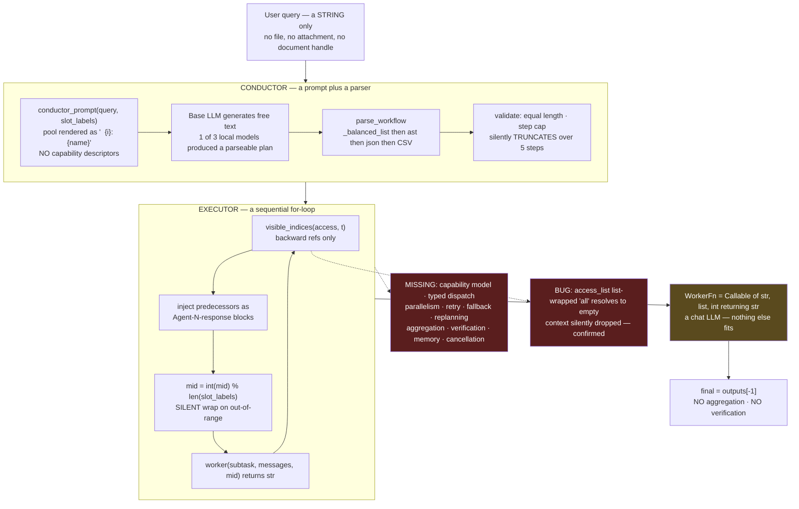
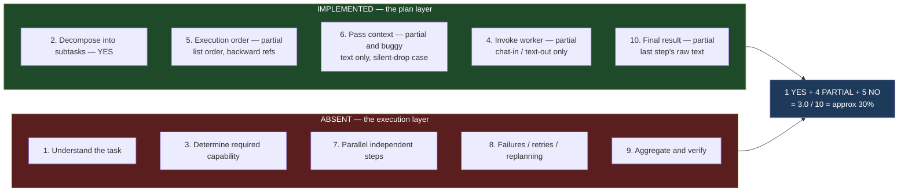
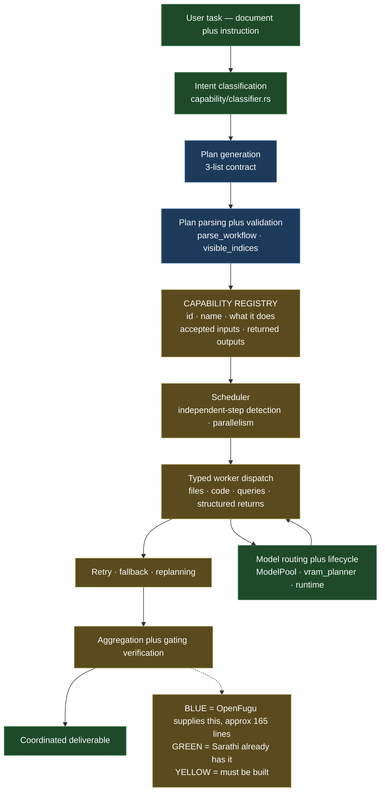
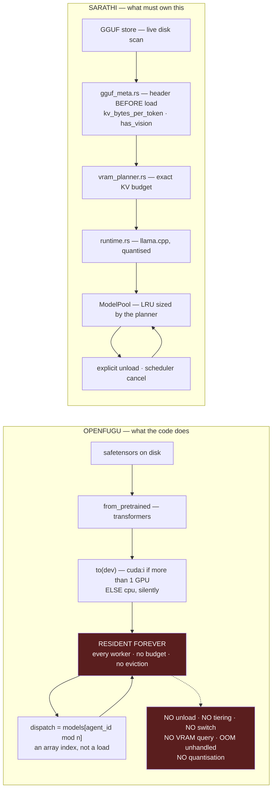
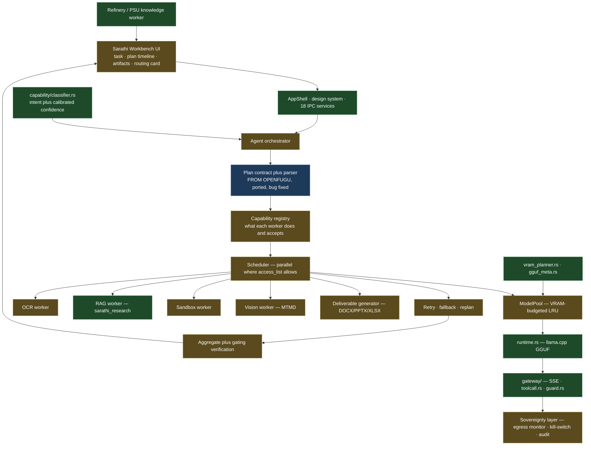

# SIH 2026 · PS 26117 — OpenFugu Complete Analysis
## Evaluated strictly as the ORCHESTRATOR / CONDUCTOR layer

**Subject:** `https://github.com/trotsky1997/OpenFugu.git` (branch `main`)
**Target:** SIH 2026 PS 26117 — *Sovereign On-Premise Agentic AI Workbench using Open-Weight Multimodal LLMs for Confidential Industrial Work* (MRPL)
**Sarathi reference:** [`SIH_26117_Sarathi_Reuse_Analysis.md`](SIH_26117_Sarathi_Reuse_Analysis.md)
**Date:** 2026-08-22
**Method:** read directly from the GitHub repository URL via raw file fetch. **Not cloned, downloaded, copied, modified, or forked in this analysis.** Neither OpenFugu nor Sarathi was modified.

---

## 0. Framing, and how this differs from the earlier report

This analysis applies a **strict orchestrator-only lens**, as directed:

> OpenFugu is judged on the quality of its ORCHESTRATION, **not** on whether it personally contains OCR, RAG, Vision, Sandbox, document processing, knowledge bases, or tools. Those are independent modules.

That is the correct lens, and it changes the evaluation materially. A companion document, [`SIH_26117_OpenFugu_Deep_Analysis.md`](SIH_26117_OpenFugu_Deep_Analysis.md), evaluated OpenFugu as a whole-solution candidate and therefore counted missing OCR/RAG/sandbox against it. **This document does not.** Where the two disagree, this one governs for orchestration questions.

The lens does not, however, make the analysis easier on OpenFugu — it makes it sharper. The directive itself enumerates ten orchestration responsibilities. Those become the rubric, and OpenFugu is graded against them and nothing else. The result is a more specific and, in places, more serious critique than "it lacks OCR": **the deficiencies that matter are orchestration deficiencies.**

### Evidence classification

| Tag | Meaning |
| --- | --- |
| **[CODE VERIFIED]** | Read from source fetched from the repository URL during this analysis; file and function cited |
| **[DOCUMENTED]** | Stated in the repository's own README, `docs/`, or committed run logs |
| **[INFERRED]** | Deduced from code structure; reasonable, not directly executed |
| **[UNKNOWN]** | Not determinable from the repository |
| **[PRIOR-RUN]** | Executed locally in an earlier session and reported here; re-verified against source this session where possible |

A note on **[PRIOR-RUN]**: a previous session cloned the repository and executed its offline test paths. Those observations are cited where they are load-bearing and are labelled. That clone still exists in a temporary scratchpad from that session; this session's reads were all from the repository URL.

---

## Table of Contents

1. [What exactly is OpenFugu?](#1-what-exactly-is-openfugu)
2. [What is OpenFugu best at?](#2-what-is-openfugu-best-at)
3. [How does OpenFugu understand intent?](#3-how-does-openfugu-understand-intent)
4. [How does it plan and decompose tasks?](#4-how-does-it-plan-and-decompose-tasks)
5. [How does it select models and workers?](#5-how-does-it-select-models-and-workers)
6. [How does model switching actually work?](#6-how-does-model-switching-actually-work)
7. [Multi-model orchestration](#7-multi-model-orchestration)
8. [Fugu-Ultra / Conductor, in depth](#8-fugu-ultra--conductor-in-depth)
9. [Local and offline operation](#9-local-and-offline-operation)
10. [OpenFugu as orchestrator for PS 26117](#10-openfugu-as-orchestrator-for-ps-26117)
11. [OpenFugu + Sarathi](#11-openfugu--sarathi)
12. [PS 26117 requirement mapping](#12-ps-26117-requirement-mapping)
13. [Reuse analysis](#13-reuse-analysis)
14. [Limitations and bugs](#14-limitations-and-bugs)
15. [Requirements to run it](#15-requirements-to-run-it)
16. [Standalone orchestration test](#16-standalone-orchestration-test)
17. [Feasibility for PS 26117](#17-feasibility-for-ps-26117)
18. [Final verdict](#18-final-verdict)
19. [Architecture diagrams](#19-architecture-diagrams)
20. [Evidence index](#20-evidence-index)

---

## Executive summary

**In one sentence:** OpenFugu is an excellent *specification* for how an LLM should emit a workflow plan, wrapped around a ~30-line sequential `for` loop that implements roughly a third of what orchestration requires.

The directive lists ten orchestration responsibilities. Graded strictly from source:

| # | Orchestration responsibility | OpenFugu | Evidence |
| --- | --- | --- | --- |
| 1 | Understand the overall task | **NO dedicated mechanism** | No intent component exists; delegated wholly to a prompted base model |
| 2 | Decompose into subtasks | **YES** | `subtasks[]` in the Conductor output — genuine and works |
| 3 | Determine what capability each subtask requires | **NO** | The Conductor is shown only `"  {i}: {name}"` — an index and a bare model name. No capability descriptor, no tool schema, no I/O types |
| 4 | Select and invoke the appropriate agent/model/tool/service | **PARTIAL** | Selects an `int`. Invokes through `WorkerFn = Callable[[str, list, int], str]` — chat messages in, text out. **Cannot express a non-LLM service** |
| 5 | Determine execution order and dependencies | **PARTIAL** | List order plus backward-only `access_list`. A topological *order*, not a dependency *graph*; no scheduler |
| 6 | Pass context/data between components | **PARTIAL + BUGGY** | String concatenation into `<Agent N response>` blocks; one access-list form silently drops all context |
| 7 | Run independent tasks in parallel | **NO** | No `asyncio`, no `threading`, no `concurrent.futures` in `ultra.py`. Plain `for` loop |
| 8 | Handle failures / retries / replanning | **NO** | No retry, no `try`/`except` around the worker call, no replanning anywhere |
| 9 | Aggregate and verify results | **NO** | `res.final = outputs[-1]`. No aggregation. No verification in Ultra |
| 10 | Produce the final coordinated result | **PARTIAL** | Returns the last step's raw text |

**Score: 1 YES · 4 PARTIAL · 5 NO → ≈30% of the orchestration function** (1 + 4×0.5 = 3 of 10).

### The single most important finding

**OpenFugu's worker contract cannot describe or invoke a non-LLM capability.** **[CODE VERIFIED]**

```python
# openfugu/ultra.py
WorkerFn = Callable[[str, list, int], str]   # (subtask, messages, agent_id) -> reply
```

```python
# openfugu/mini.py
# A worker is any callable: (role_name, messages, agent_id) -> reply text.
WorkerFn = Callable[[str, list, int], str]
```

A worker is, by definition, *a chat LLM*. It receives a subtask string, a list of chat messages, and an integer; it returns a string. There is no file handle, no typed argument, no structured return, no schema, and — critically — **no capability descriptor anywhere in the repository**.

The Conductor's entire knowledge of its pool is this, from `conductor_prompt`: **[CODE VERIFIED]**

```python
pool = "\n".join(f"  {i}: {name}" for i, name in enumerate(slot_labels))
```

An index and a name. Nothing about what a worker can *do*, what it *accepts*, or what it *returns*.

For PS 26117 this is decisive. The premise of the reframe is that OCR, RAG, sandbox and vision live as independent components and OpenFugu coordinates them. But an OCR service takes a **file path** and returns **structured text with page and region provenance**. A sandbox takes **code** and returns **stdout, stderr, and an exit code**. A RAG index takes a **query** and returns **passages with citations**. None of these fit `(str, list[ChatMessage], int) -> str`, and none of them can be described to a Conductor that is only ever shown a list of names.

You can shim around it — wrap each service as a pseudo-chat-model that parses a file path out of a prompt string and returns prose. But once you have written the capability registry, the typed dispatch, the parallel scheduler, the retry policy, and the result aggregator that shim implies, **you have written the orchestrator**, and OpenFugu's remaining contribution is the plan format.

### What is genuinely valuable

The **3-list plan contract** is a real and good idea: `model_id[] / subtasks[] / access_list[]`, equal-length-validated, topologically validated, with **explicit per-step visibility** rather than a shared scratchpad. That last property is the strongest design decision in the repository — it is what stops context explosion and what the Conductor paper calls preventing "orchestration collapse." The parser that extracts it from chatty small-model output (`_balanced_list` → `ast.literal_eval` → `json.loads` → CSV) is robust and worth porting.

That is approximately **165 lines**, and it is genuinely worth having.

### Verdict

> # USE ONLY AS ARCHITECTURAL REFERENCE
>
> Adopt the plan contract and the visibility discipline. Port the parser with attribution. Write the orchestrator yourself — because OpenFugu has not written one, and under the orchestrator-only lens that is precisely the thing it was supposed to supply.

**Is Fugu-Ultra the most relevant component for PS 26117?** Yes, unambiguously — and TRINITY is not relevant at all. See §8.

---

## 1. What exactly is OpenFugu?

### In simple language

OpenFugu is a **reverse-engineering study**. Sakana AI sells a closed product called "Fugu" that pretends to be one model but is really a small program that picks which of several big models should answer you. Sakana published two papers and one small trained file, but not the product. OpenFugu's authors read the papers, rebuilt the mechanism, verified their rebuild against Sakana's released file, trained their own version, and wrote it all up.

It is a **research artifact that proves a mechanism**. It is not a product, not a library, and not a framework. It has no package metadata, no tests directory, and no CI. **[CODE VERIFIED]** — repository root contains no `pyproject.toml`, `setup.py`, `.github/`, or `tests/`.

### Technically

Two independent orchestration lines share a repository:

**Line A — TRINITY** (`openfugu/mini.py`). A frozen Qwen3-0.6B backbone whose *text output is discarded*. For a given transcript it computes one hidden state at the penultimate token and multiplies it by a bias-free 10×1024 head, producing 7 "which worker" logits and 3 "which role" logits. Roles are solver / thinker / verifier. A loop runs at most 5 turns, dispatching exactly one worker per turn, terminating when a verifier replies `ACCEPT` or the turn budget expires. The 19,456 trainable numbers (9,216 singular-value offsets + the 10,240-element head) are the entire learned surface. **[CODE VERIFIED]**

**Line B — Conductor / Fugu-Ultra** (`openfugu/ultra.py`). A prompted LLM writes an entire workflow in one shot as three equal-length lists. A parser extracts them; an executor validates and runs them in order, injecting each step's permitted predecessors as tagged context blocks. **[CODE VERIFIED]**

Supporting cast: `openfugu/serve.py` (a stdlib HTTP server exposing TRINITY as one OpenAI-compatible endpoint), `train/` (10 trainers — sep-CMA-ES for TRINITY, GRPO for the Conductor), `eval/`, `verify/`, `pipeline/`, `scripts/fetch_artifacts.py`.

### The components, one by one

| Component | What it actually is | Grade |
| --- | --- | --- |
| **Mini / TRINITY** | A learned per-turn worker+role picker. Requires Sakana's `model_iter_60.npy`. 7 hardcoded slots | [CODE VERIFIED] |
| **Conductor** | A *prompt* (`conductor_prompt`) plus a *parser* (`parse_workflow`). The "Conductor model" is any LLM you point at it | [CODE VERIFIED] |
| **Fugu-Ultra** | Not a separate implementation. `ultra.py` **is** the Conductor line; "Ultra" is Sakana's product-tier name | [CODE VERIFIED] |
| **Worker system** | `WorkerFn = Callable[[str, list, int], str]`. Three implementations: `LiteLLMWorker` (external API), `LocalPoolWorker` (resident HF models), `MockWorker` (offline stub) | [CODE VERIFIED] |
| **Routing system** | TRINITY: a matmul over a hidden state. Ultra: whatever integers the Conductor LM writes into `model_id[]` | [CODE VERIFIED] |
| **Workflow/DAG system** | Three equal-length lists. Backward-only references. Executed by a `for` loop | [CODE VERIFIED] |
| **Training system** | sep-CMA-ES over the router head; GRPO over a Conductor. 1,651 lines, ~43% of the Python | [CODE VERIFIED] |
| **Serving system** | `http.server.ThreadingHTTPServer`, binds `0.0.0.0:8088`, no streaming, no auth, no tool support | [CODE VERIFIED] |
| **Evaluation system** | `eval_orchestration.py` runs a **synthetic** `MockWorld`; the e2e scripts assert only that output is non-empty | [CODE VERIFIED] |
| **Local execution** | `--local-conductor` and `--local-models` load HF checkpoints in-process via `transformers` | [CODE VERIFIED] |
| **API execution** | `litellm.completion(...)`, default `openai/gpt-4o-mini` | [CODE VERIFIED] |

### So what category is it?

Refusing to force a category, and reading only what the code does:

| Candidate | Verdict |
| --- | --- |
| **An orchestrator?** | **Partially — the front half only.** It plans; it does not schedule, dispatch by capability, recover, or aggregate |
| **An intent analyzer?** | **No.** There is no intent taxonomy, classifier, confidence, or semantic label anywhere |
| **A planner?** | **Yes — this is its strongest identity.** It defines a plan format and gets an LLM to emit it |
| **A model router?** | **Yes, in the TRINITY line** — and that line is a learned *query-to-model* selector requiring Sakana's checkpoint |
| **A multi-agent framework?** | **No.** No agent abstraction, no agent state, no memory, no inter-agent protocol beyond string injection |
| **A workflow engine?** | **No.** A workflow engine schedules, retries, handles partial failure, and persists state. This is a `for` loop |
| **A Conductor?** | **Yes — in the literal sense of the paper it reimplements:** something that writes the score. It does not run the orchestra |

> **The accurate description: OpenFugu is a *workflow-plan specification and parser*, with two reference dispatchers — one learned per-turn picker and one linear step executor.**
>
> It is best understood as the *plan layer* of an orchestrator, not an orchestrator.

---

## 2. What is OpenFugu best at?

Ranked by actual demonstrated strength, judged only on orchestration.

### Strengths

**1. Defining a compact, checkable plan format.** *(Strongest.)* Three equal-length lists, ≤N steps, backward-only references, last step is the answer. It is small enough for a 3B model to emit and structured enough to validate mechanically. Most agent frameworks either use free-form JSON that small models mangle, or a schema so heavy that small models never comply. This sits in the useful middle. **[CODE VERIFIED]** `conductor_prompt`, `ConductorExecutor.validate`

**2. Robustly parsing structure out of chatty small-model output.** `_balanced_list` walks the text tracking bracket depth while respecting quotes and escapes; `extract_list` then tries `ast.literal_eval`, then `json.loads` with quote normalisation, then a CSV split. It also normalises smart quotes (`_SMART`). This is a real, well-built solution to a real, annoying problem. **[CODE VERIFIED]**

**3. Explicit per-step context visibility.** Each step declares which earlier outputs it may see; everything else is invisible to it. This is a materially better design than the usual shared-scratchpad approach — it bounds context growth and prevents one early verbose step from dominating everything downstream. **[CODE VERIFIED]** `visible_indices`, and `docs/ARCHITECTURE.md` §3.3 records that Sakana's product adds "intra-workflow agent isolation" for exactly this reason.

**4. Provenance-tagged context injection.** Predecessor outputs arrive labelled with both the subtask and the producing agent:
`<Subtask assigned to Agent N>…</…><Agent N response>…</…>`. Small models handle this far better than raw concatenation. **[CODE VERIFIED]**

**5. Plan validation before execution.** Equal-length check, step-count cap, forward-reference rejection. Cheap, and catches the common malformed-plan failures. **[CODE VERIFIED]** *(Caveat: the step cap truncates silently rather than erroring.)*

**6. Learned query-level model routing (TRINITY).** Genuinely novel and genuinely works *for what it is* — 95%/100% on a 37-case fixture against real weights. But it is query-to-model selection, requires a Sakana checkpoint, and assumes 7 fixed heterogeneous frontier workers. **[DOCUMENTED]**

**7. Honest negative reporting.** Not a code capability, but a real asset: `results/README.md` opens with a caveat that most of its own experiments measure per-question routing and **are not** the per-step mechanism. That intellectual honesty is rarer than the code.

### What OpenFugu is NOT designed to do

Stated as orchestration gaps, not capability gaps:

- **Model capabilities.** No descriptor, schema, or type. Workers are names in a list. **[CODE VERIFIED]**
- **Heterogeneous services.** The worker contract is a chat LLM. Nothing else fits. **[CODE VERIFIED]**
- **Concurrency.** No parallel execution of independent steps. **[CODE VERIFIED]**
- **Fault tolerance.** No retry, no fallback, no partial-failure handling. **[CODE VERIFIED]**
- **Adaptive planning.** The plan is fixed at generation; nothing revises it. **[CODE VERIFIED]**
- **Result synthesis.** `final = outputs[-1]`. **[CODE VERIFIED]**
- **Verification.** None in Ultra; TRINITY's is `text.strip().upper().startswith("ACCEPT")`. **[CODE VERIFIED]**
- **State and memory.** Nothing persists between runs. `docs/ARCHITECTURE.md` §3.3 describes persistent shared memory as a **product-only** Sakana feature, absent from both papers and from this code. **[DOCUMENTED]**
- **Observability.** `print()` with `flush=True`; the HTTP server suppresses its own logging. **[CODE VERIFIED]**
- **Cancellation, budgets, timeouts.** None. **[CODE VERIFIED]**

---

## 3. How does OpenFugu understand intent?

### Direct answer

> **OpenFugu has no intent-understanding component. None. There is no intent taxonomy, no classifier, no embedding comparison, no confidence score, and no semantic label anywhere in the repository.** **[CODE VERIFIED]**

Two things get mistaken for intent understanding. Neither is.

### Mechanism 1 — TRINITY's learned head (opaque, not semantic)

`FuguRouter.route()` in `openfugu/mini.py`: **[CODE VERIFIED]**

```python
h = self._hidden(messages)          # backbone forward; hidden state at position -2
logits = self.head @ h              # (10,)
agent_logits, role_logits = logits[:7], logits[7:]
agent_id = self._pick(agent_logits, sample)
role_id  = self._pick(role_logits,  sample)
```

- **Input:** the transcript joined as raw `"role: content"` lines — *not* a chat template.
- **Output:** two integers. `agent_id ∈ 0..6`, `role_id ∈ {0,1,2}`.

This is not intent classification. It is a learned scoring function over an opaque embedding, trained by evolution strategies to correlate with *which of seven specific frontier models empirically succeeded*. It produces no semantic category, no confidence, and no explanation. `agent_id = 4` means "slot 4," and slot 4 means whatever the pool was bound to at deploy time.

For comparison, Sarathi's `capability/classifier.rs` produces a named intent (`Coding`, `Reasoning`, `Mathematics`, `ToolCalling`, `Research`, `GeneralChat`) with calibrated confidence derived from dominance and evidence — strictly more information, and explainable. **[DOCUMENTED — Sarathi analysis §2.2.9]**

### Mechanism 2 — the Conductor's prompt (delegated, not implemented)

`conductor_prompt` builds a system message and a user message. Whatever "understanding" occurs happens **inside the base model's forward pass**, and OpenFugu contributes only the prompt text and the parser for what comes out. **[CODE VERIFIED]**

- Rule-based? **No.**
- Prompt-based? **Yes** — that is the whole of it.
- Embedding-based? **No.**
- Learned routing? **Only in TRINITY**, and it is a routing head, not an intent model.

### The worked example

> *"Analyze this confidential industrial maintenance document and determine the likely equipment failure."*

**Along the Ultra path**, exactly this happens:

1. `conductor_prompt(query, slot_labels)` builds:
   - a system message containing the 3-list rules and the pool rendered as, e.g.,
     `  0: llama-3.2-3b` / `  1: gemma-3-4b`
   - a user message: `USER QUESTION: Analyze this confidential industrial maintenance document and determine the likely equipment failure.`
2. The Conductor model generates free text.
3. `parse_workflow` regex-searches for `model_id:` / `subtasks:` / `access_list:` and extracts the first balanced list after each.
4. `ConductorExecutor.execute` runs a `for` loop over the parsed lists.

**Now note what did not happen.** **[CODE VERIFIED]**

- **The document never entered the pipeline.** `query` is a `str`. There is no file parameter, no attachment, no document handle, anywhere in `ultra.py` or `mini.py`. The Conductor sees only the sentence *about* a document.
- **The Conductor cannot know the document is a scan**, because it never sees it.
- **It cannot route "OCR first,"** because no worker is described as doing OCR — the pool is `0: llama-3.2-3b`, `1: gemma-3-4b`.
- **It could not pass the file to an OCR worker even if it chose one**, because `WorkerFn` takes chat messages and returns a string.

**Along the TRINITY path**, even less happens: `format_transcript` joins the message into `"user: Analyze this confidential…"`, tokenizes it, runs one forward pass, multiplies by the head, and argmaxes to an integer.

> **Conclusion: for PS 26117, intent understanding must be supplied externally.** Sarathi already has a stronger, explainable, tested implementation of it.

---

## 4. How does it plan and decompose tasks?

**This is OpenFugu's genuine strength, and the answer is yes — with sharp limits.**

### Does it break a task into subtasks? Yes.

`subtasks[]` is a list of natural-language instructions, one per step, written by the Conductor. This is real decomposition, not role re-framing. **[CODE VERIFIED]**

(By contrast, TRINITY does **not** decompose. Each turn re-asks the *same* original query with different role framing — solver, thinker, or verifier. `_format_messages` builds every role's message from `query`. So the TRINITY line is multi-*turn*, not multi-*task*.) **[CODE VERIFIED]**

### Which component? The Conductor — meaning, a prompted LLM.

OpenFugu supplies the prompt and the parser; the decomposition quality is entirely the base model's. **[CODE VERIFIED]**

### Static or dynamic? Dynamically generated, then frozen.

The plan is generated per query, so its content varies. But it is produced **once**, before any step runs, and nothing revises it thereafter. **[CODE VERIFIED]**

### Does it generate a DAG? A topological order, not a DAG.

The repository is candid about this. `docs/ARCHITECTURE.md` §3.1 states forward references are forbidden, enforcing topological ordering, and its own corrections log lists *"'arbitrary DAG' → topological order, forward refs forbidden"* as a fixed error. **[DOCUMENTED]**

`visible_indices` enforces it: **[CODE VERIFIED]**

```python
if pos >= step:      # forward reference -> reject
    raise ValueError(f"step {step} references future/own step {pos} (not a DAG order)")
```

There is no graph structure, no topological sort, and no scheduler. The list *is* the order.

### How are dependencies represented?

By `access_list[t]` — the indices of earlier steps whose outputs step *t* may read. Accepted forms: `[]`, a list of ints, or the string `"all"`.

**Crucially, `access_list` is a *visibility* declaration, not a *dependency* declaration.** Step 3 always runs after step 2 whether or not it reads step 2. The executor never asks "what can run now?" — it asks "what is next in the list?"

### Can one task depend on another? Yes — for data.

Predecessor outputs are injected as `<Subtask assigned to Agent N>…</…>` + `<Agent N response>…</…>` blocks. **[CODE VERIFIED]**

### Can it branch? **No.** Can it loop? **No.** Can it revise its plan? **No.**

No conditional edges, no cycles, no replanning. The nearest thing to adaptivity is TRINITY's Thinker emitting `<suggested_role>`, which overrides the *next turn's role* for exactly one turn — a one-slot override, not a branch. **[CODE VERIFIED]**

### A real example, from the repository's own committed run

`results/conductor_e2e_run.txt`, probing which local models can emit a plan: **[DOCUMENTED]**

```
[gemma-3-4b] steps=5 model_id=[2, 1, 3, 0, 4] access=[[], [], [0, 1], [2, 3], []]
```

Read as a plan this is well-formed and even interesting: steps 0 and 1 are independent, step 2 reads both, step 3 reads step 2 and step 3… wait — `access[3] = [2, 3]` includes **3**, its own index. `visible_indices` would raise `ValueError: step 3 references future/own step 3`. So this plan, from the *only* local model in the probe that produced a plan at all, **is invalid and would crash the executor** — and there is no retry path to recover from it.

Also note step 4 has `access=[]` — the final step, whose output *is the answer*, sees nothing from any earlier step.

---

## 5. How does it select models and workers?

### Two mechanisms, both weak for a heterogeneous local pool

**TRINITY:** `agent_id = argmax(head @ hidden_state)` over 7 slots. Requires Sakana's checkpoint. Learned against 7 specific frontier API models. **[CODE VERIFIED]**

**Ultra:** the Conductor writes integers into `model_id[]`. **[CODE VERIFIED]**

### Does it select capabilities? **No — and this is the core finding.**

`conductor_prompt` renders the pool as: **[CODE VERIFIED]**

```python
pool = "\n".join(f"  {i}: {name}" for i, name in enumerate(slot_labels))
```

and instructs: *"Pick workers to match each subtask's demands."*

The Conductor is asked to match capability, but is given **nothing to match against except a name string**. There is no capability field, no tool schema, no description, no input/output type, no cost or latency hint, no example. Selection reduces to whatever the base model's priors associate with the literal token sequence of a model name.

In OpenFugu's own local run, `slot_labels` were derived from directory basenames — which were **HuggingFace snapshot SHAs**: **[DOCUMENTED]**

```
[ultra-e2e] workers LOCAL (2): ['0cb88a4f764b7a12671c53f0838cd831a0843b95', '093f9f388b31de276ce2de164bdc2081324b9767']
```

The Conductor was shown `0: 0cb88a4f764b7a12671c53f0838cd831a0843b95` and `1: 093f9f...` and asked to pick workers matching each subtask's demands. It emitted `model_id=[0, 0, 0]`. That is not a routing failure by the model — it is the only possible outcome when capability information is absent.

### Are workers predefined? Can arbitrary local models be supplied? Yes.

`--local-models "path1@cuda:1,path2@cuda:2"` or `--slot-models "<litellm ids>"`. The labels are freely remappable; `mini.py`'s comment says so explicitly. **[CODE VERIFIED]**

### Can different models perform different subtasks? Mechanically yes.

`ConductorExecutor` dispatches per step via `self.worker(sub, messages, mid)`. **[CODE VERIFIED]**

**But there is a silent correctness hazard:** **[CODE VERIFIED]**

```python
mid = int(mid) % len(self.slot_labels)
```

If the Conductor names worker 4 and only 2 workers are loaded, the request goes to worker 0 — silently, with no warning. The same modulo appears in every worker implementation (`serve.py`, `ultra.py` ×2, `train/train_trinity_perstep.py`). For TRINITY specifically this is worse: a head trained to discriminate 7 slots, run against a 2-model pool, collapses slots {0,2,4,6}→model 0 and {1,3,5}→model 1, destroying the learned signal arithmetically.

### Can it dynamically change the worker? **No.**

Assignment is fixed when the plan is generated. Nothing reassigns a step after a failure or a poor result. **[CODE VERIFIED]**

### Concrete example

Pool: `0: ocr-service`, `1: qwen2.5-coder-3b`, `2: llama-3.2-3b`.
Query: *"Read the attached inspection report and draft an approval note."*

What OpenFugu does:
1. Conductor sees three names, no capabilities.
2. It might emit `model_id=[0,2,2]`, `subtasks=["Extract the text", "Summarise the findings", "Draft an approval note"]`, `access_list=[[],[0],[0,1]]`. A reasonable-looking plan.
3. Step 0 calls `worker("Extract the text", [{"role":"user","content":"Your subtask: Extract the text"}], 0)`.
4. **The OCR service receives a chat message containing the words "Extract the text" and no file.** There is nowhere in the contract to put the document.

The plan is right. The dispatch is impossible.

---

## 6. How does model switching actually work?

Under the orchestrator-only lens, model lifecycle belongs to Sarathi — so this section is scoped to *what OpenFugu assumes*, because those assumptions constrain any integration.

> ## OpenFugu performs no model lifecycle management. It eagerly loads every worker at construction and never releases any of them.

### Traced from source **[CODE VERIFIED]**

**Who loads the model?** `LocalPoolWorker.__init__` — in `serve.py`, `ultra.py`, and `train/train_trinity_perstep.py` (three near-identical copies):

```python
for name, path, dev in specs:                      # every spec, up front
    tk = AutoTokenizer.from_pretrained(path)
    m  = AutoModelForCausalLM.from_pretrained(path, dtype=torch.bfloat16).to(dev).eval()
    self.models.append(m); self.devs.append(dev)
```

In `serve.py` this runs at line ~173, **before** the socket binds at line ~183. Everything is resident before request one.

**Who unloads?** **Nobody.** A repo-wide search for `empty_cache`, `del model`, `offload`, `device_map`, `max_memory`, `low_cpu_mem_usage`, `mmap`, and every quantisation library returns **zero hits**. **[PRIOR-RUN, repo-wide grep; consistent with this session's `ultra.py` read]**

**Who selects?** The Conductor or the TRINITY head — but "selection" resolves to `self.models[agent_id % len(self.models)]`, an **array index into already-resident objects**.

**Does it use a separate inference runtime?** It uses `transformers` over PyTorch, in-process. Not llama.cpp, not vLLM, not ONNX. **[CODE VERIFIED]**

**Does it use LiteLLM?** Yes, as the alternative worker backend, and it is the **default** — `LiteLLMWorker` falls back to `openai/gpt-4o-mini`. **[CODE VERIFIED]**

**External model servers?** Only through litellm. The local path is in-process. **[CODE VERIFIED]**

**Separate processes?** **No.** All models are Python objects in one process. The only `subprocess.Popen` calls launch the *server* from a test harness. **[CODE VERIFIED]**

**Can multiple models stay loaded?** **Yes — that is the design. It requires one GPU per worker.** The device planner: **[CODE VERIFIED]**

```python
n_gpu = torch.cuda.device_count() if torch.cuda.is_available() else 0
dev = f"cuda:{(i % max(n_gpu - 1, 1)) + 1}" if n_gpu > 1 else "cpu"
```

`cuda:0` is reserved for the orchestrator; workers round-robin across `cuda:1..n-1`. **If there is one GPU or none, every worker goes to `"cpu"`.** OpenFugu's own runs used an 8×A800-80GB box with workers pinned `@cuda:1`, `@cuda:2`. **[DOCUMENTED]** `results/serve_e2e_run.txt`

**Does it move models SSD → RAM → VRAM → SSD?** **No.** There is one transition — disk to device, once, at startup. No tiering, no eviction, no promotion, no demotion.

**What happens on insufficient VRAM?** An unhandled `torch.cuda.OutOfMemoryError` from inside the constructor, killing the process before the server starts. No `try`, no CPU fallback, no smaller-quant retry. **[CODE VERIFIED]**

**Does it automatically switch models?** **No. There is no switching event.** Nothing loads, unloads, or moves after startup.

### The actual trace

```
User request
    ↓
Worker selected           →  an integer, modulo the pool size
    ↓
Model loading             →  DID NOT HAPPEN — already resident since startup
    ↓
Inference                 →  model.generate(...) on the resident object
    ↓
Task completed
    ↓
Model remains loaded      →  ALWAYS. No unload path exists.
    ↓
Next task                 →  another array index
```

### Consequence for the integration

This is not a defect *under this lens* — model lifecycle is explicitly Sarathi's job. But it has a hard consequence: **`LocalPoolWorker` must be deleted, not adapted.** Every worker call must be redirected into Sarathi's runtime. And that removes OpenFugu's entire execution layer, leaving the parser and the `for` loop.

For contrast, Sarathi already owns this properly: `vram_planner.rs` (961 lines, exact KV-cache math), `gguf_meta.rs` (1,097 lines, pre-load header introspection giving `kv_bytes_per_token`), `runtime.rs` (2,799 lines), `scheduler.rs`, and 13 hardware collectors. **[DOCUMENTED — Sarathi analysis §2.2.8]** OpenFugu's total hardware awareness is one `device_count()` call.

---

## 7. Multi-model orchestration

Graded strictly, question by question.

| Question | Answer | Evidence |
| --- | --- | --- |
| Can multiple local models be used? | **YES** | `--local-models` CSV; `LocalPoolWorker` holds a list **[CODE VERIFIED]** |
| Can Model A perform Task 1? | **YES** | `worker(sub, msgs, model_ids[0])` **[CODE VERIFIED]** |
| Can Model B perform Task 2? | **YES** | `worker(sub, msgs, model_ids[1])` **[CODE VERIFIED]** |
| Can A's output become B's input? | **YES by design — but with a confirmed silent-loss bug** | `<Agent N response>` injection for indices in `sees`; see §14 |
| Can workers run sequentially? | **YES** | The `for` loop **[CODE VERIFIED]** |
| Can they run in parallel? | **NO** | No `asyncio`, `threading`, or `concurrent.futures` in `ultra.py` — verified this session **[CODE VERIFIED]** |
| Can workflows branch? | **NO** | No conditional edges **[CODE VERIFIED]** |
| Can failed workers be replaced? | **NO** | No fallback logic **[CODE VERIFIED]** |
| Can tasks be retried? | **NO** | No retry; no `try`/`except` around the worker call — verified this session **[CODE VERIFIED]** |
| Can results be verified? | **Ultra: NO. TRINITY: weakly** | `startswith("ACCEPT")` **[CODE VERIFIED]** |
| Can the Conductor combine outputs? | **NO** | `res.final = outputs[-1]` **[CODE VERIFIED]** |

### The honest summary

**The dispatch primitive works.** Multiple models genuinely can execute different steps, and data genuinely can flow between them. That is real.

**But it has never been demonstrated doing so.** In the repository's only committed local Fugu-Ultra end-to-end run: **[DOCUMENTED]** `results/conductor_e2e_run.txt`

```
emitted workflow: model_id=[0, 0, 0] access_list=[[], [], ['all']] steps=3
  step 0: agent=0(...) sees=[]
  step 1: agent=0(...) sees=[]
  step 2: agent=0(...) sees=[]
executed 3 steps; final answer[:200]="I don't see a function provided. Please provide the function you would like me to call with n=10 and print the result."
PASS — trained local Conductor emitted a workflow that executed over a real local worker pool to a non-empty final answer
```

Three things at once: **one worker for all three steps** (no multi-model routing occurred); **`sees=[]` on every step** including the one that requested `['all']` (no data flowed — the bug in §14); and a **degenerate final answer** that was nevertheless scored **PASS**, because the assertion is only that the answer is non-empty.

Everything the mechanism is supposed to demonstrate failed simultaneously, and the test reported success.

---

## 8. Fugu-Ultra / Conductor, in depth

### What the Conductor is

**In this repository, the Conductor is a prompt and a parser.** There is no Conductor *model* that ships. `ultra.py`'s own docstring is explicit: **[DOCUMENTED]**

> "[DOC] the GRPO-trained 7B Conductor weights are NOT public, so here the Conductor is a *prompted off-the-shelf model*. … This reproduces the mechanism, not the trained policy."

### Which model does it use?

Whatever you point at it — `--conductor <litellm id>` or `--local-conductor <path>`. **[CODE VERIFIED]**

### The published trained Conductor does not work

OpenFugu trained and published `di-zhang-fdu/openfugu-conductor-3b` (Llama-3.2-3B, GRPO on ToolScale). Pointed at the workflow executor it emits Python code, not a workflow: **[DOCUMENTED]**

```
=== checkpoint-100 (our GRPO-trained Conductor) as workflow Conductor ===
[ultra-e2e] emitted workflow: model_id=[] access_list=[] steps=0
FAIL — trained Conductor emitted no parseable workflow
```

`results/README.md` diagnoses this correctly: the checkpoint was trained on the ToolScale tool-call DSL (`<think>/<answer>[json]`), a **different output language** from the 3-list workflow DSL. Obtaining a trained Conductor means a fresh multi-GPU GRPO run on the workflow DSL.

### And prompted Conductors are unreliable at this

The repository's own probe: **[DOCUMENTED]**

```
[llama-3.2-3b]        steps=0   model_id=[]  access=[]
[gemma-3-4b]          steps=5   model_id=[2, 1, 3, 0, 4] access=[[], [], [0, 1], [2, 3], []]
[deepseek-distill-7b] steps=0   model_id=[]  access=[]
```

**1 of 3 local models emitted a parseable plan** — and as shown in §4, that one plan contains a self-reference (`access[3]` includes `3`) that `visible_indices` would reject with `ValueError`. With no retry path, a failed parse or an invalid plan is a hard failure.

For PS 26117's mid-range-GPU, small-open-weight-model constraint, this is the sharpest practical risk in the whole assessment.

### What it receives, generates, and how execution happens

- **Receives:** a system message (3-list rules + `"  {i}: {name}"` pool) and `USER QUESTION: {query}`. **[CODE VERIFIED]**
- **Generates:** free text that must contain `model_id: [...]`, `subtasks: [...]`, `access_list: [...]`. **[CODE VERIFIED]**
- **DAG creation:** `parse_workflow` extracts three lists; `validate` checks equal length and caps steps; `visible_indices` rejects forward references. **[CODE VERIFIED]**
- **Worker selection:** integers in `model_id[]`, wrapped by `% len(slot_labels)`. **[CODE VERIFIED]**
- **Data flow:** `<Subtask assigned to Agent N>` + `<Agent N response>` blocks for permitted predecessors. **[CODE VERIFIED]**
- **Execution:** a sequential `for` loop; `final = outputs[-1]`. **[CODE VERIFIED]**

### Does it dynamically change the workflow, revise plans, or reason recursively?

**No, no, and no — not in the inference path.** **[CODE VERIFIED]**

`docs/ARCHITECTURE.md` §3.1 notes Sakana's Conductor "may name itself as a worker → recursive topologies," but **no self-invocation or nested-workflow mechanism exists in `ultra.py`**. The recursion work lives in `train/train_recursion*.py` as a *training-time* prompt-splicing scheme, and its held-out result was a **TIE** — round-0 0.617 vs round-1 0.616, 0 of 40 questions improved. **[DOCUMENTED]**

### Limitations, consolidated

Hard 5-step cap with silent truncation · no parallelism · no retry · no verification · no aggregation · no replanning · no capability model · text-only worker contract · `% len` silent misrouting · the `['all']` context-loss bug · no state or memory · no cancellation or timeout · no observability.

### Is Fugu-Ultra the most relevant OpenFugu component for PS 26117?

> **Yes — unambiguously, and it is the only relevant one.**

TRINITY is a poor fit on every axis: it requires Sakana's checkpoint (whose license is undeclared on the Hub — see §14); it has 7 hardcoded slots that collapse under modulo on a small pool; it does not decompose tasks; its routing is opaque and unexplainable, which is exactly wrong for a sovereignty demo where you must *show* why a model was chosen; and it costs a permanently resident fp32 Qwen3-0.6B plus ~25 s of SVD reconstruction at every startup **[PRIOR-RUN, measured]** purely to make routing decisions that Sarathi's existing classifier makes for free.

Fugu-Ultra's plan contract, by contrast, is directly applicable — and is the one thing worth taking.

---

## 9. Local and offline operation

### FULLY LOCAL (no network, once artifacts are staged)

| Component | Notes |
| --- | --- |
| **Conductor** | `--local-conductor <path>` → `LocalConductor` loads an HF checkpoint via `transformers` **[CODE VERIFIED]** |
| **Worker models** | `--local-models <csv>` → `LocalPoolWorker` **[CODE VERIFIED]** |
| **TRINITY router** | `FuguRouter` loads a local dir + local `.npy` **[CODE VERIFIED]** |
| **Workflow parse + execute** | Pure stdlib: `ast`, `json`, `re` **[CODE VERIFIED]** |
| **Serving** | stdlib `http.server` — but binds `0.0.0.0`, see §14 **[CODE VERIFIED]** |

### LOCAL WITH OPTIONAL EXTERNAL SERVICES

`litellm` is imported lazily inside the `LiteLLMWorker` constructors, so the local paths never touch it. But it is the **default** worker when neither `--local-models` nor `--slot-models` is given in `ultra.py`, falling back to `openai/gpt-4o-mini`. **Local is a flag, not a default, and not a guarantee.** **[CODE VERIFIED]**

### REQUIRES EXTERNAL SERVICES

| Path | Note |
| --- | --- |
| `scripts/fetch_artifacts.py` | Three network fetches: raw.githubusercontent.com, `hf_hub_download`, `snapshot_download` **[CODE VERIFIED]** |
| `datasets.load_dataset(...)` | In every trainer — GSM8K, ToolScale **[CODE VERIFIED]** |
| `LiteLLMWorker` | External LLM APIs **[CODE VERIFIED]** |

### Telemetry

**No telemetry, analytics, or phone-home was found.** **[CODE VERIFIED]** — no `posthog`, `sentry`, `wandb`, or `mlflow` in `requirements.txt` or the orchestration modules. `report_to=[]` is set explicitly in `train_conductor.py`, disabling trainer reporting.

### Verdict on sovereign operation

> **YES — OpenFugu's orchestration path can run fully offline**, provided the Conductor checkpoint and all worker models are pre-staged and `--local-conductor` + `--local-models` are used on every invocation.
>
> **Two caveats.** (1) It is *capable* of offline operation but does not *enforce* it: there is no offline mode, no egress guard, no kill-switch, and the API path is the default. For PS 26117's D6 ("prove no external calls are made"), the enforcement and proof layer must come from Sarathi. (2) `serve.py` binds `0.0.0.0`, which is an inbound exposure rather than an egress one, but is still wrong for a sovereign deployment.

---

## 10. OpenFugu as orchestrator for PS 26117

The proposed flow:

```
User → Conductor → understand → plan → OCR worker → RAG worker
     → reasoning model → tool worker → verification worker → final result
```

### Where OpenFugu helps

**The plan is expressible.** The Conductor can emit exactly this shape, and the contract validates it:

```python
model_id   = [0, 1, 2, 3, 4]
subtasks   = ["Extract text from the inspection report",
              "Retrieve related SOP passages for the findings",
              "Determine the likely equipment failure",
              "Compute remaining service life from the readings",
              "Verify the conclusion against the retrieved SOPs"]
access_list= [[], [0], [0, 1], [0, 2], [2, 3]]
```

Equal length ✓ · ≤5 steps ✓ · backward-only ✓ · last step is the answer ✓. `visible_indices` resolves each step's context correctly, and the executor injects predecessors with provenance tags. **This part genuinely works and is genuinely useful.**

### Where it breaks — five blockers, all orchestration-layer

**Blocker 1 — the Conductor cannot know which worker is the OCR one.** The pool is `"  {i}: {name}"`. No capability descriptor exists in the repository. With workers named by directory basename — which in OpenFugu's own run were HF snapshot SHAs — capability matching is impossible in principle, not merely unreliable. **[CODE VERIFIED]**

**Blocker 2 — the worker contract cannot carry a document, code, or a structured result.** `WorkerFn = Callable[[str, list, int], str]`. OCR needs a file path in and text-with-regions out. The sandbox needs source in and stdout/stderr/exit-code out. RAG needs a query in and passages-with-citations out. None fit. You must write a shim per service. **[CODE VERIFIED]**

**Blocker 3 — steps 0 and 1 above are provably independent and still run sequentially.** OCR and retrieval could overlap; the executor is a `for` loop. On a mid-range GPU where each step is seconds to tens of seconds, this is the difference between a demo that feels alive and one that does not. **[CODE VERIFIED]**

**Blocker 4 — if OCR fails, everything fails.** No `try`, no retry, no fallback, no partial result. An exception from any worker propagates out of `execute()` and kills the workflow. For a live SIH demo this is the highest-variance failure mode there is. **[CODE VERIFIED]**

**Blocker 5 — "verification worker" is a step whose result is discarded.** `final = outputs[-1]` returns the verifier's *prose*, not the verified artifact, and nothing acts on a rejection. Under PS 26117's D4 ("a coding task run and verified in a sandbox"), verification must gate the result. Here it merely appends commentary. **[CODE VERIFIED]**

### So: can OpenFugu effectively coordinate these components?

> **It can *describe* the coordination. It cannot *perform* it.**
>
> The plan format is the right shape for PS 26117 and is worth adopting. The executor implements the easiest 30% of what executing that plan requires, and none of the parts that make a live demo survive contact with a real document.

Building the missing 70% — a capability registry, typed worker adapters, a parallel scheduler, retry and fallback, gating verification, and result aggregation — **is** building the orchestrator. At that point OpenFugu's contribution is the ~165 lines of contract and parser, which is exactly the recommendation in §18.

---

## 11. OpenFugu + Sarathi

### Validating the proposed split against both sources

The proposed division:

| Sarathi | OpenFugu |
| --- | --- |
| Model library · hardware detection · compatibility · recommendation · installation · loading · unloading · VRAM/RAM · local inference · runtime | Intent/task understanding · decomposition · planning · workflow generation · worker selection · dependency management · coordination · aggregation · retry/replanning · verification |

**The Sarathi column is correct and strongly supported.** Every item maps to a shipped, tested Sarathi subsystem: `system_analyzer/` (13 collectors), `model_recommendation/`, `download_manager/` (1,674 lines), `model_manager/store.rs`, `runtime.rs` (2,799), `vram_planner.rs` (961), `scheduler.rs`. **[DOCUMENTED — Sarathi analysis §2.2.3–2.2.8]** OpenFugu has none of it. **Uncontested.**

**The OpenFugu column does not survive contact with the source.** Item by item:

| Claimed for OpenFugu | Reality | Verdict |
| --- | --- | --- |
| Intent/task understanding | No intent component exists (§3). Sarathi's `capability/classifier.rs` does this, with confidence, and is wired into generation | ❌ **Sarathi** |
| Task decomposition | Real — `subtasks[]` | ✅ **OpenFugu (as contract)** |
| Planning | Real — the 3-list format | ✅ **OpenFugu (as contract)** |
| Workflow generation | Real — prompt + parser | ✅ **OpenFugu (as contract)** |
| Worker selection | Emits an integer with no capability model; `% len` silently misroutes | ⚠️ **Sarathi** must own resolution |
| Dependency management | Visibility only; no scheduler | ⚠️ **Split** — contract from OpenFugu, scheduling from Sarathi |
| Worker coordination | Sequential `for` loop, no parallelism, no cancellation | ❌ **Sarathi** |
| Result aggregation | Does not exist — `outputs[-1]` | ❌ **New code** |
| Retry / replanning | Does not exist | ❌ **New code** |
| Verification | Absent in Ultra; `startswith("ACCEPT")` in TRINITY | ❌ **New code** |

**Four of ten land on OpenFugu, and all four are the same thing: the plan contract.**

### The corrected division

| Layer | Owner | Rationale |
| --- | --- | --- |
| **UI, task input, plan timeline, artifacts** | **Sarathi** | Full design system, AppShell, 18 typed IPC services |
| **Intent classification** | **Sarathi** | `capability/classifier.rs` — 6 intents, calibrated confidence, explainable (needed for the demo's "why this model?" panel) |
| **Plan format + validation + parsing** | **OpenFugu** *(spec, reimplemented)* | The one genuine contribution |
| **Capability registry** | **NEW** | Does not exist in either system. The keystone piece |
| **Worker/tool adapters (typed)** | **NEW** | OCR, RAG, sandbox, vision, doc-gen behind a typed interface |
| **Step scheduling + parallelism** | **NEW** | Independent-step detection from `access_list` |
| **Retry, fallback, replanning** | **NEW** | |
| **Result aggregation + gating verification** | **NEW** | |
| **Model routing → a concrete model** | **Sarathi** | Extend `CapabilityBackend` with `Model { id }` (2–3 days, Sarathi analysis §5.2) |
| **Model lifecycle, VRAM, loading** | **Sarathi** | `vram_planner.rs`, `gguf_meta.rs`, `runtime.rs`, plus a new LRU `ModelPool` |
| **Inference transport** | **Sarathi** | `gateway/` ~4,000 lines, SSE, `toolcall.rs` 5 formats, `guard.rs` |
| **Air-gap enforcement + egress proof** | **Sarathi** | New sovereignty layer over an already loopback-first architecture |

### The honest picture of the proposed diagram

The sketch shows OpenFugu owning the middle of the system. In reality:

```
SARATHI UI
    ↓
[NEW] Agent orchestrator ─── uses ──→ [OPENFUGU] plan contract + parser
    ↓                                  (~165 lines, the blue box)
[NEW] Capability registry → [NEW] typed worker adapters → [NEW] scheduler
    ↓
SARATHI model router → SARATHI ModelPool → SARATHI runtime → SARATHI gateway
    ↓
[NEW] aggregation + gating verification
    ↓
SARATHI UI
```

**No duplicated responsibility** — because OpenFugu is reduced to the one layer it actually implements well.

---

## 12. PS 26117 requirement mapping

Orchestration-focused. **OpenFugu is not penalised for lacking OCR/RAG/vision/sandbox** — those are independent components. It *is* graded on whether it can coordinate them.

| PS 26117 Requirement | OpenFugu Role | Direct / Partial / None | Explanation |
| --- | --- | --- | --- |
| **R2 — automatically pick the right model per task** | Plan-time model assignment | **PARTIAL** | Emits `model_id[]` per step. But no capability model, and `% len` silently misroutes. Sarathi's classifier + a capability registry must do the actual resolution |
| **R2 — support multiple models at once** | Per-step dispatch | **PARTIAL** | The primitive works; never demonstrated (`model_id=[0,0,0]` in the only local run) |
| **R3 — new models addable without redesign** | Pool is a CLI CSV | **DIRECT** | Genuinely extensible — labels are freely remappable. But a new model contributes nothing to routing without a capability descriptor, which does not exist |
| **R4 — plan out multi-step work** | Conductor `subtasks[]` | **DIRECT** | **The strongest fit in the whole assessment.** Real decomposition, validated format |
| **R4 — call local tools** | Worker invocation | **NONE** | `WorkerFn` is chat-in/text-out. Cannot express a tool call, a file, or a structured result |
| **R4 — iterate instead of answering once** | Bounded turn loop | **PARTIAL** | TRINITY iterates ≤5 turns with a verifier. But it never observes *tool* feedback, and Ultra does not iterate at all |
| **R4 — dependency/ordering of steps** | `access_list` | **PARTIAL** | Backward-only visibility. A topological order, not a scheduled graph |
| **R4 — pass data between steps** | `<Agent N response>` injection | **PARTIAL** | Works, with provenance tags — but text-only, and one access-list form silently drops everything |
| **R4 — parallel independent work** | — | **NONE** | Plain `for` loop; no concurrency anywhere |
| **R4 — recover from a failed step** | — | **NONE** | No retry, no fallback, no partial result |
| **R4 — verify results** | TRINITY verifier role | **NONE (Ultra) / WEAK (TRINITY)** | `startswith("ACCEPT")`; nothing gates on rejection |
| **R4 — aggregate into one deliverable** | — | **NONE** | `final = outputs[-1]` |
| **R1 — air-gapped, nothing leaves** | Local mode | **PARTIAL** | Capable offline; API is the default; no enforcement or proof. Sarathi must own this |
| **R7 — coordinate a KB lookup step** | Plan can name it | **PARTIAL** | The plan can say "retrieve SOPs"; the contract cannot invoke a retriever or receive citations |
| **R5/R6 — coordinate multimodal & deliverable steps** | Plan can name them | **PARTIAL** | Same shape: expressible in the plan, not invocable through the contract |
| **D1 — mid-range single GPU** | Assumes 1 GPU per worker | **NONE** | `n_gpu <= 1` → every worker on CPU. Sarathi's `ModelPool` must replace this entirely |
| **D2 — auto-selection across ≥2 task types** | `model_id[]` per step | **PARTIAL** | Mechanism exists; needs a capability registry to be trustworthy on stage |
| **D3 — agentic task end-to-end** | Plan structure | **PARTIAL** | The plan shape is right; execution lacks tools, retry, and aggregation |
| **D6 — prove no external calls** | — | **NONE** | No monitor; `serve.py` binds `0.0.0.0` |

**Tally: 2 DIRECT · 11 PARTIAL · 6 NONE.**

The two DIRECT hits are both the plan contract. That is the shape of the whole finding.

---

## 13. Reuse analysis

### Component classification

#### DIRECTLY REUSABLE

| Component | What it does | Why useful | Changes needed | Integrate or reference? |
| --- | --- | --- | --- | --- |
| **3-list plan contract** (`conductor_prompt`, `ConductorExecutor.validate`) | Defines and validates the planner's output format | Small enough for a 3B model to emit, structured enough to check. Solves a real design problem well | Add capability descriptors to the pool rendering; make the step-cap error instead of truncating | **Adopt as specification** |
| **Plan parser** (`_balanced_list`, `extract_list`, `parse_workflow`) | Extracts three lists from chatty LLM output; quote/escape-aware, `ast`→`json`→CSV cascade, smart-quote normalisation | Robust solution to "get structure out of a small model" | Port to Rust; return a typed error rather than `[]` on failure | **Port with Apache-2.0 attribution** |
| **Visibility rule** (`visible_indices`) | Resolves which predecessors a step may read; rejects forward references | Explicit visibility beats a shared scratchpad — bounds context, prevents step-0 dominance | **Fix the list-wrapped `all` case (§14)**; add it as a regression test | **Port, bug fixed** |

**~165 lines.**

#### PARTIALLY REUSABLE

| Component | What it does | Why useful | Changes needed | Integrate or reference? |
| --- | --- | --- | --- | --- |
| **`ConductorExecutor.execute`** | Runs the plan; injects provenance-tagged predecessor outputs | The context-assembly format is worth copying verbatim | Everything else: typed dispatch, parallelism, retry, aggregation, cancellation, gating verification | **Reference the injection format; rewrite the loop** |
| **`Coordinator` role protocol** (`mini.py`) | solver/thinker/verifier loop; only the solver updates state; verifier terminates | The *discipline* is well designed — worth stealing as a pattern for the iteration loop R4 requires | Decouple from `FuguRouter`; replace the string-prefix verifier with real verification | **Reference only** |

#### REQUIRES MODIFICATION

| Component | Why | Changes needed |
| --- | --- | --- |
| **Pool description in `conductor_prompt`** | `"  {i}: {name}"` is the root cause of §5 | Replace with a capability registry rendering: id, name, what it does, accepted inputs, returned outputs |
| **`mid % len(slot_labels)`** | Silently misroutes an out-of-range pick | Reject and retry with a repair prompt |

#### BETTER TO REIMPLEMENT

| Component | Why |
| --- | --- |
| **The execution loop** | ~30 lines implementing the easy third of execution. Rewriting in Rust with parallelism, retry, and typed dispatch is faster than adapting it |
| **Worker abstraction** | `Callable[[str, list, int], str]` is structurally unsuited to heterogeneous services (§10 Blocker 2) |

#### NOT USEFUL

| Component | Lines | Why |
| --- | ---: | --- |
| `train/` — 10 trainers | 1,651 | PS 26117 requires no training. Also: 4 files import `custom_data`, a package absent from the repository **[PRIOR-RUN: `ModuleNotFoundError`]**; 12 hardcoded paths to the author's GPU box |
| `openfugu/serve.py` | 189 | Sarathi's gateway supersedes it — and it binds `0.0.0.0` with no guard |
| `FuguRouter` / TRINITY | ~200 | Needs Sakana's checkpoint (undeclared license), 7 fixed slots, ~25 s SVD startup, opaque routing. Sarathi's classifier is better here |
| `verify/`, `eval/eval_orchestration.py` | 377 | Checkpoint faithfulness; a synthetic `MockWorld` benchmark |
| `scripts/fetch_artifacts.py` | 81 | Network egress |
| `pipeline/`, `assets/` | 316 | Training orchestration and plotting |

### The three percentages, with arithmetic

**1. Code reuse.** Lines that end up in the product, verbatim or lightly edited.

- Against `openfugu/ultra.py` (417 lines — the orchestration module, the fair denominator under this lens): 165 / 417 = **≈40%**
- Against `openfugu/` (1,115 lines): 165 / 1,115 = **≈15%**
- Against the repository (3,853 Python lines): 165 / 3,853 = **≈4%**

> **Report it as: ~40% of the orchestration module; ~4% of the repository.**

**2. Architecture reuse.** What fraction of the *design thinking* a PS 26117 orchestrator needs is supplied?

Supplied: the plan format; equal-length + topological validation; explicit per-step visibility; provenance-tagged injection; "one endpoint hides the pool."
Not supplied: capability modelling; typed worker interfaces; scheduling and parallelism; failure semantics; aggregation; verification gating; state and memory; cancellation and budgets; observability.

Five of roughly fourteen design concerns → **≈35%**.

**3. Orchestration-function reuse.** Directly from the ten-responsibility rubric in the Executive Summary:

`(1 YES × 1.0) + (4 PARTIAL × 0.5) + (5 NO × 0.0) = 3.0 / 10` → **≈30%**

### Summary

| Measure | Value | Denominator |
| --- | ---: | --- |
| **Code reuse** | **~40%** | of `ultra.py` (417 lines) — the orchestration module |
| **Code reuse** | **~4%** | of the repository (3,853 Python lines) |
| **Architecture reuse** | **~35%** | of the design concerns a PS 26117 orchestrator must address |
| **Orchestration-function reuse** | **~30%** | of the ten responsibilities named in the directive |

---

## 14. Limitations and bugs

### CONFIRMED

**B1 — `visible_indices` silently drops all context for the list-wrapped `all` form.** **[CODE VERIFIED + PRIOR-RUN]**

`_is_all(x)` tests `isinstance(x, str)`. When a model emits `access_list: [[], [], ['all']]` — a *list* containing `'all'`, entirely natural given every other element is a list — the string test fails, the `[] / "" / None` test fails, and the element loop skips `'all'` because it is not an `int`. Result: `[]`, with no warning.

Reproduced in a prior session:

```
bare 'all'  -> [0, 1]     # correct
['all']     -> []         # silent data loss
[0,1]       -> [0, 1]     # correct
```

This is the failure in the repository's own `results/conductor_e2e_run.txt`, where all three steps showed `sees=[]` and the final answer was degenerate. **Severity: HIGH** — it is a data-flow bug in the orchestrator's single most important function, and it fails silently.

**B2 — the e2e test asserts only non-emptiness, so B1 reported PASS.** **[DOCUMENTED]** A workflow that transferred no data and produced *"I don't see a function provided…"* was scored PASS. **Severity: HIGH** — it means the repository's green results do not establish that orchestration occurred.

**B3 — `mid % len(slot_labels)` silently misroutes.** **[CODE VERIFIED]** An out-of-range worker id wraps to a different worker with no warning. Present in all four worker implementations. **Severity: MEDIUM-HIGH.**

**B4 — no capability information reaches the Conductor.** **[CODE VERIFIED]** `"  {i}: {name}"`. In OpenFugu's own run, names were HF snapshot SHAs. **Severity: HIGH** for PS 26117 — it makes capability-based routing impossible in principle.

**B5 — no retry, no error handling around worker calls.** **[CODE VERIFIED]** Any worker exception kills the workflow. **Severity: HIGH** for a live demo.

**B6 — no parallelism.** **[CODE VERIFIED]** Provably independent steps run sequentially. **Severity: MEDIUM.**

**B7 — no aggregation.** **[CODE VERIFIED]** `final = outputs[-1]`. If the last step is a verifier, its prose is the answer. **Severity: MEDIUM-HIGH.**

**B8 — plan-parse reliability is ~33% across small local models.** **[DOCUMENTED]** And the one plan that parsed contains a self-reference that `visible_indices` would reject. **Severity: HIGH** for PS 26117's demo constraints.

**B9 — the published trained Conductor cannot drive the executor.** **[DOCUMENTED]** DSL mismatch; the repository states this itself. **Severity: MEDIUM** — the mechanism still works with a prompted model.

**B10 — `serve.py` binds `0.0.0.0` with no auth, no origin guard, no Host guard.** **[CODE VERIFIED]** For a sovereign deployment this is a genuine security defect. **Severity: HIGH if shipped; N/A if not.**

**B11 — four files import a package that does not exist.** **[PRIOR-RUN]** `from custom_data.toolscale_data import ...`; `custom_data/` is absent. `python train/train_conductor.py` → `ModuleNotFoundError`. Affects `train_conductor.py`, `grpo_smoke.py`, `train_recursion_real.py`, `eval_recursion_real.py`. **Severity: LOW** for us (training is out of scope) but a strong maturity signal.

**B12 — hardcoded paths to the author's infrastructure.** **[PRIOR-RUN]** 12 occurrences of `/root/...` and `/vePFS-Mindverse/...`. **Severity: LOW-MEDIUM.**

**B13 — no tests, no CI, no packaging.** **[CODE VERIFIED]** No `tests/`, no `pyproject.toml`, no `setup.py`, no `.github/`. Verification is `--self-test` flags inside scripts. **Severity: MEDIUM** — you cannot depend on it safely.

**B14 — silent step-cap truncation.** **[CODE VERIFIED]** `validate` truncates plans over `MAX_STEPS = 5` rather than erroring. A 7-step plan loses its last two steps — including the one designated as the answer. **Severity: MEDIUM.**

### POSSIBLE

**P1 — thread-safety in `serve.py`.** **[INFERRED]** `ThreadingHTTPServer` with module-global `ROUTER` and `WORKER`; `router.rng` and `MockWorker._verifications` are shared mutable state. Concurrent requests likely race. Not directly observed.

**P2 — latency at PS 26117 scale.** **[DOCUMENTED + INFERRED]** OpenFugu's own logs report 51.4 s (cold) and 16.3 s (warm) for one 2-turn GSM8K question — on 8×A800-80GB with one GPU per worker. On a mid-range single GPU with a 5-step plan and no streaming, minutes is the plausible range. Not measured on target hardware.

**P3 — TRINITY head transfer to a local pool.** **[INFERRED]** A head trained against 7 frontier API workers, applied to 2 local small models via modulo, plausibly carries no useful signal. Not measured.

### UNKNOWN

- Whether a *purpose-trained* Conductor (GRPO on the workflow DSL itself) would reach acceptable plan-parse reliability on 3–4B models. Untested anywhere; the repository names it as required future work.
- Actual behaviour on Windows. Every committed log is Linux, and Sarathi is a Windows-first Tauri app.
- The license status of `model_iter_60.npy`. `NOTICE` asserts the source dataset is MIT; the Hugging Face repo `nshkrdotcom/trinity-coordinator-adapted-qwen3-0.6b` carries **no license tag or field**. **[CODE VERIFIED vs. live HF metadata]** Do not redistribute it. *(Moot if TRINITY is not used — which §8 recommends.)*

---

## 15. Requirements to run it

### MINIMUM TESTING — parser and DAG logic only

| | |
| --- | --- |
| **CPU / RAM / VRAM / GPU** | Any / ~1 GB / none / none |
| **Storage** | ~50 MB (repository only) |
| **Software** | Python 3.10+ (uses PEP 604 unions and `from __future__ import annotations`). **Standard library only** — `ultra.py --self-test` needs no third-party package |
| **Models** | None |

`python openfugu/ultra.py --self-test` exercises parsing, equal-length validation, topological ordering, forward-reference rejection, and mock execution with zero dependencies. **[CODE VERIFIED]** This is the highest-value 30 seconds in the whole repository.

Mock training/eval adds `numpy` + `cma` and still needs no GPU.

### NORMAL LOCAL USE — Fugu-Ultra with local Conductor + local workers

| | |
| --- | --- |
| **CPU** | 8+ cores |
| **RAM** | 32 GB (models materialise through host memory during load) |
| **VRAM** | **As specified: one GPU per worker.** OpenFugu's own runs: 8×A800-80GB with workers on `cuda:1`, `cuda:2`. On a *single* GPU, every worker silently lands on CPU **[CODE VERIFIED]** |
| **GPU** | CUDA-capable; multi-GPU assumed by the device planner |
| **Storage** | 20–40 GB (a 3–4B Conductor + 2–3 workers, bf16, unquantised — OpenFugu applies no quantisation) |
| **Software** | Python 3.10+, CUDA toolkit, `torch>=2.4`, `transformers>=4.52,<5`, `numpy` |
| **Models** | Conductor: a 3–4B instruct model that reliably emits the 3-list DSL — per the repository's own probe, **gemma-3-4b worked; llama-3.2-3b and deepseek-distill-7b did not**. Workers: any HF causal LMs |

**Not needed for the Ultra path:** `litellm` (API only), `trl`/`peft`/`accelerate`/`datasets`/`hydra-core`/`math_verify`/`cma` (training only), `huggingface_hub` (fetching only), and `model_iter_60.npy` (TRINITY only). **[CODE VERIFIED]** — the orchestration path's real dependency set is `torch` + `transformers`, or nothing at all if workers are called over HTTP.

> **This matters for the integration:** if Sarathi executes every step, OpenFugu's orchestration logic needs **zero** third-party Python. It is pure `ast`/`json`/`re`. That is precisely why porting it to Rust is trivial.

### TRAINING — not required for PS 26117

Multi-GPU (the repository used 8×A800-80GB and 2×H100), the full `requirements.txt`, and network access for `load_dataset`. Four of the training entry points do not run as shipped (B11). **Out of scope.**

---

## 16. Standalone orchestration test

Designed to prove genuine orchestration — task in, subtasks out, multiple workers, data flowing between them, coordinated result. Fully local.

### Stage 0 — the free test (30 seconds, no GPU, no models, no dependencies)

```bash
python openfugu/ultra.py --self-test
```

**Verifies:** parse of a 3-list plan · equal-length validation · topological ordering · forward-reference rejection · mock DAG execution.
**Inspect:** `access_list=[[], [0], [0, 1]]` and per-step `sees=[]`, `sees=[0]`, `sees=[0, 1]`. **[PRIOR-RUN: passes.]**

Then immediately run the bug probe — this is the single most informative test in the plan, because it decides whether context actually flows:

```bash
python -c "import sys; sys.path.insert(0,'openfugu'); from ultra import visible_indices; print('bare :', visible_indices([[], [], 'all'], 2)); print('wrap :', visible_indices([[], [], ['all']], 2))"
```

Expect `[0, 1]` then `[]`. The second is the bug (B1).

### Stage 1 — the real orchestration test

**Pool design is the test.** Per the repository's own GSM8K finding — three workers all scoring ~92% produced a TIE because there was no complementarity signal — use workers with **genuinely different strengths** and a task where one visibly fails alone:

| Slot | Model | Strength |
| --- | --- | --- |
| 0 | Qwen2.5-Coder-3B-Instruct | code generation |
| 1 | Llama-3.2-3B-Instruct | general prose / drafting |

**Conductor:** gemma-3-4b-it — per the repository's probe, the only local model observed to emit a parseable workflow.

**Task** — genuinely multi-step, with a real dependency, phrased so one worker cannot do both halves well:

> *"Write a Python function that computes the remaining service life of a pump given operating hours, rated life, and a vibration-severity multiplier. Then write a short maintenance advisory note, in plain prose for a non-programmer, explaining what the function computes and what a result below 500 hours implies."*

**Command** — note the explicit `@device` pinning, without which every worker lands on CPU:

```bash
python openfugu/ultra.py --query "Write a Python function that computes the remaining service life of a pump given operating hours, rated life, and a vibration-severity multiplier. Then write a short maintenance advisory note, in plain prose for a non-programmer, explaining what the function computes and what a result below 500 hours implies." --local-conductor /models/gemma-3-4b-it --conductor-device cuda:0 --local-models "/models/qwen2.5-coder-3b@cuda:0,/models/llama-3.2-3b@cuda:0"
```

### Exactly what to inspect

The executor prints per step, from `ConductorExecutor.execute(verbose=True)`: **[CODE VERIFIED]**

```
workflow: model_id=[...]  access_list=[...]
  ({n} steps)

  step 0: agent=0(qwen2.5-coder-3b) sees=[]
    subtask: ...
    -> ...
  step 1: agent=1(llama-3.2-3b) sees=[0]
    subtask: ...
    -> ...
```

| # | What proves it | Where to look | Pass condition |
| --- | --- | --- | --- |
| 1 | Task understood | Are the `subtasks[]` strings actually about *this* task? | Not generic boilerplate |
| 2 | Decomposition | `({n} steps)` | n ≥ 2, and the steps are genuinely different work |
| 3 | Worker selection | `agent=` across steps | **≥2 distinct agent ids.** If every step shows `agent=0`, no multi-model orchestration occurred — this is the single most important line to read |
| 4 | Multiple workers executed | The `->` reply lines | Both models visibly produced output |
| 5 | **Information passed between workers** | `sees=` on later steps | **`sees` must be non-empty for at least one step.** If every step shows `sees=[]`, you have hit B1 and no data flowed — regardless of what the final answer looks like |
| 6 | Data actually used | The final answer | Does the advisory note describe **the function step 0 wrote**, or a generic pump? This is the real test of #5 |
| 7 | Coordinated result | `final answer (step N-1 output)` | Coherent and complete — remembering it is *only the last step's raw text*, not a synthesis |

### Run it 10 times

Because the highest-variance failure is plan generation, not execution. Record: parse successes out of 10; distinct agent ids per run; runs with any non-empty `sees`; wall-clock per run.

**Go/no-go:** ≥9/10 parse · ≥2 distinct workers in most runs · non-empty `sees` where the plan requests context · latency tolerable for a live demo. Anything less, and the orchestration layer is not demo-ready as shipped — which, given B1, B5 and B8, is the expected outcome.

---

## 17. Feasibility for PS 26117

Scored 1–10 (10 = best).

| Dimension | Score | Reasoning |
| --- | :---: | --- |
| **Technical feasibility — adopt the contract** | **9** | Pure `ast`/`json`/`re` logic. Ports to Rust in a day. No dependencies |
| **Technical feasibility — integrate the codebase** | **3** | Requires deleting the worker layer, shimming every service into a chat interface, and building the missing 70% anyway |
| **Local / offline feasibility** | **7** | Genuinely runs offline with staged artifacts. But local is a flag not a default, and there is no enforcement or proof layer |
| **Integration complexity** | **4** | As a dependency: Python↔Rust boundary, per-step IPC, torch in an offline Tauri installer. *(As a spec: 9)* |
| **Hardware feasibility** | **2** | Assumes one GPU per worker; single-GPU silently means CPU. Directly contradicts D1 |
| **Performance** | **3** | Sequential-only; no streaming; 16–51 s per 2-turn query on 8×A800 |
| **Reliability** | **2** | No tests, no CI, no retry, one silent-data-loss bug, ~33% plan-parse rate on small models, 4 broken imports |
| **Security** | **3** | `0.0.0.0` bind, no auth or guard, shared mutable globals. Must not ship as-is |
| **Development effort saved** | **4** | Saves the plan-format design (~1–2 days) and gives a parser worth porting (~0.5 day). Saves none of the orchestrator |
| **20-day MVP feasibility — as reference** | **9** | 1.5 days total: read the docs, port ~165 lines with the bug fixed |
| **20-day MVP feasibility — as dependency** | **3** | Net cost of 4–9 days for ~30% of one layer |

### Does using OpenFugu actually save development time?

**As a specification and reference: yes, modestly and reliably — about 2 days net.**

- The plan contract is a design you would otherwise spend a day or two converging on, and would probably land somewhere worse. Explicit per-step visibility in particular is a non-obvious, correct choice.
- The parser is a real solution to a real problem, worth ~0.5 day to port.
- `results/README.md` prevents three expensive mistakes: confusing per-question routing with per-step coordination; expecting routing gains from *similar* workers (directly relevant to demo D2 — pick a coder and a general model on tasks where one visibly fails, not two similar 3B chat models); and assuming a checkpoint trained on one output DSL will drive another.

**As a dependency: no — it costs 4 to 9 days.**

Because the orchestrator you need does not exist in it. You would still build the capability registry, the typed worker adapters, the scheduler, the retry policy, the aggregator, and the gating verifier — and having built those, the `for` loop you inherited is 30 lines you would have written anyway, now sitting behind a Python↔Rust boundary with `torch` in your offline installer.

---

## 18. Final verdict

**1. What is OpenFugu?**
A two-day research reverse-engineering of Sakana AI's closed Fugu orchestrator: a **workflow-plan specification and parser** with two reference dispatchers — a learned per-turn worker picker (TRINITY) and a linear step executor (Conductor / Fugu-Ultra). Not a library, framework, or product.

**2. What is it best at?**
**Defining and parsing a compact, checkable workflow plan.** Specifically: the 3-list contract, equal-length and topological validation, explicit per-step visibility, and provenance-tagged context injection.

**3. Does it understand intent?**
**No.** There is no intent component of any kind. TRINITY produces an opaque integer from a matmul; Ultra delegates entirely to a prompted base model. Sarathi's `capability/classifier.rs` is strictly better and already exists.

**4. Does it plan tasks?**
**Yes — its strongest capability.** The Conductor emits a structured, validated plan per query.

**5. Does it decompose tasks?**
**Yes, in the Ultra line** (`subtasks[]`). **No, in TRINITY** — that line re-asks the same query with different role framing.

**6. Does it select workers/models?**
**Mechanically yes; meaningfully no.** It emits an integer, but the Conductor is shown only `"{i}: {name}"` — no capability descriptor exists anywhere — and `% len(slot_labels)` silently misroutes out-of-range picks.

**7. Does it orchestrate multiple models?**
**The primitive works; it has never been demonstrated.** In the repository's only local Fugu-Ultra run: `model_id=[0,0,0]`, `sees=[]` on every step, a degenerate final answer — scored PASS.

**8. Does it switch models?**
**No.** "Switching" is `models[agent_id % n]`, an array index over permanently resident objects. No load, unload, or move occurs after startup.

**9. Does it manage SSD/RAM/VRAM?**
**No.** One eager load per worker at construction; never released. Zero hits repo-wide for `empty_cache`, `del model`, `offload`, `device_map`, `max_memory`, `mmap`, or any quantisation. Total hardware awareness: one `device_count()` call. Under this lens that is Sarathi's job — but it means `LocalPoolWorker` must be deleted, which removes OpenFugu's execution layer entirely.

**10. Can it operate offline?**
**Yes**, with `--local-conductor` + `--local-models` and pre-staged artifacts. No telemetry was found. But local is a flag, not a default, and there is no enforcement or proof layer — Sarathi must supply both for D6.

**11. What part is most useful for PS 26117?**
**Fugu-Ultra's plan contract and parser** — `conductor_prompt`'s format rules, `parse_workflow`, `visible_indices`, and the `<Agent N response>` injection format. Roughly 165 lines. TRINITY is not useful here.

**12. How can it work with Sarathi?**
**As a specification, not a service.** Sarathi owns UI, intent, models, VRAM, runtime, gateway, and security. A new Sarathi module implements the plan contract natively, backed by a **new capability registry** and **typed worker adapters** — the keystone pieces neither system has.

**13. What should remain outside OpenFugu?**
Everything except plan format and parsing: intent, capability modelling, worker invocation, scheduling, parallelism, retry, replanning, aggregation, verification, state, model lifecycle, security, UI.

**14. What should be reused?**
The 3-list contract · the parser · the visibility rule (bug fixed) · the context-injection format · the solver/thinker/verifier discipline as a pattern.

**15. What should be modified?**
`_is_all` must accept the list-wrapped form (B1). The pool rendering must carry capability descriptors, not just names (B4). `% len` must reject and repair rather than wrap (B3). The step cap must error, not truncate silently (B14).

**16. What should be rebuilt?**
The executor, and the worker abstraction. A capability registry, typed adapters, a scheduler with parallelism, retry and fallback, gating verification, and result aggregation — none of which exist.

**17. Is it worth using within the 20-day window?**
**As a reference, yes: ~1.5 days spent, ~2 days saved, and three avoided dead ends.** **As a dependency, no: net cost of 4–9 days.**

### FINAL RECOMMENDATION

> # USE ONLY AS ARCHITECTURAL REFERENCE
>
> Under the orchestrator-only lens — the correct lens — OpenFugu contributes one genuinely good idea and about 165 lines worth porting. Its plan contract is the right shape for PS 26117: small enough for a 3B model to emit, structured enough to validate, and its explicit per-step visibility is a better design than the shared-scratchpad default. Take it. Port the parser. Fix the bug and keep it as a regression test. Cite it under Apache-2.0.
>
> But do not adopt it as the orchestration layer, because it is not one. Measured against the ten orchestration responsibilities in the directive, it implements one fully and four partially: **≈30%**. The missing 70% is not incidental — it is capability-aware dispatch, parallelism, failure recovery, aggregation, and verification, which is to say all the parts that make orchestration hard and all the parts a live SIH demo depends on. Its worker contract, `Callable[[str, list, int], str]`, cannot even express an OCR service or a sandbox, which is the specific thing the reframe asked it to coordinate.
>
> **Take the score. Do not hire the conductor.**

---

## 19. Architecture diagrams

### A. OpenFugu as it actually is — the orchestration path



### B. The ten orchestration responsibilities, graded



### C. What PS 26117 needs vs what OpenFugu supplies



### D. Model lifecycle — assumptions vs reality



### E. Recommended PS 26117 architecture



**Legend** — 🟩 EXISTING SARATHI · 🟦 OPENFUGU · 🟨 NEW SANKALP CODE

---

## 20. Evidence index

| Claim | File / function | Grade |
| --- | --- | --- |
| Worker contract is chat-in/text-out | `openfugu/ultra.py` · `WorkerFn = Callable[[str, list, int], str]` | [CODE VERIFIED] |
| Same contract in TRINITY | `openfugu/mini.py` · `WorkerFn`, comment "(role_name, messages, agent_id) -> reply text" | [CODE VERIFIED] |
| No capability descriptors | `openfugu/ultra.py` · `conductor_prompt` · `pool = "\n".join(f"  {i}: {name}" …)` | [CODE VERIFIED] |
| Plan is 3 equal-length lists, ≤5 steps, backward-only | `openfugu/ultra.py` · `conductor_prompt`, `ConductorExecutor.validate` | [CODE VERIFIED] |
| Step cap truncates silently | `ConductorExecutor.validate` | [CODE VERIFIED] |
| Forward references rejected | `visible_indices` · `raise ValueError(...not a DAG order)` | [CODE VERIFIED] |
| List-wrapped `all` yields no context | `_is_all` uses `isinstance(x, str)`; loop skips non-int | [CODE VERIFIED] + [PRIOR-RUN] |
| Execution is a sequential for-loop | `ConductorExecutor.execute` | [CODE VERIFIED] |
| No parallelism, retry, aggregation, verification, replanning | `openfugu/ultra.py` — no `asyncio`/`threading`/`concurrent.futures`/retry/`try` around worker call | [CODE VERIFIED] |
| `final = outputs[-1]` | `ConductorExecutor.execute` | [CODE VERIFIED] |
| Silent modulo misrouting | `mid = int(mid) % len(self.slot_labels)` | [CODE VERIFIED] |
| Coordinator calls exactly one worker per turn, no aggregation | `openfugu/mini.py` · `Coordinator.run` | [CODE VERIFIED] |
| Verification is a string prefix test | `Coordinator._parse_verification` · `startswith(self.stop_token)` | [CODE VERIFIED] |
| Topological order, not an arbitrary DAG | `docs/ARCHITECTURE.md` §3.1 and its corrections log | [DOCUMENTED] |
| Agent memory / isolation are product-only, not in this code | `docs/ARCHITECTURE.md` §3.3 | [DOCUMENTED] |
| Trained Conductor cannot drive the executor | `results/conductor_e2e_run.txt` · "FAIL — trained Conductor emitted no parseable workflow" | [DOCUMENTED] |
| Only local run: `model_id=[0,0,0]`, `sees=[]`, degenerate answer, PASS | `results/conductor_e2e_run.txt` | [DOCUMENTED] |
| 1 of 3 local models emits a parseable plan | `results/conductor_e2e_run.txt` probe | [DOCUMENTED] |
| That one plan self-references (`access[3]` contains 3) | Same probe line, read against `visible_indices` | [CODE VERIFIED] |
| GSM8K TIE; ToolScale +7%; recursion held-out TIE; +107% is a mock | `results/README.md` | [DOCUMENTED] |
| One GPU per worker; single-GPU means CPU | `serve.py` / `ultra.py` device planner | [CODE VERIFIED] |
| No unload / VRAM budget / quantisation | repo-wide grep, zero hits | [PRIOR-RUN] |
| ~25 s SVF SVD startup | measured on the 9 matrix shapes `_apply_svf` processes | [PRIOR-RUN] |
| 51.4 s / 16.3 s per 2-turn query on 8×A800 | `results/serve_e2e_run.txt`, `results/e2e_pipeline_run.txt` | [DOCUMENTED] |
| `custom_data` package absent; 4 files fail to import | `python train/train_conductor.py` gives `ModuleNotFoundError` | [PRIOR-RUN] |
| `serve.py` binds `0.0.0.0`, no auth/guard | `serve.py` · `ThreadingHTTPServer(("0.0.0.0", args.port), Handler)` | [CODE VERIFIED] |
| No `pyproject.toml`, `setup.py`, CI, or tests | repository root listing | [CODE VERIFIED] |
| `model_iter_60.npy` source has no license declared | live HF metadata for `nshkrdotcom/trinity-coordinator-adapted-qwen3-0.6b` | [CODE VERIFIED] |
| Apache-2.0; NOTICE requires propagation | `LICENSE`, `NOTICE` | [CODE VERIFIED] |
| Sarathi subsystem facts | [`SIH_26117_Sarathi_Reuse_Analysis.md`](SIH_26117_Sarathi_Reuse_Analysis.md) §2.2.8–2.2.10 | [DOCUMENTED] |

---

*Analysis performed by reading `https://github.com/trotsky1997/OpenFugu` directly from the repository URL. Not cloned, downloaded, copied, modified, or forked in this analysis. Sarathi was not modified. Sarathi facts are drawn from the existing reuse analysis, not from a new codebase audit.*
