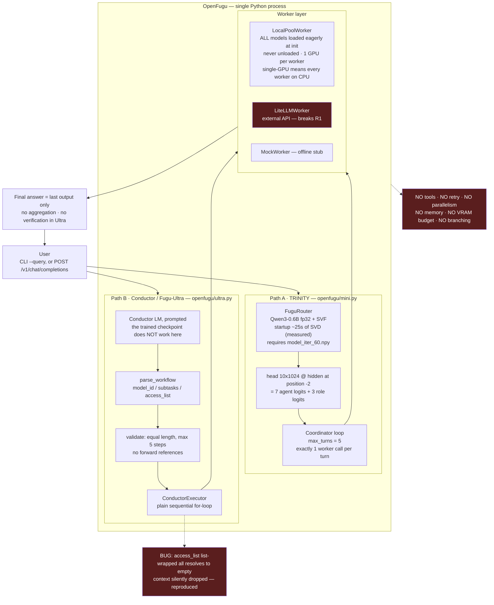
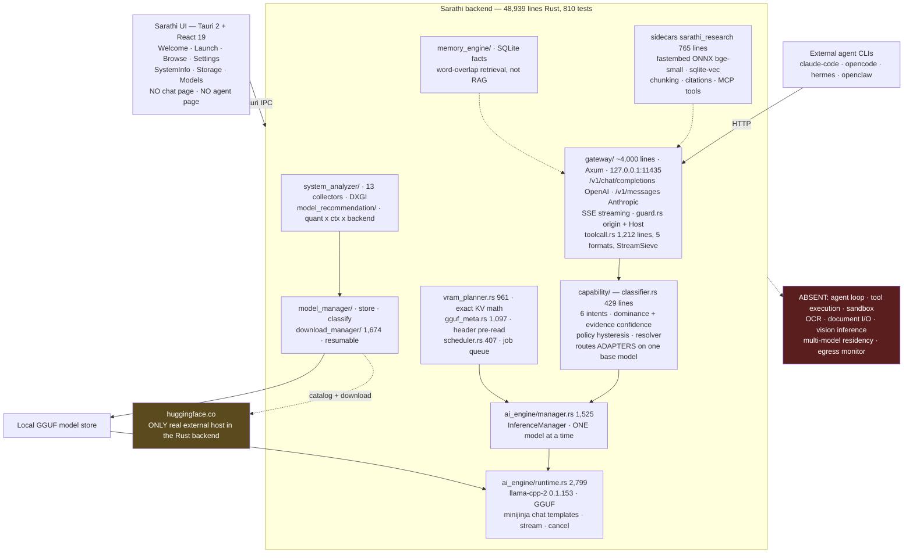
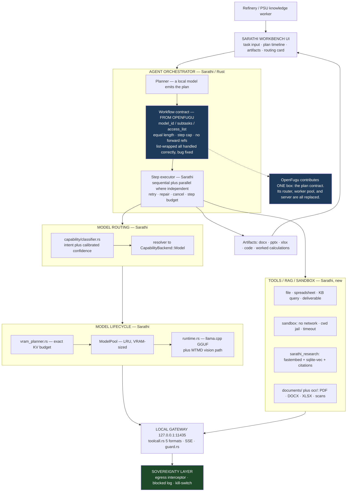
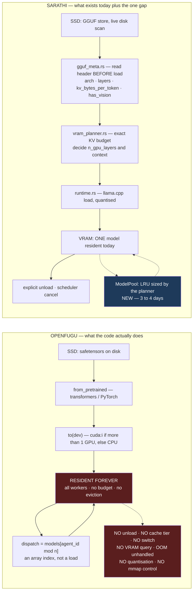
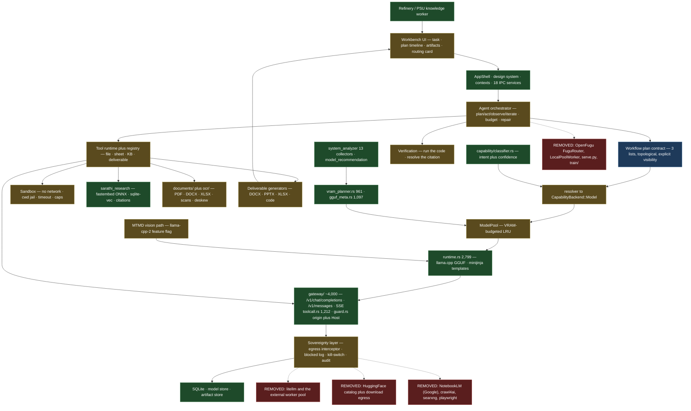

# SIH 2026 · PS 26117 — OpenFugu Deep Technical Due-Diligence

**Subject:** `https://github.com/trotsky1997/OpenFugu.git`
**Audited commit:** `7ad7ccf977c1b5f38bbd07ba33d86fe655c17be8` (2026-06-23 03:32 +0800) — the repository HEAD
**Target:** SIH 2026 PS 26117 — *Sovereign On-Premise Agentic AI Workbench using Open-Weight Multimodal LLMs for Confidential Industrial Work* (MRPL)
**Sarathi source of truth:** [`SIH_26117_Sarathi_Reuse_Analysis.md`](SIH_26117_Sarathi_Reuse_Analysis.md) (prior full-code audit; not re-derived here)
**Date:** 2026-08-22
**Nature of this document:** research and architecture investigation only. **Neither OpenFugu nor Sarathi was modified.** OpenFugu's working tree was verified clean (`git status --porcelain` → empty) after every experiment in §15.

---

## Evidence grading used throughout

Every technical claim in this report carries one of these grades. This is not decoration — several of OpenFugu's own README claims degrade sharply when graded.

| Grade | Meaning |
| --- | --- |
| **[OBSERVED]** | I executed it on this machine, or read the repository's own committed execution log, and am quoting the result |
| **[CODE]** | Read directly from OpenFugu source; the file and line are cited |
| **[DOCUMENTED]** | Asserted in OpenFugu's README/docs, with no code or log confirming it |
| **[INFERRED]** | Deduced from code structure; plausible, not executed |
| **[UNKNOWN]** | Not determinable from the repository |

---

## Table of Contents

1. [Executive summary](#1-executive-summary)
2. [PS 26117 requirements](#2-ps-26117-requirements)
3. [OpenFugu repository overview](#3-openfugu-repository-overview)
4. [Actual architecture and execution flow](#4-actual-architecture-and-execution-flow)
5. [TRINITY vs Conductor vs Fugu-Ultra](#5-trinity-vs-conductor-vs-fugu-ultra)
6. [The central question: does it really orchestrate multiple models?](#6-the-central-question-does-it-really-orchestrate-multiple-models)
7. [Model memory / VRAM behaviour — the definitive answer](#7-model-memory--vram-behaviour--the-definitive-answer)
8. [Component-by-component reuse analysis](#8-component-by-component-reuse-analysis)
9. [Reuse percentages, defined precisely](#9-reuse-percentages-defined-precisely)
10. [Requirement mapping: OpenFugu vs PS 26117](#10-requirement-mapping-openfugu-vs-ps-26117)
11. [OpenFugu + Sarathi integration design](#11-openfugu--sarathi-integration-design)
12. [Architecture diagrams](#12-architecture-diagrams)
13. [Feasibility analysis](#13-feasibility-analysis)
14. [20-day implementation impact](#14-20-day-implementation-impact)
15. [Standalone test plan](#15-standalone-test-plan)
16. [What OpenFugu does not solve](#16-what-openfugu-does-not-solve)
17. [Licensing and legal check](#17-licensing-and-legal-check)
18. [Risks](#18-risks)
19. [Final verdict](#19-final-verdict)
20. [Compact answer table](#20-compact-answer-table)

---

## 1. Executive summary

OpenFugu is a **two-day research sprint** (22 commits, all dated 2026-06-22/23, one aggregate author) that reverse-engineers Sakana AI's closed "Fugu" LLM-orchestrator from two papers plus a released checkpoint. **[OBSERVED]** `git log`. It is 3,853 lines of Python and 3,694 lines of Markdown. The documentation is genuinely excellent — better than the code. The code is a proof-of-mechanism, not a library: there is no `pyproject.toml`, no `setup.py`, no CI, no test directory, and four source files import a package (`custom_data`) that **does not exist in the repository**.

### The five findings that decide this

**1. The reusable surface is about 165 lines.** The only part of OpenFugu that a PS 26117 solution would genuinely want is the Conductor workflow contract and its executor — `parse_workflow` / `visible_indices` / `ConductorExecutor` in `openfugu/ultra.py:45-208`. Everything else is either a Sakana-checkpoint-dependent router (which Sarathi's `capability/classifier.rs` already beats for this use case), a training stack for a task PS 26117 does not require, or a serving layer strictly inferior to Sarathi's existing 4,000-line gateway.

**2. That 165 lines contains a confirmed data-flow bug.** I reproduced it. `visible_indices` treats the access-list form `['all']` — a list containing the string — as "see nothing", silently. **[OBSERVED]**

```
bare 'all'  -> [0, 1]     # works
['all']     -> []         # silently sees nothing   <-- BUG
[0,1]       -> [0, 1]     # works
```

This is not theoretical. It is exactly what happened in OpenFugu's **only** committed local Fugu-Ultra end-to-end run: gemma-3-4b emitted `access_list=[[], [], ['all']]`, all three steps printed `sees=[]`, no output flowed between steps, and the final answer was the degenerate *"I don't see a function provided. Please provide the function…"* — yet the test printed **PASS**, because its only assertion is that the answer is non-empty. **[OBSERVED]** `results/conductor_e2e_run.txt`.

**3. In its own only local multi-model demo, OpenFugu did not route to multiple models.** The workflow emitted was `model_id=[0, 0, 0]` — all three steps to worker 0. **[OBSERVED]** `results/conductor_e2e_run.txt`.

**4. OpenFugu performs no model lifecycle management whatsoever.** Every worker model is loaded eagerly at construction and stays resident forever. Repo-wide grep for `empty_cache`, `del model`, `offload`, `device_map`, `max_memory`, `low_cpu_mem_usage`, `mmap`, or any quantisation library returns **zero hits**. **[OBSERVED]** There is no VRAM budget, no eviction, no on-demand load, no unload, no fallback on OOM. On a machine with fewer than two GPUs its device planner silently puts *every worker on CPU* — which is precisely PS 26117's demo hardware (D1: "a single workstation or server with a mid-range GPU").

**5. The headline numbers are not what they look like.** The README's "**+107% over best single worker**" is a synthetic simulation with hand-authored competence values, not an LLM result — I re-ran it and got +106% **[OBSERVED]**, from a `MockWorld` whose specialists score 0.85–0.97 and non-specialists 0.15–0.35 by construction. On real data OpenFugu's own logs report a **TIE** on GSM8K (0.917 vs 0.917) and **+7% on absolute scores of 0.152 vs 0.142** on ToolScale. The recursion experiment is a **TIE** on held-out. The per-step training "1.000" is in-sample over **8 questions**. To OpenFugu's very considerable credit, `results/README.md` says all of this itself, plainly and first.

### Verdict

> **POSSIBLE BUT NOT WORTH THE COMPLEXITY** — as a dependency.
> **Read the docs, adopt the DAG contract, do not integrate the codebase.**

The design idea worth taking is one page long: *a planner emits three equal-length lists — `model_id[]`, `subtasks[]`, `access_list[]` — validated to be a topological order, then executed with explicit per-step visibility.* That is a genuinely good, genuinely small contract, and reimplementing it natively in Sarathi's Rust is roughly one day's work. Importing OpenFugu instead means dragging `torch`, `transformers`, `trl`, and `litellm` into an air-gapped Tauri desktop app to obtain 165 buggy lines, and inheriting a model-residency model that is the exact opposite of what a mid-range single GPU needs.

**OpenFugu solves ~20% of PS 26117's orchestration requirement and ~3% of the total build. Its code reuse is 5–8%. Its documentation is worth a day of reading and should be cited.**

---

## 2. PS 26117 requirements

Reproduced from [`SIH_26117_Sarathi_Reuse_Analysis.md` §1](SIH_26117_Sarathi_Reuse_Analysis.md), which extracted them from the live SIH portal. Nothing is invented here; where the PS is silent, this document says so.

### 2.1 Identification

| Field | Value |
| --- | --- |
| **Problem Statement ID** | **26117** |
| **PS Number** | SIH26117 |
| **Title** | Sovereign On-Premise Agentic AI Workbench using Open-Weight Multimodal LLMs for Confidential Industrial Work |
| **Organization / Department** | Mangalore Refinery and Petrochemicals Limited (MRPL) |
| **Category** | Software |
| **Theme** | Smart Automation |
| **Idea submission deadline** | 20 September 2026 |
| **Dataset** | Open-source models + publicly available samples (scanned PDFs, open-dataset P&IDs). No proprietary data supplied or required. |

### 2.2 Background, core problem, users

**Background.** Refineries, PSUs, defence-linked manufacturers and government offices generate high volumes of sensitive routine knowledge work — approval notes, board decks, engineering calculations, internal tooling code, review of scanned drawings and inspection reports. None of it may pass through cloud AI. Policy keeps the data on premises, so staff either work manually or quietly paste confidential material into public tools anyway. Open-weight reasoning models are now good enough, but **nothing deployable exists that industrial users can work with the way they use Claude or Codex.**

**Core problem.** Build a self-hosted, air-gapped AI workbench running entirely on the organisation's own GPU server, with commercial-assistant ergonomics, where nothing leaves the premises.

**Target users.** Knowledge workers inside confidential industrial and government environments — refinery/PSU engineers, defence-linked manufacturing staff, government office personnel.

### 2.3 MANDATORY REQUIREMENTS

| # | Requirement | PS wording |
| --- | --- | --- |
| **R1** | Air-gapped, on-premise | "running entirely on the organization's own GPU server. Nothing leaves the premises." |
| **R2** | Multi-model, auto-selected | "should not be locked to one model… support multiple open weight models at once and automatically pick the right one for a given task based on what that task needs, a coding request handled differently from a document summary request." |
| **R3** | Extensible model layer | "New open weight models should be addable later without redesigning the system." |
| **R4** | Genuine agent | "Plan out multi step work, call local tools such as file read and write, code execution in a sandbox, spreadsheet work, internal document search, and **iterate on a task instead of answering once and stopping.**" |
| **R5** | Multimodal input | "scanned PDFs, handwritten notes, engineering drawings, photographs, read through **on device OCR and vision models.**" |
| **R6** | Real deliverables | "approval notes, PPT/Word/Excel files, working code, calculations with steps shown, **not just chat replies.**" |
| **R7** | Local knowledge base | "ground itself in the organization's own manuals, SOPs and past correspondence through a **local knowledge base connector**, again with nothing going external." |

**Demo contract (effectively the rubric):**

| # | Demo obligation |
| --- | --- |
| **D1** | Working local deployment on a single workstation/server with a **mid-range GPU** (smaller open-weight model permitted if 120B-class hardware is unavailable) |
| **D2** | **Model auto-selection across at least two different task types** |
| **D3** | An agentic task end-to-end — e.g. **read a scanned inspection report → extract findings → draft an approval note as a Word file** |
| **D4** | A **coding task run and verified in a sandbox** |
| **D5** | A multimodal task involving **image or scanned-document understanding** |
| **D6** | Prove, **via logs or a visible network monitor, that no external calls are made at any point** |

**Explicit constraints:** mid-range single GPU; open-weight models only; no proprietary data; sovereignty must be *proven*, not asserted; Software category only.

### 2.4 OPTIONAL / NICE-TO-HAVE

Not stated as obligations but consistent with the PS's intent: an audit trail beyond the egress monitor; a routing-explanation surface ("why this model?"); offline/sideload model installation; multiple concurrent task types in one session.

### 2.5 NOT REQUIRED

Stated so the build does not drift: no multi-user auth / RBAC / SSO; no accuracy or latency targets; no SAP / ERP / DCS / historian integration; no mobile app; no cloud fallback; no federated deployment; no mandated model family, quantisation or inference engine; **no fine-tuning or model training of any kind.**

> **The last one matters enormously for this audit.** Roughly **43% of OpenFugu's Python (1,651 of 3,853 lines in `train/`) trains orchestrator weights** — a capability PS 26117 explicitly does not ask for.

---

## 3. OpenFugu repository overview

### 3.1 What it claims to be

From `README.md:3-11`:

> "An open, runnable reverse-engineering of Sakana AI's Fugu — the 'one model to command them all' LLM orchestrator… Fugu is sold as a single model; it is really a *policy over models* — a tiny coordinator that, per query, routes work to a pool of frontier LLMs and returns one answer."

Four stages: **read → run → train → serve**. **[DOCUMENTED]**

### 3.2 Maturity signals **[OBSERVED]**

| Signal | Finding |
| --- | --- |
| Commits | **22**, all between 2026-06-22 and 2026-06-23 — a two-day sprint |
| Authors | One: "OpenFugu Contributors" |
| Packaging | **No `pyproject.toml`, no `setup.py`** — not installable; you would vendor files |
| CI | **None** (`.github/` absent) |
| Test suite | **None.** No `tests/`, no pytest config, no file matching `*test*`. Verification is `--self-test` flags inside scripts |
| Containerisation | None |
| Broken imports | **4 files** import `from custom_data.toolscale_data import …`; `custom_data/` does not exist |
| Hardcoded foreign paths | **12 occurrences** of `/root/...` and `/vePFS-Mindverse/...` — the author's borrowed GPU box, named in `docs/handoff.md` as `ssh -p 8903 root@115.190.235.210` |

I ran the README's headline training command as shipped:

```
$ python train/train_conductor.py
ModuleNotFoundError: No module named 'custom_data'
```

**[OBSERVED]** — same for `train/grpo_smoke.py`. `train/train_recursion_real.py` and `eval/eval_recursion_real.py` carry the identical import.

### 3.3 File inventory **[OBSERVED]**

| Area | Lines (Py) | Contents |
| --- | ---: | --- |
| `openfugu/` | **1,115** | `mini.py` 507 (TRINITY router + Coordinator), `ultra.py` 417 (Conductor DAG), `serve.py` 189 (HTTP) |
| `train/` | **1,651** | 10 trainers + ToolScale reward + a reconstructed CMA loop |
| `eval/` | 455 | orchestration (mock), recursion, serve-e2e, ultra-e2e |
| `verify/` | 235 | checkpoint-faithfulness probes |
| `pipeline/` | 106 | one-command train→serve→verify |
| `scripts/` | 81 | third-party artifact fetcher |
| `assets/` | 210 | plotting |
| **Total Python** | **3,853** | |
| **Total Markdown** | **3,694** | `docs/` 991, `openspec/` ~700, `results/README.md` 284, `.claude/` ~1,400 |

### 3.4 Dependencies (`requirements.txt`)

`torch>=2.4`, `transformers>=4.52,<5`, `trl>=0.19,<0.20`, `datasets>=3.6`, `peft`, `accelerate`, `numpy`, **`litellm`**, `hydra-core`, `omegaconf`, `math_verify`, `huggingface_hub`, `cma`.

Note the shape: this is a **research training stack**. `trl`, `peft`, `accelerate`, `hydra-core`, `math_verify` and `cma` exist only to train orchestrator weights. For inference alone you need `torch` + `transformers` (local) or `litellm` (API).

### 3.5 Required artifacts — none redistributed

`scripts/fetch_artifacts.py` pulls three things at setup time: **[CODE]**

1. `model_iter_60.npy` — the TRINITY router checkpoint (19,456 floats), from HF dataset `nshkrdotcom/trinity-coordinator-adapted-qwen3-0.6b`
2. `qwen_router_prompt_eval_cases.json` — 37-case fixture, raw-fetched from GitHub
3. `Qwen/Qwen3-0.6B` — the backbone, via `snapshot_download`

**All three are network fetches.** For an air-gapped PS 26117 build every one must be pre-staged. The `.npy` checkpoint is the load-bearing artifact: without it, `FuguRouter` raises `ValueError: router vector must be 19456 floats`. **[CODE]** `mini.py:117`.

---

## 4. Actual architecture and execution flow

I traced both execution paths line by line rather than reading the README.

### 4.1 Path A — TRINITY (`openfugu/mini.py`): per-turn single-worker routing

**Construction — `FuguRouter.__init__` (`mini.py:105-130`) [CODE]**

1. `np.load(vector_path)` → assert shape `(19456,)`
2. `AutoModelForCausalLM.from_pretrained(model_dir, dtype=float32)` — Qwen3-0.6B, **fp32**, ~2.4 GB
3. `.to(device)` if `--device` given, else CPU
4. `_apply_svf(vec[:9216])` — see below
5. `head = vec[9216:].reshape(10, 1024)` — 7 agent rows + 3 role rows

**`_apply_svf` (`mini.py:136-155`)** performs a **full `torch.linalg.svd` on 9 weight matrices and reconstructs each one**, including `embed_tokens` (151936×1024) and `lm_head` (151936×1024). This is not a cheap adapter application; it rebuilds the model's two largest matrices from scratch on every construction.

I measured the exact shape sequence on this machine (CPU, fp32): **[OBSERVED]**

```
(151936,1024) svd+reconstruct 11.8s
(2048,1024)    0.4s   (1024,1024) 0.2s   (1024,1024) 0.2s   (1024,2048) 0.4s
(3072,1024)    0.3s   (3072,1024) 0.3s   (1024,3072) 0.7s
(151936,1024) svd+reconstruct 10.6s
TOTAL: 24.9s
```

**~25 seconds of startup cost per `FuguRouter` construction on CPU**, plus a transient allocation of roughly 1.2 GB for the two large `U` matrices and their reconstructions. On GPU this is faster (the code moves the model to `device` *before* `_apply_svf`), but the cost is structural and unavoidable, and it recurs on every process start.

**Routing — `route()` (`mini.py:180-201`) [CODE]**

```python
h = self._hidden(messages)          # backbone forward, hidden state at position -2
logits = self.head @ h              # (10,)
agent_logits, role_logits = logits[:7], logits[7:]
agent_id = self._pick(agent_logits, sample)   # argmax or softmax-sample
role_id  = self._pick(role_logits,  sample)
```

The backbone's *text* is never generated. One forward pass → 10 logits → two independent picks. `format_transcript` joins messages as raw `role: content` — **not** a chat template; the docs record this as decisive (95% vs 11% fixture accuracy).

**The loop — `Coordinator.run()` (`mini.py:314-370`) [CODE]**

```
obs = query
for t in range(max_turns):                       # max_turns default 5
    r = router.route([system_router, {user: obs}])
    role = suggested_role or r["role_name"]      # Thinker can override next role
    agent_id = r["agent_id"]
    if role == "Verifier" and last_response is None: role = "Worker"
    msgs = _format_messages(role, query, last_response, suggestion)
    reply = self.worker(role, msgs, agent_id)    # <-- EXACTLY ONE worker call per turn
    if   role == "Worker":   last_response = reply; obs += f"<reference_thought_{n}>{think}</...>"
    elif role == "Thinker":  suggested_role, suggestion = parse(reply)
    elif role == "Verifier": if reply.startswith("ACCEPT"): return last_response
return last_response or last turn's reply        # terminated_by = "max_turns"
```

Three roles share one system prompt; the role lives in how the *user* message is built. Only a **Worker** turn updates the router's observation. Termination is `verifier_accept` or `max_turns`. **Strictly sequential; exactly one worker per turn; no branching; no parallelism; no tools.**

### 4.2 Path B — Fugu-Ultra (`openfugu/ultra.py`): one-shot workflow DAG

**Conductor prompt (`ultra.py:122-140`) [CODE].** A prompted model is asked for three equal-length Python lists: `model_id: [int]`, `subtasks: [str]`, `access_list: [list]`, ≤5 steps, access referencing only strictly earlier steps, last step's output = final answer.

**Parsing (`ultra.py:45-95`) [CODE].** `_balanced_list` extracts the first balanced `[...]` respecting quotes/escapes; `extract_list` then tries `ast.literal_eval` → `json.loads` → CSV split. This part is well written and is the single best piece of code in the repository.

**Visibility (`ultra.py:99-118`) [CODE].** `visible_indices(access_list, step)` resolves what step *t* may see. Forward references raise `ValueError`. `'all'` means every earlier step.

**Execution (`ultra.py:167-198`) [CODE].**

```python
for t, (mid, sub) in enumerate(zip(model_ids, subtasks)):
    sees = visible_indices(access, t)
    ctx = "".join(f"<Agent {model_ids[j]} response>{outputs[j]}</...>" for j in sees)
    user = f"USER QUESTION context:\n{ctx}\n\nYour subtask: {sub}" if ctx else f"Your subtask: {sub}"
    mid = int(mid) % len(self.slot_labels)          # <-- modulo wrap
    reply = self.worker(sub, [{"role":"user","content":user}], mid)
    outputs.append(reply)
res.final = outputs[-1]
```

A plain `for` loop. **No parallelism** even where the access-list explicitly permits it (two steps with `access=[]` are provably independent and are still run one after the other). No retry. No error handling around the worker call — a worker exception propagates and kills the whole workflow. No verification of any step's output. No looping. No conditional branching.

### 4.3 The `['all']` bug — reproduced

`_is_all` (`ultra.py:96-97`) tests `isinstance(x, str)`. When a model emits `access_list: [[], [], ['all']]` — a *list* containing `'all'`, which is a natural thing for an LLM to write given lists elsewhere in the same structure — the string test fails, the `[] / "" / None` test fails, and the element loop skips `'all'` because it is not an `int`. Result: `[]`, silently. I executed it: **[OBSERVED]**

```python
>>> visible_indices([[], [], 'all'],   2)   # [0, 1]   correct
>>> visible_indices([[], [], ['all']], 2)   # []       silent data loss
>>> ConductorExecutor(MockWorker()).execute([0,0,0], ['a','b','c'], [[],[],['all']])
    steps sees: [[], [], []]
```

This is the failure mode in `results/conductor_e2e_run.txt`. **In OpenFugu's only committed local Fugu-Ultra end-to-end run, no output flowed between any pair of steps** — and the run was scored PASS.

### 4.4 The serving layer (`openfugu/serve.py`)

`ThreadingHTTPServer` on stdlib `http.server`, `0.0.0.0:8088`, `GET /health`, `GET /v1/models`, `POST /v1/chat/completions`. **[CODE]**

Compared with what Sarathi already ships (§2.2.10 of the Sarathi analysis: ~4,000 lines, Axum, SSE streaming on two dialects, origin/Host guard, `toolcall.rs` 1,212 lines across five tool-call formats, client activity tracking), `serve.py` has:

- **no streaming** — the client blocks for the entire multi-turn loop
- **binds `0.0.0.0`**, not loopback — for PS 26117's R1/D6 this is an outright liability
- **no auth, no origin guard, no Host guard**
- **no tool-call support at all**
- **global mutable `ROUTER` / `WORKER` shared across threads** with per-request `Coordinator` construction — `router.rng` and `MockWorker._verifications` are shared mutable state under `ThreadingHTTPServer`; concurrent requests race **[INFERRED]**
- `usage` returns `{"fugu_turns": n}`, which is not the OpenAI usage schema

**Measured latency from OpenFugu's own log**, 8×A800-80GB server, two 3B/4B workers resident on separate GPUs, one GSM8K arithmetic question, 2 turns: **51.4 s** on the first run and **16.3 s** on a warmed run. **[OBSERVED]** `results/serve_e2e_run.txt`, `results/e2e_pipeline_run.txt`.

---

## 5. TRINITY vs Conductor vs Fugu-Ultra

These names are used loosely in the README; here is what they actually are in this repository.

| | **TRINITY** (a.k.a. "Fugu", "Mini") | **Conductor / Fugu-Ultra** |
| --- | --- | --- |
| File | `openfugu/mini.py` (507 lines) | `openfugu/ultra.py` (417 lines) |
| Orchestrator | Qwen3-0.6B backbone + **19,456 trained floats** (9,216 SVF offsets + a 10×1024 bias-free head) | A **7B-class LM prompted in natural language**; here any local or API model |
| Decision unit | **One (worker, role) pair per turn** | **A whole 3-list workflow, one shot** |
| Decision cost | One forward pass, no decode | A full generation (≤2048 tokens) |
| Structure | Sequential loop, ≤5 turns, verifier-terminated | Topologically-ordered step list, ≤5 steps, last step = answer |
| Multi-step? | Yes — turns | Yes — steps |
| Data flow between steps | Implicit: solver `<think>` appended to router obs; `last_response` handed to verifier | Explicit: `access_list` selects which earlier outputs each step sees |
| Task decomposition | **No** — the same query is re-asked each turn with role framing | **Yes** — the Conductor writes distinct sub-task instructions |
| Requires trained weights | **Yes** — the `.npy` checkpoint is mandatory | **No** — prompting works (and the trained one doesn't, see below) |
| Roles | solver / thinker / verifier | none — steps are plain sub-tasks |
| Verification | Built in (Verifier role, `ACCEPT`/`REJECT`) | **None** |
| Tools | **None** | **None** |

**"Fugu-Ultra" and "Conductor" are the same thing in this repository.** `ultra.py` is the Conductor line; there is no separate Fugu-Ultra implementation. The name distinguishes Sakana's *product tiers*, not OpenFugu's code.

### The finding that guts the Conductor line

OpenFugu trained and published a Conductor (`di-zhang-fdu/openfugu-conductor-3b`, a Llama-3.2-3B GRPO fine-tune). **It does not drive the workflow executor.** From `results/conductor_e2e_run.txt`: **[OBSERVED]**

```
=== checkpoint-100 (our GRPO-trained Conductor) as workflow Conductor ===
[ultra-e2e] emitted workflow: model_id=[] access_list=[] steps=0
FAIL — trained Conductor emitted no parseable workflow
raw completion: (a fenced Python fibonacci function — a direct answer, not a DAG)
```

`results/README.md` explains why, correctly: the checkpoint was GRPO-trained on the **ToolScale tool-call DSL** (`<think>/<answer>[json]`), a different output language from the **3-list workflow DSL**. Getting a trained Conductor means a fresh GRPO run on the workflow DSL — a multi-GPU training project, not a config change.

**So the only working Conductor in OpenFugu is a prompted off-the-shelf model.** And the repository's own probe shows how fragile that is: **[OBSERVED]**

```
=== which local models emit a parseable 3-list workflow (probe) ===
[llama-3.2-3b]        steps=0   model_id=[]  access=[]
[gemma-3-4b]          steps=5   model_id=[2,1,3,0,4]  access=[[],[],[0,1],[2,3],[]]
[deepseek-distill-7b] steps=0   model_id=[]  access=[]
```

**One of three local models could produce a parseable workflow.** For a PS 26117 demo on a mid-range GPU with small open-weight models, a 33% plan-parse rate with no retry path is a demo-day failure waiting to happen.

---

## 6. The central question: does it really orchestrate multiple models?

Answering strictly from code and executed logs, not marketing.

| Question | Answer | Evidence |
| --- | --- | --- |
| Does it actually select different worker models? | **Mechanically yes; in its own local runs, no.** | `route()` returns `agent_id ∈ 0..6`; `LocalPoolWorker.__call__` dispatches `self.models[agent_id % len(self.models)]` **[CODE]** `serve.py:122`. But the only committed local Ultra run emitted `model_id=[0,0,0]` — one worker for all steps **[OBSERVED]** |
| What triggers worker selection? | TRINITY: one `head @ hidden_state` matmul on the penultimate-token hidden state. Ultra: whatever integers the Conductor LM happens to write into `model_id`. | **[CODE]** `mini.py:186`, `ultra.py:88` |
| One worker or multiple? | **One per turn/step, always.** `Coordinator.run` calls `self.worker(...)` exactly once per iteration; `ConductorExecutor.execute` once per step. | **[CODE]** `mini.py:340`, `ultra.py:193` |
| Multi-step workflows? | **Yes.** TRINITY ≤5 turns; Ultra ≤5 steps (`MAX_STEPS = 5`, hard cap, truncates silently in `validate()`). | **[CODE]** `ultra.py:33, 161-165` |
| Can one worker's output feed another's input? | **By design yes; in practice bug-prone.** Ultra injects `<Agent N response>` blocks for indices in `sees`. TRINITY appends solver `<think>` to the router obs and passes `last_response` to the verifier. But `['all']` silently drops all context (§4.3). | **[CODE]** + **[OBSERVED]** |
| Does Fugu-Ultra execute a DAG? | **It executes a linear list with visibility masking.** OpenFugu's own docs concede this: *"it's a topological order, not an arbitrary DAG"* (`docs/ARCHITECTURE.md` §3.1, correction #6 in its log). There is no scheduler, no dependency graph, no fan-out. | **[CODE]** `ultra.py:184` — a plain `for` loop |
| Dynamic or predetermined? | **Dynamic in content, static in shape.** The Conductor writes the plan per query, so the steps vary. But the plan is fixed at generation time and never revised — no replanning, no adaptation to a failed step. | **[CODE]** |
| Does the Conductor reason about the task? | **It is a prompted LLM, so whatever reasoning it does is the base model's.** OpenFugu contributes the prompt (`ultra.py:122`) and the parser. There is no learned or structured task analysis. | **[CODE]** |
| Does it understand intent? | **No intent model exists.** TRINITY's head produces a 7-way worker score and a 3-way role score from a hidden state. There is no intent taxonomy, no classification, no confidence. (Contrast Sarathi's `capability/classifier.rs`, 429 lines, six intents, dominance+evidence confidence.) | **[CODE]** |
| Choose workers only, or also decompose? | **TRINITY: chooses only** — the same query is re-asked each turn with role framing. **Ultra: decomposes** — the Conductor writes distinct sub-task strings. | **[CODE]** |
| Aggregate results? | **No.** Both return the *last* thing produced: `res.final = outputs[-1]` (Ultra), `res.final = last_response` (TRINITY). There is no synthesis, merge, or reduce step. | **[CODE]** `ultra.py:198`, `mini.py:367` |
| Verify results? | **TRINITY: yes, weakly** — a Verifier role whose contract is a reply starting with `ACCEPT`/`REJECT`, parsed by `text.strip().upper().startswith("ACCEPT")`. **Ultra: no verification at all.** | **[CODE]** `mini.py:409` |
| Retry failed steps? | **No.** Repo-wide there is no retry, no backoff, no circuit breaker. A worker exception propagates out of `execute()`. | **[OBSERVED]** grep for retry/backoff → zero hits outside generic `except Exception` in unrelated paths |
| Run workers sequentially? | **Yes — only sequentially.** | **[CODE]** |
| Run workers in parallel? | **No.** No `asyncio`, no `concurrent.futures`, no threads in either executor. The only threading in the repo is `ThreadingHTTPServer` (concurrent HTTP requests) and a log-pump thread in a test. | **[OBSERVED]** grep |
| Conditionally branch? | **No.** The nearest thing is the Thinker's `<suggested_role>` overriding the *next role* for one turn — a one-slot override, not a branch. | **[CODE]** `mini.py:333` |
| Loop? | **Only the fixed bounded turn loop.** No while-until-satisfied, no re-entry, no revision cycle. The "recursion" experiment feeds round-0 output into a round-1 prompt during *training*; it is not in the inference path and its held-out result was a **TIE** (round-0 0.617 vs round-1 0.616, 0/40 improved). | **[CODE]** + **[OBSERVED]** |
| TRINITY/Mini vs Fugu-Ultra? | See §5. Learned per-turn picker vs prompted one-shot planner. | |

### 6.1 The modulo problem — a design flaw for small local pools

Every worker adapter in the repository dispatches with `agent_id % len(self.models)`: **[CODE]** `serve.py:122`, `ultra.py:230`, `ultra.py:293`, `train/train_trinity_perstep.py:62`.

The TRINITY head is trained to discriminate **7 slots**. With a 2-model local pool — precisely PS 26117's mid-range-GPU scenario — slots `{0,2,4,6}` collapse to model 0 and `{1,3,5}` to model 1. The learned 7-way signal is destroyed by an arithmetic accident, and a head trained against a 7-model API pool carries **no** transferable meaning for a 2-model local pool. OpenFugu partially acknowledges this with `agent_mask` (the k-of-n experiment), but masking requires *retraining over the offered subsets* — which brings back a training requirement PS 26117 does not have.

### 6.2 Bottom line

> **OpenFugu can orchestrate multiple models. It has never been shown to do so usefully.**
>
> The dispatch mechanism is real and works. But: the trained Conductor cannot emit workflows; the only local Conductor that can (gemma-3-4b) chose one worker for all three steps; the `['all']` bug meant no data flowed between those steps anyway; and on real data the routing gains are a TIE (GSM8K) and +7% on near-zero absolute scores (ToolScale). The **+107%** headline is a synthetic simulation, which I re-ran and confirmed. **[OBSERVED]**

---

## 7. Model memory / VRAM behaviour — the definitive answer

This is the question the brief flagged as most important. It has a clean answer.

> ## OpenFugu does **NOT** manage SSD → RAM → VRAM → unload → next model.
> It performs a **one-time eager load of every worker at construction**, assigns each a fixed device, and never touches memory again. All actual loading is done by `transformers` + PyTorch's CUDA caching allocator. OpenFugu contributes **static device placement and nothing else.**

### 7.1 Evidence, item by item

**Where worker models are loaded.** Three near-identical `LocalPoolWorker.__init__` implementations — `serve.py:105-118`, `ultra.py:270-287`, `train/train_trinity_perstep.py:45-58` — all with this body: **[CODE]**

```python
for name, path, dev in specs:                      # every spec, up front
    tk = AutoTokenizer.from_pretrained(path)
    m  = AutoModelForCausalLM.from_pretrained(path, dtype=torch.bfloat16).to(dev).eval()
    self.models.append(m); self.devs.append(dev)
```

This runs inside the constructor, **before the HTTP server binds its socket** (`serve.py:173` then `:183`). Every worker is materialised before the first request arrives.

**Which library loads them.** `transformers.AutoModelForCausalLM.from_pretrained`, then `.to(device)` — i.e. HF `transformers` over PyTorch. **[CODE]** Nothing else. No `llama.cpp`, no GGUF, no `vLLM`, no ONNX.

**Does OpenFugu control loading/unloading?** It controls **load placement, once**. It does **not** control unloading, because there is none. Repo-wide grep: **[OBSERVED]**

```
empty_cache       -> 0 hits
del model         -> 0 hits
offload           -> 0 hits
device_map        -> 0 hits
max_memory        -> 0 hits
low_cpu_mem_usage -> 0 hits
mmap              -> 0 hits
quantiz | bitsandbytes | gguf | llama_cpp  -> 0 hits
```

**Do multiple workers stay resident?** **Yes — permanently, all of them, for the process lifetime.** They are held in `self.models: list` and never released. **[CODE]**

**Are models loaded on demand?** **No.** Eager, all, at construction. **[CODE]**

**Are they kept in RAM?** They are moved to their assigned `dev`. If `dev` is a CUDA device, weights live in VRAM; if `"cpu"`, in system RAM. Either way they are never evicted. **[CODE]**

**Memory-mapped?** Not by OpenFugu's choice. `from_pretrained` without `low_cpu_mem_usage` or `device_map` mmaps safetensors internally during load, then fully materialises the model on `dev`. OpenFugu exercises no control. **[INFERRED]** from the call signature.

**Are workers separate processes?** **No.** All models are Python objects inside one process. The only `subprocess.Popen` calls in the repository launch *the server* from a test harness (`eval/serve_e2e.py:73`) and stages from the pipeline runner (`pipeline/e2e_train_serve.py:38`) — never a worker. **[OBSERVED]**

**Can multiple models occupy VRAM simultaneously?** **Yes, and that is the design intent — it requires one GPU per worker.** The device planner: **[CODE]** `serve.py:165-172`, `ultra.py:353-361`

```python
n_gpu = torch.cuda.device_count() if torch.cuda.is_available() else 0
dev = f"cuda:{(i % max(n_gpu - 1, 1)) + 1}" if n_gpu > 1 else "cpu"
```

Read that carefully. It reserves `cuda:0` for the router/Conductor and round-robins workers across `cuda:1..n-1`. **If `n_gpu <= 1`, every worker is placed on `"cpu"`.** OpenFugu's own runs used an 8×A800-80GB box with workers pinned `@cuda:1`, `@cuda:2` (`results/serve_e2e_run.txt`). **[OBSERVED]**

> **This is the single most disqualifying finding for PS 26117.** Demo obligation **D1** is "a single workstation or server with a **mid-range GPU**." On exactly that hardware, OpenFugu silently runs every worker model on the CPU while the orchestrator holds the GPU. A 3B model generating 384 tokens on CPU is tens of seconds per step; a 3-step workflow is minutes. The 16–51 s latencies in OpenFugu's own logs were achieved with **one A800-80GB per worker**.

**How are VRAM limitations handled?** **They are not.** There is no free-VRAM query anywhere. The only `torch.cuda` call in the entire repository is `device_count()`. There is no budget, no KV-cache accounting, no context-length sizing, no headroom check. **[OBSERVED]**

**What happens on insufficient VRAM?** An unhandled `torch.cuda.OutOfMemoryError` propagates out of `from_pretrained(...).to(dev)` inside the constructor, killing the process before the server starts. There is no `try`, no fallback to CPU, no smaller-quant retry. **[CODE]**

**Is model switching automatic?** **There is no model switching.** What OpenFugu calls routing is `self.models[agent_id % len(self.models)]` — an array index into already-resident objects. No weights move. No cache is invalidated. Nothing is loaded or freed. **[CODE]**

**Any hardware awareness?** **One line**: `torch.cuda.device_count()`, used only to pick device *names*. No VRAM capacity, no compute capability, no system RAM, no disk. **[OBSERVED]**

### 7.2 Compared with what Sarathi already has

Per [`SIH_26117_Sarathi_Reuse_Analysis.md` §2.2.8](SIH_26117_Sarathi_Reuse_Analysis.md):

| Concern | OpenFugu | Sarathi |
| --- | --- | --- |
| VRAM planning | none | `vram_planner.rs` — **961 lines**, exact KV-cache math, GPU offload planning |
| Pre-load introspection | none | `gguf_meta.rs` — **1,097 lines**, reads arch/layers/`kv_bytes_per_token`/`has_vision` from the header before loading |
| Hardware profile | `device_count()` | `system_analyzer/` — 13 collectors, DXGI |
| Fit decision | none | `model_recommendation/` — quant × context × backend scoring matrix |
| Scheduling | none | `scheduler.rs` — job queue, queue position, lock-free cancellation |
| Residency | all workers, forever | one model, deliberately (`scheduler.rs:3`: *"Only one model fits in VRAM…"*) |
| Quantisation | none (bf16 only) | GGUF, full quant ladder |

**Sarathi's weakness is that it holds one model; OpenFugu's is that it holds all of them with no budget.** The correct answer for a mid-range GPU is neither: a **VRAM-budgeted LRU pool**, which Sarathi is roughly 3–4 days from (Sarathi analysis §5.2) because the planner and loader already exist. OpenFugu contributes nothing to that work.

### 7.3 Would Sarathi need to take over model lifecycle management?

**Yes, unambiguously, and it is not close.** OpenFugu has no lifecycle layer to divide responsibility with. Any integration must strip `LocalPoolWorker` entirely and replace it with a call into Sarathi's runtime. At that point the remaining OpenFugu surface is the ~165-line DAG parser/executor.

---

## 8. Component-by-component reuse analysis

### DIRECTLY REUSABLE

| Component | Purpose | Evidence | State | Changes | Usefulness |
| --- | --- | --- | --- | --- | ---: |
| **Workflow parser** — `_balanced_list`, `extract_list`, `parse_workflow` | Extract three lists from free-form LLM text; quote-aware balanced-bracket scan then `ast` → `json` → CSV fallback | `ultra.py:45-91` | Works; self-test passes **[OBSERVED]** | Port to Rust, or run as-is in a Python sidecar | **HIGH** — the most robust ~50 lines in the repo, and exactly the "parse a plan out of a small model's chatty output" problem PS 26117 hits |
| **The 3-list workflow contract** | `model_id[] / subtasks[] / access_list[]`, equal length, ≤N steps, strictly-earlier references, last step = answer | `ultra.py:122-140` (prompt), `:157-165` (validate) | Specified and enforced | None — adopt the contract | **HIGH** — a small, checkable planner output format |
| **Forward-reference rejection** | Refuse plans referencing future/own steps | `ultra.py:110-113` | Works | None | **MEDIUM** — cheap plan validation |

**Total directly reusable: ~110 lines.**

### PARTIALLY REUSABLE

| Component | Purpose | Evidence | State | Changes | Usefulness |
| --- | --- | --- | --- | --- | ---: |
| **`ConductorExecutor.execute`** | Run the plan; inject named prior outputs as `<Agent N response>` | `ultra.py:167-198` | **Has the `['all']` bug** (§4.3); sequential-only; no retry; no per-step verification | Fix `_is_all` to accept the list-wrapped form; add per-step try/except plus retry; parallelise independent steps; replace `agent_id % n` with real capability-to-model resolution | **MEDIUM-HIGH** — good skeleton, needs hardening |
| **`Coordinator` loop protocol** | solver/thinker/verifier turn loop, obs accumulation, verifier termination | `mini.py:285-410` | Works, but is glued to `FuguRouter` | Decouple from `FuguRouter`; drive role selection from Sarathi's `capability/classifier.rs`; replace the `startswith("ACCEPT")` verifier with real verification (run the code, resolve the citation) | **MEDIUM** — worth stealing as a *pattern*: the "verifier terminates, thinker can redirect, only the solver updates state" discipline is well thought out |
| **Role prompt set** | `THINKER_PROMPT`, `VERIFICATION_PROMPT` | `mini.py:63-92` | Verbatim-from-source prompts | Rewrite for industrial-document tasks; they are tuned for math and code | **LOW-MEDIUM** — useful as a starting shape |
| **`agent_mask` subset routing** | Restrict routing to workers actually available this turn | `mini.py:191-195` | Works; requires a retrained head to be meaningful | Reimplement as "route only among models that fit the current VRAM budget" — the *idea* transfers, the code does not | **MEDIUM (as an idea)** |

### REQUIRES MAJOR MODIFICATION

| Component | Purpose | Evidence | State | Changes | Usefulness |
| --- | --- | --- | --- | --- | ---: |
| **`LocalPoolWorker`** (three copies) | Hold and dispatch local worker models | `serve.py:100-132`, `ultra.py:268-300`, `train_trinity_perstep.py:40-78` | Eager-load-all, no eviction, one-GPU-per-worker, CPU fallback on single-GPU | **Delete and replace** with a Sarathi-backed adapter that calls the local gateway | **NEGATIVE for PS 26117** — actively wrong for the target hardware |
| **`serve.py`** | OpenAI-compatible endpoint | `serve.py:1-189` | `0.0.0.0` bind, no streaming, no guard, no tools, shared mutable globals | **Delete** — Sarathi's gateway supersedes it entirely | **NONE** |
| **`FuguRouter`** | Hidden-state to 7 worker plus 3 role logits | `mini.py:105-201` | Requires `model_iter_60.npy`; ~25 s SVD startup **[OBSERVED]**; 7 fixed slots; fp32 Qwen3-0.6B resident | Would need retraining for a local pool (which PS 26117 excludes), and adds a permanently-resident 2.4 GB model on a mid-range GPU purely to make routing decisions | **NONE for PS 26117** — Sarathi's lexical classifier is cheaper, explainable, already wired |

### NOT USEFUL FOR PS 26117

| Component | Lines | Why not |
| --- | ---: | --- |
| `train/` — 10 trainers, sep-CMA-ES, GRPO, recursion, adaptive-pool | **1,651** | PS 26117 §2.5: **no fine-tuning or training required.** Also: 4 of these files have broken imports and 12 hardcoded paths to the author's GPU box |
| `verify/` — checkpoint faithfulness probes | 235 | Proves OpenFugu matches Sakana's checkpoint. Irrelevant once you are not using the checkpoint |
| `eval/eval_orchestration.py` | 142 | Synthetic `MockWorld` benchmark. I re-ran it: +106% **[OBSERVED]** — from hand-authored competence values, not models |
| `train/toolscale_data.py` | 185 | ToolScale reward. Its own docstring: *"So we DON'T execute tools."* String-matching, training-only |
| `scripts/fetch_artifacts.py` | 81 | Three network fetches — an egress path, forbidden under R1/D6 |
| `pipeline/`, `assets/` | 316 | Training orchestration and reward-curve plotting |
| **Total not useful** | **~2,610 lines (68% of the Python)** | |

### MUST BE BUILT OUTSIDE OPENFUGU

Everything PS 26117 actually needs that OpenFugu has zero of. Each row was verified by repo-wide grep returning **zero hits** **[OBSERVED]**:

| Capability | PS req | OpenFugu | Note |
| --- | --- | --- | --- |
| Tool calling / tool execution | R4, D4 | **0 lines** | `tool_call`, `tools=`, `function_call` → 0 hits. "Tool use" exists only as a *training reward string-match* |
| Sandboxed code execution | R4, D4 | **0 lines** | `sandbox` → 0 hits |
| OCR | R5, D3, D5 | **0 lines** | `ocr` → 0 hits |
| Vision / multimodal inference | R5, D5 | **0 lines** | `image`, `vision`, `audio`, `multimodal` → 0 hits |
| Document parsing (PDF/DOCX/XLSX) | R5, R6, D3 | **0 lines** | `pdf` → 0 hits |
| Deliverable generation (DOCX/PPTX/XLSX) | R6, D3 | **0 lines** | |
| RAG / embeddings / vector store | R7 | **0 lines** | embedding, `faiss`, `chroma`, retrieval → 0 hits |
| Persistent memory / conversation state | R4 | **0 lines** | `memory` → 0 hits. Every run starts blank |
| Air-gap enforcement / egress monitor | R1, D6 | **0 lines** | And `serve.py` binds `0.0.0.0` |
| Hardware awareness / VRAM planning | D1 | **1 line** | `device_count()` only (§7) |
| Model lifecycle (load/unload/switch) | R2, R3, D1 | **0 lines** | §7 |
| Authentication / audit trail | optional | **0 lines** | |
| UI | all | **0 lines** | CLI plus `curl` only |
| Streaming responses | D1 ergonomics | **0 lines** | Blocking HTTP only |
| Retry / error recovery | reliability | **0 lines** | |
| Parallel execution | latency | **0 lines** | |

---

## 9. Reuse percentages, defined precisely

The brief correctly warns that "40% of the code is useful" and "solves 70% of the orchestration requirement" are different claims. Here are four distinct numbers with explicit definitions.

### 9.1 Code reuse — **5–8%**

*Definition: OpenFugu source lines that would end up in the shipped PS 26117 product, verbatim or lightly edited.*

| Bucket | Lines | Counts as |
| --- | ---: | --- |
| Workflow parser plus contract plus forward-ref check (`ultra.py:45-118`) | ~110 | **full** |
| `ConductorExecutor` (`ultra.py:143-198`) | ~55 | **full**, after bug fix |
| `Coordinator` loop plus role prompts (`mini.py:63-92, 285-410`) | ~190 | **half** — reused as a pattern, rewritten in Rust |
| Everything else (3,498 lines) | 3,498 | **zero** |

(110 + 55 + 0.5 × 190) / 3,853 = **6.7%** → **5–8%**.

> In absolute terms: **about 165–260 lines out of 3,853.**

### 9.2 Architectural reuse — **35–40%**

*Definition: what fraction of OpenFugu's own design decisions transfer to PS 26117.*

**Transfers:** the 3-list plan contract; equal-length plus topological validation; explicit per-step visibility instead of a shared scratchpad; named-provenance context injection (`<Agent N response>`); the solver/thinker/verifier role split; verifier-or-budget termination; the only-the-solver-updates-state discipline; "one endpoint hides the pool"; subset-aware routing as a concept.

**Does not transfer:** SVF singular-value adaptation; evolutionary training of a router head; the 7-fixed-slot head; hidden-state routing; GRPO; recursion training; the frontier-API-pool premise; per-GPU worker residency.

Roughly the Conductor half transfers and the TRINITY-training half does not → **35–40%**.

### 9.3 Functional reuse against the whole PS 26117 build — **≈3%**

*Definition: using the Sarathi analysis's 135-unit weighted component model (§4.2 there), how many units does OpenFugu deliver as working capability?*

| Component (weight) | OpenFugu delivers | Units |
| --- | --- | ---: |
| Agent loop — plan/act/observe/iterate (12) | ~25% — a bounded multi-step executor with a weak verifier; **no** tool loop, repair, or replanning | 3.0 |
| Task classification / routing (6) | ~5% — a routing mechanism that needs a checkpoint Sarathi does not want | 0.3 |
| Multi-model pool / hot-swap (5) | ~10% — the dispatch *protocol* only; the residency model is wrong | 0.5 |
| Local gateway (8) | 0% — Sarathi is already at 100% and better | 0.0 |
| All 16 other components (104) | 0% | 0.0 |
| **Total** | | **3.8 / 135 = 2.8%** |

> **OpenFugu contributes ≈3% of the total PS 26117 engineering.**

### 9.4 Coverage of the orchestration requirement specifically — **≈20%**

Orchestration = agent loop (12) + routing (6) + multi-model pool (5) = **23 units**. OpenFugu delivers 3.8 → **17%**, round to **~20%**.

This is the number that matters most, and it is the one most likely to be overstated. OpenFugu is an orchestrator, so the instinct is "it solves orchestration." It does not, because **PS 26117's orchestration is orchestration over *tools*, not over *models*.** R4 is explicit: "call local tools such as file read and write, code execution in a sandbox, spreadsheet work, internal document search, and **iterate**." OpenFugu has zero tool infrastructure and no iteration beyond a fixed turn budget. It solves the *model-selection* slice of orchestration and none of the *tool-use* slice — and the tool-use slice is the larger and harder one.

### 9.5 Overall engineering value — **10–15%**

Code (~3% of the build) plus a genuine one-day documentation dividend: `docs/HOW_FUGU_IS_IMPLEMENTED.md` (505 lines) and `docs/ARCHITECTURE.md` (374 lines, including a 15-entry corrections log) are a better introduction to learned LLM orchestration than most surveys, and `results/README.md` is a model of honest negative reporting that will save the team from three dead ends (per-question is not per-step routing; routing gains need *complementary* workers; a tool-call-DSL checkpoint will not drive a workflow DSL).

### 9.6 Summary

| Measure | Value | Meaning |
| --- | ---: | --- |
| **Code reuse** | **5–8%** | ~165–260 of 3,853 Python lines survive into the product |
| **Architectural reuse** | **35–40%** | The Conductor DAG contract transfers; the TRINITY training line does not |
| **Functional reuse (whole PS)** | **≈3%** | 3.8 of 135 weighted units |
| **Orchestration-requirement coverage** | **≈20%** | Model selection yes; tool use, iteration, verification no |
| **Overall engineering value** | **10–15%** | Mostly documentation, not code |

---

## 10. Requirement mapping: OpenFugu vs PS 26117

| PS 26117 Requirement | OpenFugu supports? | Evidence | Reuse level | Gap |
| --- | --- | --- | --- | --- |
| **Multi-model orchestration** (R2) | **PARTIAL** | `agent_id` to `models[id % n]`; `model_id[]` per step. But its own local run emitted `model_id=[0,0,0]` **[OBSERVED]** `results/conductor_e2e_run.txt` | MEDIUM | Never demonstrated to route usefully across local models; modulo collapse on small pools (§6.1) |
| **Task understanding** | **NO** | No intent model. TRINITY is an opaque `head @ h` matmul; Ultra is a prompted LLM **[CODE]** | NONE | Sarathi's `capability/classifier.rs` (429 lines, 6 intents, calibrated confidence) already exceeds this |
| **Task decomposition** | **YES (Ultra only)** | Conductor writes `subtasks[]` **[CODE]** `ultra.py:122` | MEDIUM-HIGH | Depends entirely on the base model; 1 of 3 local models could emit a parseable plan **[OBSERVED]** |
| **Workflow generation** | **YES** | 3-list DSL plus parser **[CODE]** `ultra.py:45-140` | **HIGH** | 5-step hard cap, silently truncating **[CODE]** `ultra.py:161` |
| **DAG execution** | **PARTIAL** | Linear list with visibility masking; OpenFugu's docs: *"a topological order, not an arbitrary DAG"* | MEDIUM | No scheduler, no fan-out, no parallelism; `['all']` bug drops context **[OBSERVED]** |
| **Model routing** | **PARTIAL** | Two mechanisms, both weak for local pools | LOW | TRINITY needs a Sakana checkpoint plus retraining; Ultra's routing is whatever integers the LLM writes |
| **Worker selection** | **YES (mechanically)** | `mini.py:186`, `ultra.py:193` | MEDIUM | One worker per step, always |
| **Local workers** | **YES (with a caveat)** | `LocalPoolWorker` via `transformers` **[CODE]** | LOW | **Requires one GPU per worker**; single-GPU means all workers on CPU (§7.1) |
| **Tool use** | **NO** | `tool_call`/`tools=`/`function_call` → **0 hits** **[OBSERVED]**. `toolscale_data.py` docstring: *"we DON'T execute tools"* | **NONE** | 100% new build. Sarathi's `toolcall.rs` (1,212 lines, 5 formats) covers parsing; execution is new |
| **Agent loop** | **PARTIAL** | Bounded turn loop with verifier termination **[CODE]** `mini.py:314` | MEDIUM | No tools, no observation of tool results, no repair, no replanning — not the loop R4 describes |
| **Iteration** | **PARTIAL** | 5 turns max; Thinker can redirect the next role | LOW-MEDIUM | Fixed budget only. R4's "iterate instead of answering once" means iterate *on tool feedback*, which is absent |
| **Retry** | **NO** | **0 hits** for retry/backoff **[OBSERVED]** | NONE | Worker exception kills the workflow |
| **Verification** | **WEAK** | `text.strip().upper().startswith("ACCEPT")` **[CODE]** `mini.py:409`; Ultra has none | LOW | D4 requires *running* the code. String-prefix checking is not verification |
| **Multimodal** | **NO** | `image`/`vision`/`audio`/`multimodal` → **0 hits** **[OBSERVED]** | NONE | Sarathi's path: enable `llama-cpp-2/mtmd` (already vendored, 980 lines, unwired) |
| **Document handling** | **NO** | `pdf`/`docx`/`xlsx` → **0 hits** **[OBSERVED]** | NONE | 100% new |
| **RAG** | **NO** | embeddings/vector-store/retrieval → **0 hits** **[OBSERVED]** | NONE | Sarathi's `sarathi_research` (765 lines, fastembed ONNX plus sqlite-vec plus citations) already covers ~55% |
| **Local knowledge base** | **NO** | — | NONE | As above |
| **Sandboxing** | **NO** | `sandbox` → **0 hits** **[OBSERVED]** | NONE | 100% new |
| **Artifact generation** | **NO** | Returns `outputs[-1]`, a string **[CODE]** | NONE | 100% new |
| **Security** | **NEGATIVE** | Binds `0.0.0.0`; no auth, no origin/Host guard, shared mutable globals **[CODE]** `serve.py:183` | NONE | Sarathi's `guard.rs` is loopback-only and rebinding-protected. OpenFugu's server would *weaken* the posture |
| **Air-gapped operation** | **PARTIAL / DEFAULT-NO** | Local mode exists (`--local-models`, `--local-conductor`). But the default worker is `litellm` to `openai/gpt-4o-mini`; `fetch_artifacts.py` and `load_dataset(...)` hit the network **[CODE]** | LOW | Local path is real but is a flag, not a guarantee. No enforcement, no monitor |
| **Offline operation** | **PARTIAL** | Inference offline **if** all artifacts pre-staged and `--local-*` used | LOW | Requires pre-staging Qwen3-0.6B plus the `.npy` plus workers |
| **Hardware awareness** | **NO** | One `device_count()` call **[OBSERVED]** | NONE | Sarathi: 13 collectors plus DXGI plus `vram_planner.rs` 961 lines |
| **VRAM awareness** | **NO** | No free-VRAM query anywhere **[OBSERVED]** | NONE | OOM is unhandled |
| **Model switching** | **NO** | Array indexing over resident objects (§7.1) | NONE | Sarathi must own this |
| **Model loading** | **PARTIAL/WRONG** | Eager-load-all at construction **[CODE]** | **NEGATIVE** | Exactly wrong for a mid-range GPU |
| **Model lifecycle** | **NO** | No unload, evict, budget, or on-demand path **[OBSERVED]** | NONE | Sarathi must own this |
| **API interface** | **YES (inferior)** | `serve.py` stdlib HTTP, no streaming | **NONE** | Sarathi's gateway is roughly 20x the functionality |
| **UI** | **NO** | CLI plus `curl` **[CODE]** | NONE | Sarathi has a full design system |
| **Monitoring / logging** | **MINIMAL** | `print()` with `flush=True`; `log_message` suppressed **[CODE]** `serve.py:96` | NONE | No structured logs, metrics, or traces |

**Tally: 3 YES, 9 PARTIAL, 19 NO/NEGATIVE.**

---

## 11. OpenFugu + Sarathi integration design

### 11.1 Validating the proposed principle

The brief proposes:

> OPENFUGU = orchestration
> SARATHI = local model/runtime/resource intelligence

**The Sarathi half is correct and strongly supported.** The Sarathi analysis documents `vram_planner.rs` (961 lines), `gguf_meta.rs` (1,097), `runtime.rs` (2,799), `system_analyzer/` (13 collectors), `model_recommendation/`, and the gateway (~4,000 lines with `toolcall.rs`). OpenFugu has essentially none of it. Uncontested.

**The OpenFugu half is only ~20% correct.** It fails on three grounds:

1. **PS 26117's orchestration is over tools, not models.** R4 lists file read/write, sandboxed code execution, spreadsheet work, and document search, and demands iteration. OpenFugu has zero tool infrastructure and no tool-feedback loop. The part of orchestration it addresses — picking which model answers — is the smaller half.
2. **It brings a hostile runtime model.** `LocalPoolWorker` must be deleted, which removes OpenFugu's entire execution layer. What remains is a parser and a `for` loop.
3. **The remainder is too small to justify a dependency.** ~165 lines of Python, one confirmed bug, no tests, no packaging, in a language the host application does not use.

**Corrected principle:**

> **SARATHI owns everything: UI, models, runtime, VRAM, gateway, tools, sandbox, RAG, security, agent state.**
> **OPENFUGU contributes a *specification* — the 3-list workflow contract and its validation rules — reimplemented natively, with attribution.**

### 11.2 Ownership matrix — no duplicated responsibility

| Responsibility | Owner | Why |
| --- | --- | --- |
| **UI** | **Sarathi** | Full design system, AppShell, 7 pages, 18 typed IPC services. OpenFugu has none |
| **Model selection** | **Sarathi** | `capability/classifier.rs` — 6 intents, weighted lexical bands, dominance plus evidence confidence, already wired into generation at `manager.rs:706`. Extend `CapabilityBackend` with a `Model { id }` variant (2–3 days per Sarathi analysis §5.2). OpenFugu's router needs a Sakana checkpoint, ~25 s of SVD at startup, a permanently resident fp32 backbone, and retraining for any local pool |
| **Hardware compatibility** | **Sarathi** | `system_analyzer/` plus `model_recommendation/`. OpenFugu: one `device_count()` |
| **Model loading/unloading** | **Sarathi** | `runtime.rs` plus a new VRAM-budgeted LRU `ModelPool`. OpenFugu has no unload path at all |
| **VRAM management** | **Sarathi** | `vram_planner.rs`, exact KV math. OpenFugu: none |
| **Orchestration — plan structure** | **OpenFugu (spec only)** | The 3-list contract plus topological validation, reimplemented in Rust |
| **Orchestration — plan execution** | **Sarathi** | Steps must call tools, hit the sandbox, query the KB, generate artifacts, and honour cancellation. None of that exists in OpenFugu's executor |
| **Agent state** | **Sarathi** | Session/step/artifact state must survive, be cancellable, and be visible in the UI timeline. OpenFugu keeps state in Python locals |
| **Tool execution** | **Sarathi (new)** | OpenFugu: zero. `toolcall.rs` already parses 5 formats; execution plus registry is new work |
| **Security / air-gap** | **Sarathi** | `guard.rs` plus a new sovereignty layer. OpenFugu binds `0.0.0.0` and would weaken the posture |
| **RAG / knowledge base** | **Sarathi** | `sarathi_research` (fastembed ONNX, sqlite-vec, citations). OpenFugu: zero |
| **Multimodal / OCR / documents** | **Sarathi (new)** | OpenFugu: zero |

**Every row lands on Sarathi except one, and that one is a specification rather than code.** That is the finding.

### 11.3 If you integrate anyway — three options ranked

**Option A — Reimplement the contract natively in Rust. RECOMMENDED.**
Add `src-tauri/src/agent/workflow.rs`: a `Workflow { model_id, subtasks, access_list }` struct, a `parse_workflow()` port of `extract_list`/`_balanced_list`, `visible_indices()` **with the `['all']` case fixed**, and an executor that dispatches each step through Sarathi's own capability router and tool runtime.
*Cost:* ~1 day. *Dependencies added:* none. *Attribution:* Apache-2.0 requires the license text and NOTICE be preserved if you copy code; see §17.

**Option B — Python sidecar running `ultra.py`. NOT RECOMMENDED.**
Sarathi already runs Python sidecars (`sidecars/mcp/sarathi_research/`), so the pattern exists. But this one adds `torch` plus `transformers` (multi-GB) to an air-gapped desktop installer for a 165-line parser, forces IPC on every step, and still requires deleting `LocalPoolWorker` and routing every worker call back into Sarathi's gateway. *Cost:* 3–4 days. *Benefit over A:* none.

**Option C — Fork and vendor OpenFugu. STRONGLY NOT RECOMMENDED.**
Inherits 2,610 lines of training/eval code you will never run, 12 hardcoded paths to a stranger's GPU box, four broken imports, and an unlicensed HF artifact dependency (§17.3).

---

## 12. Architecture diagrams

### A. OpenFugu standalone architecture



### B. Sarathi standalone architecture

*From [`SIH_26117_Sarathi_Reuse_Analysis.md` §2](SIH_26117_Sarathi_Reuse_Analysis.md) — the "engine room", not an agent.*



### C. Combined Sarathi + OpenFugu architecture

*As the brief sketches it — shown here with the **actual** boundary the audit supports. OpenFugu's contribution is the plan contract; everything else is Sarathi.*



### D. Model lifecycle — only steps the implementations actually support



### E. PS 26117 target architecture, provenance-marked



**Legend** — 🟩 EXISTING SARATHI · 🟦 OPENFUGU · 🟨 NEW SANKALP CODE · 🟥 REMOVED EXTERNAL COMPONENTS

Note the visual balance: **one blue box.**

---

## 13. Feasibility analysis

Rated for the scenario "integrate OpenFugu into Sarathi for PS 26117".

| Dimension | Rating | Reasoning |
| --- | --- | --- |
| **Technical feasibility (contract only, Option A)** | **HIGH** | ~165 lines of pure-logic Python to Rust. No dependencies. Testable in isolation |
| **Technical feasibility (codebase integration, Option B/C)** | **LOW** | Requires deleting OpenFugu's execution layer, then bridging Python and Rust per step |
| **Integration complexity** | **HIGH** as dependency / **LOW** as spec | Language boundary, process boundary, model-lifecycle boundary — three seams for 165 lines |
| **Hardware requirements** | **HIGH risk** | OpenFugu's model expects **one GPU per worker**. Its own logs: 8xA800-80GB. PS 26117 D1: one mid-range GPU. Direct contradiction |
| **RAM requirements** | **MEDIUM** | Router alone: fp32 Qwen3-0.6B ≈ 2.4 GB plus a transient ~1.2 GB SVD spike **[OBSERVED]**. Plus every worker if CPU-placed |
| **VRAM requirements** | **HIGH risk** | Unbudgeted and unhandled. Sarathi's `vram_planner.rs` must own this; OpenFugu contributes nothing |
| **Storage requirements** | **MEDIUM** | Qwen3-0.6B (~1.5 GB) plus `model_iter_60.npy` (78 KB) plus torch and transformers wheels (multi-GB) plus worker weights — all pre-staged for air-gap |
| **Model sizes** | **MEDIUM** | OpenFugu's runs used 3B/4B/7B bf16 workers. On one mid-range GPU, 2 quantised models is realistic — which is where the modulo collapse (§6.1) bites |
| **Runtime dependencies** | **HIGH** | Adding torch plus transformers to a Tauri desktop installer is a large, awkward, offline-hostile change |
| **Python/Rust/TypeScript integration** | **MEDIUM** | Sarathi already runs a Python MCP sidecar, so the pattern exists — but that sidecar is CPU-only ONNX, not a torch GPU stack |
| **Process communication** | **MEDIUM** | Every workflow step would cross a process boundary to reach Sarathi's models |
| **Latency** | **HIGH risk** | **51.4 s / 16.3 s** for one 2-turn GSM8K question on 8xA800 **[OBSERVED]**. Plus ~25 s router startup on CPU. A 5-step workflow on a mid-range GPU with no streaming is a minutes-long blank screen |
| **Model-switching overhead** | **N/A** | There is no switching (§7). If Sarathi's `ModelPool` evicts between steps, cost is a GGUF reload — Sarathi's problem, and it is planned for |
| **Local / offline** | **MEDIUM** | Achievable: `--local-conductor` plus `--local-models` plus pre-staged artifacts. But local is a flag, not a guarantee, and the default is an API call |
| **Security** | **HIGH risk** | `serve.py` binds `0.0.0.0`, no auth or guard, shared mutable globals. It must not ship. `litellm` must be excluded from the build, not merely unused |
| **Reliability** | **HIGH risk** | No tests, no CI, no retry, unhandled worker exceptions, 4 broken imports, 1 confirmed silent-data-loss bug, 33% plan-parse rate across local models |
| **Debugging complexity** | **HIGH** | Failures split across Rust, a Python sidecar, and an LLM-generated plan. The `['all']` case is the canonical example: it fails **silently** and still reports PASS |
| **20-day MVP feasibility (OpenFugu as dependency)** | **LOW** | Spends days on a seam that returns ~3% of the build |
| **20-day MVP feasibility (contract reimplemented natively)** | **HIGH** | ~1 day, no new dependencies, no new failure surface |
| **Final 10-day testing feasibility** | **MEDIUM to HIGH** | HIGH under Option A. MEDIUM under B/C — a torch sidecar with no tests is a poor thing to be stabilising in week four |

---

## 14. 20-day implementation impact

### 14.0 Three paths compared

Baselines from the Sarathi analysis: ~57% reuse, ~29–41 engineer-days of new development, 20-day MVP rated feasible.

#### A. Sarathi alone

| | |
| --- | --- |
| **New work** | Agent orchestrator (5–7 d) · tool runtime (3–4 d) · sandbox (3–5 d) · document ingestion (3–4 d) · OCR (3–4 d) · deliverable generators (4–5 d) · sovereignty monitor (2–3 d) · workbench UI (4–6 d) · verification (2–3 d) — **29–41 days**. Plus modifications: model-router extension, ModelPool, MTMD vision, local-file KB ingestion, air-gap switch — **16–23 days** |
| **Effort** | ~45–64 engineer-days over 20 calendar days, so **3–4 engineers** |
| **Biggest risks** | Small-model agentic reliability; OCR quality on real scans; Windows sandbox confinement |
| **Time saved vs scratch** | **60–90 engineer-days already banked** |
| **Feasibility** | **HIGH** |

#### B. OpenFugu + Sarathi

| | |
| --- | --- |
| **New work** | Everything in A, **minus** roughly 1 day of plan-contract design, **plus**: strip `LocalPoolWorker` and re-bind to Sarathi's gateway (1–2 d) · fix the `['all']` case and add retry/error handling (1 d) · Python sidecar packaging with torch for an offline installer (2–3 d, **or** skip via Option A) · pre-stage and license-clear Qwen3-0.6B plus `model_iter_60.npy` (0.5 d) · debug the Rust/Python/plan seam (2–4 d, unbounded) |
| **Effort** | **A plus 5–10 days**, minus ~1 day of design |
| **Biggest risks** | Adding a torch dependency to an air-gapped installer; a silent-failure bug class that reports PASS; a 33% plan-parse rate on small local models; team time spent on OpenFugu training code that will never run |
| **Time saved** | **Net negative as a dependency: −4 to −9 days.** Positive as a *read*: 1–2 days saved on plan-format design plus three avoided dead ends |
| **Feasibility** | **LOW as a dependency · HIGH as a design reference** |

#### C. From scratch

| | |
| --- | --- |
| **New work** | GGUF runtime, chat templates, streaming, VRAM planning, hardware detection, model catalog/download/store, gateway, tool-call parsing across formats, plus all of A |
| **Effort** | **~105–155 engineer-days** |
| **Biggest risks** | Chat-template rendering and tool-call parsing alone are multi-week problems that Sarathi has already solved (`runtime.rs` minijinja path; `toolcall.rs` 1,212 lines, 5 formats) |
| **Time saved** | none |
| **Feasibility** | **NOT FEASIBLE in 30 days** |

### 14.1 Does OpenFugu save meaningful time?

**As code: no — it costs time.** The reusable surface is ~165 lines that a competent Rust engineer reimplements in a day. Importing it instead adds a language boundary, a process boundary, a multi-GB dependency hostile to offline installation, a confirmed silent-failure bug, and 2,610 lines of training/eval code the team must read past. **Net: −4 to −9 days.**

**As a document: yes — about 1–2 days, plus three avoided dead ends.**

1. `results/README.md` distinguishes **per-question** from **per-step** routing and states plainly that the per-question experiments *are not* the mechanism. A team that misses this ships query-level model selection while claiming multi-step coordination.
2. It shows routing gains require **complementary** workers: GSM8K TIED (0.917 vs 0.917) because every worker already solved ~92%; ToolScale gave +7% because the spread was 0.000 / 0.142 / 0.021. **The direct lesson for D2:** demonstrate auto-selection with a coder and a general model on tasks where one genuinely fails — not with two similar 3B chat models.
3. The `conductor_e2e_run.txt` DSL finding — a checkpoint trained on one output language cannot drive a different one — is a general and expensive lesson about plan formats.

### 14.2 What I would actually schedule

| Day | Activity | Deliverable |
| --- | --- | --- |
| **0.5** | Read `docs/HOW_FUGU_IS_IMPLEMENTED.md` §0–§3 and all of `results/README.md` | Team shares the vocabulary and knows the three dead ends |
| **1.0** | Implement `src-tauri/src/agent/workflow.rs` — the 3-list contract, `parse_workflow`, `visible_indices` **with the list-wrapped `all` case fixed**, plus unit tests including that bug as a regression case | Native Rust plan contract, zero new dependencies |
| **0.0** | *Do not* vendor, fork, or sidecar OpenFugu | — |

**Total OpenFugu-attributable spend: 1.5 days. Total OpenFugu-attributable saving: 1–2 days plus avoided rework.** Roughly break-even on schedule, clearly positive on design quality.

---

## 15. Standalone test plan

*"Prove OpenFugu works standalone before touching Sarathi."* Commands are taken from `README.md` and verified against the actual `argparse` definitions in the source.

### Tier 0 — Zero-cost, runs now (I already ran these)

No GPU, no API, no downloads.

```bash
git clone https://github.com/trotsky1997/OpenFugu.git && cd OpenFugu && python openfugu/ultra.py --self-test
```

**Expected:** parses the canned workflow, executes 3 mock steps, prints PASS.
**My result [OBSERVED]:** PASS — `model_id=[2,0,1]`, `access_list=[[],[0],[0,1]]`, `sees` correct at each step.

```bash
python train/train_trinity.py && python eval/eval_orchestration.py
```

**My result [OBSERVED]:** trains to optimal routing in the synthetic world; eval prints `coordinator 0.882 vs best single 0.428 → +106%`. **This is the "+107%" headline, and it is a simulation** — `MockWorld` in `train/train_trinity.py` assigns specialists 0.85–0.97 and non-specialists 0.15–0.35 by construction.

**Reproduce the access-list bug** — the single most important standalone test:

```bash
python -c "import sys; sys.path.insert(0,'openfugu'); from ultra import visible_indices, ConductorExecutor, MockWorker; print('bare all :', visible_indices([[], [], 'all'], 2)); print('wrapped  :', visible_indices([[], [], ['all']], 2)); r = ConductorExecutor(MockWorker()).execute([0,0,0], ['a','b','c'], [[], [], ['all']]); print('sees     :', [s.sees for s in r.steps])"
```

**My result [OBSERVED]:** `[0, 1]` / `[]` / `[[], [], []]` — confirmed silent context loss.

**Confirm the training stack does not run as shipped:**

```bash
python train/train_conductor.py
```

**My result [OBSERVED]:** `ModuleNotFoundError: No module named 'custom_data'`.

### Tier 1 — The real test: 2–3 local workers, no external API

This is the test the brief asks for. **Hardware note up front:** OpenFugu's device planner puts every worker on **CPU** unless `torch.cuda.device_count() > 1`. On a single-GPU box you **must** pin devices explicitly with `path@device` or the test measures CPU inference.

**Setup — needs network once, then air-gappable:**

```bash
pip install -r requirements.txt && python scripts/fetch_artifacts.py
```

Then export `FUGU_MODEL` (the Qwen3-0.6B snapshot dir), `FUGU_VECTOR` (`artifacts/model_iter_60.npy`) and `FUGU_FIXTURE` (`artifacts/qwen_router_prompt_eval_cases.json`).

Pre-download three small instruct models with **complementary** strengths — per §14.1 lesson 2, similar models will tie and prove nothing. Suggested: a coder (Qwen2.5-Coder-3B-Instruct), a general chat model (Llama-3.2-3B-Instruct), and a reasoner (DeepSeek-R1-Distill-Qwen-7B).

**T1.1 — Checkpoint faithfulness (proves the router is real):**

```bash
python openfugu/mini.py --self-test
```

Expected per README: ~95% agent / 100% role on 37 cases. **If this fails, nothing downstream is meaningful.** Time the process start — it includes the ~25 s SVD (§4.1).

**T1.2 — Multi-step coordination over a real local pool, offline:**

```bash
python openfugu/serve.py --model "$FUGU_MODEL" --vector "$FUGU_VECTOR" --local-models "/models/qwen2.5-coder-3b@cuda:0,/models/llama-3.2-3b@cuda:0" --port 8088 --max-turns 4
```

Watch for `[serve] worker pool: LOCAL (2)`. **If it prints `MOCK`, the flag was wrong and the test is void.** Note `serve.py` binds `0.0.0.0` — firewall the port.

```bash
time curl -s localhost:8088/v1/chat/completions -H 'Content-Type: application/json' -d '{"messages":[{"role":"user","content":"Write a Python function that computes compound interest with monthly contributions, then verify it for principal=100000, rate=7%, 10 years, 5000 per month."}]}'
```

**Measure:** wall-clock latency; `usage.fugu_turns`; whether the answer is correct. **There is no streaming — expect a long blank wait.**

**T1.3 — Which workers actually got selected (the key question).** `serve.py` deliberately hides the pool, so instrument the coordinator directly rather than through HTTP. Write this to a scratch file and run it:

```python
import sys, os, time
sys.path.insert(0, 'openfugu')
from mini import FuguRouter, Coordinator
from serve import LocalPoolWorker

t0 = time.time()
r = FuguRouter(os.environ['FUGU_MODEL'], os.environ['FUGU_VECTOR'], device='cuda:0', seed=0)
print(f'router construction incl. SVF SVD: {time.time()-t0:.1f}s')

w = LocalPoolWorker([('coder',   '/models/qwen2.5-coder-3b', 'cuda:0'),
                     ('general', '/models/llama-3.2-3b',     'cuda:0')])
res = Coordinator(r, w, max_turns=4, sample=False).run('<your query>', verbose=True)
print('terminated_by:', res.terminated_by)
for t in res.turns:
    print(f'  turn {t.turn}: agent={t.agent_id} -> model[{t.agent_id % 2}] role={t.role_name}')
```

**This prints the execution order and worker selection.** Watch specifically for the modulo collapse (§6.1): with 2 models, agents 0/2/4/6 map to model 0 and 1/3/5 to model 1.

**T1.4 — Workflow DAG (Fugu-Ultra), fully local:**

```bash
python openfugu/ultra.py --query "Write a Python function returning the n-th Fibonacci number, then verify it on n=10." --local-conductor /models/gemma-3-4b-it --conductor-device cuda:0 --local-models "/models/qwen2.5-coder-3b@cuda:0,/models/llama-3.2-3b@cuda:0"
```

**Record:** the emitted `model_id` and `access_list`; whether `sees` is non-empty for later steps; whether the plan parses at all. **Run it 10 times and count parse successes** — OpenFugu's own probe found 1 of 3 local models could emit a parseable workflow. A plan-parse rate below ~90% disqualifies this path for a live demo.

**T1.5 — Memory behaviour (the §7 claims, verified).** Run alongside T1.2/T1.4:

```bash
nvidia-smi --query-gpu=memory.used,memory.total --format=csv -l 1 | tee vram.log
```

**Predicted [INFERRED from §7]:** VRAM rises monotonically during `LocalPoolWorker.__init__`, plateaus once all workers are loaded, and **never falls** — because there is no unload path. Then confirm directly:

```bash
grep -rn "empty_cache\|del model\|offload\|device_map\|max_memory" --include=*.py .
```

Expected output: nothing.

**T1.6 — Prove offline operation.** Run T1.2/T1.4 with the network physically down, or under a monitor:

```bash
sudo tcpdump -i any -n 'not host 127.0.0.1' -w openfugu-egress.pcap
```

**Expected:** silence, *provided* every artifact was pre-staged and no `litellm` path is taken. Any packet means the local path was not actually used. This is also a rehearsal for D6.

### Tier 2 — Skip

`train/*` requires a multi-GPU box, has 4 broken imports and 12 hardcoded paths to the author's server, and trains a capability PS 26117 explicitly does not require. **Do not spend a day on it.**

### Go / no-go criteria

| Test | Pass condition | If it fails |
| --- | --- | --- |
| T1.1 | ≥90% agent, ≥95% role | Router is not faithful — abandon the TRINITY path |
| T1.2 | Correct answer, `fugu_turns > 0`, pool reports LOCAL | Local path unusable |
| T1.3 | ≥2 distinct workers selected across ≥3 runs | **No multi-model orchestration is happening** — the primary claim fails |
| T1.4 | ≥9/10 parseable plans, `sees` non-empty for dependent steps | Plan generation too unreliable for a live demo |
| T1.5 | VRAM plateaus and never falls | Confirms §7: Sarathi must own lifecycle |
| T1.6 | Zero non-loopback packets | Not air-gappable as configured |

**Realistic expectation:** T1.1, T1.2, T1.5 and T1.6 pass. **T1.3 and T1.4 are where it breaks** — and those are exactly the two that carry the value proposition.

---

## 16. What OpenFugu does not solve

Every PS 26117 requirement still fully open after a maximal OpenFugu integration. Each verified by repo-wide grep returning **zero hits** **[OBSERVED]**.

**OpenFugu gives you: a plan format, a plan parser, and a sequential step executor.**

**It does not give you:**

| # | Capability | PS | Status | Remaining effort |
| --- | --- | --- | --- | ---: |
| 1 | **OCR** | R5, D3, D5 | Zero. `ocr` → 0 hits | 3–4 d, **HIGH risk** on real scans |
| 2 | **Document parsing** — PDF/DOCX/XLSX, scanned pages | R5, R6, D3 | Zero. `pdf` → 0 hits | 3–4 d |
| 3 | **Vision / multimodal inference** | R5, D5 | Zero. `image`/`vision`/`multimodal` → 0 hits | 3–5 d (Sarathi: enable `llama-cpp-2/mtmd`, already vendored) |
| 4 | **Sandbox** — confined, no network, timeout, resource caps | R4, D4 | Zero. `sandbox` → 0 hits | 3–5 d, **HIGH risk** on Windows |
| 5 | **Tool execution runtime plus registry** | R4 | Zero. `tool_call`/`tools=` → 0 hits. `toolscale_data.py`: *"we DON'T execute tools"* | 3–4 d |
| 6 | **Artifact / deliverable generation** — DOCX, PPTX, XLSX | R6, D3 | Zero. Returns `outputs[-1]`, a string | 4–5 d |
| 7 | **RAG / local knowledge base** | R7 | Zero. embeddings and vector-store → 0 hits | 2–3 d (Sarathi ~55% done) |
| 8 | **Security enforcement / air-gap proof** | R1, D6 | Zero — and `serve.py` binds `0.0.0.0` | 2–3 d |
| 9 | **Model lifecycle / VRAM management** | R2, R3, D1 | Zero (§7). Actively harmful default | 3–4 d (Sarathi's planner exists) |
| 10 | **Hardware awareness** | D1 | One `device_count()` call | 0 d (Sarathi has it) |
| 11 | **Agent iteration on tool feedback** | R4 | Zero — fixed turn budget, no observation of tool results | Part of the 5–7 d orchestrator |
| 12 | **Real verification** | D4 | `startswith("ACCEPT")` only | 2–3 d |
| 13 | **Retry / error recovery** | reliability | Zero. Worker exception kills the workflow | 1 d |
| 14 | **Persistent memory / session state** | R4 | Zero. `memory` → 0 hits | 1–2 d |
| 15 | **UI** | all | Zero — CLI plus `curl` | 4–6 d (Sarathi shell reusable) |
| 16 | **Streaming responses** | ergonomics | Zero — blocking HTTP | 0 d (Sarathi gateway has SSE) |
| 17 | **Parallel step execution** | latency | Zero — plain `for` loop | 1–2 d |
| 18 | **Structured logging / monitoring** | D6 | `print()`; `log_message` suppressed | 1 d |

**Total remaining after integrating OpenFugu: ~29–41 engineer-days of new development — statistically identical to the Sarathi-alone estimate.**

That is the finding in one line: **integrating OpenFugu does not remove a single item from the critical path.**

---

## 17. Licensing and legal check

Based on the actual files: `LICENSE`, `NOTICE`, `.gitignore`, `requirements.txt`, `scripts/fetch_artifacts.py`, and live Hugging Face metadata.

### 17.1 OpenFugu's own license — Apache-2.0, clean

`LICENSE` is the verbatim Apache License 2.0 (202 lines). `NOTICE` reads: *"OpenFugu / Copyright 2026 The OpenFugu Contributors / Licensed under the Apache License, Version 2.0."* Every source file carries a header: `# OpenFugu — Apache-2.0. … NOT affiliated with Sakana AI. See NOTICE.` **[OBSERVED]**

| Question | Answer |
| --- | --- |
| **Can we use OpenFugu in Sankalp?** | **Yes.** Apache-2.0 grants perpetual, worldwide, royalty-free copyright **and patent** rights |
| **Can we modify it?** | **Yes** — §4b requires modified files to carry prominent change notices |
| **Can we distribute modified code?** | **Yes** — §4: include the License, retain notices, state changes, propagate NOTICE |
| **Can the final SIH project remain proprietary?** | **Yes.** Apache-2.0 is permissive, not copyleft — no source-disclosure obligation. §4 obligations attach only to the OpenFugu-derived portions |

### 17.2 Required attribution — precisely

If **any** OpenFugu code is copied — including a Rust port of `parse_workflow` / `visible_indices`, which is a derivative of the expression, not merely the idea:

1. **Include the full Apache-2.0 text** in the distribution (`THIRD_PARTY_NOTICES` or `licenses/`)
2. **Retain all copyright, patent, trademark and attribution notices** from the copied source — in practice the per-file header block
3. **Add a prominent change notice** to every modified file, e.g. *"Modified from OpenFugu (Apache-2.0); `visible_indices` corrected to handle the list-wrapped all form; ported to Rust."*
4. **Propagate `NOTICE`** — Apache-2.0 §4d makes this mandatory where the work includes a NOTICE file. OpenFugu's NOTICE carries substantive attribution (Sakana papers, the third-party checkpoint source, the Qwen3 backbone, the Llama-3.2 weights clause) and must be reproduced in your NOTICE / THIRD_PARTY_NOTICES
5. **Do not use the OpenFugu name or contributors' names** to endorse your product (§6, trademark)

**Minimum `THIRD_PARTY_NOTICES.md` entry:**

```text
OpenFugu — https://github.com/trotsky1997/OpenFugu
Copyright 2026 The OpenFugu Contributors
Licensed under the Apache License, Version 2.0.

Portions of <path/to/workflow.rs> are derived from openfugu/ultra.py
(functions parse_workflow, extract_list, _balanced_list, visible_indices),
ported to Rust and modified: the "all" access-list form now accepts a
list-wrapped value; per-step error handling and retry were added.

Full license text: licenses/Apache-2.0.txt
OpenFugu's own NOTICE file is reproduced at licenses/OpenFugu-NOTICE.txt
```

> **The cheapest path avoids all of this:** implement the *contract* (three equal-length lists, topological validation, explicit visibility) from the specification in `ultra.py:122-140` without copying the parser's code, and cite OpenFugu as a design reference in the README. Contracts and ideas are not copyrightable; parser code is. If you copy, comply — the burden is small either way.

### 17.3 Model and artifact licensing — one genuine gap

| Artifact | Declared | Verified | Assessment |
| --- | --- | --- | --- |
| **Qwen/Qwen3-0.6B** (backbone) | Apache-2.0 (NOTICE §4) | **Confirmed** — HF metadata `license: apache-2.0` **[OBSERVED]** | Clean |
| **`model_iter_60.npy`** (TRINITY router) | "third-party HuggingFace dataset `nshkrdotcom/trinity-coordinator-adapted-qwen3-0.6b` (MIT)" (NOTICE §1) | **NOT CONFIRMED.** Live HF metadata for that dataset shows **no `license:` tag and no License field** **[OBSERVED]** | ⚠️ **RISK.** The artifact derives from Sakana AI's released TRINITY checkpoint. OpenFugu asserts MIT; the Hub repo does not declare it. **Do not redistribute this file.** If you use the TRINITY router at all, obtain written clarification first |
| **`qwen_router_prompt_eval_cases.json`** (37-case fixture) | `nshkrdotcom/trinity_coordinator` (MIT) (NOTICE §3) | Repository-level MIT claim, unverified here | Low risk; test fixture only |
| **`di-zhang-fdu/openfugu-conductor-3b`** (trained Conductor) | Llama 3.2 Community License (NOTICE) | **Confirmed** — HF metadata `license: llama3.2` **[OBSERVED]** | Restrictive; see below |
| **`nvidia/ToolScale`** (training data) | CC-BY-4.0 (`toolscale_data.py:3`) | Loaded at runtime, not redistributed | Irrelevant — no training in PS 26117 |

**On the Llama 3.2 Community License** — applies only if you use the trained Conductor, which per §5 **does not work with the workflow executor anyway**. It is *not* an OSI-approved open-source license: it imposes an Acceptable Use Policy, a >700M-MAU commercial restriction, and a naming requirement (derivative model names must begin "Llama"; products must display *"Built with Llama"*). **Recommendation: do not use it.** It contributes nothing functional and imports a naming and AUP obligation into an SIH submission.

**Critical distribution note.** OpenFugu deliberately redistributes **no** third-party weights — `.gitignore` blocks `artifacts/`, `*.npy`, `*.safetensors`, `models/`, `checkpoints/`, and `NOTICE` states it explicitly. **An air-gapped PS 26117 build must pre-stage models, and by doing so becomes a redistributor.** Every model shipped on the demo machine needs its own license cleared and recorded. Qwen (Apache-2.0), Gemma (Gemma Terms) and Llama (Community License) carry materially different obligations. **Prefer Apache-2.0 / MIT models** — the Qwen2.5 family, Mistral's Apache-2.0 releases — for the demo build.

### 17.4 Dependency licenses — verified from installed metadata **[OBSERVED]**

| Package | Version | License | Redistribution concern |
| --- | --- | --- | --- |
| torch | 2.12.0.dev | BSD-3-Clause | None |
| transformers | 4.57.6 | Apache-2.0 | None |
| trl | 0.19.1 | Apache-2.0 (project) | Training only — exclude |
| datasets | 5.0.1 | Apache-2.0 | Training only — exclude |
| peft / accelerate | 0.20.0 / 1.14.0 | Apache-2.0 | Training only — exclude |
| numpy | 2.2.6 | BSD-3-Clause | None |
| **litellm** | 1.97.0 | **MIT** | License fine; **the dependency itself is the R1 hazard** — it is a client for external LLM APIs. Exclude from the build entirely |
| hydra-core / omegaconf | 1.3.5 / 2.3.1 | MIT / BSD | Training only — exclude |
| math_verify | 0.9.0 | Apache-2.0 | Training only — exclude |
| huggingface_hub | 0.36.2 | Apache-2.0 | Network fetcher — exclude from the air-gapped build |
| cma | 4.4.4 | BSD-3-Clause | Training only — exclude |

**No copyleft (GPL/AGPL/LGPL) anywhere in the dependency set.** Nothing forces source disclosure. The concerns are architectural — `litellm` and `huggingface_hub` are egress paths — not legal.

### 17.5 Files and notices that must be preserved

If OpenFugu code ships in any form:

| Must preserve | Where | Why |
| --- | --- | --- |
| Apache-2.0 full text | `licenses/Apache-2.0.txt` | §4a |
| OpenFugu `NOTICE` verbatim | `licenses/OpenFugu-NOTICE.txt` | §4d — mandatory |
| Per-file header block | Top of any ported file | §4b / §4c |
| Change statement | Same header | §4b |
| "Not affiliated with Sakana AI" | Header plus THIRD_PARTY_NOTICES | Preserves OpenFugu's own non-affiliation disclaimer; protects you too |
| Sakana paper citations (arXiv:2512.04695, arXiv:2512.04388) | THIRD_PARTY_NOTICES | Present in OpenFugu's NOTICE; academic honesty for an SIH submission |

**One more, non-legal but reputational:** OpenFugu is a reverse-engineering of a *commercial competitor's closed product*. Its NOTICE handles this carefully. If Sankalp's submission cites OpenFugu, it should carry the same non-affiliation language rather than paraphrasing it away.

### 17.6 Legal summary

| Question | Answer |
| --- | --- |
| Can we use OpenFugu? | **Yes** — Apache-2.0 |
| Can we modify it? | **Yes**, with change notices |
| Can we distribute modified code? | **Yes**, with License plus NOTICE plus change notices |
| What attribution is required? | Apache-2.0 §4 a–d: license text, retained notices, change statement, NOTICE propagation |
| Which files/notices must be preserved? | `LICENSE`, `NOTICE`, per-file headers — see §17.5 |
| Are model weights separately licensed? | **Yes.** Qwen3-0.6B Apache-2.0 (clean); `model_iter_60.npy` **license undeclared on the Hub** (⚠️); Conductor 3B under Llama 3.2 Community License (restrictive, and non-functional) |
| Any restrictive dependencies? | No copyleft. `litellm` (MIT) and `huggingface_hub` (Apache-2.0) are **architectural** hazards for R1, not legal ones |
| Can the SIH project remain proprietary? | **Yes** — Apache-2.0 is permissive |
| What must appear in README / THIRD_PARTY_NOTICES? | The §17.2 block, plus a per-model license table for every weight shipped on the demo machine |

---

## 18. Risks

| # | Risk | Likelihood | Impact | Evidence | Mitigation |
| --- | --- | --- | --- | --- | --- |
| **1** | **Silent-failure bug class.** The list-wrapped `all` form drops all inter-step context and still reports PASS | **CONFIRMED** | **HIGH** | Reproduced **[OBSERVED]**; caused the degenerate answer in `results/conductor_e2e_run.txt` | Fix `_is_all`; make "plan requested context but received none" a hard error; never assert only on non-emptiness |
| **2** | **Wrong hardware model.** Needs one GPU per worker; single-GPU means all workers on CPU | **CONFIRMED** | **CRITICAL** | `serve.py:171` **[CODE]**; own runs on 8xA800 **[OBSERVED]**; PS D1 is one mid-range GPU | Do not use `LocalPoolWorker`. Sarathi owns lifecycle |
| **3** | **Plan-parse unreliability.** 1 of 3 local models emitted a parseable workflow | **CONFIRMED** | **HIGH** | `results/conductor_e2e_run.txt` probe **[OBSERVED]** | Constrained decoding or a JSON grammar; retry with repair; deterministic fallback plan |
| **4** | **The value proposition is unproven on real data.** Headline +107% is a simulation; real results TIE and +7% on ~0.15 scores | **CONFIRMED** | **HIGH** | Re-ran the mock: +106% **[OBSERVED]**; `results/*.txt` | Do not build the pitch on OpenFugu's numbers. For D2, choose genuinely complementary models and tasks where one fails |
| **5** | **Dependency weight.** torch plus transformers in an air-gapped Tauri installer | HIGH | HIGH | `requirements.txt` **[CODE]** | Option A — reimplement in Rust, add nothing |
| **6** | **Latency.** 16–51 s for one 2-turn arithmetic question on 8xA800, no streaming | **CONFIRMED** | **HIGH** | `results/serve_e2e_run.txt` **[OBSERVED]** | Sarathi's SSE gateway; parallelise independent steps; cap step count; show a live plan timeline so waiting is legible |
| **7** | **Security regression.** `serve.py` binds `0.0.0.0`, no auth or guard | **CONFIRMED** | **HIGH** | `serve.py:183` **[CODE]** | Never ship `serve.py`. Sarathi's `guard.rs` is loopback-only and rebinding-protected |
| **8** | **Undeclared license on `model_iter_60.npy`** | MEDIUM | MEDIUM | HF repo has no license tag **[OBSERVED]** | Do not use or redistribute the TRINITY checkpoint |
| **9** | **Maintenance orphan.** 22 commits over 2 days, one author, no CI, no tests, dormant since 2026-06-23 | **CONFIRMED** | MEDIUM | `git log` **[OBSERVED]** | Treat as a frozen reference, never as an upstream |
| **10** | **Team attention drain.** 68% of the Python is training/eval code that will never run, with broken imports and foreign paths | HIGH | MEDIUM | §8, §3.2 **[OBSERVED]** | Time-box to reading `docs/` and `results/README.md` |
| **11** | **Debuggability across three layers** — Rust, Python, and an LLM-generated plan | HIGH | HIGH | §13 | Option A collapses it to one layer |
| **12** | **Anchoring bias.** "We're using a real orchestrator" substituting for the harder tool/document/sandbox work | MEDIUM | **HIGH** | §16: integration removes **zero** items from the critical path | Keep §16's table visible in planning |

**Single biggest risk:** #2 — the hardware model. OpenFugu's entire local execution path assumes one GPU per worker. On PS 26117's mandated demo hardware it silently degrades to CPU inference. Every latency number OpenFugu reports was obtained on an 8xA800-80GB server.

---

## 19. Final verdict

**1. Is OpenFugu genuinely useful for PS 26117?**
**Marginally, and mostly as a document.** Its 3-list workflow contract is a good, small, checkable planner-output format worth adopting. Its code contributes ~165 usable lines with one confirmed silent-data-loss bug. Its documentation is genuinely first-rate and worth half a day of the team's time.

**2. How much is reusable?**
**Code 5–8%** (~165–260 of 3,853 lines) · **architecture 35–40%** · **functionality ≈3%** of the total build · **≈20%** of the orchestration requirement specifically.

**3. What exactly should we use?**
The workflow contract (`ultra.py:122-140`), the parser (`_balanced_list`, `extract_list`, `parse_workflow` — `ultra.py:45-91`), the visibility rule (`visible_indices` — `ultra.py:99-118`, **bug fixed**), and the executor skeleton (`ConductorExecutor.execute` — `ultra.py:167-198`, hardened). As a *pattern*: the solver/thinker/verifier discipline in `mini.py`'s `Coordinator`.

**4. What exactly should we ignore?**
All of `train/` (1,651 lines), all of `verify/` (235), `eval/eval_orchestration.py` (a simulation), `scripts/fetch_artifacts.py` (egress), `openfugu/serve.py` (inferior and insecure), and `FuguRouter`/SVF (needs an undeclared-license checkpoint, ~25 s startup, and retraining for any local pool). **~2,610 lines, 68% of the Python.**

**5. What must be modified?**
`_is_all` must accept the list-wrapped `all` form. The executor needs per-step error handling, retry, and parallelism for independent steps. `agent_id % n` dispatch must be replaced with real capability-to-model resolution. `LocalPoolWorker` must be deleted outright.

**6. What must be built separately?**
OCR · document parsing · vision inference · sandbox · tool runtime · artifact generation · RAG · air-gap enforcement · model lifecycle · real verification · retry · memory · UI · streaming · monitoring. **~29–41 engineer-days — unchanged by the integration.**

**7. Does it really orchestrate multiple local models?**
**Mechanically yes; demonstrably no.** The dispatch works. But its only committed local Fugu-Ultra run chose `model_id=[0,0,0]` — one worker for every step — and the access-list bug meant no data flowed between them anyway.

**8. Does it manage SSD/RAM/VRAM model lifecycle?**
**No.** Eager-load-all at construction, never unload, no VRAM query, no budget, unhandled OOM, and one GPU assumed per worker. `transformers`/PyTorch do the loading; OpenFugu contributes static device placement only.

**9. Should Sarathi control model lifecycle?**
**Yes, unambiguously.** `vram_planner.rs` (961 lines, exact KV math), `gguf_meta.rs` (1,097 lines, pre-load header introspection), `runtime.rs` (2,799 lines), plus 13 hardware collectors. There is no division of responsibility to negotiate — OpenFugu has nothing to divide.

**10. Embedded, forked, or separate service?**
**None of the three. Reimplement the contract natively in Rust** (~1 day, zero new dependencies) and cite OpenFugu. A sidecar costs 3–4 days for the same 165 lines plus a torch dependency; a fork inherits 2,610 dead lines, 12 foreign paths, and 4 broken imports.

**11. Technically feasible?**
**Contract-only: HIGH.** **Codebase integration: LOW.**

**12. Feasible within 20 days?**
**Contract-only: yes — 1.5 days including reading.** **As a dependency: it costs 4–9 net days and returns ~3% of the build.**

**13. Does it make PS 26117 easier than Sarathi alone?**
**No.** Section 16 is the proof: integrating OpenFugu removes **zero** items from the critical path. The four hard gaps — agent tool loop, sandbox, document I/O, OCR — are exactly the four OpenFugu has nothing for. It saves ~1–2 days of plan-format design and costs more than that to wire in.

**14. Single biggest risk?**
**The hardware model.** OpenFugu's local path assumes one GPU per worker; on PS 26117's mandated single mid-range GPU it silently runs every worker on the CPU. Its 16–51 s latencies were measured on 8xA800-80GB. A demo built on this fails at the venue, quietly, in the worst possible way.

**15. Would I recommend OpenFugu for Sankalp?**
**As a dependency: no. As a design reference: yes, emphatically.** Read `docs/HOW_FUGU_IS_IMPLEMENTED.md` §0–§3 and all of `results/README.md`. Adopt the 3-list contract. Cite it properly. Write the ~165 lines yourself, in Rust, with the bug fixed and a regression test for it.

### FINAL VERDICT

> # POSSIBLE BUT NOT WORTH THE COMPLEXITY
>
> **Take the contract. Read the docs. Leave the code.**
>
> OpenFugu is an honest, well-documented, two-day research artifact that proves a mechanism and — to its considerable credit — publishes its own negative results plainly. It is not a library, and it was never trying to be. Its reusable surface is ~165 lines carrying a confirmed silent-failure bug; its runtime model is the precise opposite of what PS 26117's mandated hardware requires; and its coverage of PS 26117's real orchestration problem — orchestration over *tools*, not over *models* — is approximately zero.
>
> Sarathi already provides everything OpenFugu would supply, and provides it better: hardware-aware model selection, VRAM-planned loading, a production gateway, and 5-format tool-call parsing. What Sarathi lacks — the agent loop, tool execution, sandbox, document I/O, and OCR — OpenFugu lacks equally.
>
> **Spend 1.5 days on OpenFugu, then never open it again.**

---

## 20. Compact answer table

| Question | Answer |
| --- | --- |
| **PS compatibility** | **3 / 10** — text-only, tool-less, API-pool-oriented, multi-GPU-assuming; addresses R2 partially and nothing else |
| **OpenFugu reuse** | **Code 5–8%** · architecture 35–40% · functional ≈3% of build · ≈20% of the orchestration requirement |
| **Sarathi reuse synergy** | **4 / 10** — the DAG contract fits a real Sarathi gap; the runtime model directly conflicts with Sarathi's VRAM-planned design |
| **Local orchestration** | **YES** — `--local-conductor` plus `--local-models`, no API, proven end-to-end (`results/conductor_e2e_run.txt`) |
| **Multi-model orchestration** | **YES mechanically / NO demonstrably** — its own local run emitted `model_id=[0,0,0]` |
| **Automatic model switching** | **NO** — "switching" is `models[agent_id % n]`, an array index over permanently resident objects |
| **SSD→RAM→VRAM management by OpenFugu** | **NO** — eager-load-all at construction; zero hits for `empty_cache`/`del model`/`offload`/`device_map`/`max_memory`; transformers plus PyTorch do the loading |
| **Hardware awareness** | **NO** — one `torch.cuda.device_count()` call, used only to name devices |
| **Agent loop** | **PARTIAL** — bounded 5-turn loop with a `startswith("ACCEPT")` verifier; no tools, no tool feedback, no repair, no replanning |
| **DAG execution** | **PARTIAL** — a linear list with visibility masking; OpenFugu's own docs: *"a topological order, not an arbitrary DAG"*; no parallelism |
| **Offline local mode** | **YES, conditionally** — requires pre-staged Qwen3-0.6B plus `model_iter_60.npy` plus worker weights, and `--local-*` on every invocation |
| **External API dependency** | **YES by default** — `litellm` is the default worker (`openai/gpt-4o-mini`); `fetch_artifacts.py` and `load_dataset()` hit the network. Avoidable, not absent |
| **20-day feasibility** | **HIGH** (contract reimplemented natively, ~1.5 days) · **LOW** (codebase integrated: −4 to −9 net days) |
| **Recommended for Sankalp** | **NO** as a dependency · **YES** as a cited design reference |
| **Final verdict** | **POSSIBLE BUT NOT WORTH THE COMPLEXITY** — take the 3-list workflow contract, read `docs/` and `results/README.md`, reimplement ~165 lines natively in Rust with the access-list bug fixed, attribute under Apache-2.0 §4, and leave the rest |

---

### Audit provenance

- **OpenFugu** cloned at `7ad7ccf977c1b5f38bbd07ba33d86fe655c17be8`, read in full — all 28 Python files, all 30 Markdown files, `LICENSE`, `NOTICE`, `.gitignore`, `requirements.txt`, all 10 committed run logs, all 3 openspec specs. Working tree verified clean after every experiment. **Not modified.**
- **Executed on this machine:** `openfugu/ultra.py --self-test`; `train/train_trinity.py`; `eval/eval_orchestration.py`; `train/train_conductor.py` (failed as shipped); `train/grpo_smoke.py` (failed as shipped); the `visible_indices` bug probe; the `_apply_svf` SVD cost measurement; repo-wide capability greps; dependency-license extraction from installed metadata; live Hugging Face metadata queries for three model/dataset repos.
- **Sarathi** facts taken exclusively from [`SIH_26117_Sarathi_Reuse_Analysis.md`](SIH_26117_Sarathi_Reuse_Analysis.md) as instructed. **No Sarathi source was read or modified for this report.**
