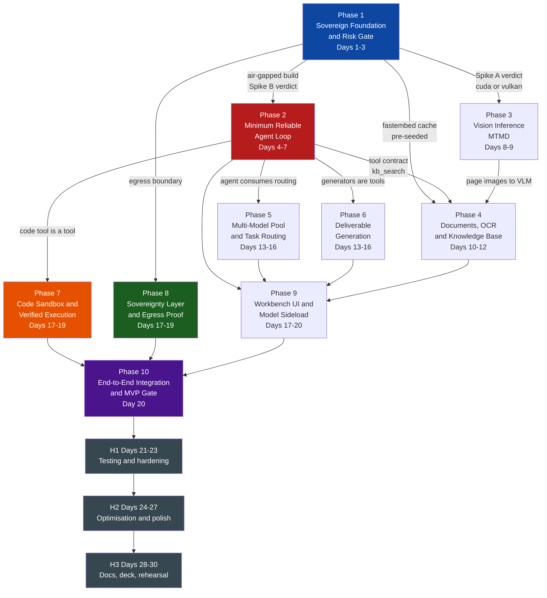
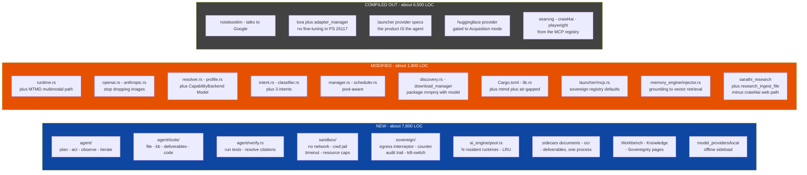
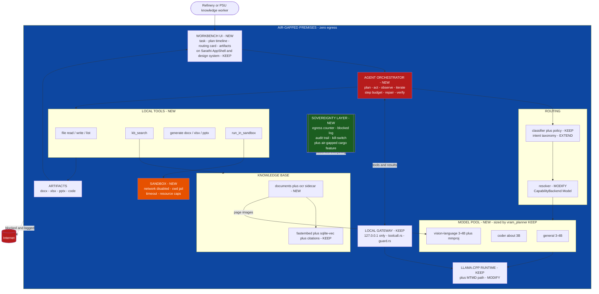

# SIH 26117 — Phase-Wise Implementation Plan

**Source of truth:** `SIH_26117_Sarathi_Reuse_Analysis.md` — treated as authoritative and complete.
**Status:** Plan only. No implementation has begun. Every phase below reads `PHASE COMPLETE = NO`.
**Budget:** Days 1–20 working MVP · Days 21–30 testing, hardening, polish, docs, demo prep.

> **Reading rule.** Every phase is written to be executable by an engineer who has *not* read
> the source analysis. Where the source analysis does not settle a decision, the phase says
> **"Needs clarification from source analysis"** rather than inventing an answer. Nothing in
> this plan adds architecture or requirements the source does not state.

---

## Table of Contents

1. [Executive Summary](#1-executive-summary)
2. [Source-Derived Architecture Baseline](#2-source-derived-architecture-baseline)
3. [Reuse Map](#3-reuse-map)
4. [Phase Dependency Map](#4-phase-dependency-map)
5. [Implementation Phases](#5-implementation-phases)
6. [20-Day MVP Timeline](#6-20-day-mvp-timeline)
7. [Final 10-Day Testing / Hardening Timeline](#7-final-10-day-testing--hardening-timeline)
8. [Final System Completion Criteria](#8-final-system-completion-criteria)
9. [Critical Risks Mapped to Phases](#9-critical-risks-mapped-to-phases)
10. [Final Architecture Flow](#10-final-architecture-flow)
11. [Final Executive Checklist](#11-final-executive-checklist)

---

## 1. Executive Summary

### What is being built

A **sovereign, air-gapped agentic AI workbench** for confidential industrial knowledge work
(SIH 2026 PS 26117, Mangalore Refinery and Petrochemicals Limited). It runs entirely on one
workstation or GPU server, uses open-weight models only, and must satisfy seven capability
requirements (R1–R7) and six demonstration obligations (D1–D6) defined in the source analysis.

### Overall strategy

The source analysis establishes that the existing Sarathi codebase supplies **≈57%** of the
engineering, concentrated in the infrastructure layer beneath an agent — local GGUF inference,
model-native chat templating, VRAM planning, hardware-aware model sizing, a loopback
OpenAI/Anthropic gateway with five-format tool-call parsing, a calibrated intent classifier,
and a local embedding plus vector retrieval engine.

The remaining **≈43%** is concentrated in four greenfield areas: the **agent loop**, the
**code sandbox**, **document I/O**, and **OCR**.

The chosen approach, per the source analysis, is **Option D executed as a fork**: fork into a
new product, keep every Sarathi engine crate untouched and consumed as-is, add PS 26117
capability as new sibling modules, and compile out divergent features behind an `air-gapped`
cargo feature.

### Sarathi reuse strategy

| Principle | Consequence for this plan |
| --- | --- |
| **Never re-plan a rebuild of something already reusable** | No phase touches `gateway/toolcall.rs`, `vram_planner.rs`, `gguf_meta.rs`, `capability/classifier.rs`, `system_analyzer/`, or `model_recommendation/` |
| **Modify surgically, never rewrite** | The source budgets ~1,800 LOC of modification across 11 existing files; this plan distributes exactly those 11 changes across phases |
| **Add capability as new siblings** | ~7,800 LOC of new modules, distributed across phases 2, 4, 6, 7, 8, 9 |
| **Compile out, do not delete** | `notebooklm/`, `lora/`, `adapter_manager/`, and launcher provider specs stay in the tree but leave the binary — this is itself part of the sovereignty proof |

### The 20+10 day approach

**Days 1–20 (ten phases).** Every phase is a complete loop — UNDERSTAND → IMPLEMENT →
INTEGRATE → VERIFY → COMPLETE — ending in something demonstrable and independently testable.
No phase hands unfinished work forward.

Three deliberate deviations from a naive reading of the source's day blocks, each justified
in the phase that makes it:

1. **The two highest-risk unknowns are resolved on Days 1–3, before anything depends on them.**
   The source names both (the `mtmd` build, and small-model tool-call reliability) and states
   that both must be de-risked by end of Day 3. Phase 1 makes each a gated deliverable with a
   recorded verdict.
2. **NIC-disconnected verification starts at Phase 1, not Day 21.** The source rates a hidden
   offline dependency as P0/CRITICAL and "invisible until the worst moment," and directs that
   such dependencies should "surface early rather than failing silently." Deferring the first
   air-gapped run to Day 21 contradicts that. Every phase from 1 onward carries a
   NIC-disconnected acceptance criterion.
3. **The `fastembed` ONNX model cache is pre-seeded in Phase 1**, not when the knowledge base
   is first built in Phase 4. The source identifies `fastembed` downloading its model on first
   use as a specific instance of the P0 offline-dependency risk; the cache must therefore exist
   before any phase depends on embeddings.

**Days 21–30 (three hardening stages).** No new architecture enters this window. If a feature
is too risky to defer, it lands inside the MVP window — which is why the sandbox, the
sovereignty layer, and every demo scenario complete by Day 20.

### Scope-trim protection order

If scope must be cut, cut from the **bottom** of this list upward. The top item is protected
absolutely.

1. **Mandatory SIH requirements** (R1–R7) — never cut
2. **Demo-critical items** (D1–D6) — never cut while any lower item remains
3. **Core architecture** (agent loop, pool, gateway integration)
4. **Reliability** (retry depth, regression breadth)
5. **Security / sovereignty proof depth** (beyond the D6 minimum)
6. **Polish** (animation, empty states, visual refinement) — cut first

> *Interpretation note: the task brief lists this order as "cut in this order: mandatory SIH
> requirements > demo-critical items > … > polish". Read literally that would cut mandatory
> requirements first, which cannot be intended. This plan reads it as a **protection
> hierarchy**, most-protected first, and trims from the bottom up.*

---

## 2. Source-Derived Architecture Baseline

Everything in this section is established by the source analysis. Nothing is added.

### 2.1 What Sarathi is

Sarathi is a **model management and local inference gateway** — an "engine room" that other
agent tools plug into. It is **not** a chat application and **not** an agent. Its UI registers
seven routes (`Welcome`, `Launch`, `Browse`, `Settings`, `SystemInfo`, `Storage`, `Models`)
and contains no chat, agent, or document surface. Its own architecture documents state that
support for Sarathi-as-agent is "not at all" present.

Scale: **48,939 lines of Rust** across 152 files, ~5,500 lines of React/TypeScript,
11 Python sidecar files, **810 test functions across 71 files**, and shipping debug and
release binaries. This is a mature, tested codebase, not a prototype.

### 2.2 Components that exist and work

| Component | Substance established by the source |
| --- | --- |
| `gateway/` (~4,000 LOC) | Axum server bound to `127.0.0.1` only, port 11435. OpenAI `/v1/chat/completions` and Anthropic `/v1/messages` with SSE. `guard.rs` rejects foreign `Origin` and non-local `Host` (DNS-rebinding protection), unit-tested. `toolcall.rs` (1,212 LOC) parses tool calls from raw model text in **five** emission formats with a `StreamSieve` for streaming. Tool schemas transported to the chat template; tool results round-trip structurally via `ChatMessage.tool_calls` / `tool_call_id` / `name` |
| `ai_engine/runtime.rs` (2,799 LOC) | In-process GGUF inference via `llama-cpp-2 0.1.153`. Renders the model's **own** Jinja chat template from the GGUF `tokenizer.chat_template` key using `minijinja`, with transformers-compatibility shims, falling back to llama.cpp's `apply_chat_template`. Streaming and cancellation |
| `ai_engine/gguf_meta.rs` (1,097 LOC) | Reads the GGUF header pre-load: architecture, layer count, `embedding_length`, **`has_vision`**, exact `kv_bytes_per_token` |
| `ai_engine/vram_planner.rs` (961 LOC) | GPU offload planning with real KV-cache math |
| `ai_engine/scheduler.rs` (407 LOC) | Single-threaded job queue with queue position and lock-free cancellation |
| `capability/` (7 modules) | `classifier.rs` (429 LOC) scores every intent independently across five weighted signal bands, deriving confidence from **dominance** and **evidence**; `policy.rs` provides switch hysteresis; `resolver.rs` resolves to `Base` / `PromptProfile` / `LoraAdapter` and always degrades gracefully; `profile.rs` holds per-capability directives and sampling overrides. **Wired into the real generation path.** Emits `CapabilityPayload` carrying capability, badge, backend, confidence, switched, reason, backend_reason, adapter_path, and effective sampling parameters |
| `system_analyzer/` | 13 hardware collectors including DXGI GPU detection, single-flight scanning, user overrides |
| `model_recommendation/` (10 modules) | `HardwareProfile → Budget → Catalog → Estimator → Multi-Config Evaluator → Scorer`. `scorer.rs` (936 LOC) evaluates *(quantization × context × backend × run_mode)* across context checkpoints 2048–131072 with calibrated headroom constants |
| `model_manager/store.rs` (470 LOC) | **Directory walk is always live** — a model copied on by USB is detected with no network. GGUF header reads memoised on `(path, len, mtime_nanos)` |
| `download_manager/manager.rs` (1,674 LOC) | Resumable, pausable, cancellable, disk-space checked, SHA-256 verified |
| `sidecars/mcp/sarathi_research/server.py` (765 LOC) | **A working local RAG engine**: `fastembed` ONNX (`BAAI/bge-small-en-v1.5`, 384-dim), `sqlite-vec` index, chunking at 1,200 chars / 150 overlap with line tracking, named "notebook" collections, provenance sufficient for citation, exposed as MCP tools |
| UI foundation | Complete design system (13 components), `AppShell` / `TopBar` / `StatusBar`, five context providers, `ISarathiClient` plus `SarathiTauriClient`, 18 typed IPC service modules |
| Deployment | `tauri build` producing a desktop bundle; `scripts/select-backend.mjs` choosing CUDA / Vulkan / auto |

### 2.3 Components that are absent

Confirmed by exhaustive search in the source analysis, not assumed:

- **Agent / orchestration** — no planner, no task decomposition, no observe/act loop, no
  iteration control, no step budget, no reflection
- **Tool execution** — Sarathi is an MCP *provisioner*, not a proxy; the client executes tools
- **Code sandbox** — `sandbox` matches **0 files**
- **OCR** — `tesseract` matches **0 files**
- **Document parsing and generation** — `pdf`, `docx`, `pptx`, `xlsx`, `openpyxl`,
  `python-docx` each match **0 files**, in both directions
- **Vision inference** — images are explicitly dropped at *both* gateway surfaces
- **Multi-model residency** — one `Arc<Mutex<LlamaCppRuntime>>`, one `Option<LoadedModelInfo>`;
  the scheduler states "only one model fits in VRAM"
- **Chat / agent / document UI surfaces**
- **Offline model sideload UI** — `model_providers/local/` is a 10-line stub
- **Network kill-switch, egress monitor, offline mode flag**

### 2.4 The multimodal finding that shapes Phase 3

`llama-cpp-2 0.1.153` — already pinned — ships **`src/mtmd.rs`, 980 lines** exposing
llama.cpp's full MTMD multimodal API (`MtmdContext::init_from_file`, `support_vision()`,
`support_audio()`, `MtmdBitmap::from_file` / `from_buffer` / `from_image_data`,
`MtmdInputChunks::tokenize`, `eval_chunks`) behind an unused feature flag
`mtmd = ["llama-cpp-sys-2/mtmd"]`. `eval_chunks` is a helper that runs `llama_decode()` on
text chunks and `mtmd_encode()` then `mtmd_get_output_embd()` then `llama_decode()` on image
chunks.

Sarathi already detects `has_vision` from GGUF headers, detects `mmproj` projector files by
name and size ratio (and currently *excludes* them from quantisation lists), and carries a
`Vision` model category. **Enabling vision is a feature flag plus an integration, not an
engine replacement.**

### 2.5 Network posture

The only real external host in the entire Rust backend is `huggingface.co` / `hf.co`
(25 plus 2 references). Everything else is `127.0.0.1` / `localhost`. **The inference path
makes zero network calls.**

Three egress paths must be removed for an air-gapped build:

1. **Hugging Face** — catalog, downloads, GGUF header probes
2. **NotebookLM** — talks to Google
3. **MCP registry defaults** — `searxng`, `crawl4ai`, `playwright`

### 2.6 The requirements and demo obligations this plan must satisfy

| ID | Requirement |
| --- | --- |
| R1 | Air-gapped, on-premise, nothing leaves the premises |
| R2 | Multiple open-weight models at once, automatically selected per task |
| R3 | New models addable without redesigning the system |
| R4 | Genuine agent: plan multi-step work, call local tools, **iterate rather than answering once** |
| R5 | Multimodal input via on-device OCR and vision models |
| R6 | Real deliverables — Word / PPT / Excel / working code / calculations with steps — not chat replies |
| R7 | Local knowledge base over the organisation's manuals, SOPs, correspondence |

| ID | Demo obligation |
| --- | --- |
| D1 | Runs on a single workstation with a mid-range GPU; smaller model if 120B-class hardware is unavailable |
| D2 | Model auto-selection across **at least two** different task types |
| D3 | Agentic task end to end — scanned inspection report to findings to **Word approval note** |
| D4 | Coding task **run and verified in a sandbox** |
| D5 | Multimodal task involving image or scanned-document understanding |
| D6 | Proof via **logs or a visible network monitor** that no external calls are made |

### 2.7 Open items the source analysis does not settle

These are carried into the relevant phases as explicit clarification requests, not guesses.

| # | Open item | Where it bites |
| --- | --- | --- |
| C1 | **Specific model identities.** The source specifies sizes only — "a small instruct model (~3–4B), a small coder (~3B), and a small vision-language model (~3–4B with `mmproj`)" — and no model names | Phases 1, 3, 5 |
| C2 | **OCR engine choice.** The source establishes OCR is absent and prescribes deskew/denoise preprocessing, but names no engine | Phase 4 |
| C3 | **Agent plan format / prompt schema.** The source prescribes few-shot plan formatting and a validating repair turn, but defines no concrete schema | Phase 2 |
| C4 | **Hybrid lexical/BM25 retrieval.** Named as a Risk 7 mitigation; the source does not state whether it is in MVP scope | Phase 4 |
| C5 | **Artifact storage / versioning.** Listed under R6 as "MUST BE BUILT (small)" but **absent from the source's own new-module list** | Phase 6 |
| C6 | **Offline model sideload UI.** Listed as MUST BE BUILT at 1–2 days, but **absent from the source's own new-module list** | Phase 9 |
| C7 | **Venue GPU model and VRAM.** Unknown; determines how many models stay resident | Phases 1, 5 |

> **C5 and C6 are internal inconsistencies in the source analysis** — both are named as required
> in the requirement mapping but omitted from the consolidated new-module list. This plan places
> both (Phase 6 and Phase 9 respectively) and flags them rather than silently dropping or
> silently inventing them.

---

## 3. Reuse Map

Status tags: **KEEP** (consume unchanged) · **MODIFY** (behaviour changes, file survives) ·
**EXTEND** (additive only) · **REPLACE** (superseded for this use) · **REMOVE** (compiled out) ·
**NEW** (greenfield).

| Area | Status | Action |
| --- | --- | --- |
| `core/`, `config/`, `logging/`, `diagnostics.rs`, `database/` | **KEEP** | Consume unchanged as the application spine (95% reuse) |
| `system_analyzer/` (13 collectors) | **KEEP** | Drives the D1 hardware panel; no code change |
| `model_recommendation/` (10 modules) | **KEEP** | Supplies D1 sizing and Phase 5 pool budgeting; no code change |
| `model_manager/store.rs`, `classify.rs` | **KEEP** | Live disk walk already makes USB sideload work; only the UI is missing |
| `download_manager/` | **KEEP (gated)** | Reachable only in an explicitly off-by-default Acquisition mode |
| `model_providers/huggingface/` (16 modules) | **MODIFY** | Gate behind Acquisition mode; compiled out under `air-gapped` |
| `model_providers/local/` (10-line stub) | **NEW** | Build the offline sideload path — see C6 |
| `ai_engine/runtime.rs` | **MODIFY** | Add the MTMD multimodal path (~350 LOC); text path untouched |
| `ai_engine/gguf_meta.rs` | **KEEP** | `has_vision` and KV math consumed as-is |
| `ai_engine/vram_planner.rs` | **KEEP** | Sizes the model pool; no code change |
| `ai_engine/manager.rs` | **MODIFY** | Delegate single-slot ownership to the pool |
| `ai_engine/scheduler.rs` | **MODIFY** | Pool-aware, per-model queues (~120 LOC) |
| `ai_engine/pool.rs` | **NEW** | N resident runtimes, LRU eviction sized by `vram_planner` (~400 LOC) |
| `capability/classifier.rs`, `policy.rs`, `profile.rs` | **KEEP** | The routing brain already works and is already wired to generation |
| `capability/intent.rs` | **EXTEND** | Add `DocumentAnalysis`, `Multimodal`, `Drafting` (~120 LOC with classifier signals) |
| `capability/resolver.rs` | **MODIFY** | Add `CapabilityBackend::Model { id }`; consult a model registry (~150 LOC) |
| `gateway/server.rs`, `state.rs` | **KEEP** | Loopback bind, SSE, `ClientActivity` consumed as-is |
| `gateway/toolcall.rs` (1,212 LOC) | **KEEP** | Five-format tool-call parsing reused verbatim — highest-value single asset |
| `gateway/guard.rs` | **KEEP** | Origin plus Host guard is already the inbound half of the sovereignty boundary |
| `gateway/openai.rs`, `anthropic.rs` | **MODIFY** | Stop dropping image parts; route them to the MTMD path (~150 LOC) |
| `model_providers/huggingface/discovery.rs` | **MODIFY** | Fetch `mmproj` as part of a vision package instead of excluding it (~120 LOC) |
| `launcher/mcp.rs` | **MODIFY** | Sovereign defaults — drop `searxng`, `crawl4ai`, `playwright` (~40 LOC) |
| `launcher/spec.rs` provider specs | **REMOVE** | The SIH product *is* the agent; external CLI launching is out of scope |
| `launcher/console.rs` | **EXTEND** | Spawn / monitor / kill patterns reused by the sandbox |
| `notebooklm/` (~2,080 LOC) | **REMOVE** | External (Google); compiled out under `air-gapped` |
| `lora/`, `adapter_manager/` (~3,400 LOC) | **REMOVE** | No fine-tuning in PS 26117; compiled out |
| `memory_engine/injector.rs` | **MODIFY** | Point grounding at vector retrieval (~60 LOC) |
| `memory_engine/retriever.rs` | **REPLACE** | Word-overlap similarity superseded by the vector engine for grounding |
| `sidecars/mcp/sarathi_research/` | **EXTEND** | Add `research_ingest_file` (~200 LOC); remove the Crawl4AI web-ingestion path |
| `agent/`, `agent/tools/`, `agent/verify.rs` | **NEW** | Orchestrator, tool registry, verification (~2,650 LOC) |
| `sandbox/` | **NEW** | Confined execution: no network, cwd jail, timeout, resource caps (~600 LOC) |
| `sovereign/` | **NEW** | Egress interceptor, blocked-attempt log, live counter, audit trail, kill-switch (~500 LOC) |
| `sidecars/documents/`, `sidecars/ocr/`, `sidecars/deliverables/` | **NEW** | ~2,000 LOC Python — consolidated into one sidecar process (Risk 9) |
| `src/components/`, `contexts/`, `sdk/`, `services/` | **KEEP** | Design system, providers, and typed IPC layer consumed unchanged |
| `src/pages/` existing seven routes | **KEEP** | Model-management surfaces retained as secondary screens |
| `src/pages/Workbench.tsx`, `Sovereignty.tsx`, `Knowledge.tsx` | **NEW** | ~2,050 LOC — the primary PS 26117 surfaces |
| `Cargo.toml` features | **MODIFY** | Add `mtmd`; add `air-gapped` (~80 LOC of feature plumbing) |
| Deployment (`tauri build`, `select-backend.mjs`) | **KEEP** | Already produces a desktop bundle with backend selection |

**Totals from the source analysis:** ~1,800 LOC modified across 11 existing files ·
~7,800 LOC new · ~6,500 LOC compiled out.

---

## 4. Phase Dependency Map

**Critical path:** P1 → P2 → P5/P6 → P9 → P10. Phase 2 is the schedule's single point of
failure; its gate at end of Day 7 governs whether the general-planner architecture survives.

**Parallel tracks:** Phases 5 and 6 run concurrently on Days 13–16 (independent — 6 depends on
2, not on 5). Phases 7, 8 and 9 run concurrently on Days 17–20 (7 and 8 are independent; 9
consumes 8's backend only for the Sovereignty page, scheduled last within 9).

---

## 5. Implementation Phases

### Phase 1 — Sovereign Foundation & Risk Gate

**Objective.** Stand up the forked product as a build that runs with the network disconnected,
and resolve — with recorded verdicts — the two unknowns that determine the architecture of
every later phase.

**Why this phase exists.** The source analysis names two risks it says must be settled by end
of Day 3: whether `llama-cpp-2`'s `mtmd` feature compiles alongside the GPU backend, and
whether a small model can emit parseable tool calls reliably enough to sustain an agent loop.
Both have architecture-changing fallbacks. Discovering either answer on Day 12 costs the
project. It also establishes the air-gapped build, because a hidden offline dependency is rated
P0/CRITICAL and is "invisible until the worst moment."

**Inputs.** The Sarathi repository at commit `8917df7`; the source analysis §2.5 (network
posture), §5.4 (exclusion list), §12 Risk 1, Risk 2, Risk 6.

**Reuse from Sarathi.**
- **KEEP** — entire tree consumed as the engine; `gateway/`, `ai_engine/`, `system_analyzer/`,
  `model_recommendation/`, UI shell, deployment scripts, all 810 existing tests
- **MODIFY** — `Cargo.toml` (add `air-gapped` feature), `lib.rs` (conditional module
  registration), `launcher/mcp.rs` (sovereign registry defaults)
- **REMOVE** — `notebooklm/`, `lora/`, `adapter_manager/`, launcher provider specs, and the
  Hugging Face provider, all compiled out under `air-gapped`

**New work.**
- `air-gapped` cargo feature plumbing (~80 LOC)
- Sovereign `mcp.json` defaults (~40 LOC)
- Pre-seeded `fastembed` ONNX model cache at the `MODEL_CACHE` path the research sidecar
  already defines, shipped with the build
- **Spike A** (throwaway): build with `mtmd` plus GPU backend; push one image through
  `MtmdContext::init_from_file` → `MtmdBitmap::from_file` → `tokenize` → `eval_chunks`
- **Spike B** (throwaway): drive a hand-written five-step tool-call transcript against the
  target small model through the existing gateway; measure the parse-success rate

**Implementation scope.** Fork and rename; feature gating; sovereign MCP registry; dependency
vendoring so no Python package resolves at import time; the two spikes.

**Out of scope.** Any agent code. Any UI change. Any model-pool work. Deleting excluded
modules (they are compiled out, not removed).

**Dependencies.** None. This is the root phase.

**Implementation steps.**
1. Fork the repository into the new product; confirm `tauri build` still produces a bundle.
2. Add the `air-gapped` cargo feature; make `notebooklm/`, `lora/`, `adapter_manager/`, the
   HF provider, and launcher provider specs conditional on its absence.
3. Replace the default `mcp.json` contents with a sovereign registry: remove `searxng`,
   `crawl4ai`, `playwright`.
4. Vendor all Python sidecar dependencies; pre-seed the `fastembed` model cache; remove any
   CDN asset reference from the frontend.
5. **Spike A** — build with `--features mtmd,cuda`. If it fails, retry `--features mtmd,vulkan`.
   If that fails, prototype the Python `transformers` sidecar fallback. **Record the verdict.**
6. **Spike B** — run at least 20 tool-call attempts against the candidate small model; record
   the parse-success rate and the failure modes observed. **Record the verdict.**
7. Select the three demo models (**blocked on C1 and C7** — see below).

**Integration.** The air-gapped feature must not break any of the 810 existing tests that do
not require network. Tests that *do* require network must fail loudly under `air-gapped`, never
skip silently.

**Verification.**
- Full existing test suite passes under the `air-gapped` feature
- Application launches, loads a model, and answers a prompt **with the NIC disabled**
- Any network-dependent test fails visibly rather than skipping
- Spike A and Spike B verdicts written into the repository as a dated decision record

**Acceptance criteria.**
1. `tauri build --features air-gapped` succeeds and the binary runs.
2. A model loads and generates with the network interface disabled.
3. Inspection of the built configuration confirms no `searxng` / `crawl4ai` / `playwright` entries.
4. **Spike A verdict recorded** as one of: `cuda` / `vulkan` / `python-sidecar-fallback`.
5. **Spike B verdict recorded** with a measured parse-success rate over at least 20 attempts.
6. Zero existing tests regressed.

**Expected output.** A running air-gapped fork; a decision record naming the GPU backend and
the multimodal approach; a measured baseline for small-model tool-call reliability.

**Failure conditions.**
- `mtmd` compiles with neither `cuda` nor `vulkan` → escalate to the Python sidecar fallback
  and re-plan Phase 3 accordingly on Day 3, not later
- Spike B parse-success rate is very low → Phase 2 begins with the constrained-schema
  mitigations active from the first commit rather than added after a failure
- A hidden network dependency is found → fix it here; do not proceed to Phase 2 with it open

**Rollback / recovery.** The fork is additive and feature-gated; reverting means dropping the
`air-gapped` feature flag. No Sarathi engine code is altered, so rollback cannot damage the
inherited 810-test baseline.

**Estimated effort.** **M** — mostly configuration, plus two time-boxed spikes.

**Estimated duration.** **Days 1–3** (3 days).

**Needs clarification from source analysis:**
- **C1 — specific model identities.** The source specifies sizes only (~3–4B instruct,
  ~3B coder, ~3–4B vision-language with `mmproj`) and names no models. Model selection cannot
  be finalised from the source.
- **C7 — venue GPU and VRAM.** Unknown. The source states the pool size must be computed from
  it via `vram_planner`, but the target figure itself is not established.

**PHASE COMPLETE = NO** — plan only. Becomes YES when all six acceptance criteria pass and both
spike verdicts are recorded.

---

### Phase 2 — Minimum Reliable Agent Loop

**Objective.** Implement and verify the minimum reliable agent loop: **plan → execute →
observe → retry once → complete a bounded task**, using file and knowledge tools only.

**Why this phase exists.** The source analysis rates small-model agentic reliability as the
project's single P0/CRITICAL risk with no clean fallback, and states the schedule's governing
condition: if the agent loop is not working by Day 8, fall back to fixed per-scenario pipelines
immediately. This phase exists to answer that question early and definitively, on the smallest
possible tool surface. Agent-system reuse is only ~15%; everything here except the model
plumbing is new.

**Inputs.** Phase 1 air-gapped build; Spike B verdict and its measured parse-success rate.

**Reuse from Sarathi.**
- **KEEP** — `gateway/toolcall.rs` (five-format tool-call parsing plus `StreamSieve`);
  `gateway/openai.rs` tool-schema transport to the chat template; `ChatMessage.tool_calls` /
  `tool_call_id` / `name` structural round-trip; `ai_engine/scheduler.rs`;
  `capability/profile.rs` sampling overrides for lowering temperature on planning turns
- **KEEP** — the loopback gateway itself: **the agent calls the gateway, not the runtime**,
  which reuses tool transport and parsing for free and keeps the agent inside the sovereignty
  boundary

**New work.**
- `src-tauri/src/agent/` — orchestrator: plan, act, observe, iterate, step budget, failure
  repair (~1,400 LOC)
- `src-tauri/src/agent/tools/` — tool registry and executor with `file_read`, `file_write`,
  `file_list`, and the `kb_search` **contract** (~900 LOC)

**Implementation scope.** A working loop over 4 tools. Plan representation, step execution,
observation feedback, one validating repair turn on schema failure, a hard step budget with a
graceful partial-completion exit.

**Out of scope.** Code execution (Phase 7). Deliverable generation (Phase 6). Model routing —
this phase runs against a single model (Phase 5). The `kb_search` *backend* (Phase 4); this
phase defines the contract and stubs the implementation. Any UI (Phase 9).

**Dependencies.** Phase 1 (air-gapped build; Spike B verdict).

**Implementation steps.**
1. Define the tool registry: at most 7 tools, **flat primitive-typed arguments only** (Risk 1
   mitigation), JSON-schema described.
2. Implement `file_read`, `file_write`, `file_list` against a configured working directory.
3. Stub `kb_search` behind the contract Phase 4 will implement.
4. Implement the orchestrator: submit plan request to the gateway with tools attached; parse
   the returned plan; execute steps sequentially; feed each observation back.
5. Add the **validating repair turn** — on a malformed or unknown tool call, feed the exact
   schema error back as an observation rather than failing the step.
6. Add the step budget with a graceful "here is what I completed" exit.
7. Apply `capability/profile.rs` sampling overrides to lower temperature on planning turns.
8. Write the few-shot plan-format exemplars (**blocked on C3** — see below).

**Integration.** The agent submits generations through the existing gateway
(`/v1/chat/completions`), so tool schemas travel via the existing transport and responses are
parsed by the existing `toolcall.rs`. No new model-facing protocol is introduced.

**Verification.**
- **Integration:** a 3-step file task (read a file, transform it, write a new file) completes
  unattended
- **Failure:** an induced malformed tool call is repaired by the validating repair turn and the
  task still completes
- **Failure:** an unsatisfiable task exhausts the step budget and exits gracefully with a
  partial-completion report, never looping
- **Regression:** ordinary non-agent gateway chat is unaffected; existing gateway tests pass
- **Acceptance:** the 3-step task succeeds in **at least 8 of 10 consecutive runs**

**Acceptance criteria.**
1. A bounded 3-step file task completes unattended in at least 8/10 runs.
2. At least one run visibly demonstrates observe → retry → succeed.
3. Step-budget exhaustion produces a graceful partial result, never an infinite loop.
4. Existing gateway and inference tests pass unchanged.
5. The whole verification runs with the **NIC disconnected**.

**Expected output.** An agent that reliably completes bounded multi-step file work — the
minimum viable evidence for R4, and the gate for the rest of the schedule.

**Failure conditions.**
- **Reliability below the 8/10 bar by end of Day 7** → this is the project's designated
  decision point. Invoke the fallback: replace the general planner with **fixed per-scenario
  pipelines**. The source states this still satisfies D3 and D4. Do not spend Days 8–16
  fighting a general planner.
- Model hallucinates tool names → tighten the schema and re-run; if unresolved, escalate model
  size if VRAM permits (per Risk 1 mitigation).

**Rollback / recovery.** The agent is a new module consuming the gateway; disabling it returns
the product to a Phase 1 state with no engine damage. The fixed-pipeline fallback reuses the
same tool registry, so tool work is not lost under fallback.

**Estimated effort.** **L** — ~2,300 LOC of new Rust, and the highest-uncertainty work in the plan.

**Estimated duration.** **Days 4–7** (4 days).

**Needs clarification from source analysis:**
- **C3 — agent plan format and prompt schema.** The source prescribes few-shot plan formatting,
  a validating repair turn, and a step budget, but defines no concrete plan schema or exemplars.

**PHASE COMPLETE = NO** — plan only. Becomes YES when all five acceptance criteria pass, or when
the fixed-pipeline fallback is invoked and meets the same criteria.

---

### Phase 3 — Vision Inference (MTMD)

**Objective.** Make the product see: enable multimodal inference end to end, so an image sent
to the local gateway returns a real description from a vision-language model.

**Why this phase exists.** D5 requires image or scanned-document understanding, and R5 requires
on-device vision models. The source establishes that images are currently **dropped at both
gateway surfaces** and that vision inference does not exist — but also that the full MTMD API
already ships inside the pinned `llama-cpp-2 0.1.153` behind an unused feature flag. This is a
feature-flag-plus-integration phase, not an engine replacement, and it must precede document
ingestion so page images have somewhere to go.

**Inputs.** Phase 1 Spike A verdict (which GPU backend, or the Python-sidecar fallback).

**Reuse from Sarathi.**
- **KEEP** — `gguf_meta.rs` `has_vision` detection from `{arch}.vision.*` / `clip.*` keys;
  `model_manager/classify.rs` `Vision` category; `runtime.rs` refusal to load a bare projector
  as a model; `vram_planner.rs` for sizing the vision model
- **MODIFY** — `ai_engine/runtime.rs` (add the MTMD path, ~350 LOC);
  `gateway/openai.rs` plus `anthropic.rs` (stop dropping image parts, ~150 LOC);
  `model_providers/huggingface/discovery.rs` plus `download_manager` (fetch `mmproj` as part of
  the package rather than excluding it, ~120 LOC)

**New work.** None as separate modules — this phase is entirely modification of existing files,
totalling ~620 LOC.

**Implementation scope.** `Cargo.toml` `mtmd` feature; `MtmdContext::init_from_file` loading the
projector; `MtmdBitmap` construction from request image data; `MtmdInputChunks::tokenize` and
`eval_chunks` in the generation path; image parts carried through both gateway dialects;
`mmproj` packaged with the vision model.

**Out of scope.** OCR (Phase 4). Document parsing (Phase 4). Routing *to* the vision model
(Phase 5) — this phase loads it explicitly. Audio, which MTMD also supports but PS 26117 does
not require.

**Dependencies.** Phase 1 (Spike A verdict determines whether this is the native path or the
Python-sidecar fallback).

**Implementation steps.**
1. Add `mtmd` to the `llama-cpp-2` feature list per the Spike A verdict.
2. In `runtime.rs`, load the projector via `MtmdContext::init_from_file`; assert
   `support_vision()`.
3. Build `MtmdBitmap` from inbound image bytes (`from_buffer` / `from_image_data`).
4. Replace the text-only decode path with `MtmdInputChunks::tokenize` plus `eval_chunks` when an
   image chunk is present; leave the pure-text path untouched.
5. In `openai.rs` and `anthropic.rs`, stop discarding non-text content parts; carry them to the
   MTMD path.
6. In `discovery.rs`, include the detected `mmproj` file in the vision model's package rather
   than excluding it from the quantisation list; extend `download_manager` to fetch both files.
7. Verify `has_vision` gating: a non-vision model given an image must return a clear error, not
   silently drop it.

**Integration.** Reuses the existing gateway request path, the existing model package format,
and the existing `has_vision` / `mmproj` detection. The text generation path must be
byte-for-byte unaffected.

**Verification.**
- **Integration:** an image posted to `/v1/chat/completions` returns a substantive description
- **Integration:** the same works on `/v1/messages`
- **Failure:** a vision model whose `mmproj` is missing fails with a clear message, not a crash
- **Failure:** an image sent to a non-vision model returns an explicit unsupported error
- **Regression:** all existing text-generation and chat-template tests pass unchanged
- **Regression:** streaming and cancellation still work on the text path

**Acceptance criteria.**
1. A photograph and a rasterised document page each produce a correct description locally.
2. Both gateway dialects accept image content.
3. Downloading a vision model brings its `mmproj` with it as one package.
4. Text-only generation is unchanged — full existing test suite green.
5. Runs with the **NIC disconnected** (model already on disk).

**Expected output.** D5's inference half is satisfied: the product can look at an image, locally.

**Failure conditions.**
- MTMD compiles but produces garbage output → verify the projector matches the base model;
  check `decode_use_non_causal` / `decode_use_mrope` handling
- MTMD unavailable on the chosen backend → **fall back to the Python `transformers` sidecar**
  established in Spike A. Slower, still fully local, still satisfies D5

**Rollback / recovery.** The `mtmd` feature is compile-time; disabling it returns the gateway to
the current drop-images behaviour with no other effect. The gateway image-carrying change is
behind the same flag.

**Estimated effort.** **M** — ~620 LOC of modification, concentrated in one hot file.

**Estimated duration.** **Days 8–9** (2 days).

**Needs clarification from source analysis:**
- **C1 — the specific vision-language model** is not named by the source; only its approximate
  size (~3–4B with `mmproj`).

**PHASE COMPLETE = NO** — plan only. Becomes YES when all five acceptance criteria pass.

---

### Phase 4 — Document Ingestion, OCR & Local Knowledge Base

**Objective.** Turn local office and scanned documents into two things at once: **retrievable,
citable text chunks** in the knowledge base, and **page images** the vision model can be shown.

**Why this phase exists.** R7 requires grounding in the organisation's own manuals, SOPs and
correspondence; R5 requires reading scanned PDFs and handwritten notes via on-device OCR. The
source establishes that the retrieval engine already exists and works (fastembed ONNX,
sqlite-vec, chunking, citations — ~55% reuse) but ingests **only web pages, git repositories and
raw text**. Document parsing and OCR match **0 files**. This phase closes precisely that gap and
nothing else.

**Inputs.** Phase 1 pre-seeded `fastembed` cache; Phase 2 `kb_search` tool contract; Phase 3
vision path for page images.

**Reuse from Sarathi.**
- **KEEP** — the entire retrieval half of `sidecars/mcp/sarathi_research/server.py`: fastembed
  ONNX `BAAI/bge-small-en-v1.5` at 384 dimensions, correct asymmetric BGE query encoding,
  `sqlite-vec` index, chunking at 1,200 / 150 overlap with line tracking, notebook collections,
  provenance fields, and the `research_search` / `research_sources` / `research_forget` /
  `research_health` MCP tools
- **EXTEND** — the same sidecar gains `research_ingest_file` (~200 LOC)
- **MODIFY** — `memory_engine/injector.rs` points grounding at vector retrieval (~60 LOC)
- **REPLACE** — `memory_engine/retriever.rs` word-overlap similarity is superseded for grounding
- **REMOVE** — the Crawl4AI web-ingestion path, which is an egress route

**New work.**
- `sidecars/documents/` — PDF (text layer and scanned), DOCX, XLSX, image to text plus page
  regions (~700 LOC Python)
- `sidecars/ocr/` — rasterise, deskew, denoise, recognise, region-map (~500 LOC Python)
- `kb_search` backend fulfilling the Phase 2 contract

**Implementation scope.** Local-file ingestion across the four document families; OCR
preprocessing and recognition; indexing into the existing vector store with citations; exposing
page images to the Phase 3 vision path.

**Out of scope.** Deliverable *generation* (Phase 6). Hybrid lexical retrieval (**C4** — not
established as MVP scope). Any web ingestion. The Knowledge UI (Phase 9).

**Dependencies.** Phase 1 (fastembed cache must exist offline), Phase 2 (`kb_search` contract),
Phase 3 (page images need a vision consumer).

**Implementation steps.**
1. **Consolidate into one Python sidecar process** with multiple endpoints rather than separate
   `documents` and `ocr` processes — the source's Risk 9 mitigation. Phase 6 will add
   `deliverables` endpoints to the same process.
2. Implement PDF handling: extract the text layer when present; rasterise pages when absent.
3. Implement DOCX and XLSX extraction preserving section headers in chunk metadata.
4. Implement the OCR path: deskew → denoise → recognise → map regions back to page coordinates.
5. Add `research_ingest_file` to the research sidecar, routing extracted text into the existing
   `store_document` path so chunking, embedding and citation storage are reused unchanged.
6. Emit page images alongside text so the Phase 3 vision path can consume the same ingestion.
7. Implement the `kb_search` tool backend against `research_search`, returning passages with
   resolvable citations.
8. Repoint `memory_engine/injector.rs` at vector retrieval.
9. Remove the Crawl4AI ingestion path.
10. **Select and freeze the demo document set** (the source permits public samples) and tune
    preprocessing against it.

**Integration.** Ingestion writes through the *existing* `store_document` function, so the
vector index, chunk schema, provenance fields and citation format are inherited rather than
reinvented. `kb_search` becomes a live tool in the Phase 2 registry.

**Verification.**
- **Integration:** a scanned PDF is ingested, OCR'd, indexed, and returns passages with
  citations that resolve back to the correct page
- **Integration:** DOCX and XLSX ingest and retrieve correctly
- **Integration:** the same ingested page is successfully shown to the vision model (Phase 3)
- **Failure:** a corrupt or password-protected PDF reports a clear error rather than indexing
  garbage
- **Failure:** ingestion with no `fastembed` cache and no network fails loudly — proving the
  Phase 1 pre-seed is what makes it work
- **Regression:** existing `research_search` behaviour over text sources is unchanged
- **Acceptance:** every citation returned resolves to a real source location

**Acceptance criteria.**
1. A scanned PDF from the frozen demo set yields findings-bearing text with correct citations.
2. DOCX and XLSX ingest, index, and retrieve.
3. `kb_search` is live in the agent tool registry and Phase 2's loop can call it.
4. 100% of returned citations resolve.
5. Ingestion and retrieval run with the **NIC disconnected**.
6. Only one Python sidecar process is required.

**Expected output.** R7 satisfied, and the input half of D3 and D5 in place.

**Failure conditions.**
- OCR quality too poor to extract findings → per the source's Risk 4 mitigations: deskew and
  denoise first; **use the vision model rather than OCR for drawings and stamps**; run both paths
  and cross-check; **scope handwriting down to reading an annotation, not transcribing a form**;
  surface a confidence indicator and a human-review step
- Retrieval cites the wrong clause → the citation-resolution check catches it before the user
  sees it; consider chunk-size tuning for technical documents

**Rollback / recovery.** Ingestion is additive to an existing, working index. A bad ingestion is
undone with the existing `research_forget` tool. The injector repoint is a one-line source
change, revertible.

**Estimated effort.** **L** — ~1,400 LOC Python plus ~260 LOC of Rust/sidecar wiring.

**Estimated duration.** **Days 10–12** (3 days).

**Needs clarification from source analysis:**
- **C2 — OCR engine.** The source establishes OCR is absent and prescribes deskew/denoise
  preprocessing but names no engine.
- **C4 — hybrid lexical/BM25 retrieval.** Named as a Risk 7 mitigation; the source does not
  state whether it belongs in the MVP. Planned as **out of MVP scope** pending clarification,
  and listed as an H2 optimisation candidate.

**PHASE COMPLETE = NO** — plan only. Becomes YES when all six acceptance criteria pass.

---

### Phase 5 — Multi-Model Pool & Task Routing

**Objective.** Hold two or three models resident simultaneously and route each task — and each
*step* within a task — to the right one, with the decision visible and explainable.

**Why this phase exists.** R2 requires supporting multiple open-weight models at once and
automatically picking the right one per task; D2 requires demonstrating auto-selection across at
least two task types. The source establishes that the *classifier* is done, tested, and already
wired into generation (~70% reuse of routing logic), but that the runtime holds exactly one
model — `Arc<Mutex<LlamaCppRuntime>>` with a single `Option<LoadedModelInfo>` — and that routing
currently targets adapters and prompt profiles on one base model rather than different models.

**Inputs.** Phase 2 agent loop; Phase 1 model selection and Spike A backend verdict.

**Reuse from Sarathi.**
- **KEEP** — `capability/classifier.rs` (weighted signals, dominance-plus-evidence confidence),
  `capability/policy.rs` (switch hysteresis, conversation stickiness),
  `capability/profile.rs` (per-capability directives and sampling overrides),
  `CapabilityPayload` (already carries capability, confidence, switched, reason, backend_reason
  and effective sampling — it can drive the routing panel with no change),
  `ai_engine/vram_planner.rs` (exact KV-cache math — this is precisely the calculation a pool
  needs), `model_recommendation/scorer.rs`, and the existing load/unload machinery
- **EXTEND** — `capability/intent.rs`: add `DocumentAnalysis`, `Multimodal`, `Drafting` with
  their classifier signal tables (~120 LOC)
- **MODIFY** — `capability/resolver.rs` plus `profile.rs`: add `CapabilityBackend::Model { id }`
  and consult a model registry (~150 LOC); `ai_engine/manager.rs` delegates to the pool;
  `ai_engine/scheduler.rs` becomes pool-aware with per-model queues (~120 LOC)
- **NEW** — `ai_engine/pool.rs`: N resident runtimes keyed by model id with LRU eviction sized
  by `vram_planner` (~400 LOC)

**Implementation scope.** The pool, pool-aware scheduling, model-level routing, three new
intents, and the routing decision payload reaching the UI layer.

**Out of scope.** The routing *panel* itself (Phase 9 renders it; this phase emits the data).
LoRA adapter routing — out of scope for PS 26117 entirely. Alternative runtimes (vLLM and
similar) — the source marks these NOT REQUIRED.

**Dependencies.** Phase 2 (the agent is the consumer of routing decisions).

**Implementation steps.**
1. Implement `ModelPool`: a map of model id to runtime, with residency decided by
   `vram_planner`'s budget and LRU eviction when it is exceeded.
2. Delegate `InferenceManager`'s single-slot ownership to the pool, preserving its lock-free
   status mirror so status queries stay fast.
3. Make the scheduler pool-aware — per-model queues, preserving queue position reporting and
   lock-free cancellation.
4. Add `CapabilityBackend::Model { id }`; have the resolver consult a model registry that maps
   capability to preferred model.
5. Extend the intent taxonomy with `DocumentAnalysis`, `Multimodal`, `Drafting`, adding their
   weighted signal tables in the classifier's existing five-band scheme.
6. Ensure every routing decision emits a `CapabilityPayload` including the chosen model id.
7. Pre-warm the pool at startup so no demo pays a cold load.

**Integration.** The classifier, policy and payload are consumed unchanged; only the *resolution
target* changes. The agent (Phase 2) submits each step through the gateway and the router selects
the model — the agent does not choose models itself.

**Verification.**
- **Integration:** a coding prompt and a document-summarisation prompt route to **different**
  models, with both resident
- **Integration:** within one multi-step agent task, two different steps route to two different
  models
- **Failure:** when VRAM holds only one model, the pool evicts and reloads with visible progress
  rather than failing
- **Failure:** a routed-to model that fails to load degrades to the general model rather than
  failing the task — matching the resolver's existing always-degrade contract
- **Regression:** all existing capability, classifier, policy and scheduler tests pass
- **Regression:** single-model operation still works when only one model is installed

**Acceptance criteria.**
1. **D2 satisfied** — two task types demonstrably select two different models.
2. `CapabilityPayload` carries intent, confidence, chosen model id, and reason for every decision.
3. Pool residency is computed from `vram_planner`, not hardcoded.
4. Existing classifier and scheduler tests pass unchanged.
5. Graceful degradation verified when only one model fits.
6. Runs with the **NIC disconnected**.

**Expected output.** R2 satisfied and D2 demonstrable — the most visible expression of the
"not locked to one model" requirement.

**Failure conditions.**
- Only one model fits the venue GPU → per the source: keep the model set small (3–4B at Q4 so
  2–3 fit in 8–12 GB); if still not, **show the swap honestly with a progress indicator** — the
  PS asks for automatic selection, not instantaneous selection
- Classifier mis-routes the new intents → the existing dominance-plus-evidence confidence
  threshold already prevents low-evidence switches; tune signal weights, do not bypass the
  threshold

**Rollback / recovery.** The pool sits behind `InferenceManager`'s existing interface; a pool of
size 1 is behaviourally identical to today's single-slot manager, which is the natural rollback
target.

**Estimated effort.** **L** — ~790 LOC across new and modified Rust in the most
concurrency-sensitive area of the codebase.

**Estimated duration.** **Days 13–16** (4 days, parallel with Phase 6).

**Needs clarification from source analysis:**
- **C1 / C7** — model identities and venue VRAM both determine how many models stay resident.

**PHASE COMPLETE = NO** — plan only. Becomes YES when all six acceptance criteria pass.

---
### Phase 6 — Deliverable Generation

**Objective.** Make the product's output a **file, not a message** — the agent produces Word,
Excel and PowerPoint deliverables by calling tools, so each generation is a visible step in the
run.

**Why this phase exists.** R6 requires "approval notes, PPT/Word/Excel files, working code,
calculations with steps shown, **not just chat replies**," and the source rates this the
requirement "most competing solutions will quietly skip." Reuse here is **~10%** — document
generation matches **0 files** in either direction. It is nonetheless rated **LOW risk**, because
the libraries are mature and the Python sidecar pattern already exists.

**Inputs.** Phase 2 tool registry and its argument-shape constraints; Phase 4's consolidated
Python sidecar process.

**Reuse from Sarathi.**
- **KEEP** — the Phase 2 tool registry and executor: generators are registered as ordinary
  tools, so no special-casing is introduced and each generation appears in the run timeline
- **KEEP** — `capability/profile.rs` `mathematics` profile, which already lowers temperature for
  determinism, used for the "calculations with steps shown" clause of R6
- **EXTEND** — Phase 4's single consolidated sidecar gains `deliverables` endpoints rather than
  spawning a third process (Risk 9 mitigation)

**New work.**
- `sidecars/deliverables/` — DOCX, PPTX and XLSX writers (~800 LOC Python)
- **Artifact storage** — where generated files live, and how a run references them
  (**C5**: the source requires this under R6 as "MUST BE BUILT (small)" but omits it from its own
  new-module list)

**Implementation scope.** Three template-driven generators exposed as agent tools; artifact
persistence keyed to a run; golden-file tests for each format.

**Out of scope.** Code generation and execution (Phase 7). The artifact *panel* UI (Phase 9).
PDF export. Any document *reading* — that is Phase 4.

**Dependencies.** Phase 2 (tools), Phase 4 (the sidecar process that will host these endpoints).

**Implementation steps.**
1. Add `deliverables` endpoints to the existing consolidated sidecar.
2. Build an **approval-note DOCX template** and a fill-fields generator — the source is explicit
   that template-driven generation, not free-form document construction, is the mitigation for
   amateur-looking output.
3. Build the XLSX generator, including a workings/steps sheet so R6's "calculations with steps
   shown" is satisfied structurally rather than only in prose.
4. Build the PPTX generator against a slide template.
5. Register `generate_docx`, `generate_xlsx`, `generate_pptx` as agent tools with flat
   primitive-typed arguments, matching the Phase 2 schema constraint.
6. Implement artifact storage: each generated file persisted and referenced by run id (**C5**).
7. Write golden-file tests per format.

**Integration.** Because generators are tools, the agent produces a Word file *by calling a
tool*, which makes the step visible in the run timeline — the source's stated integration
requirement. Artifacts are addressable from the run record that Phase 9 will render.

**Verification.**
- **Integration:** the Phase 2 agent, given a findings list, produces `approval_note.docx`
- **Integration:** an `.xlsx` is produced containing both results and a visible workings sheet
- **Integration:** a `.pptx` is produced from a structured outline
- **Failure:** malformed generator arguments produce a schema error the agent can repair, not a
  corrupt file
- **Failure:** a write to a full or read-only location fails clearly
- **Regression:** Phase 4 ingestion endpoints still work in the shared sidecar process
- **Acceptance:** every generated file opens without repair prompts in real Microsoft Office

**Acceptance criteria.**
1. All three formats generate and **open cleanly in real Word, Excel and PowerPoint** — not only
   in a preview pane.
2. Generation is invoked by the agent as a tool call, visible as a step.
3. The XLSX contains visible workings, satisfying R6's "calculations with steps shown."
4. Golden-file tests pass for all three formats.
5. Artifacts persist and are retrievable by run id.
6. Still only one Python sidecar process.
7. Runs with the **NIC disconnected**.

**Expected output.** R6 satisfied, and the output half of D3 in place.

**Failure conditions.**
- Output looks amateur next to real engineering documents → fall back harder on templates;
  the source's mitigation is explicitly template-driven generation with the model filling
  fields, never free-form document construction
- Sidecar process becomes fragile with the added endpoints → split only as a last resort, since
  process count is itself the Risk 9 concern

**Rollback / recovery.** Generators are additive tools. Unregistering them returns the agent to
its Phase 2 tool set with no other effect. Artifact storage is append-only.

**Estimated effort.** **M** — ~800 LOC Python plus tool registration and artifact storage.

**Estimated duration.** **Days 13–16** (4 days, parallel with Phase 5).

**Needs clarification from source analysis:**
- **C5 — artifact storage and versioning.** Required by the source's R6 mapping as "MUST BE
  BUILT (small)" but absent from its consolidated new-module list; no retention, versioning or
  naming policy is specified.

**PHASE COMPLETE = NO** — plan only. Becomes YES when all seven acceptance criteria pass.

---

### Phase 7 — Code Sandbox & Verified Execution

**Objective.** Let the agent write code, **run it in a confined environment, observe the failure,
repair it, and re-run until it passes** — with the confinement real enough to describe honestly.

**Why this phase exists.** D4 requires a coding task "run **and verified in a sandbox**." The
source establishes that `sandbox` matches **0 files** and that tool-execution reuse is ~10%. It
also warns that a subprocess with no confinement "does not honestly meet that word," and that
overclaiming here is worse than a modest accurate claim.

**Inputs.** Phase 2 agent loop and tool registry.

**Reuse from Sarathi.**
- **EXTEND** — `launcher/console.rs` and `launcher/mod.rs` spawn / monitor / kill patterns. The
  source notes these transfer, while being clear that the launcher deliberately gives tools *an
  unconfined terminal* — the opposite of a confinement boundary. Patterns are reused; policy is not.
- **KEEP** — `capability/profile.rs` `coding` directive and sampling overrides
- **KEEP** — `gateway/toolcall.rs`, since the code tool is an ordinary tool call

**New work.**
- `src-tauri/src/sandbox/` — confined subprocess: **network disabled**, cwd jail, wall-clock
  timeout, memory and process caps (~600 LOC)
- `run_in_sandbox` tool registered in the Phase 2 registry
- `src-tauri/src/agent/verify.rs` — runs generated code, checks the result, and resolves
  citations back to sources (~350 LOC)

**Implementation scope.** The confinement boundary, the code tool, the verification layer, and
the escape-test suite.

**Out of scope.** Multi-language toolchains beyond what the demo needs. Persistent sandbox
environments. Network-enabled sandboxes — network-disabled is a requirement here, not a
limitation, and doubles as D6 evidence.

**Dependencies.** Phase 2 (the code tool is an agent tool and the repair loop is the agent's).

**Implementation steps.**
1. Implement the confinement primitive: **Windows Job Objects plus a restricted token** for
   memory cap, process cap and kill-on-close, per the source's stated approach.
2. **Disable network inside the sandbox.** This is both a security boundary and D6 evidence.
3. Implement the cwd jail with an explicit allowlist; reject path traversal.
4. Add a hard wall-clock timeout.
5. Register `run_in_sandbox` as an agent tool returning stdout, stderr and exit status as an
   observation the agent can act on.
6. Implement `verify.rs`: run generated tests, report pass/fail structurally, and resolve
   citations back to their sources.
7. Write the escape-test suite: **network attempt, path traversal, fork bomb, timeout.**
8. Write down precisely what the sandbox does and does not guarantee, for the presentation.

**Integration.** `run_in_sandbox` joins the Phase 2 registry, so a failing test becomes an
ordinary observation and the existing repair loop drives the retry — no separate retry mechanism
is introduced.

**Verification.**
- **Integration:** **D4 end to end** — agent writes code plus tests, runs them, **tests fail**,
  agent repairs, re-runs, **tests pass**
- **Failure (escape):** a network call from inside the sandbox is blocked
- **Failure (escape):** a path-traversal write outside the jail is blocked
- **Failure (escape):** a fork bomb is contained by the process cap
- **Failure (escape):** an infinite loop is killed by the timeout
- **Regression:** the Phase 2 agent loop is unaffected on non-code tasks
- **Acceptance:** all four escape tests block, and the D4 loop completes

**Acceptance criteria.**
1. **D4 satisfied** — the visible fail → repair → pass sequence completes.
2. All four escape tests (network, traversal, fork bomb, timeout) are blocked and logged.
3. The verification layer reports test results structurally, not by parsing prose.
4. A written statement of the sandbox's actual guarantees exists in the repository.
5. Phase 2's non-code behaviour is unchanged.
6. Runs with the **NIC disconnected**.

**Expected output.** D4 satisfied, and the source's stated differentiator — "code that is run and
verified, not just generated" — demonstrable.

**Failure conditions.**
- Windows confinement proves too fiddly in the time available → **fall back to a Docker container
  or WSL2**, which the source names as giving real isolation at the cost of a heavier
  prerequisite
- Confinement is weaker than claimed → **reduce the claim, not the tests.** The source is
  explicit that overclaiming is the worse failure

**Rollback / recovery.** Unregistering `run_in_sandbox` removes code execution entirely and
returns the agent to its Phase 2/6 tool set. No engine code is touched.

**Estimated effort.** **M** — ~950 LOC, of which the confinement primitive carries the risk.

**Estimated duration.** **Days 17–19** (3 days, parallel with Phases 8 and 9).

**PHASE COMPLETE = NO** — plan only. Becomes YES when all six acceptance criteria pass, including
all four escape tests.

---

### Phase 8 — Sovereignty Layer & Egress Proof

**Objective.** Make the sovereignty claim **provable on screen** — a live egress counter, a
blocked-attempt log, an audit trail of every local tool call, and a kill-switch.

**Why this phase exists.** D6 is unambiguous: the system must show, "through logs or a visible
network monitor, that no external calls are made at any point. **That's the actual proof of the
sovereign claim, not just a statement of it.**" The source establishes that the architecture is
already loopback-first (~50% reuse) but that no kill-switch, egress monitor, or offline-mode flag
exists.

**Inputs.** Phase 1's `air-gapped` build — the compile-time layer this phase makes visible.

**Reuse from Sarathi.**
- **KEEP** — `gateway/guard.rs`: the Origin and Host guard already blocks browser-originated
  requests and DNS rebinding, and becomes the **inbound** half of this dashboard unchanged
- **KEEP** — `gateway/state.rs` `GatewayStats` and `ClientActivity`, which already track which
  client is using the model and when it was last seen
- **KEEP** — `logging/` and the `event_bus` for surfacing events to the UI
- **KEEP** — Phase 1's `air-gapped` cargo feature as the compile-time proof layer

**New work.**
- `src-tauri/src/sovereign/` — outbound-socket interceptor, blocked-attempt log, live egress
  counter, audit trail, kill-switch (~500 LOC)

**Implementation scope.** The three-layer proof the source defines: compile-time (Phase 1),
runtime (this phase), physical (demo procedure). Plus an audit trail listing every tool call that
ran locally.

**Out of scope.** The Sovereignty *page* (Phase 9 renders it). Authentication, RBAC, data-at-rest
encryption — the source states none of these are required by PS 26117. Tamper-evident logging
beyond an ordinary append-only audit trail.

**Dependencies.** Phase 1 (`air-gapped` feature).

**Implementation steps.**
1. Implement the egress interceptor wrapping outbound socket attempts; **log loudly and block.**
2. Maintain a live counter of egress attempts and blocks, per run and cumulative.
3. Implement the audit trail: every tool call, its arguments summary, and its outcome, appended
   locally.
4. Implement the kill-switch: a user-facing control that hard-disables all outbound capability.
5. Wire `GatewayStats` and `ClientActivity` in as the inbound half of the same dashboard data.
6. Emit all of it over the existing `event_bus` for the Phase 9 page to render.
7. Add a deliberate outbound-call test fixture so "blocked" can be *demonstrated*, not just claimed.

**Integration.** The interceptor sits beneath everything — agent, tools, sandbox, sidecars — so
one counter covers the whole system. The gateway's existing guard needs no change; it is
consumed as the inbound complement.

**Verification.**
- **Integration:** a complete agent run (Phase 2 plus Phase 4 plus Phase 6) reports **egress
  attempts: 0**
- **Integration:** the audit trail lists every tool call from that run
- **Failure:** the deliberate outbound-call fixture is **blocked and logged**, and the counter
  increments visibly
- **Failure:** the kill-switch, once engaged, blocks even a permitted acquisition-mode call
- **Regression:** loopback gateway traffic is unaffected — the interceptor must not block
  `127.0.0.1`
- **Regression:** existing `guard.rs` tests pass unchanged

**Acceptance criteria.**
1. **D6 satisfied** — a full run shows a live counter at zero.
2. A deliberate outbound attempt is blocked **and** appears in the blocked-attempt log.
3. The audit trail records every local tool call in the run.
4. Loopback traffic is never blocked (no false positives on `127.0.0.1`).
5. The kill-switch demonstrably hard-disables outbound capability.
6. Existing guard tests pass unchanged.
7. Everything above holds with the **NIC disconnected**.

**Expected output.** The sovereignty claim becomes demonstrable at all three layers the source
identifies: compile-time (code absent from the binary), runtime (counter at zero), physical
(cable out).

**Failure conditions.**
- The interceptor produces false positives on loopback → scope it to non-loopback destinations;
  a monitor that blocks the product's own gateway is worse than no monitor
- A hidden dependency is found attempting egress → **this is the interceptor working as
  intended.** Fix the dependency; the source is explicit that loud logging during development is
  how these surface early

**Rollback / recovery.** The interceptor is a new module; disabling it leaves the compile-time
(`air-gapped`) and inbound (`guard.rs`) protections fully intact, so rollback degrades the
*proof*, never the *protection*.

**Estimated effort.** **M** — ~500 LOC, low technical risk, high demonstration value.

**Estimated duration.** **Days 17–19** (3 days, parallel with Phases 7 and 9).

**PHASE COMPLETE = NO** — plan only. Becomes YES when all seven acceptance criteria pass.

---

### Phase 9 — Workbench, Knowledge & Sovereignty UI + Offline Model Sideload

**Objective.** Give the system a face: a workbench where a task is submitted and its plan,
steps, routing decisions and artifacts are visible; a knowledge screen; a sovereignty screen; and
an offline path to add a model without a network.

**Why this phase exists.** The source establishes that Sarathi's UI foundation is strong
(~65% reuse — complete design system, `AppShell`, five context providers, typed IPC layer) but
that its seven pages are all model-management surfaces: **there is no chat, agent, or document
screen.** Without this phase every capability built in Phases 2–8 is unreachable by a judge.

**Inputs.** Phase 2 (run records), Phase 4 (knowledge base), Phase 5 (`CapabilityPayload`
routing decisions), Phase 6 (artifacts), Phase 8 (sovereignty event stream).

**Reuse from Sarathi.**
- **KEEP** — the complete design system (`Button`, `Card`, `Badge`, `Dialog`, `ConfirmDialog`,
  `Input`, `Toast`, `Toggle`, `Tooltip`, `Spinner`, `DownloadBar`, `ErrorBoundary`)
- **KEEP** — `AppShell`, `TopBar`, `StatusBar`
- **KEEP** — the five context providers (`AppState`, `Config`, `Theme`, `Toast`, `Confirm`)
- **KEEP** — `ISarathiClient` / `SarathiTauriClient` and the 18 typed IPC service modules
- **KEEP** — the existing seven pages as secondary screens; in particular `SystemInfo` already
  renders the hardware profile that satisfies **D1**, and `Storage` already lists installed models
- **NEW** — `model_providers/local/` sideload path behind the existing 10-line stub

**New work.**
- `src/pages/Workbench.tsx` — task input, plan timeline, step detail, routing card, artifact
  panel (~1,200 LOC)
- `src/pages/Sovereignty.tsx` — live egress counter, blocked-attempt log, audit trail (~350 LOC)
- `src/pages/Knowledge.tsx` — document ingestion, source browser, citation inspector (~500 LOC)
- Offline model sideload UI — folder picker plus manifest writer (**C6**)

**Implementation scope.** Three new pages on the existing shell, plus the sideload path. Routing
decisions rendered as cards. Artifacts openable from the run.

**Out of scope.** Visual polish and motion (deferred to H2, Days 24–27 — the correct window for
polish under the no-new-architecture rule). Redesigning any existing page. Authentication.

**Dependencies.** Phases 2, 4, 5, 6 for content; Phase 8 for the Sovereignty page's data
(scheduled last within this phase so Phase 8 can complete in parallel first).

**Implementation steps.**
1. Add three routes to the existing router; reuse `AppShell` and the design system throughout.
2. **Workbench:** task input accepting text and dropped files; plan timeline showing each step's
   status; per-step routing card rendering `CapabilityPayload` (intent, confidence, chosen model,
   reason); artifact panel listing generated files with open/save.
3. **Knowledge:** ingest local files, list indexed sources, inspect a citation and open its exact
   source location.
4. **Sovereignty:** live egress counter, blocked-attempt log, audit trail — built last within
   this phase, once Phase 8 emits its events.
5. **Sideload:** a folder picker that writes `manifest.json`, relying on the existing live disk
   walk in `model_manager/store.rs` to pick the model up with no network (**C6**).
6. Wire everything through the existing typed IPC service layer; add no new client abstraction.

**Integration.** Every page consumes existing contexts and the existing `SarathiTauriClient`; no
new state-management approach is introduced. The `SystemInfo` page is linked from the Workbench
so **D1** — "this GPU, therefore these models at these quantisations" — is one click away.

**Verification.**
- **Integration:** a full agent task is submitted, watched, and its artifact opened, entirely
  from the Workbench
- **Integration:** a document is ingested from the Knowledge page and a citation opens its source
- **Integration:** the Sovereignty page shows a live zero during a run and increments on the
  deliberate-egress fixture
- **Integration:** a model copied into the store folder appears **with the NIC disconnected**
- **Failure:** a failed agent run renders its partial result and failure reason rather than a
  blank screen
- **Failure:** ingesting an unsupported file type shows an actionable error
- **Regression:** all seven existing pages still work

**Acceptance criteria.**
1. Every one of D1–D6 is reachable and observable from the UI.
2. The routing card is visible for every step, showing model and reason.
3. Artifacts open from the run record.
4. A sideloaded model appears with no network.
5. Failure states render informatively, never blank.
6. Existing pages unregressed.
7. Runs with the **NIC disconnected**.

**Expected output.** The system becomes demonstrable by a person rather than by a test harness.

**Failure conditions.**
- UI scope grows past the schedule → cut **polish first** per the trim order; the pages must be
  *functional and legible* by Day 20, not beautiful. Beauty is H2's job
- Sovereignty page blocked by Phase 8 slipping → build Workbench and Knowledge first; the
  Sovereignty page is deliberately sequenced last within the phase

**Rollback / recovery.** New routes are additive; removing them restores the current seven-page
product. No existing page is modified.

**Estimated effort.** **L** — ~2,050 LOC of new TSX plus the sideload path.

**Estimated duration.** **Days 17–20** (4 days, parallel with Phases 7 and 8).

**Needs clarification from source analysis:**
- **C6 — offline model sideload UI.** The source requires it under R3 as MUST BE BUILT at 1–2
  days but omits it from its consolidated new-module list; no manifest schema is specified.

**PHASE COMPLETE = NO** — plan only. Becomes YES when all seven acceptance criteria pass.

---

### Phase 10 — End-to-End Integration & MVP Gate

**Objective.** Prove that all five demo scenarios run end to end **with the network cable
out** — and declare the MVP either complete or scoped down, on Day 20, with evidence.

**Why this phase exists.** Phases 7, 8 and 9 run in parallel and converge here. The source
defines five demo scenarios mapped onto the six demo obligations, and a demo choreography that
depends on them running in sequence. A phase that only integrates *components* is not enough:
the deliverable is a rehearsed, working demonstration.

**Inputs.** Phases 7, 8 and 9 complete; Phase 4's frozen demo document set.

**Reuse from Sarathi.** No new reuse — this phase integrates and verifies what previous phases
established. The `SystemInfo` hardware panel is used as-is to open the demo (D1).

**New work.** No new modules. Integration glue, the five scenario scripts, and defect fixes.

**Implementation scope.** Wiring the five scenarios end to end; the demo choreography; the MVP
gate decision.

**Out of scope.** Any new feature. Any new architecture. Optimisation (H2). Documentation (H3).

**Dependencies.** Phases 7, 8, 9 — all three must be COMPLETE.

**Implementation steps.**
1. Wire and run **Scenario 1** — scanned inspection report → OCR plus vision → findings → KB
   lookup of acceptance criteria → margin computed with steps → `approval_note.docx` → citation
   verification. *(D3, D5)*
2. Wire and run **Scenario 2** — coding task, routed to the coder model, run in the sandbox,
   **failing first attempt**, repaired, passing. *(D4, D2)*
3. Wire and run **Scenario 3** — P&ID understanding → `equipment_register.xlsx` **with a
   confidence column and a human-review step**, presented as assisted extraction, not full
   automation. *(D5)*
4. Wire and run **Scenario 4** — confidential document Q&A with resolvable citations. *(D6, R7)*
5. Wire and run **Scenario 5** — spreadsheet variance analysis then deck drafting, **routing to a
   different model mid-task**. *(D2, R6)*
6. Rehearse the choreography: open on the Sovereignty page at zero, **unplug the cable**, show
   the hardware panel (D1), run Scenarios 2 → 1 → 5, close back on Sovereignty still at zero.
7. **Make the MVP gate decision** and record it.

**Integration.** This *is* the integration phase. Every subsystem is exercised through the UI, as
a user would.

**Verification.**
- **Integration:** all five scenarios complete end to end
- **Failure:** each scenario has a documented fallback if it fails on the day
- **Regression:** the full existing test suite plus every phase's tests pass together
- **Acceptance:** the entire sequence runs **with the network physically disconnected**

**Acceptance criteria.**
1. Scenarios 1–5 all complete end to end.
2. Every one of D1–D6 is demonstrated at least once across the set.
3. The whole sequence runs with the **cable physically out**.
4. The sovereignty counter reads zero at start and end.
5. Scenario 2 visibly shows fail → repair → pass.
6. Scenario 5 visibly changes model mid-task.
7. Every test from every phase passes in one run.
8. A named fallback exists for each scenario.

**Expected output.** **A working MVP on Day 20**, rehearsed once, with all six demo obligations
evidenced.

**Failure conditions.**
- One scenario cannot be made to work → cut it and rely on the others, provided **every one of
  D1–D6 is still covered**. The demo obligations are protected; individual scenarios are not.
- Multiple scenarios fail → the MVP gate fails. Apply the trim order: drop polish, then
  sovereignty depth beyond D6's minimum, then reliability breadth, and re-gate on Day 21. **Do
  not carry a failing MVP into the hardening window pretending it passed.**

**Rollback / recovery.** No new code, so nothing to roll back. Recovery is scope reduction under
the trim order, not reversion.

**Estimated effort.** **M** — integration and defect-fixing, not construction.

**Estimated duration.** **Day 20** (1 day).

**PHASE COMPLETE = NO** — plan only. Becomes YES only when all eight acceptance criteria pass
with the cable out. **This is the MVP gate; it must not be marked YES on partial evidence.**

---

## 6. 20-Day MVP Timeline

| Days | Phase(s) | Lands | Gate |
| --- | --- | --- | --- |
| **1–3** | **P1** Sovereign Foundation & Risk Gate | Air-gapped fork builds and runs; Spike A and B verdicts recorded; fastembed cache pre-seeded | **Both spike verdicts recorded.** If `mtmd` fails on both backends, Phase 3 re-plans to the Python sidecar *today* |
| **4–7** | **P2** Minimum Reliable Agent Loop | plan → execute → observe → retry → complete, over 4 tools | **THE CRITICAL GATE.** At least 8/10 on a bounded 3-step task. If not met by end of Day 7, invoke fixed-pipeline fallback immediately |
| **8–9** | **P3** Vision Inference (MTMD) | An image sent to the gateway returns a real description | Text path unregressed |
| **10–12** | **P4** Documents, OCR & Knowledge Base | Scanned PDF → OCR → indexed → citable; page images available to the VLM | 100% of citations resolve; one sidecar process only |
| **13–16** | **P5** Multi-Model Pool & Routing *(parallel)* | Two task types route to two different resident models | **D2 satisfied** |
| **13–16** | **P6** Deliverable Generation *(parallel)* | Agent produces DOCX / XLSX / PPTX by calling tools | Files open cleanly in real Office |
| **17–19** | **P7** Sandbox & Verified Execution *(parallel)* | Code written, run, failed, repaired, passed | **D4 satisfied**; all four escape tests block |
| **17–19** | **P8** Sovereignty Layer & Egress Proof *(parallel)* | Live counter, blocked-attempt log, audit trail, kill-switch | **D6 satisfied**; no loopback false positives |
| **17–20** | **P9** Workbench / Knowledge / Sovereignty UI + Sideload *(parallel)* | Every capability reachable by a person | All of D1–D6 observable from the UI |
| **20** | **P10** End-to-End Integration & MVP Gate | Five scenarios, cable out | **MVP GATE** — all eight criteria, or scope down |

### Parallelisation

Three windows carry parallel tracks. The source's effort figures assume a team of roughly six,
of whom two to three are effective Rust contributors, so the sequencing below reflects skill
separation as much as dependency.

| Window | Track A (Rust core) | Track B (Python / sidecar) | Track C (UI) |
| --- | --- | --- | --- |
| Days 13–16 | **P5** pool and routing | **P6** deliverable generators | — |
| Days 17–19 | **P7** sandbox and verification · **P8** sovereignty layer | *(P6 spillover, golden files)* | **P9** workbench and knowledge |
| Day 20 | **P10** integration | **P10** integration | **P9** sovereignty page → **P10** |

### Critical-path summary

**P1 → P2 → {P5, P6} → P9 → P10.** Phases 3 and 4 sit off the critical path (P4 feeds P9 for the
Knowledge page but not the gate), which is deliberate: it means an OCR-quality problem — the most
likely quality failure — cannot delay the MVP gate, only reduce Scenario 1's polish.

---

## 7. Final 10-Day Testing / Hardening Timeline

**Rule for this window: no new architecture.** Every item below is testing, fixing, tuning,
documenting, or rehearsing. Anything that would require a new module belongs in Days 1–20 or
does not ship.

### H1 — Days 21–23: Testing and hardening

**Objective.** Break the system deliberately, in the ways the source predicts it will break.

| Activity | Source basis |
| --- | --- |
| Extend the existing suite; keep its conventions | 810 tests already exist and are the regression baseline |
| **Golden-file tests for each deliverable generator** | Risk 8 mitigation |
| **Agent-loop tests with a scripted mock model** (deterministic tool-call transcripts) | Makes the P0 agent risk testable without model variance |
| **Sandbox escape tests**: network, path traversal, fork bomb, timeout | Risk 3 mitigation; re-run from Phase 7 as regression |
| **Full suite with the NIC physically disabled** | Risk 6, P0/CRITICAL — the single most dangerous hidden failure |
| Fix everything that breaks | — |

**Acceptance for H1:** the entire suite passes with the network interface disabled; all four
sandbox escape tests block; golden files match for all three document formats.

**Risk in this window:** the agent loop proves flaky under variation. **Mitigation, per the
source: freeze the demo prompts by Day 22 and tune against those specifically** — legitimate,
because D1–D6 is the contract.

### H2 — Days 24–27: Optimisation and polish

**Objective.** Make it fast and make it look finished. **Feature freeze begins Day 24.**

| Activity | Source basis |
| --- | --- |
| Prompt-cache reuse across agent steps | Named optimisation |
| Pre-warm the model pool at startup | Removes cold-load latency from the demo |
| Tune `n_gpu_layers` per venue GPU | Uses the existing `vram_planner` |
| Reduce first-token latency | Named optimisation |
| Polish the plan timeline, routing card, artifact panel | Deferred here from Phase 9 by design |
| Empty and error states | Named polish item |
| *(Optional, if time)* hybrid lexical/BM25 retrieval | **C4** — Risk 7 mitigation; only if it needs no new module, else defer |

**Acceptance for H2:** no regression against H1's passing suite; measurable first-token latency
improvement; every screen has defined empty and error states.

**Risk in this window:** optimisation regresses working behaviour. **Mitigation: feature freeze
on Day 24; performance work only behind the passing test suite.**

### H3 — Days 28–30: Documentation, deck, rehearsal

**Objective.** Make it explainable and make it repeatable.

| Activity | Source basis |
| --- | --- |
| README and an on-premise deployment guide | Named deliverable |
| Architecture diagrams | Named deliverable |
| SIH idea presentation (a deck template already exists at `SIH2026/`) | Named deliverable and existing asset |
| **A written statement of what the sandbox does and does not guarantee** | Risk 3 — the source is explicit that overclaiming is worse than a modest claim |
| **A written statement of small-model limits**, for the "what if I give it an unscripted task?" question | Risk 1 — the source names this as the question a judge will rightly ask |
| **At least three full dress rehearsals** of all five scenarios on the actual demo machine, **with the network cable out** | Named requirement |
| **Rehearse on deliberately weaker hardware**; carry the smaller model set on a USB drive | Risk 5 mitigation; exercises the detect-and-re-size path |
| Clean-machine install test | Risk 9 mitigation |

**Acceptance for H3:** three consecutive clean dress rehearsals, cable out; a clean-machine
install succeeds; every document written.

**Risk in this window:** venue hardware differs from the dev machine. **Mitigation: this is
exactly what `system_analyzer` plus `model_recommendation` exist for** — rehearse the
detect-and-re-size path on a weaker GPU rather than assuming.

---

## 8. Final System Completion Criteria

The system is complete when **all** of the following hold simultaneously.

### Requirements

| ID | Criterion | Proven by |
| --- | --- | --- |
| R1 | Runs entirely on premises; nothing leaves | P1 (compile-time), P8 (runtime), P10 (physical) |
| R2 | Multiple open-weight models resident, auto-selected per task | P5 |
| R3 | A new model is addable with no code change and no network | P9 sideload plus the existing live disk walk |
| R4 | Plans multi-step work, calls local tools, **iterates rather than answering once** | P2, visibly in P7's repair loop |
| R5 | Reads scanned PDFs, drawings and photographs via on-device OCR and vision | P3 plus P4 |
| R6 | Produces Word / Excel / PowerPoint / working code / calculations with steps | P6 plus P7 |
| R7 | Grounded in local manuals, SOPs and correspondence with citations | P4 |

### Demo obligations

| ID | Criterion | Proven by |
| --- | --- | --- |
| D1 | Runs on a single workstation with a mid-range GPU; sizes itself down if needed | Existing `system_analyzer` plus `model_recommendation`, surfaced in P9 |
| D2 | Auto-selection across at least two task types | P5, shown in Scenarios 2 and 5 |
| D3 | Scanned inspection report → findings → **Word approval note**, end to end | Scenario 1 |
| D4 | Coding task **run and verified in a sandbox** | Scenario 2 |
| D5 | Image or scanned-document understanding | Scenarios 1 and 3 |
| D6 | Logs or a visible network monitor proving no external calls | P8, on screen throughout |

### Engineering gates

1. Every phase reads **PHASE COMPLETE = YES** against its own acceptance criteria.
2. The full test suite — 810 inherited plus every phase's additions — passes **in one run, with
   the network interface disabled**.
3. All four sandbox escape tests block.
4. Three consecutive clean dress rehearsals of all five scenarios, cable out.
5. A clean-machine install succeeds on a machine that has never built the project.
6. The sandbox's actual guarantees and the models' actual limits are **written down**, and match
   what is said aloud in the room.

---

## 9. Critical Risks Mapped to Phases

Risks and priorities are taken from the source analysis; the phase mapping and gates are this
plan's contribution.

| # | Risk | P | Impact | Owning phase | Gate that catches it | Fallback |
| --- | --- | --- | --- | --- | --- | --- |
| 1 | **Small models are unreliably agentic** | HIGH | **CRITICAL** | **P2** (Days 4–7) | At least 8/10 on a bounded 3-step task by end of Day 7 | **Fixed per-scenario pipelines** — still satisfies D3 and D4 |
| 6 | **Hidden offline dependency** surfaces when the cable comes out | MEDIUM | **CRITICAL** | **P1**, then every phase | NIC-disconnected acceptance criterion on *every* phase, not just H1 | Fix in place; the P8 interceptor logs loudly so these surface during development |
| 10 | **Scope explosion** | HIGH | HIGH | All phases | Out-of-scope section in every phase; trim order in §1 | Cut from the bottom of the protection order |
| 2 | **`mtmd` plus GPU-backend build failure** | MEDIUM | HIGH | **P1** Spike A (Day 1), realised in **P3** | Spike A verdict recorded by end of Day 3 | Vulkan backend, then Python `transformers` sidecar |
| 3 | **Sandbox confinement weaker than claimed** | MEDIUM | HIGH | **P7** | All four escape tests must block | Docker or WSL2; **and reduce the claim, not the tests** |
| 5 | **GPU limits / model-switch latency** | MEDIUM | MED-HIGH | **P5** | Pool residency computed from `vram_planner`, not hardcoded | Small models (3–4B at Q4); honest swap progress; USB fallback model set |
| 4 | **OCR quality on real scanned documents** | MED-HIGH | MEDIUM | **P4** | Frozen demo set tuned against by Day 12 | Vision model instead of OCR for drawings; **scope handwriting to reading an annotation, not transcribing a form**; confidence column plus human review |
| 7 | **RAG quality on industrial documents** | MEDIUM | MEDIUM | **P4** | 100% of citations must resolve | Chunk-size tuning; header metadata; hybrid lexical retrieval as an H2 candidate (**C4**) |
| 9 | **Rust/Python integration complexity** | MEDIUM | MEDIUM | **P4**, **P6** | Only one Python sidecar process permitted | Split only as a last resort; clean-machine install test in H3 |
| 8 | **Document generation fidelity** | LOW-MED | MEDIUM | **P6** | Files must open cleanly in real Office, not a preview pane | Template-driven generation with field filling, never free-form |

### The two decision points that matter

**Day 3 — Spike gate (P1).** If `mtmd` builds on neither backend, Phase 3 re-plans to the Python
sidecar *that day*. Cost of catching it here: hours. Cost of catching it on Day 12: the
multimodal requirement.

**Day 7/8 — Agent gate (P2).** If the loop is below 8/10, invoke fixed pipelines immediately.
The source is explicit: *"The failure mode to avoid is spending Days 8–16 fighting a general
planner and arriving at Day 17 with nothing demonstrable."*

---

## 10. Final Architecture Flow

### A. Sarathi core — kept unchanged

```mermaid
flowchart TB
    subgraph KEEP["SARATHI CORE - consumed unchanged"]
        direction TB
        GW["gateway - 4,000 LOC<br/>OpenAI and Anthropic dialects<br/>SSE - loopback bind"]
        TC["gateway/toolcall.rs - 1,212 LOC<br/>five tool-call formats<br/>StreamSieve"]
        GRD["gateway/guard.rs<br/>Origin and Host guard<br/>DNS-rebinding protection"]
        RT["ai_engine/runtime.rs - 2,799 LOC<br/>GGUF load - minijinja chat template<br/>streaming - cancellation"]
        GM["ai_engine/gguf_meta.rs - 1,097 LOC<br/>arch - layers - has_vision<br/>exact KV bytes per token"]
        VP["ai_engine/vram_planner.rs - 961 LOC<br/>GPU offload with real KV math"]
        CLS["capability/classifier.rs - 429 LOC<br/>weighted signals<br/>dominance plus evidence confidence"]
        POL["capability/policy.rs<br/>switch hysteresis"]
        SA["system_analyzer - 13 collectors<br/>DXGI GPU detection"]
        MR["model_recommendation - 10 modules<br/>quant x context x backend scorer"]
        MS["model_manager/store.rs<br/>live disk walk - memoised headers"]
        DM["download_manager - 1,674 LOC<br/>resumable - checksummed"]
        RAG["sarathi_research retrieval half<br/>fastembed ONNX - sqlite-vec<br/>chunking - citations"]
        UIK["design system - AppShell<br/>contexts - sdk - 18 IPC services"]
    end

    style KEEP fill:#1b5e20,color:#fff
```

### B. Added, modified, and removed

### C. Final PS 26117 system

---

## 11. Final Executive Checklist

Every phase, its completion condition, and its status. **No phase may be marked YES on partial
evidence.**

| Phase | Days | Completion condition | Status |
| --- | --- | --- | --- |
| **P1** Sovereign Foundation & Risk Gate | 1–3 | Air-gapped build runs with NIC disabled · sovereign MCP registry verified · fastembed cache pre-seeded · **Spike A verdict recorded** (cuda / vulkan / python-sidecar) · **Spike B parse rate recorded** over at least 20 attempts · zero existing tests regressed | **PHASE COMPLETE = NO** |
| **P2** Minimum Reliable Agent Loop | 4–7 | Bounded 3-step file task completes unattended **at least 8/10** · one run shows observe → retry → succeed · step-budget exhaustion exits gracefully · existing gateway tests pass · verified with NIC disconnected | **PHASE COMPLETE = NO** |
| **P3** Vision Inference (MTMD) | 8–9 | Photograph and rasterised page each described locally · both gateway dialects accept images · `mmproj` ships with its model as one package · text path unregressed (full suite green) · NIC disconnected | **PHASE COMPLETE = NO** |
| **P4** Documents, OCR & Knowledge Base | 10–12 | Scanned PDF yields findings-bearing text with correct citations · DOCX and XLSX ingest and retrieve · `kb_search` live in the tool registry · **100% of citations resolve** · NIC disconnected · **one sidecar process only** | **PHASE COMPLETE = NO** |
| **P5** Multi-Model Pool & Routing | 13–16 | **D2 satisfied** — two task types select two different models · `CapabilityPayload` carries intent, confidence, model id, reason · pool residency computed from `vram_planner` · classifier and scheduler tests pass unchanged · graceful degradation when only one model fits · NIC disconnected | **PHASE COMPLETE = NO** |
| **P6** Deliverable Generation | 13–16 | All three formats **open cleanly in real Office** · generation is a visible agent tool call · XLSX shows workings · golden-file tests pass · artifacts retrievable by run id · still one sidecar · NIC disconnected | **PHASE COMPLETE = NO** |
| **P7** Sandbox & Verified Execution | 17–19 | **D4 satisfied** — visible fail → repair → pass · **all four escape tests block** (network, traversal, fork bomb, timeout) · verification reports results structurally · **written statement of actual guarantees exists** · Phase 2 non-code behaviour unchanged · NIC disconnected | **PHASE COMPLETE = NO** |
| **P8** Sovereignty Layer & Egress Proof | 17–19 | **D6 satisfied** — full run shows counter at zero · deliberate outbound attempt blocked **and** logged · audit trail records every tool call · **no loopback false positives** · kill-switch hard-disables outbound · existing guard tests pass · NIC disconnected | **PHASE COMPLETE = NO** |
| **P9** Workbench UI & Sideload | 17–20 | **All of D1–D6 reachable from the UI** · routing card visible per step · artifacts open from the run record · sideloaded model appears with no network · failure states render informatively · existing seven pages unregressed · NIC disconnected | **PHASE COMPLETE = NO** |
| **P10** End-to-End Integration & MVP Gate | 20 | Scenarios 1–5 all complete · **every one of D1–D6 demonstrated** · **entire sequence runs with the cable physically out** · counter zero at start and end · Scenario 2 shows fail → repair → pass · Scenario 5 changes model mid-task · every phase's tests pass in one run · a named fallback per scenario | **PHASE COMPLETE = NO** |
| **H1** Testing & hardening | 21–23 | Full suite passes **with NIC disabled** · four sandbox escape tests block · golden files match all three formats · demo prompts frozen by Day 22 | **NOT STARTED** |
| **H2** Optimisation & polish | 24–27 | **Feature freeze from Day 24** · no regression against H1 · measurable first-token latency improvement · every screen has empty and error states | **NOT STARTED** |
| **H3** Docs, deck & rehearsal | 28–30 | README and deployment guide written · architecture diagrams delivered · deck complete · **sandbox guarantees and small-model limits written down** · **three consecutive clean dress rehearsals with the cable out** · rehearsed on weaker hardware · clean-machine install succeeds | **NOT STARTED** |

### Open clarifications blocking full specification

| # | Item | Blocks | Needed by |
| --- | --- | --- | --- |
| **C1** | Specific model identities — the source gives sizes only | P1, P3, P5 | **Day 1** |
| **C7** | Venue GPU and VRAM — determines pool residency | P1, P5 | **Day 1** |
| **C3** | Agent plan format / prompt schema | P2 | **Day 4** |
| **C2** | OCR engine choice | P4 | **Day 10** |
| **C4** | Whether hybrid lexical/BM25 retrieval is in MVP scope | P4 | **Day 10** (planned out of MVP; H2 candidate) |
| **C5** | Artifact storage and versioning policy — source requires it under R6 but omits it from its own module list | P6 | **Day 13** |
| **C6** | Offline sideload UI and manifest schema — source requires it under R3 but omits it from its own module list | P9 | **Day 17** |

> **C5 and C6 are internal inconsistencies in the source analysis, not omissions in this plan.**
> Both are named as required in the source's requirement mapping and absent from its consolidated
> new-module list. Both are placed here with effort allocated; only their detailed specification
> is outstanding.

---

*This plan is derived exclusively from `SIH_26117_Sarathi_Reuse_Analysis.md`. No claim about the
Sarathi codebase originates anywhere else, and no requirement is attributed to SIH that does not
appear in the problem statement text quoted in that analysis. Where the source does not settle a
decision, the plan says so rather than guessing.*
