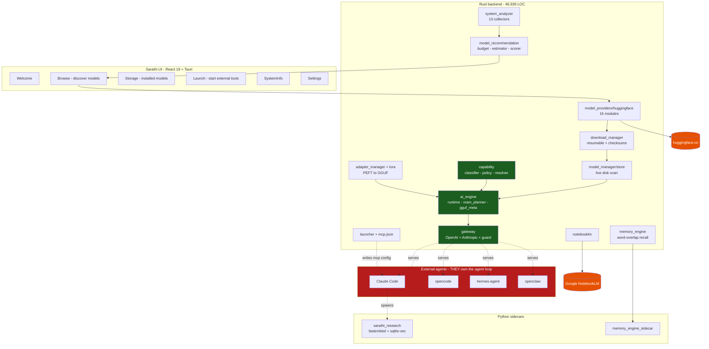
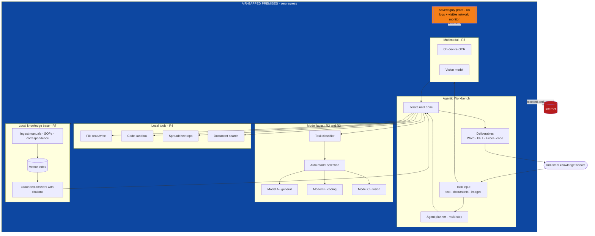
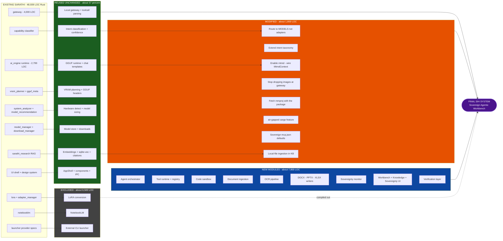
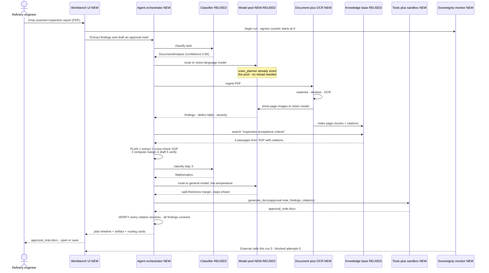

# SIH 2026 · PS 26117 — Sarathi Reuse & Feasibility Analysis

**Analysis date:** 22 August 2026
**Method:** Deep code audit of the Sarathi repository at commit `8917df7` (branch `main`)
**Repository audited:** `C:\Users\lenovo\.gemini\antigravity\scratch\Sarathi`
**Question:** Can Sarathi be transformed into a valid PS 26117 solution instead of building from scratch?

> **Method note.** Every claim about Sarathi in this document was verified by reading the
> actual source at the cited file and line. Where a capability is absent, that absence was
> confirmed by exhaustive search, not assumed. Where a capability is present but
> *unwired*, that distinction is stated explicitly. No requirement is attributed to SIH
> that does not appear in the official problem statement text.

---

## Table of Contents

1. [PS 26117 — the official problem statement](#1-ps-26117--the-official-problem-statement)
2. [Sarathi architecture audit](#2-sarathi-architecture-audit)
3. [Requirement-to-Sarathi mapping](#3-requirement-to-sarathi-mapping)
4. [Reuse percentage, with evidence](#4-reuse-percentage-with-evidence)
5. [What Sarathi saves us](#5-what-sarathi-saves-us)
6. [Required changes, by phase](#6-required-changes-by-phase)
7. [Modify, fork, or build new?](#7-modify-fork-or-build-new)
8. [30-day build feasibility](#8-30-day-build-feasibility)
9. [Final proposed architecture](#9-final-proposed-architecture)
10. [Visualised flows](#10-visualised-flows)
11. [Demo scenarios](#11-demo-scenarios)
12. [Biggest risks](#12-biggest-risks)
13. [Final verdict](#13-final-verdict)
14. [Executive summary](#14-executive-summary)

---

## 1. PS 26117 — the official problem statement

Retrieved from the live SIH 2026 portal (`https://sih.gov.in/sih2026PS`, DataTables row 117).
The public page renders all 226 problem statements client-side; PS 26117 was extracted
directly from the table's underlying row data.

### 1.1 Identification

| Field | Value |
| --- | --- |
| **Problem Statement ID** | **26117** |
| **PS Number** | SIH26117 |
| **Title** | Sovereign On-Premise Agentic AI Workbench using Open-Weight Multimodal LLMs for Confidential Industrial Work |
| **Organization** | Mangalore Refinery and Petrochemicals Limited (MRPL) |
| **Department** | Mangalore Refinery and Petrochemicals Limited (MRPL) |
| **Category** | Software |
| **Theme** | Smart Automation |
| **Ideas submitted** | 0 / 500 (at time of audit) |
| **Deadline for Idea Submission** | 20 September 2026 |
| **Dataset Link** | "Open-source models and publicly available document samples (sample scanned PDFs, sample P&IDs from open datasets) to be used for demonstration; no proprietary data required." |
| **YouTube / Contact** | Not provided |

### 1.2 Background (as stated)

Refineries, PSUs, defence-linked manufacturing units and government offices generate a
large volume of routine but sensitive knowledge work: approval notes, board
presentations, engineering calculations, code for internal tools, review of scanned
drawings and inspection reports.

None of this can go through cloud AI assistants, because the underlying data is
confidential — Piping & Instrumentation Diagrams, financials, vendor negotiations,
unreleased designs, internal correspondence, confidential business strategies.

Company policy keeps this data on premises, so people either do the work manually
(losing productivity) **or quietly paste confidential material into public tools anyway.**

The PS states that open-weight large reasoning models have reached a point where a
genuinely useful assistant built on them is realistic — but **nothing deployable exists
today that industrial users can actually work with the way they use Claude or Codex.**

### 1.3 Core problem

Build a self-hosted, air-gapped AI workbench running entirely on the organization's own
GPU server, with the ergonomics of a commercial coding/knowledge assistant, where nothing
leaves the premises.

### 1.4 Target users

Knowledge workers inside confidential industrial and government environments: refinery and
PSU engineers, defence-linked manufacturing staff, government office personnel.
Explicitly, people who today either work manually or leak data to public tools.

### 1.5 Required capabilities (verbatim obligations)

| # | Requirement | Wording from the PS |
| --- | --- | --- |
| **R1** | Air-gapped, on-premise | "running entirely on the organization's own GPU server. Nothing leaves the premises." |
| **R2** | Multi-model, auto-selected | "should not be locked to one model… support multiple open weight models at once and automatically pick the right one for a given task based on what that task needs, a coding request handled differently from a document summary request." |
| **R3** | Extensible model layer | "New open weight models should be addable later without redesigning the system, since this space is moving fast." |
| **R4** | Genuine agent | "Plan out multi step work, call local tools such as file read and write, code execution in a sandbox, spreadsheet work, internal document search, and **iterate on a task instead of answering once and stopping.**" |
| **R5** | Multimodal input | "scanned PDFs, handwritten notes, engineering drawings, photographs, read through **on device OCR and vision models.**" |
| **R6** | Real deliverables | "approval notes, PPT/Word/Excel files, working code, calculations with steps shown, **not just chat replies.**" |
| **R7** | Local knowledge base | "ground itself in the organization's own manuals, SOPs and past correspondence through a **local knowledge base connector**, again with nothing going external." |

### 1.6 Expected solution — the demo contract

The PS is unusually specific about what must be *shown*. This is effectively the
evaluation rubric.

| # | Demo obligation |
| --- | --- |
| **D1** | "A working local deployment, demonstrable on a single workstation or server with a **mid range GPU** (use a smaller open weight model if 120B class hardware isn't available at the venue)" |
| **D2** | "shows **model auto selection across at least two different task types**" |
| **D3** | "An agentic task carried through end to end, for example **reading a scanned inspection report, pulling out key findings and drafting an approval note as a Word file**" |
| **D4** | "A **coding task run and verified in a sandbox**" |
| **D5** | "A multimodal task involving **image or scanned document understanding**" |
| **D6** | "The system should also show, through **logs or a visible network monitor, that no external calls are made at any point.** That's the actual proof of the sovereign claim, not just a statement of it." |

### 1.7 Constraints explicitly stated by SIH

- **Hardware:** a single workstation or server with a **mid-range GPU**. The PS explicitly
  permits substituting a smaller open-weight model if 120B-class hardware is unavailable
  at the venue. No minimum VRAM figure is given.
- **Models:** must be **open-weight**. No specific model is mandated.
- **Data:** demonstration uses open-source models and publicly available document samples
  (sample scanned PDFs, sample P&IDs). **No proprietary data is required or provided.**
- **Security:** the sovereignty claim must be *proven*, not asserted — via logs or a
  visible network monitor.
- **Category:** Software. No hardware deliverable.

### 1.8 What the PS does *not* require

Stated here so the build does not drift into invented scope:

- No multi-user authentication, RBAC, or SSO is mentioned.
- No specific accuracy or latency numbers are given.
- No integration with SAP/ERP/DCS/historian systems is mentioned.
- No mobile app, no cloud fallback, no federated deployment.
- No specific model family, quantisation, or inference engine is mandated.
- No requirement to fine-tune or train models.

---

## 2. Sarathi architecture audit

### 2.0 What Sarathi actually is

This is the single most important finding of the audit, and it is not what the project
name or README would lead you to assume.

**Sarathi is not a chat application and it is not an agent.** It is a *model management
and local inference gateway* — an "engine room" that other agent tools plug into.

Evidence:

- `src/App.tsx` registers exactly seven routes: `Welcome`, `Launch`, `Browse`, `Settings`,
  `SystemInfo`, `Storage`, `Models` (legacy). **There is no chat page, no agent page, no
  document page.**
- `src-tauri/src/gateway/mod.rs:4` — *"Sarathi is the engine room: it owns the model, and
  tools like Claude Code, opencode, and openclaw connect to it rather than loading their own."*
- `src-tauri/src/lib.rs` — the startup comment states plainly: *"Sarathi serves other tools
  rather than hosting its own chat, so nothing in the UI would otherwise trigger a load."*
- `docs/architecture/mcp-usage-and-integration.md` — *"Sarathi should be an MCP
  **provisioner**, not an MCP **proxy**. It owns the definition, credentials, readiness and
  distribution of MCP capabilities; the client owns the connection. Sarathi sits on the
  configuration path, not the runtime data path."*
- `docs/architecture/sarathi-mcp-tool-host-feasibility.md:26` contains an explicit
  self-assessment table row: **"Sarathi's current code supports [Sarathi-as-agent]? —
  Not at all."**

This shapes the entire analysis. Sarathi has solved, to production quality, the layer
*beneath* the agent. It has not built the agent.

### 2.1 Scale and maturity

| Metric | Value |
| --- | --- |
| Rust backend | **48,939 lines** across 152 `.rs` files |
| React/TS frontend | ~5,500 lines across 7 pages + 13 UI components + 18 services |
| Python sidecars | 11 files (memory engine + research MCP server) |
| **Test functions** | **810** across 71 files (`#[test]` / `#[tokio::test]`) |
| Build artifacts | `target/debug/sarathi.exe` (42 MB), `target/release/sarathi.exe` (181 MB), both built 21 Aug 2026 |
| Stack | Tauri 2, React 19, TypeScript 5.8, Vite 7, Rust 2021 |

This is a mature, tested, *shipping* codebase — not a prototype. The code carries unusually
detailed rationale comments explaining prior defects and why the current design exists.

### 2.2 Subsystem-by-subsystem audit

#### 2.2.1 Frontend / UI — exists, good quality, wrong shape for PS

| Path | State |
| --- | --- |
| `src/components/ui/` | Complete design system: `Button`, `Card`, `Badge`, `Dialog`, `ConfirmDialog`, `Input`, `Toast`, `Toggle`, `Tooltip`, `Spinner`, `DownloadBar`, `ErrorBoundary`, `SarathiLogo` — all with CSS modules |
| `src/components/layout/` | `AppShell`, `TopBar`, `StatusBar` |
| `src/contexts/` | `AppState`, `Config`, `Theme`, `Toast`, `Confirm` providers |
| `src/pages/Browse.tsx` | 1,626 lines — model discovery/search/download UI |
| `src/pages/Storage.tsx` | 973 lines — installed-model management |
| `src/pages/SystemInfo.tsx` | 791 lines — hardware profile display |
| `src/pages/Launch.tsx` | 399 lines — detect/install/launch external agent CLIs |
| `src/pages/Settings.tsx` | 319 lines |
| `src/sdk/` | `ISarathiClient` interface + `SarathiTauriClient` implementation — a real client abstraction |
| `src/services/` | 18 typed service modules wrapping Tauri IPC |

**Verdict:** the shell, design system, state management, and IPC layer are directly
reusable. The *pages* are about model management, which PS 26117 needs but only as a
secondary concern. The primary PS surfaces — a workbench, an agent run view, a document
view, a sovereignty monitor — do not exist.

#### 2.2.2 Backend core — exists, directly reusable

- `src-tauri/src/core/` — `app_state`, `event_bus`, `module_manager`, `service_registry`
- `src-tauri/src/config/` — `ConfigManager` with JSON persistence, defaults, HF token handling
- `src-tauri/src/logging/` — panic handler, `tauri-plugin-log` to stdout + log dir + webview
- `src-tauri/src/diagnostics.rs` — a UI-thread guard (`mark_ui_thread`,
  `assert_off_ui_thread`, `Stage`) that names blocking work instead of letting the window freeze
- `src-tauri/src/database/mod.rs` — SQLite via `tauri-plugin-sql`, 2 migrations:
  settings / activity_log / models / downloads / installed_loras, then the Phase 6 memory tables

#### 2.2.3 Hardware detection — exists, excellent, a genuine differentiator

`src-tauri/src/system_analyzer/` — 13 collectors: `cpu_collector`, `gpu_collector`
(431 lines, DXGI on Windows via the `windows` crate), `memory_collector`, `os_collector`,
`storage_collector`, `software_collector`, `ai_runtime_collector`, `path_collector`,
`process_utils`, `normalization`, `validation`, `overrides` (the user can correct a
mis-detected value).

Thread-safe with single-flight scanning (`is_scanning: AtomicBool`), publishes to the
event bus, and is deliberately run off the UI thread.

#### 2.2.4 Model recommendation / hardware-aware selection — exists, excellent

`src-tauri/src/model_recommendation/` — 10 modules. Pipeline (from `mod.rs:6`):

```
HardwareProfile -> Budget Calculator -> Model Catalog -> Memory Estimator
                -> Multi-Config Evaluator -> Deterministic Scorer -> Ranked Recommendations
```

`scorer.rs` (936 lines) evaluates a full matrix of *(quantization x context x backend x
run_mode)* per model across `CONTEXT_CHECKPOINTS = [2048 … 131072]`, with calibrated
constants (`MIN_SAFE_HEADROOM = 0.05`, `COMFORTABLE_HEADROOM = 0.15`,
`HEADROOM_SCORING_TARGET = 0.20`, `MIN_USEFUL_CONTEXT = 4096`) and explicit commentary on
why the scorer's target sits above the grader's threshold.

**This directly answers D1** — "use a smaller open weight model if 120B class hardware
isn't available at the venue." Sarathi already performs exactly that computation.

#### 2.2.5 Model providers / catalog — exists, extensive, partly needs air-gapping

`src-tauri/src/model_providers/huggingface/` — 16 modules:

| Module | Lines | Does |
| --- | --- | --- |
| `card.rs` | 1,285 | Model card parsing/rendering |
| `discovery.rs` | 1,176 | Quantisation file discovery; **detects and excludes `mmproj` vision projectors** |
| `live_catalog.rs` | 913 | Live HF Hub catalog queries |
| `catalog_cache.rs` | 593 | On-disk catalog caching |
| `catalog_provider.rs` | 568 | Catalog assembly |
| `brands.rs` | 513 | Recognises official vendors (NVIDIA, DeepSeek, Qwen, Unsloth…) |
| `adapter_discovery.rs` | 473 | Finds LoRA adapters for a base model |
| `resolver.rs` / `resolve_upstream.rs` | 429 / — | Resolves GGUF repo to original upstream model |
| `moe_fit.rs` / `moe_geometry.rs` | 399 / 297 | Mixture-of-Experts memory fitting |
| `probe.rs` | 312 | **Reads a GGUF header over HTTP range requests before committing to a download** |
| `curation.rs` | 273 | Quality filtering |

`model_providers/local/mod.rs` is a **10-line stub** — there is no local/offline model
import path through the provider abstraction. (However, see §2.2.7: the disk scan is live,
so manually-placed models *are* detected.)

#### 2.2.6 Download manager — exists, production quality

`src-tauri/src/download_manager/manager.rs` — 1,674 lines. Resumable, pausable,
cancellable, with `check_disk_space`, SHA-256 checksums, per-task progress events, and
multi-file package downloads.

#### 2.2.7 Model store — exists, and makes sideloading work by accident

`src-tauri/src/model_manager/store.rs` (470 lines):

> *"The **directory walk is always live**. Adding or deleting a model is seen on the next
> call with no cache to invalidate."*

GGUF header reads are memoised on `(path, len, mtime_nanos)`. Concurrent callers share one
scan. **Consequence for PS 26117: a model copied onto an air-gapped machine by USB is
picked up automatically** — no network needed. Only the *UI* for sideloading is missing.

`model_manager/classify.rs` (442 lines) categorises models: `Dense`, `MixtureOfExperts`,
**`Vision`**, `Embedding`, `Other` — including the note that llama.cpp keeps the projector
in a separate `mmproj` GGUF.

#### 2.2.8 Local inference — exists, sophisticated, single-model

`src-tauri/src/ai_engine/`:

| File | Lines | Does |
| --- | --- | --- |
| `runtime.rs` | **2,799** | `LlamaCppRuntime`: load, generate, stream, cancel |
| `manager.rs` | 1,525 | `InferenceManager`: thread-safe wrapper, status mirror, capability integration |
| `gguf_meta.rs` | 1,097 | Reads the GGUF header pre-load: arch, layers, `embedding_length`, **`has_vision`**, exact `kv_bytes_per_token` |
| `vram_planner.rs` | 961 | GPU offload planning with real KV-cache math |
| `scheduler.rs` | 407 | Single-threaded job queue with queue position and lock-free cancellation |
| `session.rs` | — | Session persistence / restore |
| `lora_binding.rs` | — | LoRA adapter caching and live-context binding |

**Inference engine:** `llama-cpp-2 = "0.1"`, resolving to **0.1.153** (from `Cargo.lock`) —
in-process GGUF inference. GPU is **opt-in at compile time** (`--features cuda` / `vulkan`);
`Cargo.toml` carries a long comment explaining that llama.cpp silently ignores
`n_gpu_layers` without it, plus the known nvcc/MSVC-version failure and its fixes.

**Chat templates:** `runtime.rs` renders the model's *own* Jinja template from the GGUF's
`tokenizer.chat_template` key using `minijinja`, with compatibility shims for
transformers-specific constructs minijinja cannot parse, falling back to llama.cpp's
`apply_chat_template`. This is a genuinely hard problem, solved.

**Ollama:** the `AIBackendType` enum lists `Ollama`, `LlamaCpp`, `VLLM`, `Custom` — but
**only `LlamaCpp` is implemented.** There is no Ollama integration in this codebase.

**Multi-model:** `InferenceManager` holds `runtime: Arc<Mutex<LlamaCppRuntime>>` and a
single `Option<LoadedModelInfo>`. `scheduler.rs:3` states it outright: *"Only one model
fits in VRAM, and llama.cpp generation is blocking, so exactly one generation can run at a
time."* **One model at a time.**

#### 2.2.9 Capability layer (task routing) — exists, wired, and is the hidden gem

`src-tauri/src/capability/` — 7 modules. From `mod.rs`:

```
prompt -> classify (confidence) -> switch policy (hysteresis) -> resolve backend
       -> apply (system directive + sampling, and/or LoRA adapter binding)
```

- `intent.rs` — taxonomy: `Coding`, `Reasoning`, `Mathematics`, `ToolCalling`, `Research`,
  `GeneralChat`
- `classifier.rs` (429 lines) — weighted lexical signals in five bands
  (`DECISIVE 3.0` down to `WEAK 0.6`), scores **every** intent independently, then derives
  confidence from two orthogonal factors: **dominance** (lead over rivals) and **evidence**
  (total signal found). Whole-token matching, so `reason` does not fire on "reasonable".
  Explicitly documents and supersedes an earlier first-match scanner.
- `policy.rs` — switch hysteresis, conversation stickiness
- `resolver.rs` — resolves to `Base` | `PromptProfile` | `LoraAdapter`, **always degrading
  gracefully** when an adapter is unavailable
- `profile.rs` — per-capability system directives and sampling overrides
- `assign.rs` / `eval.rs` — adapter-to-capability assignment and evaluation

**Crucially, it is wired into the real generation path** — verified at
`ai_engine/manager.rs:706`. The module comment is emphatic about this being the fix for a
previous version that classified intent, displayed a badge, and then generated with the
unmodified base model.

It emits a `CapabilityPayload` carrying `capability`, `badge`, `backend`, `confidence`,
`switched`, `reason`, `backend_reason`, `adapter_path`, and the *effective* sampling
parameters — so it can already drive a "why did it pick this?" panel.

**Limitation for PS 26117:** it routes between **adapters and prompt profiles on one
loaded base model**, not between **different models**. R2 needs the latter.

#### 2.2.10 Gateway (API layer) — exists, production quality, directly reusable

`src-tauri/src/gateway/` — ~4,000 lines across 6 modules.

- Axum 0.8 server, **binds `127.0.0.1` only**, default port **11435** (deliberately not
  Ollama's 11434), with retry plus ephemeral-port fallback and graceful shutdown
- `GET /health`, `GET /v1/models`
- `POST /v1/chat/completions` — OpenAI dialect (`openai.rs`, 599 lines)
- `POST /v1/messages` — Anthropic dialect (`anthropic.rs`, 714 lines)
- SSE streaming on both; client-disconnect cancellation
- `state.rs` — `GatewayStats`, `ClientActivity` (which tool is using the model, last seen)

`guard.rs` — an **origin guard** that rejects requests carrying a foreign `Origin`
(blocking drive-by attacks from web pages) and a non-local `Host` (blocking DNS
rebinding). Fully unit-tested.

`toolcall.rs` — **1,212 lines** parsing tool calls out of raw model text, because *"a GGUF
returns text, and the shape of that text is decided by the chat template baked into the
model — so this is a parser, not a protocol."* Five formats: ChatML `<tool_call>`, LFM2
`<|tool_call_start|>` (Python call syntax, not JSON), Llama 3.1 bare JSON /
`<|python_tag|>`, Mistral `[TOOL_CALLS]`, and a fenced JSON block. Includes a `StreamSieve`
that holds back partial tool syntax during streaming.

**This is one of the highest-value reusable assets in the repository.** Getting local
models to emit parseable tool calls reliably is a multi-week problem, and it is solved.

**Images are explicitly dropped** at both surfaces — `openai.rs:78`: *"Non-text parts
(images) are dropped — the local GGUF path has no vision support"*; `anthropic.rs:126`:
*"Images are still dropped — the local GGUF path has no vision."*

#### 2.2.11 Launcher (external tool integration) — exists, reusable in part

`src-tauri/src/launcher/` — detects, installs, and launches four external agent CLIs:
**claude-code**, **opencode**, **hermes-agent**, **openclaw** (`spec.rs`, 1,566 lines),
writing each one's config in its own dialect, plus `console.rs` (612 lines) giving each
launched tool its own terminal.

`mcp.rs` (824 lines) — one `mcp.json` registry rendered per-client dialect.
**Explicitly: "Nothing here starts a process."** Sarathi provisions MCP configuration; the
*client* spawns and talks to the servers.

#### 2.2.12 LoRA / adapter management — exists, deep, mostly not needed for PS 26117

`adapter_manager/` (1,530 lines in `mod.rs`) — model package manifests (`manifest.json`),
installed-adapter inventory, capability defaults, state machine, startup scan.

`lora/convert/` — **PEFT safetensors to GGUF conversion in pure Rust** (`arch.rs`,
`gguf_writer.rs`, `peft_config.rs`, `safetensors_reader.rs`, `tensor_map.rs`), avoiding
shipping Python and torch.

Impressive, but PS 26117 does not ask for fine-tuning or adapters. This is the largest
block of *high-quality but out-of-scope* code.

#### 2.2.13 Memory engine — exists, but is NOT document RAG

`memory_engine/` — 18 Rust modules plus a Python sidecar. It is a **conversational
fact/preference store**, not a document knowledge base:

- SQLite `memory_nodes` with `importance_score`, `recency_timestamp`, project scoping
- `retriever.rs:97` — similarity is **`calculate_text_similarity`: a bag-of-words overlap
  ratio**, clamped to `[0.1, 0.95]`. No embeddings, no semantic search.
- Retrieves at most 50 raw candidates from SQLite before ranking
- `embedding_blob BLOB` columns exist in both `database/mod.rs:106` and
  `memory_engine/persistence.rs:88` — **and are never populated.** Placeholder.
- `injector.rs` — injects recalled facts into the system message (this part *is* reusable
  for grounding)

**Verdict: partially reusable as a *pattern* (injection, project scoping, persistence), not
as a RAG engine.**

#### 2.2.14 Research MCP sidecar — exists, and IS a real local RAG engine

`sidecars/mcp/sarathi_research/server.py` — 765 lines. This is the most under-appreciated
asset for PS 26117.

| Aspect | Implementation |
| --- | --- |
| Embeddings | **`fastembed` ONNX, `BAAI/bge-small-en-v1.5`, 384-dim, runs locally** |
| Query encoding | Correct asymmetric BGE handling (`query_embed` vs `embed`) |
| Vector index | **`sqlite-vec`** over one SQLite file |
| Chunking | 1,200 chars / 150 overlap, line-range tracked |
| Collections | Named "notebooks" — independent indexes |
| Provenance | URL for pages; **file plus line range for repositories** — real citations |
| MCP tools | `research_ingest_url`, `research_ingest_repo`, `research_ingest_text`, `research_search`, `research_ask`, `research_list_notebooks`, `research_sources`, `research_forget`, `research_health` |
| Synthesis | Optional, against any OpenAI-compatible endpoint (Sarathi's own included) |

Module docstring: *"The NotebookLM-shaped capability, **with nothing leaving the machine**."*

**Gap for PS 26117:** it ingests **web pages, git repos, and raw text** — *not* local office
documents. There is no PDF/DOCX/XLSX ingestion path, and the web path (via Crawl4AI) is an
egress route that must be removed for air-gapped operation.

#### 2.2.15 Multimodal — absent in Sarathi, but available in its existing dependency

This is the most important *positive surprise* of the audit.

**What Sarathi has today:**

- `gguf_meta.rs:370` — reads `has_vision` from `{arch}.vision.*` / `clip.*` GGUF keys
- `discovery.rs` — detects `mmproj` projector files by name and size ratio, and **excludes
  them from quantisation lists** so they are not mistaken for models
- `classify.rs` — a `Vision` model category ("These can be shown images as well as text")
- `runtime.rs:385` — refuses to load a bare vision projector as a model
- **Zero vision inference.** Images dropped at the gateway.
- `model_intelligence/profile.rs:150` — `registry.set_capability("vision", false, 0.0, …)`
  — declared unsupported

**What the pinned dependency already ships:**

`llama-cpp-2 0.1.153` contains **`src/mtmd.rs` — 980 lines** exposing llama.cpp's full MTMD
multimodal API, gated behind `#[cfg(feature = "mtmd")]`:

```rust
MtmdContext::init_from_file(...)      // load an mmproj projector
    .support_vision() / .support_audio()
MtmdBitmap::from_file / from_buffer / from_image_data / from_audio_data
MtmdInputChunks::tokenize(...)
    .eval_chunks(mtmd_ctx, llama_ctx, n_past, seq_id, n_batch, logits_last)
```

`eval_chunks` is a helper that *"automatically runs `llama_decode()` on text chunks, runs
`mtmd_encode()` on image chunks, then `mtmd_get_output_embd()` and then `llama_decode()`."*

And `llama-cpp-2`'s own `Cargo.toml` declares: `mtmd = ["llama-cpp-sys-2/mtmd"]`.

**Conclusion: enabling vision is a one-line feature-flag change plus an integration — not a
rewrite, and not an engine swap.** Sarathi already detects, downloads and classifies vision
models; it simply never learned to run them.

#### 2.2.16 OCR — absent

Exhaustive search: `tesseract` → 0 files. `ocr` → 1 incidental file. **Nothing exists.**

#### 2.2.17 Document processing and generation — absent

`pdf` → 0 files. `docx` → 0. `pptx` → 0. `xlsx` → 0. `openpyxl` → 0. `python-docx` → 0.
**Nothing exists in either direction — no parsing, no generation.**

This is a hard gap against R5 and R6, and against demo obligations D3 and D5.

#### 2.2.18 Agent / orchestration — absent

No planner, no task decomposition, no observe/act loop, no iteration control, no step
budget, no reflection. The architecture docs state this explicitly (§2.0).

#### 2.2.19 Sandbox / code execution — absent

`sandbox` → **0 files** across `src-tauri/`, `src/`, and `sidecars/`.

The only process-spawning code is `launcher/`, which starts *developer tools in their own
terminal* — the opposite of a confinement boundary.

#### 2.2.20 Network posture and offline operation — strong, and a real asset

Exhaustive enumeration of every URL literal in the Rust backend:

| Host | Occurrences |
| --- | --- |
| `127.0.0.1` | 26 |
| `huggingface.co` | 25 |
| `localhost` / `tauri.localhost` | 5 |
| `hf.co` | 2 |
| `opencode.ai` | 1 (install docs) |
| *(test fixtures: `example.com`, `evil.com`, `x`, `y`)* | 12 |

**The only real external host in the entire Rust backend is Hugging Face.** Every other
network path is loopback. The inference path itself makes **zero** network calls.

Egress that must be removed for an air-gapped build:

1. **Hugging Face** — catalog browsing, model/adapter download, GGUF header probes
2. **NotebookLM** (`notebooklm/`, 953 + 675 + 237 + 214 lines) — talks to **Google**
3. **MCP registry defaults** — `searxng` (aggregates public engines), `crawl4ai` (fetches
   web pages), `playwright` (headless browser). All self-hosted, all outward-facing.

There is currently **no network kill-switch, no egress monitor, and no offline mode flag.**

#### 2.2.21 Security / privacy controls — partial

Present: loopback-only bind, origin and Host guard, DNS-rebinding protection, HF token
stored in config rather than code, `mcp.json` excluded from the repository.

Absent: authentication, authorisation, RBAC, audit trail, data-at-rest encryption,
per-document access control, tamper-evident logging. **None of these are required by
PS 26117**, but an audit trail is worth having for the sovereignty story.

#### 2.2.22 Plugin architecture / provider abstraction — exists, thin

`model_providers/provider.rs` and `registry.rs` define a `ModelProvider` trait with
`ProviderType`. HuggingFace is fully implemented; `Local` and `OllamaLibrary` are stubs.
`plugins/` and `installer/` are trait-only scaffolding.

**Consequence for R3 ("new models addable without redesigning the system"): partially
satisfied.** Adding a new *GGUF* model needs no code at all — drop it in the store, or
download it. Adding a new *provider* or *runtime* has a trait, but little behind it.

#### 2.2.23 Error handling, monitoring, deployment

- **Error handling:** `anyhow` + `thiserror` throughout; `GenerationError::classify` maps
  runtime failures to HTTP status codes and machine-readable types
  (`context_length_exceeded`, `tools_unsupported`, `inference_error`)
- **Monitoring:** `tauri-plugin-log` to stdout, log directory, and webview; `event_bus` for
  in-app events; `GatewayStats` / `ClientActivity` for live gateway state
- **Deployment:** `npm run dev:cuda` / `dev:vulkan` / `dev:auto`, with
  `scripts/select-backend.mjs` picking a backend; `tauri build` produces a Windows installer
  bundle. **Single-binary desktop deployment already works.**
---

## 3. Requirement-to-Sarathi mapping

Categories used:

| Tag | Meaning |
| --- | --- |
| **DIRECTLY REUSABLE** | Works today, used as-is or with configuration only |
| **PARTIALLY REUSABLE** | Real code exists and helps, but a meaningful piece is missing |
| **REQUIRES MODIFICATION** | The right architecture exists; behaviour must change |
| **MUST BE BUILT** | Nothing usable exists; greenfield |
| **NOT REQUIRED** | Sarathi has it; PS 26117 does not ask for it |

### 3.1 R1 — Air-gapped, on-premise, nothing leaves the premises

| Aspect | Sarathi module | Verdict |
| --- | --- | --- |
| Local-only inference | `ai_engine/runtime.rs` — in-process llama.cpp, **zero network calls on the inference path** | **DIRECTLY REUSABLE** |
| Loopback-only API | `gateway/server.rs` binds `127.0.0.1` exclusively | **DIRECTLY REUSABLE** |
| Anti-exfiltration guard | `gateway/guard.rs` — Origin + Host checks, DNS-rebinding protection, unit-tested | **DIRECTLY REUSABLE** |
| Local storage | SQLite + app-data model store; nothing remote | **DIRECTLY REUSABLE** |
| Model acquisition | `model_providers/huggingface/*` — 25 references to `huggingface.co` | **REQUIRES MODIFICATION** — must be gated behind an explicit, off-by-default "Acquisition mode" |
| NotebookLM | `notebooklm/` — talks to Google | **REQUIRES MODIFICATION** — compile out of the air-gapped build |
| Web-facing MCP servers | `searxng`, `crawl4ai`, `playwright` in `mcp.json` | **REQUIRES MODIFICATION** — remove from the sovereign registry |
| Egress kill-switch | — | **MUST BE BUILT** |
| Visible network monitor (D6) | — | **MUST BE BUILT** |

**Estimated reuse for R1: ~50%** — the architecture is already loopback-first, which is the
hard half; the proof surface and the enforcement switch are new.

### 3.2 R2 — Multiple models at once, automatically selected per task

| Aspect | Sarathi module | Verdict |
| --- | --- | --- |
| Task classification | `capability/classifier.rs` — weighted, calibrated-confidence, 6 intents, 429 lines, tested | **DIRECTLY REUSABLE** (extend taxonomy) |
| Switch hysteresis | `capability/policy.rs` | **DIRECTLY REUSABLE** |
| Routing decision object | `capability::CapabilityPayload` — confidence, reason, backend, effective sampling | **DIRECTLY REUSABLE** — already drives an explainability panel |
| Route *target* | `capability/resolver.rs` resolves to adapter/prompt-profile **on one model** | **REQUIRES MODIFICATION** — add a `Model { id }` backend variant |
| Multiple models resident | `InferenceManager` holds **one** `Arc<Mutex<LlamaCppRuntime>>` | **MUST BE BUILT** — a model pool |
| Serialised execution | `ai_engine/scheduler.rs` — job queue, queue position, cancellation | **PARTIALLY REUSABLE** — becomes per-model or pool-aware |
| Fitting N models into VRAM | `ai_engine/vram_planner.rs` (961 lines, exact KV math) + `model_recommendation/scorer.rs` | **DIRECTLY REUSABLE** — this is exactly the calculation a pool needs |
| Load/unload machinery | `InferenceManager::load_installed_model_direct`, `unload_model` | **DIRECTLY REUSABLE** |

**Estimated reuse for R2: ~65%.** The classifier — the part most teams get wrong — is done
and tested. What is missing is a pool that can hold two or three small models and a router
that selects among *models* rather than *adapters*.

### 3.3 R3 — New models addable without redesigning the system

| Aspect | Sarathi module | Verdict |
| --- | --- | --- |
| Add a new GGUF | `model_manager/store.rs` live directory walk + `gguf_meta.rs` header read | **DIRECTLY REUSABLE** — genuinely zero-code |
| Auto-sizing a new model | `model_recommendation/*` + `vram_planner.rs` | **DIRECTLY REUSABLE** |
| Auto-classifying a new model | `model_manager/classify.rs` (`Dense` / `MoE` / `Vision` / `Embedding`) | **DIRECTLY REUSABLE** |
| Chat template for a new model | `runtime.rs` renders the GGUF's own Jinja via minijinja | **DIRECTLY REUSABLE** — this is what makes new models "just work" |
| Sideload UI (offline install) | `model_providers/local/` is a 10-line stub | **MUST BE BUILT** (small — a folder picker plus manifest writer) |
| Alternative runtimes (vLLM etc.) | `AIBackendType` enum exists; only `LlamaCpp` implemented | **NOT REQUIRED** for the PS |

**Estimated reuse for R3: ~85%.** This requirement is close to already satisfied, and it is
an unusually strong story to tell judges.

### 3.4 R4 — Genuine agent: plan, call local tools, iterate

| Aspect | Sarathi module | Verdict |
| --- | --- | --- |
| Planner / task decomposition | — | **MUST BE BUILT** |
| Observe / act / iterate loop | — | **MUST BE BUILT** |
| Step budget, retry, repair | — | **MUST BE BUILT** |
| Tool *schema* transport to the model | `gateway/openai.rs` + `anthropic.rs` accept `tools`, pass to chat template | **DIRECTLY REUSABLE** |
| Tool *call parsing* from model text | `gateway/toolcall.rs` — 1,212 lines, 5 emission formats, `StreamSieve` | **DIRECTLY REUSABLE** — very high value |
| Tool result round-trip | `ChatMessage.tool_calls` / `tool_call_id` / `name` carried structurally *and* re-rendered into content | **DIRECTLY REUSABLE** |
| Tool *execution* | — Sarathi is a "provisioner, not a proxy"; the client executes | **MUST BE BUILT** |
| File read/write tool | — | **MUST BE BUILT** |
| Code execution sandbox | `sandbox` → 0 files | **MUST BE BUILT** |
| Spreadsheet tool | — | **MUST BE BUILT** |
| Document-search tool | `research_search` in the MCP sidecar | **PARTIALLY REUSABLE** |
| Process supervision patterns | `launcher/console.rs`, `launcher/mod.rs` | **PARTIALLY REUSABLE** — spawn/monitor/kill patterns transfer |

**Estimated reuse for R4: ~30%** — and this is the crux of the whole project. The *plumbing
between the model and tools* is done to production quality. The *loop and the tools
themselves* do not exist.

### 3.5 R5 — Multimodal: scanned PDFs, handwriting, drawings, photos via on-device OCR and vision

| Aspect | Sarathi module | Verdict |
| --- | --- | --- |
| Vision-model detection | `gguf_meta.rs` `has_vision`; `discovery.rs` `mmproj` detection; `classify.rs` `Vision` category | **DIRECTLY REUSABLE** |
| Vision-model download | `download_manager` + `discovery.rs` (already knows the projector is a separate file) | **REQUIRES MODIFICATION** — currently *excludes* `mmproj`; must fetch it as part of the package |
| Vision inference | `llama-cpp-2 0.1.153` ships `mtmd.rs` (980 lines) behind an unused feature flag | **REQUIRES MODIFICATION** — enable `features = ["mtmd"]`, wire `MtmdContext` into `runtime.rs` |
| Image input over the API | Images explicitly dropped in `openai.rs:78` and `anthropic.rs:126` | **REQUIRES MODIFICATION** — stop dropping, route to the MTMD path |
| OCR | 0 files | **MUST BE BUILT** |
| PDF rasterisation / page extraction | 0 files | **MUST BE BUILT** |
| Handwriting | 0 files | **MUST BE BUILT** (and see §12 — scope carefully) |

**Estimated reuse for R5: ~30%.** Higher than it first appears, because the hardest part —
having a multimodal-capable inference engine at all — turns out to be a feature flag away
rather than an engine replacement.

### 3.6 R6 — Real deliverables: Word, PPT, Excel, working code, calculations with steps

| Aspect | Sarathi module | Verdict |
| --- | --- | --- |
| DOCX generation | 0 files | **MUST BE BUILT** |
| PPTX generation | 0 files | **MUST BE BUILT** |
| XLSX generation | 0 files | **MUST BE BUILT** |
| Code generation | Model capability; `capability/profile.rs` already has a `coding` directive and sampling overrides | **PARTIALLY REUSABLE** |
| Code *verification* | — | **MUST BE BUILT** (needs the sandbox) |
| "Calculations with steps shown" | `capability/profile.rs` `mathematics` profile lowers temperature for determinism | **PARTIALLY REUSABLE** |
| Artifact storage / versioning | — | **MUST BE BUILT** (small) |

**Estimated reuse for R6: ~10%.** Essentially greenfield, but low-risk: `python-docx`,
`python-pptx` and `openpyxl` are mature, and the sidecar pattern for Python already exists
in `sidecars/`.

### 3.7 R7 — Local knowledge base over manuals, SOPs, past correspondence

| Aspect | Sarathi module | Verdict |
| --- | --- | --- |
| Local embeddings | `sarathi_research/server.py` — fastembed ONNX, BGE-small, 384-dim | **DIRECTLY REUSABLE** |
| Vector index | `sqlite-vec` over SQLite | **DIRECTLY REUSABLE** |
| Chunking | 1,200 / 150 overlap with line tracking | **DIRECTLY REUSABLE** |
| Citations / provenance | Source id, origin, title, path, line range | **DIRECTLY REUSABLE** |
| Collection scoping | "Notebooks" — independent indexes | **DIRECTLY REUSABLE** |
| Retrieval + grounded answer | `research_search`, `research_ask` | **DIRECTLY REUSABLE** |
| Exposure to an agent | MCP tools already defined | **DIRECTLY REUSABLE** |
| **Ingesting local documents** | Only URL, git repo, raw text | **MUST BE BUILT** — PDF/DOCX/XLSX/image ingestion |
| Web ingestion path (Crawl4AI) | Present | **REQUIRES MODIFICATION** — remove for air-gap |
| Conversational memory | `memory_engine/` (word-overlap similarity) | **PARTIALLY REUSABLE** — the injection pattern, not the retrieval |

**Estimated reuse for R7: ~55%.** The retrieval engine is genuinely done; the *ingestion
front-end for office documents* is not.

### 3.8 Demo obligations mapping

| Demo | Sarathi coverage today | What is needed |
| --- | --- | --- |
| **D1** Runs on a mid-range GPU, smaller model if needed | **Strong** — `system_analyzer` + `model_recommendation` + `vram_planner` already do exactly this | Nothing new; surface it in the UI |
| **D2** Model auto-selection across ≥2 task types | **Partial** — classifier done, routes to adapters not models | Model-level routing + a visible decision panel |
| **D3** Scanned report → findings → Word approval note | **Weak** — none of OCR, vision, or DOCX exists | OCR/vision + agent loop + DOCX writer |
| **D4** Coding task run and verified in a sandbox | **Weak** — tool-call parsing exists, execution does not | Sandbox + agent loop |
| **D5** Image / scanned-document understanding | **Weak** — detection yes, inference no | MTMD integration |
| **D6** Proof of no external calls | **Moderate** — architecture already loopback-only | Egress monitor UI + kill-switch + audit log |

---

## 4. Reuse percentage, with evidence

### 4.1 What "reuse" means here

**Reuse = existing code and architecture that ships into the PS 26117 product with no
change, or with configuration/extension rather than rewriting.**

It explicitly does **not** count:

- Code whose *concept* is similar but whose implementation must be replaced
  (e.g. the memory engine's word-overlap retrieval)
- High-quality code that PS 26117 does not need (e.g. the entire LoRA conversion pipeline)
- "We already thought about this" — architectural ideas without working code

### 4.2 Method

Each component of a complete PS 26117 solution was assigned an effort weight reflecting how
much of a 30-day team build it represents. Sarathi's coverage of each was then scored from
the audit in §2. The overall figure is the weighted average.

| # | Component | Weight | Sarathi coverage | Contribution | Evidence |
| --- | --- | ---: | ---: | ---: | --- |
| 1 | Hardware detection and profiling | 6 | 100% | 6.0 | `system_analyzer/` 13 collectors, DXGI, overrides |
| 2 | Model catalog / acquisition | 8 | 95% | 7.6 | 16 HF modules; needs offline sideload UI |
| 3 | Model storage and registry | 4 | 100% | 4.0 | `model_manager/store.rs` live scan + memoised headers |
| 4 | GGUF runtime, chat templates, streaming | 12 | 95% | 11.4 | `runtime.rs` 2,799 lines; minijinja template rendering |
| 5 | VRAM planning / GPU offload | 4 | 100% | 4.0 | `vram_planner.rs` 961 lines, exact KV math |
| 6 | Task classification / routing logic | 6 | 70% | 4.2 | `capability/classifier.rs` done; taxonomy needs extending |
| 7 | Multi-model pool / hot-swap | 5 | 25% | 1.25 | Single-slot manager; loader + planner reusable |
| 8 | Local API gateway (OpenAI + Anthropic) | 8 | 100% | 8.0 | `gateway/` ~4,000 lines, SSE, guard, stats |
| 9 | Tool-call parsing from raw model text | 5 | 100% | 5.0 | `toolcall.rs` 1,212 lines, 5 formats, `StreamSieve` |
| 10 | **Agent loop (plan / act / observe / iterate)** | 12 | 5% | 0.6 | Absent; docs state "not at all" |
| 11 | **Tool execution runtime + sandbox** | 8 | 10% | 0.8 | `sandbox` → 0 files; only `launcher/` spawn patterns |
| 12 | RAG: ingestion, embedding, retrieval | 10 | 55% | 5.5 | `sarathi_research` has embeddings/vec/chunking/citations |
| 13 | **Document parsing (PDF/DOCX/scanned)** | 6 | 0% | 0.0 | 0 files |
| 14 | **OCR** | 4 | 0% | 0.0 | 0 files |
| 15 | Vision inference | 6 | 30% | 1.8 | Detection + classification exist; `mtmd` flag unused |
| 16 | **Deliverable generation (DOCX/PPTX/XLSX)** | 7 | 0% | 0.0 | 0 files |
| 17 | UI shell, design system, pages | 10 | 65% | 6.5 | Full component library + 7 pages; new surfaces needed |
| 18 | Config, logging, DB, events, diagnostics | 5 | 95% | 4.75 | `core/`, `config/`, `logging/`, `diagnostics.rs` |
| 19 | Air-gap enforcement + egress proof | 5 | 50% | 2.5 | Loopback + guard exist; monitor/kill-switch new |
| 20 | Packaging and deployment | 4 | 90% | 3.6 | `tauri build`, backend selector script, shipping binaries |
| | **Total** | **135** | | **77.5** | |

### 4.3 Overall result

> ## Overall Sarathi reuse: ≈ **57%**
> (77.5 / 135 weighted units — a defensible **55–60%**)

Interpretation: **roughly three-fifths of the engineering needed for a credible PS 26117
solution already exists, is tested, and runs.** The remaining ~43% is concentrated in four
areas — the agent loop, tool execution/sandbox, document I/O, and OCR — which together are
27% of the total and are essentially greenfield.

**Do not round this up.** Claiming 80% would be false: the four missing areas are precisely
the ones the PS title emphasises ("Agentic", "Multimodal").

### 4.4 Breakdown by the requested categories

| Layer | Reuse | Why |
| --- | ---: | --- |
| **Core architecture** (Tauri shell, core, config, DB, events, logging, diagnostics) | **95%** | Mature, tested, layer-agnostic |
| **Model management** (catalog, download, store, classification, manifests) | **90%** | Only offline sideload UI missing |
| **Model selection** (hardware profiling, budget, estimator, scorer) | **95%** | Directly answers D1 with no changes |
| **Inference layer** (llama.cpp runtime, templates, streaming, VRAM, scheduler) | **85%** | Single-model constraint is the only structural gap |
| **Agent system** (planner, loop, tool execution) | **15%** | Tool-call *parsing* reusable; loop and tools absent |
| **RAG / knowledge base** | **55%** | Engine done; office-document ingestion absent |
| **Multimodal** | **30%** | Detection done; MTMD available but unwired; OCR absent |
| **Tool execution / sandbox** | **10%** | Process patterns only |
| **UI** | **65%** | Design system and shell reusable; new surfaces needed |
| **Backend / API** | **100%** | Gateway is production-quality and exactly right |
| **Security / offline layer** | **50%** | Loopback-first architecture; proof surface new |
| **Deployment** | **90%** | Already ships a desktop bundle |

---

## 5. What Sarathi saves us

### 5.1 ALREADY SOLVED BY SARATHI

| # | Sarathi capability | Serves | Time saved |
| --- | --- | --- | ---: |
| 1 | **In-process GGUF inference with streaming and cancellation** (`runtime.rs`, 2,799 lines) | R1, D1 | **8–12 days** |
| 2 | **Model-native Jinja chat-template rendering** with transformers-compat shims (minijinja) | R2, R3 | **4–6 days** — the single most commonly botched piece in local-LLM projects |
| 3 | **Tool-call parsing across 5 emission formats** + streaming sieve (`toolcall.rs`, 1,212 lines) | R4, D4 | **5–8 days** |
| 4 | **OpenAI + Anthropic-compatible local gateway** with SSE, guard, stats (`gateway/`, ~4,000 lines) | R1, R4 | **5–7 days** |
| 5 | **VRAM planning with exact KV-cache math** (`vram_planner.rs`, 961 lines) | D1, R2 | **3–5 days** — and it is what stops the venue demo from OOM-ing |
| 6 | **Hardware detection across CPU/GPU/RAM/OS/storage** (13 collectors, DXGI) | D1 | **4–6 days** |
| 7 | **Hardware-aware model recommendation** (quant × context × backend matrix scorer) | D1, R3 | **4–6 days** |
| 8 | **Intent classification with calibrated confidence** (`classifier.rs`, tested) | R2, D2 | **3–4 days** |
| 9 | **Local RAG engine** — ONNX embeddings, sqlite-vec, chunking, citations (`sarathi_research`) | R7 | **5–7 days** |
| 10 | **Resumable download manager with checksums** (1,674 lines) | R3 | **3–4 days** |
| 11 | **GGUF header reader** — arch, layers, KV cost, `has_vision` (1,097 lines) | R2, R3, R5 | **3–4 days** |
| 12 | **Loopback-only bind + Origin/Host guard** (`guard.rs`, tested) | R1, D6 | **2–3 days** |
| 13 | **Complete design system + app shell + IPC service layer** | All UI | **5–7 days** |
| 14 | **Tauri packaging with CUDA/Vulkan backend selection** | D1 | **3–4 days** |
| 15 | **810 tests + UI-thread diagnostics + structured error taxonomy** | Reliability | **4–6 days** |

**Total time already banked: roughly 60–90 engineer-days.**

### 5.2 PARTIALLY SOLVED BY SARATHI

| Capability | What exists | Gap | Change required | Effort |
| --- | --- | --- | --- | ---: |
| **Model auto-selection** | Classifier + policy + resolver + `CapabilityPayload`, wired into generation | Routes to adapters on one model, not between models | Add a `CapabilityBackend::Model { id }` variant; resolver consults a model registry | **2–3 days** |
| **Multi-model residency** | Loader, unloader, VRAM planner, scheduler | Single `Arc<Mutex<LlamaCppRuntime>>` | `ModelPool` keyed by model id with an LRU evictor sized by `vram_planner` | **3–4 days** |
| **Vision** | `has_vision` detection, `mmproj` discovery, `Vision` category, refusal to load projectors as models | No inference; images dropped at gateway | Enable `llama-cpp-2/mtmd`; wire `MtmdContext` + `MtmdBitmap` into `runtime.rs`; stop dropping images | **3–5 days** |
| **Local knowledge base** | Embeddings, vector index, chunking, citations, MCP tools | Ingests only URLs/repos/text | Add a local-file ingestion path (PDF/DOCX/XLSX/image) into the existing `store_document` | **2–3 days** |
| **Grounding injection** | `memory_engine/injector.rs` composes a system message from recalled facts | Retrieval is word-overlap | Point the injector at vector retrieval instead of `memory_engine::retriever` | **1 day** |
| **Air-gap** | Loopback-only architecture, guard | No enforcement switch, no proof surface | `air-gapped` cargo feature + runtime egress interceptor + monitor UI | **3–4 days** |
| **Offline model install** | Live disk scan already detects manually-placed models | No UI, no manifest writer | Folder-picker page that writes `manifest.json` | **1–2 days** |
| **Process supervision** | `launcher/console.rs`, `LaunchedProcesses` | Spawns tools in a terminal, not confined | Reuse spawn/monitor/kill; add confinement | **1 day of reuse** |

**Total: roughly 16–23 days of *modification* work, against 35–55 days if built fresh.**

### 5.3 NEW DEVELOPMENT REQUIRED

| # | Component | Why nothing exists | Effort | Risk |
| --- | --- | --- | ---: | --- |
| 1 | **Agent orchestrator** — plan, execute, observe, iterate, step budget, repair-on-failure | Sarathi is a provisioner by design | **5–7 days** | **HIGH** |
| 2 | **Tool runtime + registry** — file read/write, search, spreadsheet ops, KB query | Sarathi never executes tools | **3–4 days** | MEDIUM |
| 3 | **Code-execution sandbox** — confined, no network, timeout, resource caps | 0 files | **3–5 days** | **HIGH** |
| 4 | **Document ingestion** — PDF (text + scanned), DOCX, XLSX, images | 0 files | **3–4 days** | MEDIUM |
| 5 | **OCR pipeline** — rasterise, deskew, recognise, region-map | 0 files | **3–4 days** | **HIGH** (quality) |
| 6 | **Deliverable generators** — DOCX, PPTX, XLSX, code artifacts, worked calculations | 0 files | **4–5 days** | LOW |
| 7 | **Sovereignty monitor** — live egress counter, blocked-attempt log, audit trail, kill-switch | 0 files | **2–3 days** | LOW |
| 8 | **Workbench UI** — task input, plan view, step timeline, artifact panel, routing-decision panel | Pages are model-management only | **4–6 days** | MEDIUM |
| 9 | **Verification layer** — check generated code compiles/tests pass; check citations resolve | 0 files | **2–3 days** | MEDIUM |

**Total new development: roughly 29–41 engineer-days.**

### 5.4 NOT REQUIRED (Sarathi has it; PS 26117 does not ask)

Carrying these forward costs maintenance and dilutes the demo. Recommend excluding from the
SIH build — keep the code in the tree, but do not surface or wire it:

- **LoRA/PEFT conversion pipeline** (`lora/convert/*`, ~1,900 lines) — no fine-tuning in the PS
- **Adapter discovery and capability assignment** (`adapter_discovery.rs`, `assign.rs`, `eval.rs`)
- **NotebookLM integration** (`notebooklm/`, ~2,080 lines) — external, actively harmful to R1
- **External agent-CLI launcher** provider specs for claude-code, opencode, hermes, openclaw
  (`launcher/spec.rs`) — the SIH product *is* the agent
- **MoE geometry/fit** (`moe_fit.rs`, `moe_geometry.rs`) — useful, not required
- **Brand recognition / catalog curation** (`brands.rs`, `curation.rs`) — tied to HF browsing

**Excluding these removes ~6,500 lines from the surface area the team must understand.**

---

## 6. Required changes, by phase

Design principle: **minimum change, maximum reuse.** No working Sarathi component is
rewritten. New capability is added as new modules that consume the existing ones.

### PHASE 1 — Reuse existing Sarathi (no code changes)

| Module | Used for |
| --- | --- |
| `core/`, `config/`, `logging/`, `diagnostics.rs`, `database/` | Application spine |
| `system_analyzer/` | Venue hardware profiling (D1) |
| `model_recommendation/` | "This GPU can run these models at this quant/context" (D1) |
| `model_manager/store.rs` + `classify.rs` | Installed-model inventory |
| `download_manager/` | Model acquisition (Acquisition mode only) |
| `ai_engine/runtime.rs`, `gguf_meta.rs`, `vram_planner.rs`, `session.rs` | Inference |
| `gateway/` (all six modules) | Local API + tool transport + sovereignty boundary |
| `capability/classifier.rs`, `policy.rs`, `profile.rs` | Task classification |
| `sidecars/mcp/sarathi_research/` retrieval half | Knowledge base |
| `src/components/`, `src/contexts/`, `src/sdk/`, `src/services/` | UI foundation |

### PHASE 2 — Modify existing Sarathi (surgical)

| # | Change | File(s) | Size |
| --- | --- | --- | --- |
| 2.1 | Add `CapabilityBackend::Model { id }`; resolver consults a model registry | `capability/profile.rs`, `capability/resolver.rs` | ~150 LOC |
| 2.2 | Extend intent taxonomy: `DocumentAnalysis`, `Multimodal`, `Drafting` | `capability/intent.rs`, `classifier.rs` | ~120 LOC |
| 2.3 | `ModelPool`: N runtimes keyed by model id, LRU eviction sized by `vram_planner` | new `ai_engine/pool.rs`; `manager.rs` delegates | ~400 LOC |
| 2.4 | Scheduler becomes pool-aware (per-model queues) | `ai_engine/scheduler.rs` | ~120 LOC |
| 2.5 | Enable `llama-cpp-2` `mtmd` feature; add `MtmdContext` load + `eval_chunks` path | `Cargo.toml`, `ai_engine/runtime.rs` | ~350 LOC |
| 2.6 | Stop dropping images; carry image parts to the MTMD path | `gateway/openai.rs`, `gateway/anthropic.rs` | ~150 LOC |
| 2.7 | Fetch `mmproj` as part of a vision model package instead of excluding it | `huggingface/discovery.rs`, `download_manager` | ~120 LOC |
| 2.8 | `air-gapped` cargo feature: compile out `notebooklm/` and the HF provider | `Cargo.toml`, `lib.rs` | ~80 LOC |
| 2.9 | Sovereign `mcp.json` default: drop `searxng`, `crawl4ai`, `playwright` | `launcher/mcp.rs` defaults | ~40 LOC |
| 2.10 | Point the grounding injector at vector retrieval rather than word-overlap | `memory_engine/injector.rs` | ~60 LOC |
| 2.11 | Local-file ingestion in the research sidecar (`research_ingest_file`) | `sidecars/mcp/sarathi_research/server.py` | ~200 LOC |

**Total modification: ~1,800 LOC across existing files. Nothing is deleted; nothing is rewritten.**

### PHASE 3 — Add new modules

| # | New module | Location | Size |
| --- | --- | --- | --- |
| 3.1 | Agent orchestrator (plan → act → observe → iterate, step budget, repair) | `src-tauri/src/agent/` | ~1,400 LOC |
| 3.2 | Tool registry + executor (file, search, KB, spreadsheet, code) | `src-tauri/src/agent/tools/` | ~900 LOC |
| 3.3 | Sandbox (confined subprocess: no network, cwd jail, timeout, memory cap) | `src-tauri/src/sandbox/` | ~600 LOC |
| 3.4 | Document ingestion sidecar (PDF/DOCX/XLSX/image → text + regions) | `sidecars/documents/` | ~700 LOC Python |
| 3.5 | OCR sidecar (rasterise, deskew, recognise) | `sidecars/ocr/` | ~500 LOC Python |
| 3.6 | Deliverable generators (DOCX/PPTX/XLSX writers) | `sidecars/deliverables/` | ~800 LOC Python |
| 3.7 | Sovereignty monitor (egress interceptor, counter, audit log, kill-switch) | `src-tauri/src/sovereign/` | ~500 LOC |
| 3.8 | Workbench UI (task, plan, timeline, artifacts, routing panel) | `src/pages/Workbench.tsx` + components | ~1,200 LOC |
| 3.9 | Sovereignty UI (live monitor page) | `src/pages/Sovereignty.tsx` | ~350 LOC |
| 3.10 | Knowledge UI (ingest documents, browse sources, inspect citations) | `src/pages/Knowledge.tsx` | ~500 LOC |
| 3.11 | Verification layer (compile/test check, citation resolution) | `src-tauri/src/agent/verify.rs` | ~350 LOC |

**Total new: ~7,800 LOC (Rust + Python + TSX).**

### PHASE 4 — Integration

1. The agent orchestrator calls the **gateway** rather than the runtime directly — reusing
   tool transport and tool-call parsing for free, and keeping the agent honest about the
   sovereignty boundary.
2. The router (2.1/2.2) sits between the orchestrator and the pool; every decision emits a
   `CapabilityPayload` the UI renders as a routing card.
3. The knowledge base is exposed to the agent as ordinary tools (`kb_search`, `kb_cite`) —
   no special-casing, reusing the MCP shape.
4. Document ingestion feeds both the KB *and* the multimodal path: a scanned page becomes
   both an OCR text chunk and an image the vision model can be shown.
5. The sovereignty monitor wraps every outbound socket attempt; the gateway's existing
   `ClientActivity` becomes the "inbound" half of the same dashboard.
6. Deliverable generators are tools, so the agent produces a Word file by *calling a tool*,
   which makes the step visible in the timeline.

### PHASE 5 — Testing

- Extend the existing 810-test suite; keep the same conventions
- Golden-file tests for each deliverable generator
- Agent-loop tests with a scripted mock model (deterministic tool-call transcripts)
- Sandbox escape tests: network attempt, path traversal, fork bomb, timeout
- **Air-gap test: run the whole suite with the NIC disabled; any test that needs the network
  must fail loudly, not skip silently**
- Venue-hardware rehearsal on at least two different GPUs

### PHASE 6 — Demo and polish

- The five scenarios in §11, scripted and rehearsed
- Sovereignty monitor as a permanent on-screen element throughout the demo
- Routing-decision panel visible for D2
- A named fallback per scenario (see §12)

---

## 7. Modify, fork, or build new?

### 7.1 Options

| | Option | Assessment |
| --- | --- | --- |
| **A** | Modify Sarathi in place | **No.** The air-gapped build must remove Hugging Face browsing — Sarathi's headline feature. The two products have divergent goals, and one repository serving both means every SIH change risks Sarathi and vice versa. |
| **B** | Fork into a separate SIH product | **Half right.** Correct on isolation, but framing it as "a fork" invites the team to start editing everything, which destroys the reuse advantage. |
| **C** | Build a completely new agent from scratch | **No.** Discards ~60 engineer-days of tested work — specifically the parts that are *invisible when they work and fatal when they don't*: VRAM planning, chat templates, tool-call parsing, GGUF header reads. Teams that go this route demo on CPU at 2 tokens/second, or crash at the venue. |
| **D** | **Use Sarathi as the core engine and build a new product layer on top** | **Yes.** |

### 7.2 Recommendation: **Option D**, executed as a fork

**Fork the repository into a new product, keep every Sarathi crate as the in-tree engine,
and add the PS 26117 capability as new modules layered on top.** Concretely:

- One Tauri application, one binary
- `src-tauri/src/{core,config,system_analyzer,model_recommendation,model_manager,download_manager,ai_engine,capability,gateway}` — **untouched, consumed as the engine**
- New siblings: `agent/`, `sandbox/`, `sovereign/`
- New sidecars: `documents/`, `ocr/`, `deliverables/`
- `notebooklm/`, `lora/`, `adapter_manager/`, launcher provider specs — **left in the tree
  but compiled out under the `air-gapped` feature and not surfaced in the UI**
- New UI pages layered over the existing shell and design system

### 7.3 Why this is the right call

1. **It matches Sarathi's own design intent.** Sarathi already declares itself the engine
   room that agents connect to. PS 26117 needs an agent. Building the agent *on* Sarathi is
   using it exactly as designed, not bending it.
2. **The reuse is real and concentrated in the risky parts.** The 57% Sarathi provides is
   the infrastructure that determines whether the demo runs at all on venue hardware.
3. **Clean separation of divergent goals.** Sarathi wants to browse Hugging Face; the SIH
   product must not touch the network. A cargo feature makes that a compile-time guarantee
   rather than a promise — which is itself a talking point for D6.
4. **The team can reason about a bounded new surface.** ~7,800 new lines is a
   comprehensible build; 49,000 lines of unfamiliar Rust is not. Excluding the out-of-scope
   modules (§5.4) removes another ~6,500 lines from what anyone must read.

### 7.4 Naming

**The SIH product should have its own name and its own repository.** The Sarathi name should
be retained *internally*, for the engine.

Rationale:

- Judges evaluate a product, not a fork of a personal project. A distinct identity with
  "built on the Sarathi inference engine" is a *stronger* story — it demonstrates a reusable
  platform rather than a one-off hack.
- It sets an honest boundary in the presentation: "this part we had already built and
  hardened; this part we built for MRPL's problem." That candour reads well and pre-empts
  the "did you build this during the hackathon?" question.
- Practically, it lets Sarathi keep evolving (HF browsing, LoRA, NotebookLM) without those
  changes ever landing in an air-gapped deliverable.

Suggested framing: *"&lt;ProductName&gt; — a sovereign agentic workbench, powered by the
Sarathi local inference engine."* Sarathi (सारथी, "charioteer") sitting beneath the product
is also a coherent Indic naming story if the team wants it.
---

## 8. 30-day build feasibility

### 8.1 Verdict up front

**Yes — a convincing MVP is achievable in 20 days, but only with hard scope discipline and
only because Sarathi already exists.** Building this from scratch in 20 days would not be
realistic; the audit is what changes the answer.

Two conditions must hold:

1. **Build exactly the six demo obligations (D1–D6) and nothing else.** The PS describes a
   product; the *evaluation* is those six items. Every hour spent outside them is at risk.
2. **De-risk the two hard unknowns in the first three days** — the `mtmd` build and the
   agent loop on a small model. If either is going to fail, it must fail on Day 3, not Day 17.

### 8.2 Assumptions

- Team of ~6 (standard SIH), of whom 2–3 are effective Rust contributors
- The team already knows the Sarathi codebase (a large advantage — an unfamiliar team should
  add 3–4 days)
- Development machine has an NVIDIA GPU with the CUDA build working (already proven — the
  `dev:cuda` script and a shipped release binary exist)
- Target demo model set: a small instruct model (~3–4B), a small coder (~3B), and a small
  vision-language model (~3–4B with `mmproj`) — chosen so that 2–3 fit simultaneously in
  8–12 GB of VRAM

### 8.3 Schedule — first 20 days (MVP)

#### Day 1–3 — Foundation, air-gap, and spikes

| | |
| --- | --- |
| **Built** | Fork and rename; `air-gapped` cargo feature compiling out `notebooklm/` + the HF provider; sovereign `mcp.json` defaults; **two parallel spikes** — (a) build with `llama-cpp-2` `features = ["mtmd", "cuda"]` and run one image through `MtmdContext` + `eval_chunks`; (b) hand-write a 5-step tool-call transcript against a 3B model through the existing gateway to measure how reliably it emits parseable calls |
| **Reused** | Entire Sarathi tree; `gateway/`, `ai_engine/`, `system_analyzer/`, `model_recommendation/`, UI shell |
| **New** | Cargo feature plumbing (~80 LOC), two throwaway spikes |
| **Milestone** | App builds and runs air-gapped. **Both spikes answered yes/no.** |
| **Main risk** | `mtmd` + `cuda` may not compile together (the nvcc/MSVC constraint is already documented in `Cargo.toml`). **Mitigation: fall back to the Vulkan feature, which has no host-compiler constraint. Decide by end of Day 3.** |

#### Day 4–7 — Agent loop and tool runtime

| | |
| --- | --- |
| **Built** | `agent/` orchestrator: plan → act → observe → iterate, step budget, failure repair; `agent/tools/` registry with `file_read`, `file_write`, `file_list`, `kb_search`; the agent talks to the local gateway (not the runtime) so tool transport and parsing come free |
| **Reused** | `gateway/toolcall.rs` (5 formats, `StreamSieve`), `gateway/openai.rs` tool-schema transport, `ChatMessage` tool round-trip fields, `scheduler.rs` |
| **New** | ~2,300 LOC (orchestrator + tools) |
| **Milestone** | The agent completes a 3-step file task end to end, unattended |
| **Main risk** | **The highest risk in the project.** A 3B model may loop, hallucinate tool names, or stop early. **Mitigation: constrain tool schemas hard (few tools, flat arguments), few-shot the plan format, add a validating repair turn that feeds schema errors back, cap steps, and be ready to move up a model size.** |

#### Day 8–12 — Multimodal, OCR, and document ingestion

| | |
| --- | --- |
| **Built** | `MtmdContext` wired into `runtime.rs`; gateway stops dropping images; `mmproj` fetched as part of a vision package; `sidecars/ocr/` (rasterise → deskew → recognise); `sidecars/documents/` (PDF text layer, scanned PDF, DOCX, XLSX, images → text + page regions); `research_ingest_file` added to the research sidecar |
| **Reused** | `gguf_meta.rs` `has_vision`, `discovery.rs` `mmproj` detection, `classify.rs` `Vision` category, the entire `sarathi_research` embedding/vector/citation stack, `download_manager` |
| **New** | ~1,900 LOC (350 Rust + ~1,200 Python + 350 glue) |
| **Milestone** | A scanned PDF is ingested, OCR'd, indexed with citations, **and** shown to a vision model that describes it |
| **Main risk** | OCR quality on noisy scans and P&IDs. **Mitigation: the PS supplies "publicly available document samples" — select the demo documents early, tune on those, and use the vision model rather than OCR for drawings.** |

#### Day 13–16 — Multi-model routing and deliverable generation

| | |
| --- | --- |
| **Built** | `ai_engine/pool.rs` — N resident runtimes with VRAM-budgeted LRU eviction; `CapabilityBackend::Model { id }`; extended intent taxonomy (`DocumentAnalysis`, `Multimodal`, `Drafting`); `sidecars/deliverables/` DOCX/PPTX/XLSX writers exposed as agent tools |
| **Reused** | `capability/classifier.rs` + `policy.rs` (unchanged), `vram_planner.rs` for pool sizing, `CapabilityPayload` for the decision panel, `model_recommendation/scorer.rs` |
| **New** | ~1,300 LOC (520 Rust + 800 Python) |
| **Milestone** | **D2 satisfied** — a coding prompt and a summarisation prompt visibly route to different models. The agent produces a real `.docx`. |
| **Main risk** | Model-switch latency if the pool cannot hold all three. **Mitigation: `vram_planner` already computes exactly what fits; pick model sizes on Day 1 so 2–3 stay resident. If only one fits, hot-swap and show the load time honestly — the PS asks for auto-selection, not zero-latency auto-selection.** |

#### Day 17–20 — Sandbox, sovereignty proof, and workbench UI

| | |
| --- | --- |
| **Built** | `sandbox/` — confined subprocess with no network, cwd jail, timeout, memory cap; `agent/verify.rs` runs generated code and checks the result; `sovereign/` egress interceptor + audit log + kill-switch; `Workbench.tsx`, `Sovereignty.tsx`, `Knowledge.tsx` |
| **Reused** | `launcher/console.rs` spawn/monitor/kill patterns, `gateway/guard.rs` and `ClientActivity` for the inbound half of the monitor, the whole design system and `AppShell` |
| **New** | ~2,900 LOC |
| **Milestone** | **All six demo obligations demonstrable end to end.** MVP complete. |
| **Main risk** | Sandbox confinement on Windows is fiddlier than on Linux. **Mitigation: Job Objects + a restricted token for the demo-grade sandbox; WSL2 or a Docker container as the fallback. Disabling network inside the sandbox does double duty — it also strengthens the D6 story.** |

### 8.4 Schedule — final 10 days

#### Day 21–23 — Testing and hardening

Extend the existing suite; golden-file tests for each generator; scripted-mock agent-loop
tests; sandbox escape tests (network, path traversal, fork bomb, timeout); **full suite run
with the NIC physically disabled.** Fix what breaks.
**Risk:** the agent loop proves flaky under variation. **Mitigation: freeze the demo prompts
by Day 22 and tune against those specifically — legitimate, since D1–D6 are the contract.**

#### Day 24–27 — Optimisation and UI polish

Prompt-cache reuse across agent steps; pre-warm the pool at startup; tune `n_gpu_layers` per
venue GPU; reduce first-token latency; polish the plan timeline, routing card, and artifact
panel; empty and error states.
**Risk:** optimisation regresses working behaviour. **Mitigation: feature-freeze on Day 24;
performance work only behind the existing test suite.**

#### Day 28–30 — Documentation, deck, and rehearsal

README and an on-premise deployment guide; architecture diagrams (§10); SIH idea
presentation (a deck template already exists at `SIH2026/`); **at least three full dress
rehearsals of all five scenarios on the actual demo machine, with the network cable out.**
**Risk:** venue hardware differs from the dev machine. **Mitigation: this is precisely what
`system_analyzer` + `model_recommendation` exist for — rehearse the "detect and re-size" path
on a deliberately weaker GPU, and carry the smaller model set on the USB drive.**

### 8.5 Feasibility summary

| Period | Confidence | Note |
| --- | --- | --- |
| Day 1–3 | **High** | Mostly configuration plus two spikes |
| Day 4–7 | **Medium** | The agent loop is the project's central risk |
| Day 8–12 | **Medium-High** | Well-trodden libraries; OCR quality is the variable |
| Day 13–16 | **High** | Classifier and VRAM planner already exist |
| Day 17–20 | **Medium** | Sandbox on Windows is the fiddly part |
| Day 21–30 | **High** | Ten days of polish on a 20-day MVP is a genuinely comfortable ratio |

**Overall: the 20-day MVP is realistic, and the 30-day submission is comfortable — provided
Day 4–7 succeeds.** If the agent loop is not working by Day 8, cut scope to a fixed
three-step pipeline per scenario rather than a general planner. That still satisfies D3 and
D4, and it is far better than a general agent that fails on stage.

---

## 9. Final proposed architecture

Adapted to what the Sarathi codebase actually supports. Annotations: **[R]** reused
unchanged · **[M]** modified · **[N]** new.

```
                         USER (refinery / PSU knowledge worker)
                                        |
                                        v
     +---------------------------------------------------------------------+
     |  WORKBENCH UI  [N]     (on Sarathi AppShell + design system  [R])    |
     |  task input · plan timeline · artifacts · routing card · KB view     |
     +---------------------------------------------------------------------+
                                        |  Tauri IPC  [R]
                                        v
     +---------------------------------------------------------------------+
     |  AGENT ORCHESTRATOR  [N]      src-tauri/src/agent/                   |
     |    plan -> act -> observe -> iterate                                 |
     |    step budget · failure repair · verification                       |
     +---------------------------------------------------------------------+
          |                   |                    |                  |
          v                   v                    v                  v
 +------------------+ +----------------+ +----------------+ +----------------+
 | TASK CLASSIFIER  | | TOOL RUNTIME   | | KNOWLEDGE BASE | | DOC PIPELINE   |
 | capability/      | | agent/tools/   | | sarathi_       | | documents/ [N] |
 |  classifier  [R] | |           [N]  | |  research  [R] | | + ocr/     [N] |
 |  policy      [R] | | file · sheet   | | fastembed ONNX | | PDF/DOCX/XLSX  |
 |  intent      [M] | | kb · deliver.  | | sqlite-vec     | | rasterise      |
 |  resolver    [M] | | code (sandbox) | | citations      | | OCR · regions  |
 +------------------+ +----------------+ +----------------+ +----------------+
          |                   |                                     |
          |                   v                                     |
          |          +------------------+                           |
          |          | SANDBOX      [N] |                           |
          |          |  no network      |                           |
          |          |  cwd jail        |                           |
          |          |  timeout · caps  |                           |
          |          +------------------+                           |
          v                                                         |
 +----------------------------------------------------------------------+
 |  MODEL ROUTER  [M]   ->  selects a MODEL, not just an adapter        |
 +----------------------------------------------------------------------+
                                        |
                                        v
 +----------------------------------------------------------------------+
 |  MODEL POOL  [N]  ai_engine/pool.rs — N resident runtimes, LRU       |
 |    sized by VRAM PLANNER  [R]  (exact KV-cache math, 961 lines)      |
 +----------------------------------------------------------------------+
          |                     |                       |
          v                     v                       v
  +---------------+     +---------------+     +--------------------+
  | GENERAL 3-4B  |     | CODER ~3B     |     | VISION-LANG 3-4B   |
  | GGUF     [R]  |     | GGUF     [R]  |     | GGUF + mmproj  [M] |
  +---------------+     +---------------+     +--------------------+
           \                    |                      /
            \                   v                     /
     +---------------------------------------------------------+
     |  LLAMA.CPP RUNTIME  [R/M]     ai_engine/runtime.rs       |
     |    GGUF load · Jinja chat template (minijinja)     [R]   |
     |    streaming · cancellation · GPU offload          [R]   |
     |    MTMD multimodal path (feature "mtmd")           [M]   |
     +---------------------------------------------------------+
                                        ^
                                        |
     +---------------------------------------------------------+
     |  LOCAL GATEWAY  [R]      127.0.0.1:11435                 |
     |    /v1/chat/completions · /v1/messages · SSE             |
     |    tool schema transport · toolcall.rs (5 formats)       |
     |    origin + Host guard (anti-exfiltration)               |
     +---------------------------------------------------------+
                                        |
     +---------------------------------------------------------+
     |  SOVEREIGNTY LAYER  [N]   src-tauri/src/sovereign/       |
     |    egress interceptor · blocked-attempt log              |
     |    live counter · audit trail · kill-switch              |
     |    air-gapped cargo feature (compile-time guarantee)     |
     +---------------------------------------------------------+
                                        |
     +---------------------------------------------------------+
     |  LOCAL STORAGE  [R]  SQLite · model store · artifacts    |
     +---------------------------------------------------------+

     SUPPORTING (always on, reused unchanged):
     system_analyzer [R]  ->  model_recommendation [R]  ->  "this GPU can run X at Y"
```

### 9.1 How this differs from the generic flow in the brief

| Generic step | What Sarathi's reality changes |
| --- | --- |
| "Task understanding → Task classification" | These are one step — `capability/classifier.rs` already produces intent *plus calibrated confidence* in a single pass |
| "Model selection" | Becomes **routing into a resident pool**, not loading a model per request — because `vram_planner` can tell us what fits, and reloading per turn would be too slow to demo |
| "Local model" | Plural. The pool is the point (R2) |
| "Agent planner" | Sits *above* classification, not below it — the planner decides steps, and each step is separately classified and routed |
| "Local tools" | Reached through the **gateway**, not the runtime, so tool transport and 5-format parsing are reused rather than reimplemented |
| "Multimodal processing" | Splits in two — OCR produces *text for the KB*, the vision model produces *understanding of the image*. Both run on the same ingested page |
| "Validation" | Becomes concrete: code is verified by *running it in the sandbox*; citations are verified by *resolving them back to a source* |
| — | **New step: the sovereignty layer wraps everything**, because D6 makes proof a first-class deliverable rather than a footnote |

---

## 10. Visualised flows

### A. Current Sarathi architecture



**Read this diagram for one thing:** the agent loop lives in the red box, *outside* Sarathi.
That is the gap PS 26117 asks us to close.

### B. PS 26117 required architecture



### C. Sarathi to PS 26117 transformation



### D. End-to-end user workflow (the D3 scenario)



### E. Network / security flow — the sovereignty proof

```mermaid
flowchart TB
    subgraph PREM["ORGANISATION PREMISES - the whole system"]
        direction TB

        DATA[["CONFIDENTIAL DATA<br/>P and IDs - financials - inspection reports<br/>vendor terms - internal correspondence"]]

        subgraph HOST["Single workstation or GPU server"]
            APP[Workbench app<br/>single Tauri binary]
            GWL["Local gateway<br/>bound to 127.0.0.1:11435 ONLY"]
            GUARD{{"Origin + Host guard<br/>rejects foreign Origin<br/>blocks DNS rebinding"}}
            MODELS[("Local GGUF models<br/>on disk - loaded to VRAM")]
            SANDBOX["Code sandbox<br/>network DISABLED inside"]
            STORE[("Local SQLite<br/>KB vectors - artifacts - audit log")]
        end

        MON[["SOVEREIGNTY MONITOR<br/>egress attempts 0<br/>blocked 0<br/>live, on screen"]]
    end

    NIC{{"Network interface<br/>physically disconnected for the demo"}}
    INET[(Internet - cloud AI - Hugging Face - Google)]

    DATA -->|never leaves| APP
    APP <-->|loopback only| GWL
    GWL --> GUARD --> MODELS
    APP --> SANDBOX
    APP --> STORE
    MODELS --> STORE

    APP -.->|any outbound attempt| MON
    MON -.->|intercept - log - BLOCK| NIC
    NIC -.x INET

    PREM -.->|ZERO bytes| INET

    style PREM fill:#0d47a1,color:#fff
    style DATA fill:#f57f17,color:#000
    style MON fill:#1b5e20,color:#fff
    style INET fill:#b71c1c,color:#fff
    style NIC fill:#424242,color:#fff
```

**Three independent layers of proof, in increasing strength:**

| Layer | Mechanism | Strength |
| --- | --- | --- |
| 1. Compile-time | The `air-gapped` cargo feature compiles out `notebooklm/` and the HF provider — **the code that could call out is not in the binary** | Strongest, but invisible on stage |
| 2. Runtime | Egress interceptor logs and blocks every outbound socket attempt; live counter on screen | Visible, and satisfies D6 as written |
| 3. Physical | **Run the entire demo with the network cable unplugged and Wi-Fi off** | Unarguable — and the single most persuasive thing to do in the room |

---

## 11. Demo scenarios

Five scenarios, mapped to the PS's own demo obligations. Each is feasible with the
architecture in §9; nothing here relies on a capability the plan does not build.

### Scenario 1 — Scanned inspection report to Word approval note  *(satisfies D3, D5)*

**This is the PS's own example, verbatim. It must work.**

| | |
| --- | --- |
| **Input** | A scanned equipment inspection report (public sample), dropped into the workbench |
| **Flow** | Ingest → rasterise → OCR → vision model reads the tables and stamps → classifier says `DocumentAnalysis` → routes to the vision-language model → findings extracted → KB searched for the relevant acceptance criteria in the SOP → margin computed with steps shown → `generate_docx` tool writes the approval note → verification confirms every citation resolves |
| **Output** | `approval_note.docx` — findings table, severity, SOP citations, recommendation, worked calculation |
| **Sarathi reused** | Runtime, chat templates, gateway, classifier, embeddings + sqlite-vec + citations, VRAM planner |
| **New** | OCR, document ingestion, DOCX writer, agent loop |
| **Proves** | Multimodal understanding, agentic multi-step work, a real deliverable, grounded in local documents |

### Scenario 2 — Coding task, run and verified in a sandbox  *(satisfies D4, D2)*

| | |
| --- | --- |
| **Input** | "Write a Python script that reads `tank_levels.csv`, flags any reading outside 20–80%, and writes an exceptions report. Include tests." |
| **Flow** | Classifier says `Coding` (high confidence) → **routes to the coder model — visibly a different model from Scenario 1** → agent writes code + tests → `run_in_sandbox` executes them → tests fail → agent reads the failure, repairs, re-runs → tests pass → artifact saved |
| **Output** | A working `.py` file, passing test output, and the exceptions report it produced |
| **Sarathi reused** | `toolcall.rs` 5-format parsing, gateway tool transport, classifier, `capability/profile.rs` coding directive and sampling |
| **New** | Sandbox, code tool, verification layer |
| **Proves** | D4 outright, **and D2** — the routing card shows a different model than Scenario 1 chose |

> **Deliberately show the failing first attempt and the repair.** "Iterate on a task instead
> of answering once and stopping" is the PS's own wording; a first-try success demonstrates
> less than a visible repair loop does.

### Scenario 3 — Engineering drawing (P&ID) understanding  *(satisfies D5)*

| | |
| --- | --- |
| **Input** | A sample P&ID from an open dataset — exactly what the PS's Dataset Link offers |
| **Flow** | Image ingested → routed to the vision-language model → agent identifies equipment tags, line numbers, instrument symbols → cross-references the tag list against the KB → produces a structured equipment register |
| **Output** | `equipment_register.xlsx` — tag, type, line, notes, confidence |
| **Sarathi reused** | `has_vision` detection, `mmproj` handling, runtime, gateway, classifier |
| **New** | MTMD path, XLSX writer |
| **Proves** | Genuine engineering-drawing comprehension, not just OCR |
| **Honesty note** | Small VLMs will not read a dense P&ID perfectly. **Present it as assisted extraction with a confidence column and a human-review step** — which is also how it would actually be deployed. Do not claim full automation. |

### Scenario 4 — Confidential document Q&A with citations  *(satisfies D6, R7)*

| | |
| --- | --- |
| **Input** | A folder of "internal" manuals and SOPs (public samples relabelled), plus a question: "What is the hydrotest pressure requirement for a Class 300 line, and which clause says so?" |
| **Flow** | Documents ingested and indexed locally → classifier says `Research` → routes to the general model → KB retrieval returns passages with clause-level provenance → grounded answer composed → every citation resolved back to a source before display |
| **Output** | An answer with clickable citations, each opening the exact source page |
| **Sarathi reused** | **The entire retrieval engine** — fastembed ONNX, sqlite-vec, chunking, provenance — essentially unchanged |
| **New** | Local-file ingestion, citation-resolution check |
| **Proves** | R7, and it is the natural moment to point at the sovereignty monitor still reading zero |

### Scenario 5 — Spreadsheet analysis and board-ready deck  *(satisfies D2, R6)*

| | |
| --- | --- |
| **Input** | A monthly production/cost spreadsheet plus "Analyse variance against target and prepare a 5-slide review deck." |
| **Flow** | XLSX parsed → classifier says `Mathematics` for the analysis step, routes with low temperature for determinism → variance computed with steps shown → classifier says `Drafting` for the narrative step, **routes to a different model** → `generate_pptx` produces the deck |
| **Output** | `variance_analysis.xlsx` (with workings) and `monthly_review.pptx` |
| **Sarathi reused** | Classifier, per-capability sampling overrides, gateway, pool |
| **New** | XLSX reader, PPTX writer |
| **Proves** | **Multiple routing decisions inside a single task** — the strongest possible demonstration of D2, since the model changes mid-run rather than between runs |

### 11.1 Demo choreography

1. **Open on the Sovereignty page.** Show the counter at zero. **Unplug the network cable on
   stage.** Everything that follows is then unarguable.
2. **Show the hardware panel.** "This is the GPU in this machine. The system chose these
   models at these quantisations because of it." — that is D1, and it pre-empts the "would
   this work on our server?" question.
3. Run Scenarios 2 → 1 → 5 in that order: coding first (fastest, most visually satisfying,
   shows the repair loop), then the scanned report (the PS's own example), then the
   spreadsheet and deck (mid-task re-routing).
4. Keep the **routing card** visible throughout. Every model switch should be legible.
5. **Close back on the Sovereignty page.** Counter still zero, with the audit log showing
   every tool call that ran locally.

---
## 12. Biggest risks

Ordered by expected damage (probability × impact).

### Risk 1 — Small-model agentic reliability

| | |
| --- | --- |
| **Risk** | A 3–4B open-weight model cannot reliably plan multi-step work, emit well-formed tool calls, and recover from failure |
| **Why it matters** | R4 and D3/D4 are the heart of the PS. Everything else can be excellent and the demo still fails here. This is the difference between an "agentic workbench" and a chatbot that occasionally calls a function. |
| **Probability** | **HIGH** (~60% that the first attempt is unusably flaky) |
| **Impact** | **CRITICAL** |
| **Mitigation** | (a) Keep the tool set tiny — 5–7 tools with flat, primitive-typed arguments; (b) few-shot the plan format in the system prompt; (c) add a **schema-validating repair turn** that feeds the exact error back to the model rather than failing the step; (d) hard step budget with a graceful "here is what I completed" exit; (e) use `capability/profile.rs` to drop temperature for planning turns; (f) **de-risk on Day 1–3** with the spike, and be willing to move to a 7–8B model if VRAM allows; (g) **fallback: a fixed pipeline per scenario** rather than a general planner — still satisfies D3/D4 |

### Risk 2 — Vision (MTMD) build and integration

| | |
| --- | --- |
| **Risk** | `llama-cpp-2`'s `mtmd` feature does not compile alongside `cuda` on the team's Windows toolchain, or the API behaves differently than documented |
| **Why it matters** | R5 and D5 depend on it. Without vision, the "multimodal" half of the PS title falls back to OCR alone. |
| **Probability** | **MEDIUM** (~35%) — `Cargo.toml` already documents an nvcc/MSVC version conflict this project has hit before |
| **Impact** | **HIGH** |
| **Mitigation** | (a) Spike it on **Day 1**, before anything depends on it; (b) `--features vulkan` instead of `cuda` — Vulkan has no host-compiler version constraint and is already a supported build path; (c) install VS 2022 Build Tools and point `CMAKE_CUDA_HOST_COMPILER` at them, as `Cargo.toml` itself recommends; (d) **fallback: run the vision model in a Python sidecar via `transformers`**, using the sidecar pattern the repo already uses — slower, still fully local, still satisfies D5 |

### Risk 3 — Sandbox confinement on Windows

| | |
| --- | --- |
| **Risk** | A genuinely confined code-execution environment on Windows is materially harder than on Linux; a weak sandbox is both a security embarrassment and an easy question for a judge |
| **Why it matters** | D4 explicitly says "run **and verified in a sandbox**." A subprocess with no confinement does not honestly meet that word. |
| **Probability** | **MEDIUM** (~40% that the first implementation is weaker than claimed) |
| **Impact** | **HIGH** |
| **Mitigation** | (a) Windows **Job Objects** plus a restricted token: memory cap, process cap, kill-on-close; (b) **disable network inside the sandbox** — which doubles as D6 evidence; (c) cwd jail with an explicit allowlist, no path traversal; (d) hard wall-clock timeout; (e) **fallback: a Docker container or WSL2**, which gives real isolation at the cost of a heavier prerequisite; (f) **be precise in the presentation about what the sandbox does and does not guarantee** — overclaiming here is worse than a modest, accurate claim |

### Risk 4 — OCR quality on real scanned industrial documents

| | |
| --- | --- |
| **Risk** | Noisy scans, stamps, rotated pages, tabular inspection forms, and especially **handwriting** produce OCR too poor to extract findings from |
| **Why it matters** | Scenario 1 is the PS's own example. If OCR garbles the defect table, the approval note is wrong in a visible way. |
| **Probability** | **MEDIUM-HIGH** (~50% on handwriting; ~25% on printed scans) |
| **Impact** | **MEDIUM** |
| **Mitigation** | (a) **Select the demo documents on Day 8 and tune against them** — the PS explicitly permits public samples; (b) deskew and denoise before recognition; (c) **use the vision model, not OCR, for drawings and stamps** — VLMs handle layout far better than OCR does; (d) run both paths and let the agent cross-check them; (e) **scope handwriting down** — demonstrate a handwritten annotation being *read*, not a handwritten form being *fully transcribed*; (f) show a confidence indicator and a human-review step |

### Risk 5 — GPU limitations and model-switch latency

| | |
| --- | --- |
| **Risk** | The venue GPU holds only one model, so every routing decision costs a 5–30 second load, making D2 look broken rather than clever |
| **Why it matters** | D2 is a core demo obligation and the most visible expression of R2 |
| **Probability** | **MEDIUM** (~35%, entirely dependent on venue hardware) |
| **Impact** | **MEDIUM-HIGH** |
| **Mitigation** | (a) **This is exactly what `vram_planner.rs` and `model_recommendation/scorer.rs` are for** — compute what fits and choose the model set accordingly; (b) pick small models (3–4B at Q4) so 2–3 fit in 8–12 GB; (c) pre-warm the pool at startup so the demo never pays a cold load; (d) if only one fits, **show the swap honestly with a progress indicator** — the PS asks for automatic selection, not instantaneous selection; (e) carry the smaller model set on the USB drive as a venue fallback |

### Risk 6 — Completely offline operation has a hidden dependency

| | |
| --- | --- |
| **Risk** | Something in the stack quietly needs the network on first run — `fastembed` downloading its ONNX model, a Python package resolving at import, a font, a CDN asset — and the demo fails precisely when the cable is unplugged |
| **Why it matters** | It would fail the sovereignty claim in the most public way possible, at the exact moment the claim is being made |
| **Probability** | **MEDIUM** (~40% that at least one such dependency exists and is missed) |
| **Impact** | **CRITICAL** — dangerous because it is *invisible until the worst moment* |
| **Mitigation** | (a) **Run the entire test suite with the NIC disabled from Day 21** — a standing gate, not a final check; (b) pre-seed the `fastembed` model cache (`MODEL_CACHE` is already an explicit path in `server.py`) and ship it with the build; (c) vendor all Python dependencies; (d) no CDN assets in the frontend; (e) the egress interceptor should **log** blocked attempts loudly during development so hidden dependencies surface early rather than failing silently |

### Risk 7 — RAG quality on industrial documents

| | |
| --- | --- |
| **Risk** | BGE-small (384-dim) retrieves poorly on dense technical text full of tag numbers, clause references, and standards codes, so grounded answers cite the wrong clause |
| **Why it matters** | R7, and Scenario 4's credibility depends on citations being *right*, not merely present |
| **Probability** | **MEDIUM** (~40%) |
| **Impact** | **MEDIUM** |
| **Mitigation** | (a) **Hybrid retrieval** — add lexical/BM25 alongside the vector search; exact tag and clause matching is a lexical problem, not a semantic one; (b) tune chunk size for technical documents (the current 1,200/150 is tuned for prose); (c) preserve section headers in chunk metadata; (d) the **citation-resolution verification step** catches the failure before the user sees it; (e) a larger embedding model if latency permits |

### Risk 8 — Document generation fidelity

| | |
| --- | --- |
| **Risk** | Generated DOCX/PPTX/XLSX look amateur next to what an engineer actually circulates |
| **Why it matters** | R6 is about *real deliverables*; a badly formatted Word file undercuts the whole "not just chat replies" claim |
| **Probability** | **LOW-MEDIUM** (~25%) |
| **Impact** | **MEDIUM** |
| **Mitigation** | (a) **Template-driven generation** — build a proper approval-note template and have the model fill fields, rather than generating documents free-form; (b) `python-docx` / `python-pptx` / `openpyxl` are mature and well-documented; (c) golden-file tests; (d) show the output opened in real Word/Excel during the demo, not in a preview pane |

### Risk 9 — Integration complexity across Rust and Python

| | |
| --- | --- |
| **Risk** | Three new Python sidecars (documents, OCR, deliverables) plus the existing two create a fragile process web that breaks on the demo machine |
| **Why it matters** | Every sidecar is a process that can fail to start, and PS 26117 must install cleanly on an air-gapped server |
| **Probability** | **MEDIUM** (~35%) |
| **Impact** | **MEDIUM** |
| **Mitigation** | (a) **Consolidate into one Python sidecar** with several endpoints rather than three separate processes; (b) reuse the existing sidecar supervision pattern rather than inventing a new one; (c) health checks with clear error surfacing — `research_health` already sets the precedent; (d) the project's global rule of using the **system Python interpreter, no venv**, keeps deployment simpler; (e) test a clean-machine install before Day 28 |

### Risk 10 — Scope explosion

| | |
| --- | --- |
| **Risk** | The PS describes an enormous product; the team tries to build the product instead of the demo |
| **Why it matters** | It is the most common way a strong SIH team produces a weak submission |
| **Probability** | **HIGH** (~55%) — and it is the most *controllable* risk on this list |
| **Impact** | **HIGH** |
| **Mitigation** | (a) **Write D1–D6 on the wall and refuse any work that does not serve one of them**; (b) the exclusion list in §5.4 is a scope decision, not a suggestion; (c) feature-freeze Day 24; (d) demo prompts frozen Day 22; (e) any "we should also…" goes on a Future Work slide, which judges reward anyway |

### Risk summary matrix

| Risk | Probability | Impact | Priority |
| --- | --- | --- | --- |
| 1. Small-model agentic reliability | HIGH | CRITICAL | **P0** |
| 6. Hidden offline dependency | MEDIUM | CRITICAL | **P0** |
| 10. Scope explosion | HIGH | HIGH | **P0** |
| 2. Vision/MTMD build | MEDIUM | HIGH | **P1** |
| 3. Sandbox confinement | MEDIUM | HIGH | **P1** |
| 5. GPU limits / switch latency | MEDIUM | MEDIUM-HIGH | **P1** |
| 4. OCR quality | MEDIUM-HIGH | MEDIUM | **P2** |
| 7. RAG quality | MEDIUM | MEDIUM | **P2** |
| 9. Integration complexity | MEDIUM | MEDIUM | **P2** |
| 8. Document fidelity | LOW-MEDIUM | MEDIUM | **P3** |

---

## 13. Final verdict

### 13.1 Can Sarathi be used for PS 26117?

**Yes — and the fit is unusually good, but not for the reason it first appears.**

Sarathi does not contain an agentic workbench. What it contains is the **entire layer
underneath one**: local GGUF inference, model-native chat templating, VRAM planning,
hardware-aware model sizing, a local OpenAI/Anthropic gateway, tool-call parsing across five
emission formats, a calibrated intent classifier, and a local embedding + vector retrieval
engine. Those are exactly the components that determine whether an on-premise agent demo
*runs at all*, and exactly the components teams building from scratch underestimate.

The PS's own line — *"use a smaller open weight model if 120B class hardware isn't available
at the venue"* — describes a computation Sarathi already performs, in
`model_recommendation/scorer.rs` and `ai_engine/vram_planner.rs`.

### 13.2 What percentage can realistically be reused?

**≈ 57%** (weighted across 20 components — see §4.2). Defensible range: **55–60%**.

Concentrated as: ~95% of the infrastructure layer, ~65% of the UI layer, ~55% of retrieval,
~30% of multimodal, and ~15% of the agent layer.

### 13.3 Biggest reuse opportunities

1. **`gateway/` (~4,000 LOC)** — a local OpenAI + Anthropic API with SSE, an anti-exfiltration
   guard, and `toolcall.rs`'s five-format tool-call parser. Reusable verbatim, and the single
   hardest thing to rebuild.
2. **`ai_engine/runtime.rs` (2,799 LOC) + `gguf_meta.rs` (1,097) + `vram_planner.rs` (961)** —
   inference, model-native Jinja templating, and GPU planning that actually fits the card.
3. **`capability/classifier.rs`** — weighted, calibrated-confidence intent classification,
   already wired into generation. D2's routing brain exists.
4. **`sidecars/mcp/sarathi_research/server.py`** — a working local RAG: ONNX embeddings,
   sqlite-vec, chunking, citations. R7's engine is done.
5. **`system_analyzer/` + `model_recommendation/`** — hardware detection and hardware-aware
   model sizing, which is D1 answered before the project starts.

### 13.4 What must be newly built?

1. **Agent orchestrator** — plan, act, observe, iterate, repair (~1,400 LOC)
2. **Tool runtime + code sandbox** (~1,500 LOC)
3. **Document ingestion + OCR** (~1,200 LOC Python)
4. **Deliverable generators — DOCX/PPTX/XLSX** (~800 LOC Python)
5. **Sovereignty monitor + workbench UI** (~2,000 LOC)

Plus ~1,800 LOC of surgical modification to existing files. **Total: ~9,600 LOC.**

### 13.5 Modify, fork, or use as a core engine?

**Use Sarathi as the core engine, in a forked repository, under a new product name.**
(Option D, executed as a fork — see §7.2.) The engine crates stay untouched; PS 26117
capability is added as new sibling modules; divergent features are compiled out under an
`air-gapped` cargo feature.

### 13.6 How much development time does reuse save?

**Roughly 60–90 engineer-days already banked** (§5.1), plus **~20–30 days avoided** by
modifying rather than rebuilding partial capabilities (§5.2).

**Net saving: approximately 80–120 engineer-days — 2.5 to 4 months of team effort.**

This is what makes a 30-day timeline arithmetically possible at all. Without Sarathi, the
same scope is a 4–5 month project.

### 13.7 Can a convincing MVP be completed in 20 days?

**Yes — conditionally.** The condition is Day 4–7: if the agent loop works on a small model
by Day 8, the rest of the schedule is well within reach, because it is mostly library
integration on top of existing infrastructure.

If the agent loop is *not* working by Day 8, fall back immediately to fixed per-scenario
pipelines. That still satisfies D3 and D4 and produces a working demo. **The failure mode to
avoid is spending Days 8–16 fighting a general planner and arriving at Day 17 with nothing
demonstrable.**

### 13.8 Can the remaining 10 days be used for testing and debugging?

**Yes, and comfortably.** A 20/10 split on a project where 57% of the code is already tested
(810 existing tests) is a healthier ratio than most SIH teams achieve. The highest-value uses
of those 10 days:

- Running the entire suite **with the network disabled** (Risk 6 — the most dangerous hidden
  failure)
- Rehearsing on **deliberately weaker hardware** than the dev machine (Risk 5)
- Freezing and tuning against the actual demo prompts (Risk 1)

### 13.9 The biggest reason this project could fail

**Small open-weight models are not reliably agentic, and the PS's title puts "Agentic" before
everything else.**

Every other risk has a workable fallback. This one does not have a clean one — the fallback
(fixed pipelines) satisfies the demo obligations but weakens the central claim. A judge who
asks "what happens if I give it a task you didn't script?" is asking the right question, and
the answer needs to be honest and prepared.

Second-most-likely failure: **a hidden network dependency surfacing when the cable comes
out** — a self-inflicted wound that costs the sovereignty claim at the exact moment it is
being demonstrated.

### 13.10 The strongest competitive advantage

**Most teams attempting PS 26117 will demo Ollama plus LangChain plus Streamlit on a laptop.
They will either fail to fit a useful model on venue hardware, run on CPU at a few tokens per
second, or crash mid-demo when VRAM runs out.**

This team starts with:

- **A hardware-aware sizing engine** that reads the actual GPU and picks the largest model
  that safely fits, with exact KV-cache math. The PS's own escape clause — "use a smaller open
  weight model if 120B class hardware isn't available at the venue" — is already implemented.
- **In-process inference**, not a subprocess talking to Ollama. Fewer moving parts to fail.
- **A loopback-only architecture with an exfiltration guard that predates the problem
  statement.** The sovereignty claim is architectural, not bolted on — and can be shown at
  compile time, at runtime, and physically.
- **810 existing tests and a shipping desktop binary.** The team can talk about engineering
  maturity rather than a notebook.
- **Model-native chat template rendering.** New open-weight models genuinely do "just work"
  (R3), which is demonstrable live: drop a new GGUF in and watch it appear, sized and ready.

### 13.11 What makes this more than "just another local RAG chatbot"?

Five things, in descending order of persuasiveness:

1. **The output is a file, not a message.** A `.docx` approval note that opens in Word, an
   `.xlsx` with visible workings, a `.py` that passes its own tests. R6 is the requirement most
   competing solutions will quietly skip.
2. **Code that is run and verified, not just generated.** A visible failing test, a repair,
   and a pass — D4 honoured rather than gestured at.
3. **Visible, explainable model routing.** A routing card showing intent, confidence, the
   chosen model, and *why* — with the model changing mid-task in Scenario 5. Most "multi-model"
   claims turn out to be a dropdown.
4. **Sovereignty proven three ways** — compile-time (the code is absent from the binary),
   runtime (egress counter at zero), and physical (cable unplugged). The PS explicitly says the
   proof is the point.
5. **Hardware honesty.** Showing the system detect the venue GPU and *choose* its model set is
   a capability no competing demo will have, and it directly answers the question every
   industrial evaluator actually cares about: "will this run on our server?"

### 13.12 Should PS 26117 be chosen?

**Yes.**

Beyond the technical fit, three practical considerations:

- **The alignment is unusually literal.** This is not a case of stretching an existing project
  to fit a problem statement. Sarathi was built to run open-weight models locally with hardware
  awareness and serve them over a loopback API. PS 26117 asks for a sovereign on-premise
  workbench built on open-weight models. The overlap is structural, not cosmetic.
- **The competition profile is favourable.** At audit time the PS showed **0 of 500** ideas
  submitted. Even accounting for a late rush, a problem this technically demanding filters out
  most teams — and those who attempt it will mostly be starting from zero.
- **The remaining work is well-understood.** The four missing pieces (agent loop, sandbox,
  document I/O, OCR) all have known solutions and mature libraries. There is no research risk
  here — only execution risk, which a 20/10 schedule and a Day-3 spike gate can manage.

The honest counterweight: **the part Sarathi does not have is the part the PS names first.**
This is not a "we already built it" story. It is a "we already built the hard, invisible
foundation, and now we build the agent on top" story — which is a better story, provided the
team tells it accurately.

### 13.13 Verdict

> # RECOMMENDED WITH MODIFICATIONS

**Not "STRONGLY RECOMMENDED"**, because the agentic core — the emphasis of the PS title — is
precisely what Sarathi lacks, and small-model agent reliability is a genuine, unresolved risk
that no amount of existing infrastructure removes.

**Not "POSSIBLE BUT HIGH RISK"**, because ~57% of the work is already done, tested, and
running; the missing pieces have known solutions; and the parts most likely to sink a 30-day
local-LLM project — VRAM planning, chat templates, tool-call parsing, hardware sizing — are
exactly the parts already solved.

**The modifications the verdict is conditional on:**

1. Fork into a separate product; use Sarathi as an untouched core engine (§7.2)
2. Spike the `mtmd` build and the agent loop on **Day 1–3**, and act on the result
3. Build strictly to D1–D6; enforce the exclusion list in §5.4
4. Have the fixed-pipeline fallback ready if the agent loop is not working by Day 8
5. Run the test suite with the network disabled from Day 21 onward, as a standing gate
6. Be precise in the presentation about what the sandbox guarantees and what small models can
   and cannot do reliably

---

## 14. Executive summary

> **One page. If you read nothing else, read this.**

### FINAL RECOMMENDATION

**Choose PS 26117. Fork Sarathi into a new product, keep the Sarathi engine untouched as the
core, and build the agentic workbench on top of it.** Do not build from scratch; do not modify
Sarathi in place.

### SARATHI REUSE

**≈ 57%** (weighted across 20 components; defensible range 55–60%)

| Layer | Reuse |
| --- | ---: |
| Backend / API (gateway) | 100% |
| Model selection / hardware sizing | 95% |
| Core architecture | 95% |
| Model management | 90% |
| Deployment | 90% |
| Inference layer | 85% |
| UI | 65% |
| RAG / knowledge base | 55% |
| Security / offline layer | 50% |
| Multimodal | 30% |
| Agent system | 15% |
| Tool execution / sandbox | 10% |

### NEW DEVELOPMENT

**≈ 43%** — approximately **7,800 LOC new** plus **1,800 LOC modified** (~9,600 total),
concentrated in the agent loop, sandbox, document I/O, and OCR.

### ESTIMATED TIME SAVED

**80–120 engineer-days (2.5–4 months of team effort).** This is what makes a 30-day timeline
arithmetically possible at all.

### 20-DAY MVP FEASIBILITY

**Realistic, conditional on the agent loop working by Day 8.** The remaining 10 days for
testing, optimisation, and rehearsal is a comfortable ratio given that 810 tests already exist.

### TOP 5 REUSED COMPONENTS

| # | Component | Why it matters |
| --- | --- | --- |
| 1 | **`gateway/`** (~4,000 LOC) — OpenAI + Anthropic local API, SSE, origin guard, and `toolcall.rs`'s 5-format tool-call parser | The hardest thing to rebuild, and the agent's entire interface to the model |
| 2 | **`ai_engine/runtime.rs`** (2,799) + **`gguf_meta.rs`** (1,097) + **`vram_planner.rs`** (961) | Inference, model-native Jinja templating, and GPU planning that actually fits the card |
| 3 | **`capability/classifier.rs`** — calibrated-confidence intent classification, wired into generation | D2's routing brain, already working |
| 4 | **`sidecars/mcp/sarathi_research/`** — ONNX embeddings, sqlite-vec, chunking, citations | R7's retrieval engine, essentially complete |
| 5 | **`system_analyzer/` + `model_recommendation/`** — 13 hardware collectors plus a quant/context/backend scorer | D1 answered before the project starts |

### TOP 5 NEW COMPONENTS

| # | Component | Effort | Risk |
| --- | --- | ---: | --- |
| 1 | **Agent orchestrator** — plan, act, observe, iterate, repair | 5–7 days | **HIGH** |
| 2 | **Code sandbox** — no network, cwd jail, timeout, resource caps | 3–5 days | **HIGH** |
| 3 | **Document ingestion + OCR** — PDF/DOCX/XLSX/scanned | 6–8 days | **HIGH** (quality) |
| 4 | **Deliverable generators** — DOCX / PPTX / XLSX | 4–5 days | LOW |
| 5 | **Sovereignty monitor + workbench UI** | 6–9 days | MEDIUM |

### TOP 5 RISKS

| # | Risk | P | Impact | Key mitigation |
| --- | --- | --- | --- | --- |
| 1 | Small models are unreliably agentic | HIGH | **CRITICAL** | Tiny flat tool schemas, validating repair turn, step budget; **fixed-pipeline fallback if not working by Day 8** |
| 2 | Hidden offline dependency surfaces when the cable comes out | MEDIUM | **CRITICAL** | Run the full suite with the NIC disabled from Day 21; pre-seed the `fastembed` model cache; vendor all Python deps |
| 3 | Scope explosion | HIGH | HIGH | Build only D1–D6; enforce the §5.4 exclusion list; feature-freeze Day 24 |
| 4 | `mtmd` + `cuda` build failure | MEDIUM | HIGH | **Spike on Day 1**; fall back to Vulkan, or run the VLM in a Python sidecar |
| 5 | Sandbox confinement weaker than claimed on Windows | MEDIUM | HIGH | Job Objects plus a restricted token; Docker/WSL2 fallback; **state the guarantee precisely** |

### THE ONE-SENTENCE VERSION

Sarathi already contains, tested and running, the entire hard layer beneath an on-premise
agentic workbench — local inference, hardware-aware model sizing, VRAM planning, a loopback
API with tool-call parsing, and a local vector knowledge base — so roughly 57% of PS 26117 is
built; the missing 43% is the agent loop, sandbox, document I/O, and OCR, all of which are
execution problems with known solutions rather than research problems.

### FINAL VERDICT

> # RECOMMENDED WITH MODIFICATIONS

Conditional on: forking rather than modifying; spiking the two hard unknowns on Day 1–3;
building strictly to D1–D6; having the fixed-pipeline fallback ready by Day 8; testing with
the network disabled from Day 21; and describing the sandbox and the models' limits honestly.

---

*Prepared from a direct audit of the Sarathi source tree at commit `8917df7`. Every capability
claim is traceable to a cited file. Absences were confirmed by exhaustive search, not assumed.*
