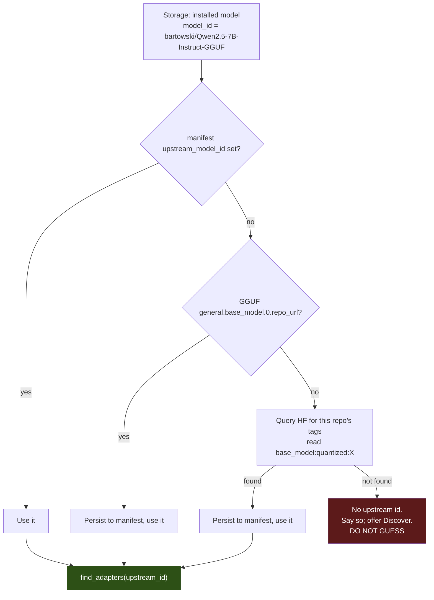
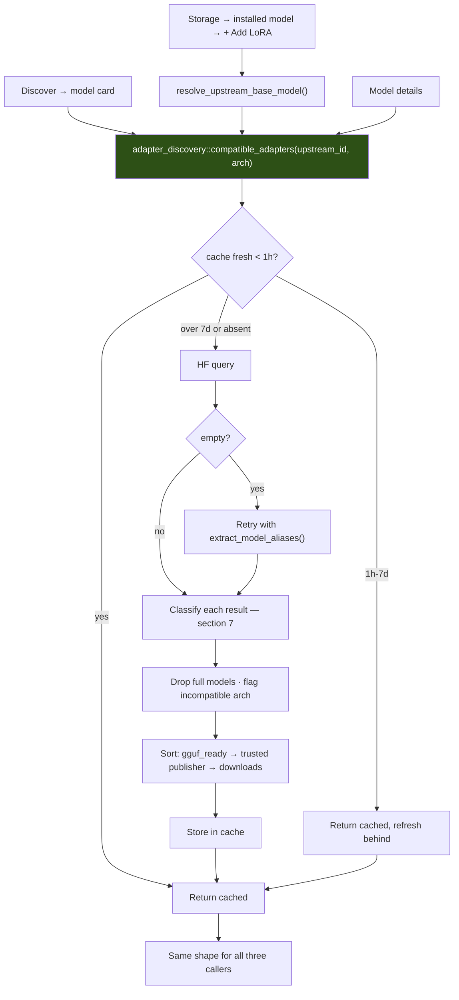
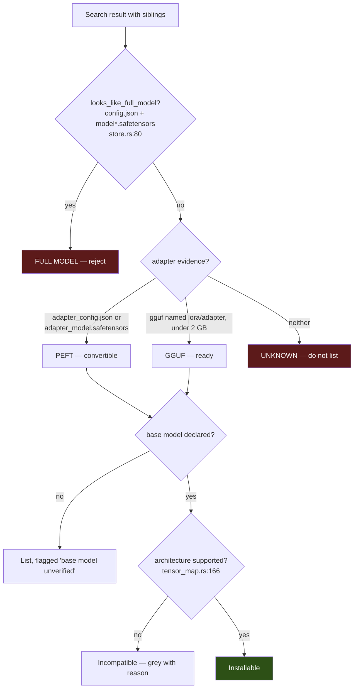
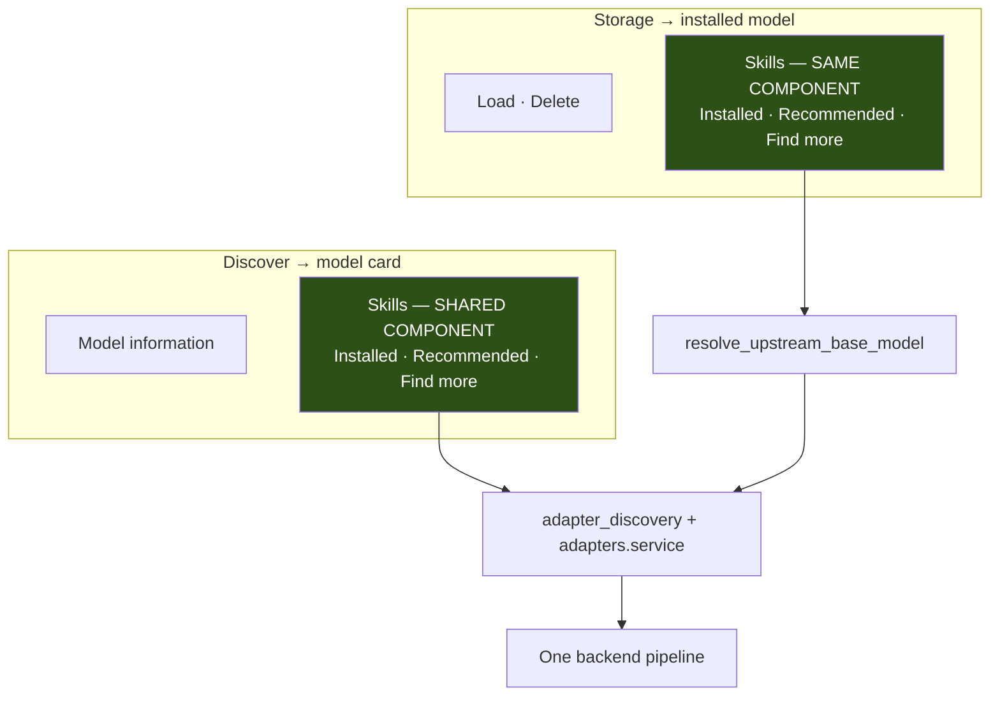
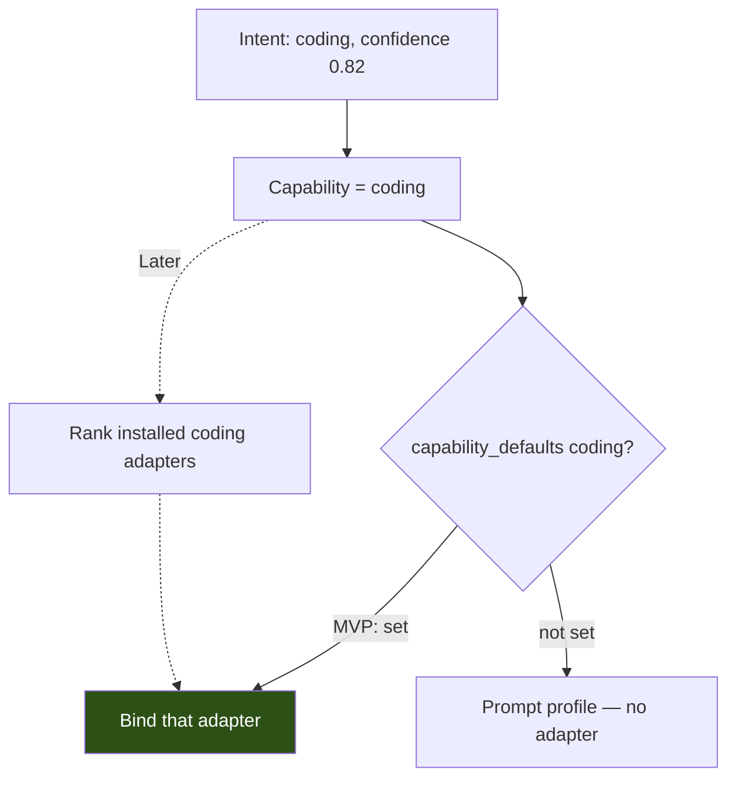
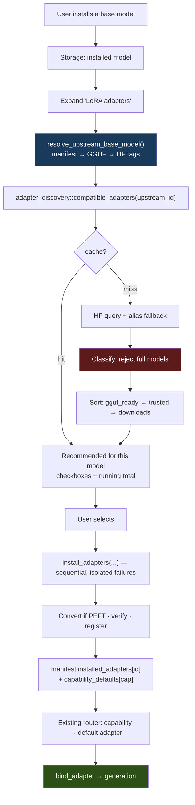
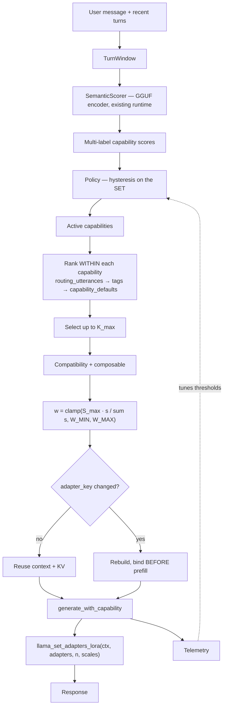
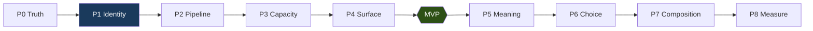

# Sarathi LoRA — Complete Re-Analysis, Architecture and Priority Plan (v2)

**Status:** Research, verification and planning only. No source code modified. **Awaiting approval before implementation.**
**Date:** 2026-08-21
**Supersedes:** `docs/lora-final-architecture-and-priority-plan.md`

This report is **standalone**. It does not require the previous reports to be read.

| Tag | Meaning |
|---|---|
| **[SARATHI]** | Observed in this repository at the cited file and line |
| **[LLAMA.CPP]** | Read in the vendored C++ source Sarathi compiles |
| **[RESEARCH]** | Supported by a paper or published experiment |
| **[INFERENCE]** | My technical conclusion |
| **[PROPOSED]** | A design I recommend |

---

## What Changed Because of the New Storage Requirement

**One finding reorders the entire plan.**

**[SARATHI]** Storage cannot search for compatible LoRAs today, and the reason is
not UI — it is that **Storage does not know which model to search for.**

Adapter discovery queries HuggingFace with
`filter=base_model:adapter:{upstream_model_id}`, where the upstream id is the
*original* model (`Qwen/Qwen2.5-7B-Instruct`). Browse gets this from
`card.baseModel`, read live from HF tags. But an installed model in Storage is
identified by its **GGUF repository** (`bartowski/Qwen2.5-7B-Instruct-GGUF`), and:

```rust
pub struct BaseManifestInfo {
    pub model_id: String,      // ← the GGUF repo, e.g. bartowski/…-GGUF
    pub model_name: String,
    pub quantization: String,
    pub file_path: String,
    pub size_bytes: u64,
    pub checksum: Option<String>,
}                              // ← NO upstream base model field
```

`adapter_manager/mod.rs:18-27`. `InstalledModel`
(`download_manager/traits.rs:62-84`) has the same gap. And `gguf_meta.rs` parses
only `general.architecture`, `general.type`, `general.name`,
`general.parameter_count`, `general.file_type` — **no base-model keys**.

**No adapter author declares a quantization repo as their base model.** So even
with a perfect "Add LoRA" button, Storage would query the wrong id and get zero
results — the exact silent-empty failure this whole effort is trying to remove.

**The requirement is blocked by one missing string, not by missing UI.**

The code even documents the friction. `Storage.tsx:475`, the empty state of an
adapter section that **already exists**:

> *"None installed. Find adapters for this model in Discover."*

That line is the UX problem, written down.

### What changed, precisely

| | |
|---|---|
| **Added** | **A new phase P1 "Identity"** — persist the upstream base model id, and recover it for already-installed models. Nothing in the previous plan covered this, and everything Storage-related depends on it |
| **Moved** | Discovery caching (previously "P2 Reach") is folded into a **shared discovery service** with three entry points, and now comes *before* any UI work — because Storage, Browse and model-details must all call the same function |
| **Reinforced** | "No separate LoRA page" is now *more* right, not less. Storage already has an expandable adapter section; a third surface would make it three inconsistent views |
| **Unchanged** | P0 Truth stays first. The fine-tune bug diagnosis, multi-adapter schema change, default-per-capability MVP, deferring semantic routing / composition / VRAM eviction, and the KV-cache verdict all survive re-verification |
| **Removed** | Nothing substantive |
| **Simplified** | One backend pipeline (`discover → classify → rank → install → register`) serving all three UI entry points, instead of Browse-specific code |

### Previous conclusions, re-verified

| Previous conclusion | Still correct? | Note |
|---|---|---|
| LoRA discovery already runs automatically on model open | ✅ **Yes** | `Browse.tsx:1001` — re-verified |
| Discovery needs caching | ✅ **Yes** | Still uncached; now part of the shared service |
| A separate LoRA page is unnecessary | ✅ **Yes, more so** | Storage already has the section |
| Full fine-tuned models incorrectly appear as LoRAs | ✅ **Yes** | Re-verified at `discovery.rs:502` |
| Multiple LoRAs per capability need a new data model | ✅ **Yes** | `HashMap<capability, Info>` re-verified |
| User-selected default per capability is a good MVP | ✅ **Yes** | Still the only honest answer |
| Semantic routing later | ✅ **Yes** | Supply side must be reliable first |
| Multi-LoRA composition later | ✅ **Yes** | Needs an upstream patch |
| VRAM eviction should wait | ✅ **Yes** | Eviction still frees nothing |

---

## 1. Executive Summary

**Sarathi's LoRA inference engine works.** A GGUF adapter is loaded, bound to a
live llama.cpp context, and applied to every token — verified down to the FFI
call. Every serious gap is on the **supply side**: finding adapters, installing
them, and getting more than one per capability.

Four things block a usable system, in dependency order:

1. **The adapter list shows things that are not adapters.** `is_lora_adapter`
   trusts a bare `lora`/`peft` tag, which merged fine-tunes routinely carry.
2. **Storage does not know its model's upstream identity**, so it cannot search
   for compatible adapters at all.
3. **Only one adapter can exist per capability**, enforced by the manifest schema.
4. **Discovery is uncached and misses adapters** when the upstream id is absent.

None of these needs research, an upstream fork, or a new dependency. All four are
self-contained changes to code that already exists.

**Recommended order: P0 Truth → P1 Identity → P2 Pipeline → P3 Capacity →
P4 Surface. That is the MVP.** Semantic routing, same-capability ranking, and
multi-LoRA composition come after, and become far more valuable once real
adapters are in front of real users.

---

## 2. Current LoRA System

**[SARATHI]** Verified this session.

```
HF discovery       live_catalog::find_adapters (base_model:adapter: filter)
  ↓ capability     capability/assign.rs   (Stated > Suggested; None rather than mis-file)
  ↓ download       commands/adapters.rs:128
  ↓ validate       lora/validator.rs      (Compatible|RequiresConversion|Incompatible|NotPresent)
  ↓ convert        lora/convert/mod.rs:84 (PEFT safetensors → GGUF, pure Rust, no Python)
  ↓ verify         adapter_manager/gguf.rs::verify_is_lora_adapter
  ↓ register       adapter_manager/mod.rs (manifest.adapters, keyed by capability)
  ↓ resolve        capability/resolver.rs:126 (7 checks)
  ↓ load           ai_engine/lora_binding.rs:95   model.lora_adapter_init(path)
  ↓ activate       ai_engine/lora_binding.rs:135  ctx.lora_adapter_set(adapter, scale)
  ↓ apply          llama.cpp/src/llama-graph.cpp:1063  res = ggml_add(res, ggml_scale(B·(A·x), s))
```

**Stack:** `llama-cpp-2` 0.1.153 in-process; no Python, PyTorch, PEFT, or vLLM in
the inference path. Certified reference model:
`Qwen/Qwen2.5-7B-Instruct-GGUF::Q4_K_M`. Hardware here: RTX 5060 Laptop,
**8151 MiB** (`nvidia-smi`, measured).

---

## 3. What Already Works

| Area | Evidence |
|---|---|
| **Adapter binding to a live context** | `lora_binding.rs:128`, no model reload, bind logged in **µs** |
| **PEFT → GGUF conversion, pure Rust** | `lora/convert/` — no Python, no torch, no network; atomic rename |
| **Download / verify / register** | `commands/adapters.rs:128` — size ceiling, cleanup on every failure path |
| **rsLoRA alpha compensation** | `peft_config.rs::effective_alpha` — correct against llama.cpp's fixed `α/r` |
| **Capability assignment from tags** | `capability/assign.rs` — returns `None` rather than mis-filing |
| **Intent classification + hysteresis** | `capability/{classifier,policy}.rs` — enter 0.55, exit 0.35, release after 3 |
| **Degrading resolution** | `resolver.rs` — LoRA → prompt profile → base; never errors |
| **Auto-discovery on model open** | `Browse.tsx:1001` — fires on card open, no click needed |
| **Install adapters after the model** | `adapters.rs` resolves the package independently |
| **Storage adapter section** | `Storage.tsx:459-500` — expandable list, capability assignment, removal |
| **KV-cache correctness on adapter change** | `runtime.rs:935` — more correct than upstream llama-server |
| **Catalog caching pattern** | `catalog_cache.rs` — `FRESH_FOR 1h`, `USABLE_FOR 7d`, load/store/merge |

**[INFERENCE]** This is most of a working system. **Nothing in this plan rewrites
any of it.**

---

## 4. What Is Broken

| # | Problem | Location | Severity |
|---|---|---|---|
| 1 | Full fine-tuned models classified as LoRA adapters | `discovery.rs:502` | **High** |
| 2 | Storage cannot search — no upstream base model id | `adapter_manager/mod.rs:18` | **High** |
| 3 | One adapter per capability, structurally | `adapter_manager/mod.rs` | **High** |
| 4 | Discovery uncached; every model open re-queries HF | `live_catalog.rs:278` | Medium |
| 5 | Discovery misses adapters when `base_model:` tag absent | `Browse.tsx:1006` fallback | Medium |
| 6 | **Badge claims `lora` after a failed bind** | `runtime.rs:964` vs `manager.rs:692` | Medium |
| 7 | `/lora` page is a one-line placeholder | `src/pages/LoRA.tsx` | Low |
| 8 | `lora.service.ts` — 4 empty stubs | — | Low |
| 9 | `lora/traits.rs` — all `Not yet implemented` | — | Low |
| 10 | Legacy `model_intelligence` router live via IPC, never reaches the model | — | Low |
| 11 | Adapter path joined without traversal check | `resolver.rs:159` | Low |
| 12 | Adapter scale not clamped | `resolver.rs:184` | Low |

---

## 5. The Storage UX Problem

### 5.1 What Storage has today **[SARATHI]**

`Storage.tsx` **already** has the section this requirement asks for:

```
Qwen2.5-7B-Instruct                    [Load] [Delete]
  ▸ LoRA adapters                      ← Storage.tsx:462, toggleAdapters()
      None installed. Find adapters for this model in Discover.   ← :475
```

Expanding calls `listInstalledAdapters(m.providerId, m.modelId)` (`:174`), and
each row supports capability assignment (`:214`) and removal (`:234`).

**The UI shell exists. The empty state is the problem — it tells the user to
leave.**

### 5.2 Why a button alone would not work **[SARATHI]**

`InstalledModel` (`download_manager/traits.rs:62-84`) carries `model_id`,
`model_name`, `provider_id`, `quantization`, `format`, `backend`, `file_path`,
`size_bytes`, `installed_at`, `checksum`, `adapters`, `classification`.

**`model_id` is the GGUF repository.** Discovery needs the upstream original.
Adding `[+ Add LoRA]` that passes `m.modelId` would query
`base_model:adapter:bartowski/Qwen2.5-7B-Instruct-GGUF` and return **nothing** —
a new dead end.

### 5.3 Recovering the upstream id — four options **[PROPOSED]**

| Option | Works retroactively? | Network? | Reliability |
|---|---|---|---|
| **A. Persist at download time** | ❌ New installs only | No | **Exact** — Browse already has `card.baseModel` |
| **B. Read `general.base_model.0.repo_url` from the GGUF** | ⚠️ Only if the converter wrote it | No | Exact when present; **Sarathi's parser does not read these keys today** |
| **C. Re-query HF for the installed repo's tags** | ✅ Yes | One request, cacheable | Exact — same `base_model:quantized:` tag Browse uses |
| **D. Strip `-GGUF` and guess** | ✅ Yes | No | **Heuristic — will be wrong sometimes** |

**[PROPOSED] Ship A + C, opportunistically B; never D.**

- **A** makes every future install correct and offline.
- **C** is a one-request backfill for models already installed, cached under the
  same policy as discovery. Resolve once, then persist — so it runs at most once
  per model.
- **B** is free when present; add the two GGUF keys to `gguf_meta.rs` and prefer
  them over C when available.
- **D** would produce silently wrong compatibility judgements. **Do not.**



**Is this the best UX?** **[INFERENCE]** Yes, and it is strictly better than the
brief describes, because **once the id is persisted, Storage, Browse and
model-details all call the identical function with the identical argument.** The
requirement stops being a Storage feature and becomes a property of the system.

**One honest limitation:** if no upstream id can be resolved, Sarathi should say
*"Sarathi could not determine which model this was built from, so it cannot check
adapter compatibility"* and offer Discover — not guess. A wrong base model yields
adapters that install and then fail to bind.

---

## 6. LoRA Discovery

### 6.1 Current behaviour **[SARATHI]**

`Browse.tsx:1001-1020`:

```tsx
// Looked up per model, not with the listing: one request per card would mean
// a hundred extra calls per sweep and would hit the rate limit immediately.
useEffect(() => {
  findModelAdapters(card.baseModel || card.repoId).then(...)
}, [card.repoId, card.baseModel]);
```

→ `commands/catalog.rs:684` → `live_catalog::find_adapters(base, 20, token)`:

```
https://huggingface.co/api/models?filter=base_model:adapter:{base}&sort=downloads&direction=-1&limit={n}&full=true
```

**Discovery already runs automatically on model open.** No click required. The
comment documents a deliberate rate-limit decision worth preserving.

### 6.2 Gaps

1. **No caching** — ten opens is ten identical requests.
2. **`|| card.repoId` fallback** silently queries a `-GGUF` repo id no adapter
   declares, returning zero.
3. **No entry point for an installed model** — §5.
4. **`find_adapters` returns empty if the id lacks a `/`** (`live_catalog.rs:284`)
   — silent, not an error.

### 6.3 One pipeline, three entry points **[PROPOSED]**



**One module, `model_providers/huggingface/adapter_discovery.rs`**, owning
querying, alias fallback, classification, compatibility filtering, ranking and
caching. The three UI entry points differ only in how they obtain the upstream id.

**Caching policy** — mirror `catalog_cache.rs` **[SARATHI]**, which already
implements exactly this:

```rust
pub const FRESH_FOR:  chrono::Duration = chrono::Duration::hours(1);
pub const USABLE_FOR: chrono::Duration = chrono::Duration::days(7);
```

| Question | Answer |
|---|---|
| Where? | On model open (Discover) and on "Add LoRA" (Storage) |
| Cached? | Yes, keyed by upstream base model id |
| Refresh? | < 1 h cached; 1 h–7 d cached + background refresh; > 7 d blocking fetch |
| Stale? | Shown with an age label, exactly as the model catalog does |
| Rate limits? | The cache is the mechanism; per-model, never per-listing |
| "Find more"? | **Explicit refresh, bypasses the cache** — the only forced fetch |

---

## 7. LoRA Classification

**[PROPOSED]** Evidence, not names, and not bare tags:



Post-download, the authoritative check already runs:
`adapter_manager::gguf::verify_is_lora_adapter` reads `general.type == "adapter"`
from the file itself (`adapters.rs:322`). **[INFERENCE]** For a *listing*, the
file list is the strongest evidence obtainable without downloading, and it is
sufficient — the failure mode being fixed always ships `config.json` plus full
weights.

---

## 8. The Fine-Tuned Model Bug

**Re-verified this session. The previous finding stands.** **[SARATHI]**

`discovery.rs:502`:

```rust
pub fn is_lora_adapter(tags: &[String]) -> bool {
    tags.iter().any(|t| {
        t.starts_with("base_model:adapter:")
            || t.eq_ignore_ascii_case("lora")      // ← trusts a bare tag
            || t.eq_ignore_ascii_case("peft")      // ← trusts a bare tag
    })
}
```

**[INFERENCE] Why it misfires:** a model fine-tuned *with* LoRA and released as
**merged weights** routinely keeps `lora` and `peft` tags — PEFT adds them, and
authors rarely strip them after merging. Such a repo is a full model classified as
an adapter.

Two consumers inherit the fault:

- `card.rs:126` → `ModelCategory::LoraAdapter` (Browse category sidebar)
- `card.rs:224` → `ModelKind::LoraAdapter`

The irony: the comment directly above `card.rs:126` reads *"a model merely
**named** 'lora-tuned' is not an adapter"* — they guarded the **name**, then
trusted the **tag**, which is equally weak.

**The asymmetry** **[SARATHI]**: the *download* path already gets this right.
`check_installable` calls `looks_like_full_model` (`store.rs:80`):

```rust
fn looks_like_full_model(filenames: &[String]) -> bool {
    let has_model_config = filenames.iter().any(|f| base(f) == "config.json");
    let has_full_weights = filenames.iter().any(|f| {
        let b = base(f);
        b.starts_with("model-") && b.ends_with(".safetensors")
            || b.starts_with("model.safetensors")
            || b.starts_with("pytorch_model")
    });
    has_model_config && has_full_weights
}
```

**The list lies; the download refuses.**

**[PROPOSED] Smallest reliable fix — three edits, reusing existing code:**

1. `is_lora_adapter_with_files(tags, filenames) -> AdapterEvidence { Confirmed,
   Suggested, FullModel, Unknown }`. Bare tag ⇒ `Suggested`;
   `looks_like_full_model` ⇒ `FullModel`; `adapter_config.json` or a small
   LoRA-named GGUF ⇒ `Confirmed`. Keep the tag-only function for callers without a
   file list, returning `Unknown` rather than `true`.
2. `to_adapter_listing` (`live_catalog.rs:308`) **drops** `FullModel` instead of
   only setting `gguf_ready = false`. It already computes `filenames`.
3. `categorize` (`card.rs:126`) uses the file-aware version — `GgufRepo` carries
   `siblings`.

---

## 9. Installation

**[SARATHI]** Already complete and robust:

- File-list pre-check before any bytes are fetched
- `MAX_ADAPTER_BYTES = 2 GB` ceiling, applied before the body is read
- PEFT → GGUF conversion in pure Rust, atomic temp-file rename
- `verify_is_lora_adapter` post-download
- `target_dir` cleaned on every failure path
- Installs into the package holding the **base model**, not the browsed repo
  (`adapters.rs:196-212`)
- `source.txt` records provenance; `perform_startup_scan` re-registers on launch

**Installing after the base model works today** — no reinstall required. An
adapter installed *before* its base model is refused with *"Download the model
first — an adapter is converted against the model it attaches to."*
(`adapters.rs:290`). That message is correct; leave it.

**[PROPOSED] Only addition — batch install:** `install_adapters(Vec<repo_id>)`,
sequential, **per-item failure isolation**, progress events. One failure must not
abort the rest.

---

## 10. Model ↔ LoRA Compatibility

| Factor | Matters? | Why |
|---|---|---|
| **Base model identity** | **Yes — decisive** | Deltas are relative to specific weights |
| **Architecture family** | **Yes — decisive** | Determines tensor names/layout. `tensor_map.rs:166`: `llama, mistral, qwen2, qwen3, gemma, gemma2, phi3` |
| **Tensor shapes** | **Yes — ground truth** | `llama_adapter_lora_init` errors on mismatch |
| **Model size** | **Yes** | Sets `d_model`, `d_ff`, layer count |
| **Target modules** | **Partly** | `get_weight(w)` returns `nullptr` for untargeted tensors and **skips them** **[LLAMA.CPP]** — extra targets are ignored, not fatal |
| **Rank** | **No** | Read from `b->ne[0]` at runtime; different ranks compose fine |
| **Alpha** | **No** | `get_scale` normalizes it |
| **Tokenizer** | **No, for binding** | LoRA touches weights, not vocabulary |
| **Quantization** | **No** | §10.1 |
| **Adapter format** | **Yes** | GGUF only at runtime; PEFT converted first |

### 10.1 Quantization does not affect compatibility **[LLAMA.CPP]**

Counter-intuitive, so stated plainly. From `build_lora_mm`
(`llama-graph.cpp:1063`):

```cpp
ggml_tensor * res = ggml_mul_mat(ctx0, w, cur);   // w is Q4_K_M — untouched
...
res = ggml_add(ctx0, res, ab_cur);                // f32/f16 correction added
```

The adapter is **never merged into the quantized weights**. It is computed
separately, in higher precision, and added to the *output*. A LoRA trained against
f16 weights applies to a Q4_K_M build of the same model with no shape or format
conflict. **[INFERENCE]** There is a *fidelity* argument — the adapter was trained
against slightly different weights — but not a compatibility one.

---

## 11. LoRA Library / Model UI

**[PROPOSED] No separate LoRA page.** Delete `src/pages/LoRA.tsx` (a one-line
placeholder), its route (`App.tsx:13,40`), and `src/services/lora.service.ts`
(four empty stubs).

**[INFERENCE] Reasons, now stronger than in the previous report:**

1. **Storage already has the section** (`Storage.tsx:459`). A separate page makes
   it three surfaces, not two.
2. **The model page owns the context** — compatibility is a function of the model.
   A standalone page must re-derive or re-select it.
3. **Adapters are not independently meaningful.** One cannot be installed,
   converted, or bound without its base model.

**The one genuine cross-model question** — "I have 6 GB of adapters, what can I
delete?" — is a *storage* question, and `Storage.tsx` answers storage questions.

**[PROPOSED] The same component in both places:**



The only difference: Discover knows the upstream id from HF tags; Storage resolves
it from the manifest (§5.3). **One React component, one service, one backend.**

---

## 12. Multiple LoRAs per Capability

**The blocker** **[SARATHI]** — `adapter_manager/mod.rs`:

```rust
pub adapters: HashMap<String, AdapterManifestInfo>,   // keyed by CAPABILITY
```

`adapters.service.ts` states the consequence: *"Only one adapter can be bound per
capability, so assigning a slot another adapter already holds displaces that
one."* `Storage.tsx:211` repeats it.

**[PROPOSED] Schema change:**

```rust
pub struct ModelPackageManifest {
    /// Installed adapters, keyed by adapter id (directory name).
    #[serde(default)]
    pub installed_adapters: HashMap<String, AdapterRecord>,

    /// Which adapter is active for each capability. The router binds these.
    #[serde(default)]
    pub capability_defaults: HashMap<String, String>,   // capability -> adapter id

    /// Legacy. Read on load, migrated, then dropped.
    #[serde(default, skip_serializing_if = "HashMap::is_empty")]
    pub adapters: HashMap<String, AdapterManifestInfo>,
}
```

**Migration must be lossless** **[INFERENCE]**: on read, if `adapters` is non-empty
and `installed_adapters` is empty, move each entry across and set
`capability_defaults[capability] = adapter_id`. Behaviour identical for every
existing install. `adapter_manager/mod.rs` already documents the rule — *"a schema
addition must never orphan an installed model."*

### 12.1 The requirement this creates

**[INFERENCE]** Today the router resolves *capability → the one adapter in that
slot*. With four coding adapters, **which one does "coding" mean?** The question
could not previously be asked.

| Option | Complexity | Phase |
|---|---|---|
| **A. User picks a default per capability** | **Trivial** — one map lookup | **MVP** |
| **B. Rank by name/tag evidence** | Moderate — reuses `assign.rs` | Later |
| **C. Semantic sub-selection via `routing_utterances`** | High — needs embeddings | Later |

**Ship A in the MVP.** It is honest, instantly debuggable, and it is the fallback
for B and C anyway. Without it, Part 5 of the brief makes the system strictly
worse: four adapters installed, no defined behaviour.



---

## 13. Recommended LoRA Set

**Re-evaluated. My answer: option D as the label, option C as the mechanism.**
**[PROPOSED]**

**[INFERENCE] Why not "Best":** there are **no per-adapter benchmarks**. The
signals available are weak:

| Signal | Value | Problem |
|---|---|---|
| Downloads | ⚠️ Weak | `curation.rs` says it itself: *"sorted by download count — which favours whatever went viral"* **[SARATHI]** |
| Likes | ⚠️ Weak | Smaller sample, same bias |
| Recency | ⚠️ Weak | Newer ≠ better |
| Size | ❌ Not quality | Rank is a training choice |
| Community ratings | ❌ Do not exist | The Hub has no adapter rating system |
| **GGUF-ready** | ✅ **Strong** | Installs without conversion — verifiable |
| **Base-model exactness** | ✅ **Strong** | Declares *this* model |
| **Trusted publisher** | ✅ **Moderate** | `curation.rs:111` already exists |
| **Has `adapter_config.json`** | ✅ **Strong** | Evidence it is a real LoRA |

```
Qwen2.5-7B-Instruct  ·  Skills

Installed (2)
  qwen-coder-lora     Coding ▾  · 161 MB · default for Coding    [Remove]
  qwen-math-lora      Mathematics ▾ · 161 MB · default            [Remove]

Recommended for this model (5)                        [Find more]
  ☑ org/python-specialist   ✅ ready · 12k · apache-2.0 · 161 MB
  ☑ org/qwen-reasoning      ✅ ready · 8k  · mit        · 161 MB
  ☐ org/cpp-helper          ⟳ converts on install · 3k · 161 MB
  ☐ org/debug-lora          ⟳ converts on install · 900 · 80 MB

                              [Install selected (2) · 322 MB]
```

**[INFERENCE]** "Recommended **for this model**" is defensible because the claim
is *compatibility*, which Sarathi can verify — not *quality*, which it cannot.
Pre-ticking the top GGUF-ready adapter per capability gives the one-click outcome
without asserting a ranking Sarathi cannot back.

**How many?** **[INFERENCE]** Pre-tick **at most one per capability, and only
GGUF-ready ones**. At ~161 MB each, 2-per-capability × 5 capabilities is
**~1.6 GB** of unverified adapters whose *interaction* is also unmeasured (§19).
Show the running total; let the user add more.

**Curated catalog? No.** It goes stale, needs review, and becomes a support burden
the moment a recommendation is bad. Revisit only if telemetry shows users cannot
choose well.

---

## 14. Adapter Metadata

**[PROPOSED]** Minimum that earns its place:

| Field | Status | Justification |
|---|---|---|
| `id`, `repo_id`, `name` | ✅ Exists | Identity, provenance, display |
| `base_model` | ✅ Exists (adapter side) | The compatibility key |
| `architecture` | ✅ Exists | Second compatibility gate |
| `file_path`, `size_bytes`, `checksum` | ✅ Exists | Binding, accounting, corruption |
| `status`, `adapter_runtime_status` | ✅ Exists | Bindability |
| `assignment_confidence` | ✅ Exists | Stops a guess being shown as fact |
| `rank`, `alpha` | ✅ Exists — **diagnostics and VRAM only** | **Must not enter weight calculation** — §18 |
| `target_modules` | ⚠️ Advisory | Cannot gate compatibility |
| **`capabilities: Vec<String>`** | **Add** | An adapter may serve several; the map key cannot express it |
| **`composable: bool`** | **Add** | Opt-out for adapters that interfere |
| **`routing_utterances: Vec<String>`** | **Add (later)** | Same-capability selection — §16 |
| `specialization` | ⚠️ **Merge into `capabilities`** | A separate axis doubles the taxonomy for no routing benefit |
| `version` | ❌ Drop | The checksum identifies the artifact |
| `recommendation score` | ❌ Drop | Compute at display time; never store stale |

**And one on the base model side** **[PROPOSED]**:

```rust
pub struct BaseManifestInfo {
    ...
    /// The original model this GGUF was built from, e.g. `Qwen/Qwen2.5-7B-Instruct`.
    /// Adapters declare THIS, not the quantization repo. Required for discovery
    /// from Storage. `None` means it could not be determined — never guessed.
    #[serde(default, skip_serializing_if = "Option::is_none")]
    pub upstream_model_id: Option<String>,
}
```

**This single field is what unblocks the entire Storage requirement.**

---

## 15. Semantic Routing

**[INFERENCE]** The lexical classifier's real failure is structural: it scores
**zero** on unseen vocabulary. *"Make this run faster on large inputs"* matches
nothing in any of the five keyword tables. Semantic routing fixes exactly this.

**But it is not MVP-critical** — for clear requests the lexical router works, and
`eval.rs` asserts ≥85% on 64 cases.

| Option | Verdict |
|---|---|
| Keyword (today) | Floor. Works for clear requests |
| **Embedding similarity** | ✅ **Recommended** — `llama-cpp-2` already exposes `embeddings_seq_ith` and pooling types (`context.rs:148-200`) **[SARATHI]**, so **zero new dependencies**; ~5–20 ms; explainable; no training |
| Small trained classifier | Later, if embeddings prove insufficient |
| LLM classifier | ❌ **Rejected** — 300–2000 ms *and* contends for the single generation thread |

**A trap that would silently break the swap** **[INFERENCE]**:
`EVIDENCE_SATURATION = 1.5` is calibrated to lexical weights where one `CLEAR`
signal is 2.0. Feed it cosine similarities in `[0,1]` and confidence caps near
0.38 — **permanently below the 0.55 enter threshold, so routing stops firing
entirely.** Requires a separate named constant plus a test asserting a known
coding prompt still clears `ENTER`.

---

## 16. Same-Capability Adapter Selection

Given `Coding: {Python, C++, Debugging, General}` and *"Fix this Python error"*:

**[PROPOSED]** Three tiers, shipped in order:

| Tier | Mechanism | Evidence source |
|---|---|---|
| **1 (MVP)** | `capability_defaults["coding"]` | User's explicit choice |
| **2** | Name and tag matching — reuse `assign.rs`'s `stated_skills`/`suggested_skills` | Author's tags > repo name |
| **3** | Cosine similarity against each adapter's `routing_utterances` | Adapter-supplied examples |

**[INFERENCE]** Tier 3 is the honest answer to "how can it know which adapter
specializes in what": **it cannot, unless the adapter says so.** A repo named
`python-lora` is a hint; `routing_utterances: ["fix this Python traceback", "why
does my pip install fail"]` is a statement. Prefer stated over inferred, exactly
as `capability/assign.rs` already does for capability slots.

**Always fall back to the default** when scores tie or evidence is absent. Never
guess between four adapters on a coin flip.

---

## 17. Multiple LoRAs Simultaneously

**Re-verified this session.**

**[LLAMA.CPP]** `llama.cpp/include/llama.h:682`, in the vendored tree Sarathi
compiles:

```c
// Set LoRa adapters on the context. Will only modify if the adapters
// currently in context are different.
LLAMA_API int32_t llama_set_adapters_lora(
        struct llama_context * ctx,
        struct llama_adapter_lora ** adapters,
        size_t n_adapters,            // unbounded
        float * scales);              // per-adapter
```

A zero scale **excludes** the adapter from the graph entirely
(`llama-context.cpp:1218`) — loaded but costing no compute.

**[SARATHI]** `llama-cpp-2` `context.rs:334` hardcodes `n = 1`:

```rust
let mut adapters = [adapter.lora_adapter.as_ptr()];
let mut scales   = [scale];
llama_set_adapters_lora(self.context.as_ptr(), adapters.as_mut_ptr(), 1, scales.as_mut_ptr())
```

Because the C call **replaces** the set, calling it twice evicts the first.
`LlamaLoraAdapter.lora_adapter` is `pub(crate)` (`model.rs:38`), so the pointer
cannot be reached around it. **0.1.154, the current latest, is unchanged.**

**Smallest clean change** **[PROPOSED]** — one method:

```rust
pub fn set_lora_adapters(&self, adapters: &mut [(&mut LlamaLoraAdapter, f32)])
    -> Result<(), LlamaLoraAdapterSetError>
```

Upstream PR preferred; `[patch.crates-io]` fork meanwhile. The same patch should
expose `llama_adapter_lora_free`, closing the leak documented at
`lora_binding.rs:12-22`. **Do not redesign the inference engine** — `bind_adapter`
becomes `bind_adapters`, `adapter_key` becomes an ordered `Vec`.

---

## 18. Weight Calculation

**[LLAMA.CPP]** Verified formula, from `llama-graph.cpp:1063` and
`llama-adapter.h:53`:

```
h = W x + Σᵢ  sᵢ · (αᵢ / rᵢ) · Bᵢ (Aᵢ x)

get_scale(alpha, adapter_scale) = alpha ? adapter_scale * alpha / rank : adapter_scale
```

**[INFERENCE]** Since PEFT *trains* with `α/r` applied, **`s = 1.0` reproduces
training-time behaviour for any rank and alpha.** `s` is a *fraction of trained
strength*. Therefore **rank and alpha must not enter the router's arithmetic** —
doing so squares the correction.

**Confidence is not strength.** The decisive case: the same coding request phrased
tersely scores 0.62, phrased explicitly 0.95. Under `scale = confidence` the
*identical task* gets 0.62× vs 0.95× adapter strength — behaviour driven by
phrasing, not content.

**[PROPOSED]**

```
w_c = clamp( S_max · s_c / Σ_{k∈C} s_k ,  W_MIN,  W_MAX )
```

```
Coding 0.80, Debugging 0.70  →  Σ = 1.50
w_coding    = 1.0 × 0.80/1.50 = 0.533
w_debugging = 1.0 × 0.70/1.50 = 0.467      Σ = 1.000 ✓
```

| Parameter | Default | Provenance |
|---|---|---|
| `S_max` (total budget) | 1.0 | **[RESEARCH]** [arXiv:2507.17075](https://arxiv.org/pdf/2507.17075) — utility degrades above 1.0; 0.5–1.0 safe |
| `W_MAX` | 1.0 | Same |
| `W_MIN` | 0.15 | **[INFERENCE]** below this an adapter costs a full re-prefill for ~nothing |
| `K_max` | 3 | **[INFERENCE]** a tunable, not a finding |

**Should weights sum to 1? No — bounded: `Σw ≤ S_max`.** Forcing equality pins a
lone adapter to full strength with no gentler option, and lets a weak third intent
steal budget from a strong first.

---

## 19. LoRA Interference

**[INFERENCE]** Safe in that nothing can crash or corrupt the model — the base
weights are read-only (§10.1). **Not** safe in the sense of guaranteed quality.

| Risk | Safeguard |
|---|---|
| **Scale explosion** | `Σw ≤ S_max` — the primary safeguard |
| **Sign conflict** | Not resolvable at runtime (TIES/DARE need materialized deltas). Bounded by the budget |
| **Same target modules** | All Sarathi-converted adapters hit `q/k/v/o/gate/up/down` (`tensor_map.rs:126`) — they *always* overlap. Accepted as normal |
| **Rank / alpha differences** | Not a problem — never summed as matrices; `get_scale` normalizes |
| **Conflicting objectives** | Only detectable by evaluation; `composable = false` opt-out |

**[RESEARCH]** MergeRepair ([arXiv:2408.09568](https://arxiv.org/abs/2408.09568))
merged task-specific adapters in code LLMs and found the *order and weight* of
merged adapters matter significantly — evidence composition helps *and* that naive
equal weighting is not automatically right.

**[INFERENCE] A caution on the brief's example.** *"Debug this C++ memory issue"
→ C++ Specialist + Debugging Specialist* composes **two adapters from the same
capability** — the most likely combination to interfere (same domain, same target
modules, overlapping objectives). **When composition lands, prefer one adapter per
capability and compose *across* capabilities.** Same-capability composition should
be opt-in and measured.

---

## 20. Switching

**[SARATHI]** Already implemented in `capability/policy.rs`: `enter 0.55`,
`exit 0.35`, `max_unsupported_turns 3`, manual override wins, `validate()` rejects
an inverted band. A Schmitt trigger, and correct.

**[PROPOSED]** One addition when composition lands: hysteresis on the **set**, not
just the top capability — otherwise the state space grows from 6 to 2⁵. Score
reordering alone must never rebuild, and weights must be frozen while the set is
held (because a weight change also invalidates the cache — §21).

---

## 21. KV Cache

**[LLAMA.CPP]** `set_adapters_lora` (`llama-context.cpp:1210`) rebuilds the
`loras` map and sets `sched_need_reserve`. **It never touches the KV cache.** That
is an upstream bug — llama.cpp issue
[#26207](https://github.com/ggml-org/llama.cpp/issues/26207), *"prompt cache is
reused across requests with different per-request `lora` — output silently
contaminated by the previous adapter"* — still open.

**[SARATHI]** `runtime.rs:935` keys the session on `adapter_key`, including
`scale.to_bits()`. **Sarathi implements the fix #26207 asks for.**

| Transition | Cache |
|---|---|
| Base → A | Rebuild |
| A → B | Rebuild |
| **A → A+B** | **Rebuild — not cheaper than a swap** |
| A+B → B | Rebuild |
| A → A, different scale | Rebuild |
| A → A, same scale | **Reuse — safe and free** |

**Is it the dominant cost? Yes, by one to two orders of magnitude.** **[INFERENCE]**
Classification is ms, binding µs, composition single-digit percent; re-prefill at
4k context is **4–10 s (estimated)**. **The only way to minimise rebuilds is to
reduce switch frequency** — which hysteresis already does. No mechanism change
needed.

---

## 22. VRAM / Adapter Cache

**[SARATHI]** `lora_binding.rs:12-22` documents the blocker:

> *"`LlamaLoraAdapter` has no `Drop` implementation in `llama-cpp-2` 0.1.153 and
> its inner pointer is `pub(crate)`, so `llama_adapter_lora_free` cannot be called
> from outside the crate."*

**[INFERENCE] Therefore eviction frees nothing.** An LRU cache today would add
bookkeeping, force re-initialization on next use, and reclaim **zero bytes**.
Building one would be a fake eviction system — exactly what the brief says not to
do.

**[PROPOSED] What is realistic now:** preload installed compatible adapters on
model load, capped by `vram_planner`'s existing arithmetic, and **warn rather than
evict**.

**[COMPUTED]** Qwen2.5-7B, `r=16`, seven projections, f32 (Sarathi's converter
widens bf16→f32): **≈ 161 MB per adapter**.

```
Total VRAM                       8151 MiB   MEASURED
− OS reserve (900 MB)            − 900
− compute overhead (12%)         − 870
= ~6381 MiB usable

base Q4_K_M            4400
+ KV @ 8k               900   = 5300
+ 3 adapters @ 161      483   = 5783  ✅ comfortable
+ 5 adapters @ 161      805   = 6105  ⚠️ thin
+ 5 adapters @ r=32    1615   = 6915  ❌ over budget
```

---

## 23. User Controls

| Control | MVP? | Why |
|---|---|---|
| Install adapter | ✅ | Core |
| Remove adapter | ✅ | Core — 161 MB each |
| **Set default per capability** | ✅ | **Required by §12** |
| Automatic routing on/off | ✅ | One toggle; `"none"` already forces base |
| View installed | ✅ | Falls out of the model page |
| Manual single selection | ⚠️ Later | `manual_capability` exists in the backend |
| Manual multi-selection | ❌ Later | Needs composition |
| Strength slider | ❌ Later | Meaningless without composition |

**Manual override beats automatic routing, unconditionally** (`policy.rs:147`
already does). But `W_MAX`, `S_max`, and compatibility checks still apply — those
are safety invariants, not preferences.

---

## 24. MVP Architecture



---

## 25. Advanced Architecture



---

## 26. Previous Plan vs New Plan

| Previous | New | Why |
|---|---|---|
| P0 Truth | **P0 Truth** | Unchanged — still first, still no dependencies |
| — | **P1 Identity** ⭐ NEW | Storage cannot search without the upstream model id |
| P2 Reach (caching) | **P2 Pipeline** | Caching folded into a shared service with three entry points |
| P1 Capacity | **P3 Capacity** | Moves after the pipeline — the UI must render many adapters |
| P3 Surface (Browse only) | **P4 Surface** (Storage + Browse, one component) | The new requirement makes Storage a first-class entry point |
| P4 Meaning | P5 Meaning | Unchanged |
| P5 Choice | P6 Choice | Unchanged |
| P6 Composition | P7 Composition | Unchanged |
| P7 Measure | P8 Measure | Unchanged |

**The substantive change is P1, and the reframing of P2 from "add a cache" to
"build one pipeline three surfaces share."**

---

## 27. New Priority Checklist



### P0 — Truth

- **Goal:** The adapter list only ever shows real adapters; remove code that lies.
- **Why now:** No dependencies, and every later phase surfaces adapter lists. Fixing classification after building UI means re-testing the UI.
- **Files:** `discovery.rs:502` · `live_catalog.rs:308` · `card.rs:126,224` · `runtime.rs:964` + `manager.rs:692` · **delete** `lora/traits.rs`, `model_intelligence/{intent,adapter_router}.rs`, `src/services/lora.service.ts`, `src/pages/LoRA.tsx`, route at `App.tsx:13,40`, `route_prompt_capability` from `lib.rs`
- **Changes:** `is_lora_adapter_with_files() -> AdapterEvidence`; listing drops full models; badge corrected on bind failure; `PromptIntent` moves into `capability/`
- **Tests:** `lora` tag + `config.json` + `model-*.safetensors` → **rejected** · `adapter_config.json` → confirmed · small LoRA-named GGUF → confirmed · bare `peft` tag, no files → Unknown, not listed · failed bind emits `backend: "base"`
- **Dependencies:** None
- **Not included:** Schema changes, discovery changes, UI
- **Result:** No fine-tuned models in adapter lists; the badge stops lying

### P1 — Identity ⭐ NEW

- **Goal:** Every installed model knows the upstream model it was built from.
- **Why now:** **Storage cannot search without it**, and P2's service signature depends on it. Doing this after P2 means changing the service.
- **Files:** `adapter_manager/mod.rs` (`BaseManifestInfo.upstream_model_id`) · `commands/adapters.rs` (persist at install) · `commands/download.rs` (persist at model install) · `ai_engine/gguf_meta.rs` (read `general.base_model.0.repo_url` if present) · new `resolve_upstream.rs`
- **Changes:** New optional field; resolver tries manifest → GGUF → HF tag lookup (cached); **never guesses**; persists once resolved
- **Tests:** A model installed with a known `base_model:quantized:` tag records the upstream id · an old manifest without the field resolves via HF and persists · **an unresolvable model returns `None`, never a stripped-`-GGUF` guess** · a second resolve issues no network call
- **Dependencies:** P0
- **Not included:** Any UI; any discovery change
- **Result:** `resolve_upstream_base_model(package)` returns the correct id for new and existing installs

### P2 — Pipeline

- **Goal:** One discovery service, cached, with alias fallback, serving all callers.
- **Why now:** Three surfaces are about to need it. Building it once prevents three implementations.
- **Files:** new `model_providers/huggingface/adapter_discovery.rs` · new `adapter_cache.rs` (modelled on `catalog_cache.rs`) · `live_catalog.rs:278` · `commands/catalog.rs:684`
- **Changes:** `compatible_adapters(upstream_id, architecture) -> AdapterPage` — query, alias fallback via `extract_model_aliases` (`adapter_provider.rs:112`), classify (P0), filter, rank, cache
- **Tests:** No `base_model:` tag → alias fallback still finds adapters · second call within 1 h issues **zero** HTTP · 3-day-old cache serves immediately and refreshes behind · "Find more" bypasses cache · full models absent from results
- **Dependencies:** P0, P1
- **Not included:** Install changes; UI
- **Result:** One function any caller can use with an upstream id

### P3 — Capacity

- **Goal:** Many adapters per capability, one active default.
- **Why now:** P4's UI must render this. Building the UI first means rebuilding it.
- **Files:** `adapter_manager/mod.rs` (schema + migration) · `store.rs:213` · `commands/adapters.rs` · `capability/resolver.rs:131`
- **Changes:** `installed_adapters` + `capability_defaults`; `migrate_legacy_adapters()`; `set_capability_default()`; resolver reads the default
- **Tests:** **A pre-migration `manifest.json` loads and binds identically** · two coding adapters coexist · setting a default displaces only the default, not the install · removing the default clears the slot rather than orphaning it
- **Dependencies:** P0
- **Not included:** Ranking within a capability; binding more than one
- **Result:** Four coding adapters installable; exactly one bound

### P4 — Surface → **MVP complete**

- **Goal:** The same Skills component in Storage and Discover, both on the shared pipeline.
- **Why now:** Everything it needs exists. This is the phase the user actually sees.
- **Files:** new `src/components/SkillsSection.tsx` · `src/pages/Storage.tsx:459-500` · `src/pages/Browse.tsx:1001` · `src/services/adapters.service.ts` · `commands/adapters.rs` (`install_adapters` batch)
- **Changes:** Shared component (Installed / Recommended / Find more); checkbox multi-select with running total; per-capability default control; batch install with **per-item failure isolation**; Storage's empty state replaced with `[+ Add LoRA]`
- **Tests:** Storage "Add LoRA" passes the **upstream** id, not `model_id` · install 3, one fails → other 2 register · total size correct before install · default toggle round-trips · unresolvable upstream id shows an explanation, not an empty list
- **Dependencies:** P1, P2, P3
- **Not included:** Strength sliders, multi-select for inference, semantic routing
- **Result:** **Install a model → open Storage → Add LoRA → install several → one per capability is used**

### P5 — Meaning

- **Goal:** Routing understands paraphrase and short follow-ups.
- **Files:** new `capability/{embedding,context,utterances}.rs` · `classifier.rs` · `eval.rs`
- **Tests:** ≥90% on ≥300 cases · **calibration curve** · `regression_api_no_longer_hijacks_coding_prompts` passes · **a test that a known coding prompt clears `ENTER`** (guards the saturation trap)
- **Dependencies:** MVP shipped and used
- **Not included:** Multi-label output

### P6 — Choice

- **Goal:** With four coding adapters, pick the right one automatically.
- **Files:** `capability/resolver.rs` · `adapter_manager/mod.rs` (`routing_utterances`)
- **Tests:** "fix this Python error" prefers the Python adapter · **falls back to `capability_defaults` on ties**
- **Dependencies:** P3, P5

### P7 — Composition

- **Goal:** Two or three adapters with calculated weights.
- **Files:** `llama-cpp-2` fork/PR · `Cargo.toml` · `lora_binding.rs` · `capability/{composer,profile,policy}.rs` · `runtime.rs`
- **Tests:** Two adapters, distinct scales · `Σw ≤ S_max` · `W_MIN` drop · **single adapter still `w = 1.0`** · **unpatched binding degrades to top-1** · A→B→A distinct outputs (guards #26207)
- **Dependencies:** P5, P6, upstream patch
- **Not included:** Same-capability composition by default

### P8 — Measure

- **Goal:** Replace guessed constants with data.
- **Files:** new `capability/telemetry.rs` · `vram_planner.rs` · `scheduler.rs`
- **Tests:** Switch rate, prefill tokens discarded, weight sweep, `S_max` sweep

---

## 28. Simplified Implementation Strategy

**Stabilise these in P0–P3 and never change them again:**

| Interface | Fixed at | Why |
|---|---|---|
| `AdapterEvidence` enum | P0 | Classification result shape |
| `upstream_model_id` field | P1 | Optional and additive |
| `compatible_adapters()` signature | P2 | All three surfaces bind to it |
| `AdapterRecord` | P3 | Every later field is `serde(default)` |
| `capability_defaults` map | P3 | P6 *overrides*; never replaces |
| `CapabilityBackend` enum | P0 | P7 *adds a variant* |
| `capability:changed` payload | P0 | Additive only |

**Shared infrastructure — one implementation, three callers:**

| Concern | Module |
|---|---|
| Discover → model LoRAs | `adapter_discovery::compatible_adapters` |
| Storage → Add LoRA | same, after `resolve_upstream_base_model` |
| Model details → LoRA list | same |
| Compatibility | `adapter_discovery` classification + `resolver.rs` bind checks |
| Registry | `adapter_manager` manifest |
| Installation | `commands/adapters.rs::install_adapters` |

**Mock first:** P6's ranking starts as a `capability_defaults` lookup; P7's
composer returns one adapter at `w = 1.0`. Both make call sites real before the
logic is.

**Feature-flag:** semantic routing (P5), composition (P7), gateway routing
(`apply_capabilities`, already flagged). Each defaults **off**, falling back to the
previous phase.

**Tests before implementation:** the P3 migration test, the P0 rejection tests, and
the P5 saturation guard. These three are where silent breakage hides.

**Measure before tuning:** every threshold is a guess until P8. Keep them as
constants in one place; do not tune in P5–P7.

**Never touch:** `lora/convert/`, the download/verify pipeline,
`adapter_manager/state_machine.rs`, the KV-cache keying at `runtime.rs:935`,
`vram_planner.rs` (until P8).

---

## 29. Testing Plan

**Storage (P1/P4)** — Add LoRA from an installed model passes the **upstream** id ·
no global search required · a model with no resolvable upstream id explains rather
than showing an empty list · adapters appear under the model after install.

**Discovery (P0/P2)** — compatible adapters found · full model with `lora` tag
rejected · merged-GGUF adapter repo rejected · incompatible architecture greyed
with a reason · alias fallback works when the exact id misses · cache hit issues no
HTTP · "Find more" forces a fetch.

**Installation (P4)** — download · validation · conversion · registration · batch
with one failure isolates it · failed conversion removes `target_dir` · adapter
before base model gives the "download the model first" message.

**Same-capability (P3/P6)** — four coding adapters coexist · two reasoning adapters
coexist · default binds · changing the default rebinds · removing the default
clears the slot · P6: "fix this Python error" prefers the Python adapter.

**Routing (P5)** — one intent · multiple intents · ambiguous → low confidence, no
switch · short follow-up with the turn window · switching does not thrash ·
**`api` does not hijack a coding prompt**.

**Multi-LoRA (P7)** — 1/2/3 adapters with correct scales · `Σw ≤ S_max` ·
incompatible combination refused · VRAM cap reduces `K_max`.

**Regression (every phase)** — **zero adapters ⇒ output identical to today** ·
single adapter ⇒ `w = 1.0` · automatic routing disabled ⇒ base · manual selection
overrides · failed adapter binding ⇒ base with an honest badge ·
`ui_thread_stays_free.rs` passes ·
`a_failed_request_never_looks_like_an_empty_answer.rs` passes.

---

## 30. Risks

| Risk | Severity | Mitigation |
|---|---|---|
| **P1 resolver guesses a wrong upstream id** | **High** | **Never strip `-GGUF`.** Return `None` and say so. A wrong base yields adapters that install then fail to bind |
| **P3 migration orphans an installed model** | **High** | Migration test first; keep `adapters` as a read-only legacy field for one release |
| **P5 saturation constant silently disables routing** | **High** | Separate named constant + a test asserting a known prompt clears `ENTER` |
| **P7 KV-cache reuse across adapter configs** | **High** | #26207's failure mode. A→B→A test asserting distinct outputs |
| HF rate limiting during P2 development | Medium | Cache first, then wire callers; use a token |
| `llama-cpp-2` fork maintenance | Medium | Keep the patch minimal; upstream it |
| Composition degrades output for some pairs | Medium | `composable = false`; P8 weight sweep |
| Users install 2 GB of adapters | Low | Running total; pre-tick at most one per capability |
| VRAM exhaustion | Low | Preload cap from `vram_planner`; warn, do not evict |

---

## 31. Exact File Mapping

| File | Current role | Change | Phase |
|---|---|---|---|
| `model_providers/huggingface/discovery.rs:502` | `is_lora_adapter` — tag-only | Add file-aware variant returning `AdapterEvidence` | P0 |
| `model_providers/huggingface/live_catalog.rs:308` | `to_adapter_listing` | Drop full models, not just flag them | P0 |
| `model_providers/huggingface/card.rs:126,224` | `categorize`, `model_kind` | Use the file-aware classifier | P0 |
| `ai_engine/runtime.rs:964` + `manager.rs:692` | Bind failure logged only | Emit corrected `capability:changed` | P0 |
| `src/pages/LoRA.tsx`, `App.tsx:13,40`, `services/lora.service.ts`, `lora/traits.rs`, `model_intelligence/{intent,adapter_router}.rs` | Dead / placeholder | **Delete** | P0 |
| `adapter_manager/mod.rs:18` | `BaseManifestInfo` | **Add `upstream_model_id: Option<String>`** | P1 |
| `ai_engine/gguf_meta.rs` | Reads 5 `general.*` keys | Also read `general.base_model.0.repo_url` when present | P1 |
| new `model_providers/huggingface/resolve_upstream.rs` | — | manifest → GGUF → HF tags; never guess | P1 |
| `commands/download.rs`, `commands/adapters.rs` | Install paths | Persist the upstream id | P1 |
| new `model_providers/huggingface/adapter_discovery.rs` | — | `compatible_adapters(upstream_id, arch)` | P2 |
| new `model_providers/huggingface/adapter_cache.rs` | — | Mirror `catalog_cache.rs` policy | P2 |
| `commands/catalog.rs:684` | `find_model_adapters` | Delegate to the service | P2 |
| `adapter_manager/mod.rs` | `adapters: HashMap<capability, …>` | `installed_adapters` + `capability_defaults` + migration | P3 |
| `adapter_manager/store.rs:213` | `list_installed` | Return many per capability | P3 |
| `capability/resolver.rs:131` | Reads `adapters[capability]` | Read `capability_defaults` → `installed_adapters` | P3 |
| new `src/components/SkillsSection.tsx` | — | Shared Installed / Recommended / Find more | P4 |
| `src/pages/Storage.tsx:459-500` | Adapter list, "find in Discover" | Use `SkillsSection`; add `[+ Add LoRA]` | P4 |
| `src/pages/Browse.tsx:1001` | Inline adapter list | Use `SkillsSection` | P4 |
| `commands/adapters.rs` | `download_adapter` (one) | Add `install_adapters(Vec<_>)` batch | P4 |
| `capability/{embedding,context,utterances}.rs` | — | **NEW** semantic routing | P5 |
| `capability/composer.rs`, `lora_binding.rs`, `Cargo.toml` | — | Composition + fork | P7 |
| `capability/telemetry.rs` | — | **NEW** | P8 |

---

## 32. Final Recommendation

**Build P0 → P1 → P2 → P3 → P4. Stop. Use it. Then decide whether P5–P7 are worth
building.**

**[INFERENCE]** The inference engine already works — a LoRA is genuinely loaded,
bound, and applied per token. Every serious gap is on the supply side, and the new
Storage requirement exposes the deepest one: **Sarathi does not record which model
an installed GGUF was built from**, so it cannot find compatible adapters for the
models a user actually has.

That single missing field is why the requirement felt like a UI problem and is not.
Fix it, and Storage, Discover, and model-details all become the same feature with
three doors.

**What I would change about the brief, one line each:**

- **Part 3 (discovery)** — already automatic in Discover; the work is a *shared,
  cached service*, not new discovery.
- **Part 6 (recommended set)** — label it "Recommended **for this model**":
  compatibility is verifiable, quality is not. Pre-tick at most one per capability.
- **Part 7 (one-click set)** — keep, but cap the default selection; 2-per-capability
  is ~1.6 GB.
- **Part 15 (VRAM eviction)** — cannot work; adapter handles cannot be freed.
  Preload and cap instead.
- **Part 5 (multi-per-capability)** — needs one thing the brief does not name:
  **which adapter a capability uses**. Ship a user-chosen default first.
- **Part 10 (same-capability selection)** — an adapter's *name* is a hint; only
  author-supplied `routing_utterances` are a statement. Prefer stated over inferred.

**And one thing I got wrong before, corrected:** the previous plan put UI work at
P3 with no way for Storage to participate. The Storage requirement is not a late
addition to that plan — it revealed a missing foundation.

---

## 33. Sources

**Sarathi source read this session:** `adapter_manager/{mod,store,state_machine,gguf}.rs` ·
`ai_engine/{manager,runtime,lora_binding,gguf_meta,vram_planner,scheduler}.rs` ·
`capability/{mod,classifier,policy,resolver,profile,assign,eval}.rs` · `lora/convert/*`, `lora/validator.rs` ·
`commands/{adapters,adapter,catalog,download,inference,intelligence}.rs` ·
`model_providers/huggingface/{discovery,live_catalog,card,curation,catalog_cache,adapter_provider}.rs` ·
`download_manager/traits.rs` · `src/pages/{Storage,Browse,LoRA}.tsx` ·
`src/services/{adapters,catalog,lora}.service.ts` · `src/App.tsx`

**llama.cpp, vendored tree Sarathi compiles** (`llama-cpp-sys-2-0.1.153/llama.cpp/`):
`include/llama.h:682` · `src/llama-adapter.h:53` · `src/llama-graph.cpp:1063` · `src/llama-context.cpp:1210`

**Upstream:** [llama.cpp #26207](https://github.com/ggml-org/llama.cpp/issues/26207) ·
[llama.cpp server README](https://github.com/ggml-org/llama.cpp/blob/master/tools/server/README.md) ·
[docs.rs llama-cpp-2 0.1.154](https://docs.rs/llama-cpp-2/0.1.154/llama_cpp_2/context/struct.LlamaContext.html)

**Research:** [LoraHub (arXiv:2307.13269)](https://arxiv.org/pdf/2307.13269) ·
[MergeRepair (arXiv:2408.09568)](https://arxiv.org/abs/2408.09568) ·
[LoRA safety alignment (arXiv:2507.17075)](https://arxiv.org/pdf/2507.17075)

**Measured:** `nvidia-smi` — RTX 5060 Laptop, 8151 MiB.

---

## 34. Note on the Working Tree

`git status` shows three modified files — `commands/catalog.rs`,
`model_providers/huggingface/card.rs`, `src/pages/Browse.tsx` — carrying
**quantization label quality notes** (`FP16`/`FP32`/`MXFP4`/`TQ` handling).
Unrelated to adapters. But P0 touches `card.rs`, P2 touches `catalog.rs`, and P4
touches `Browse.tsx`, so **commit or stash this work before starting P0** to keep
the diffs reviewable.
