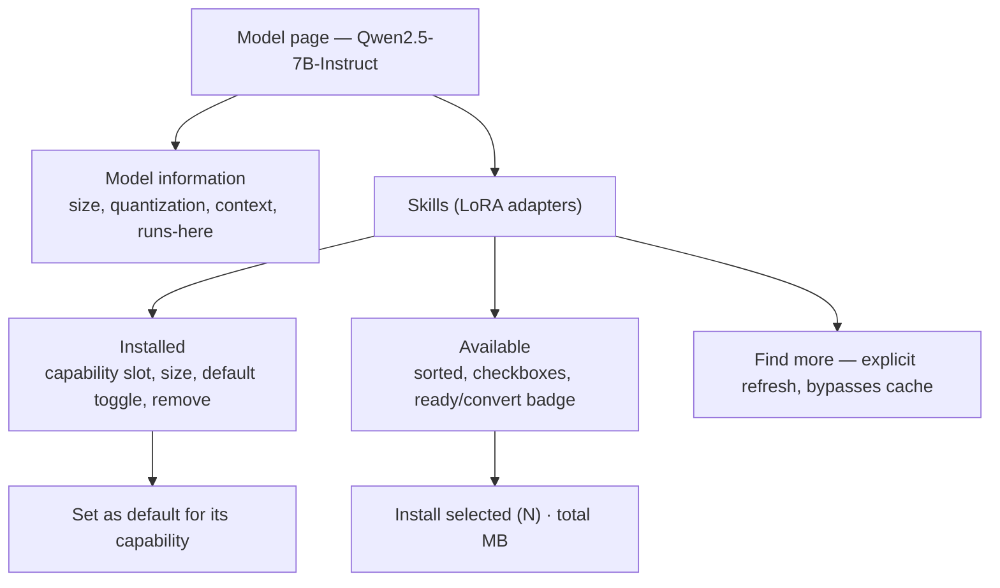
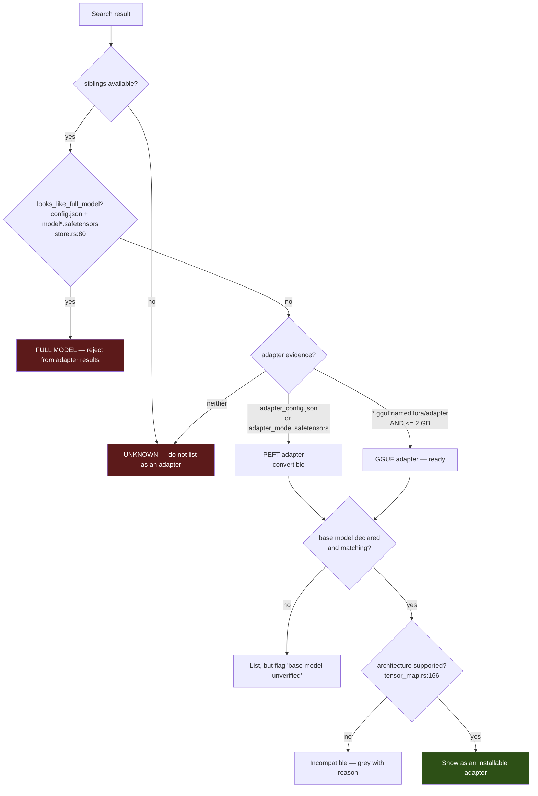
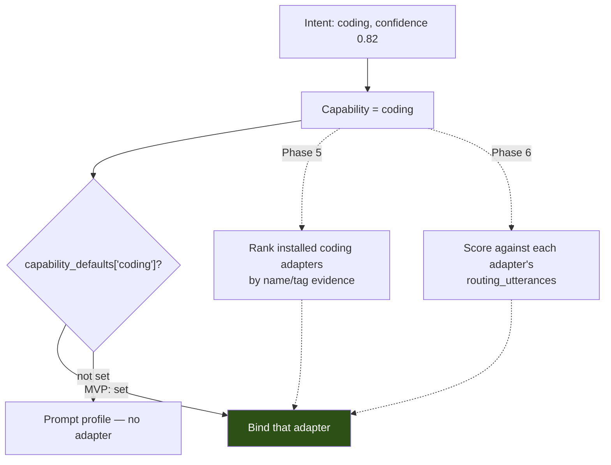
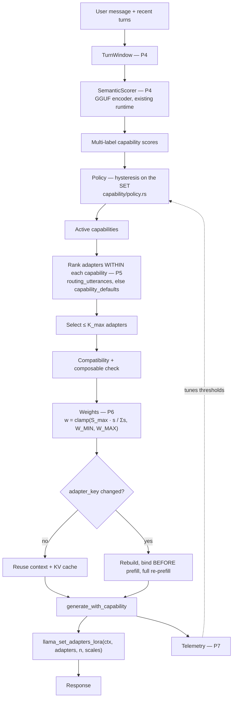

# Sarathi LoRA — Final Architecture Review and Implementation Priority Plan

**Status:** Review and planning only. No source code modified. **Awaiting approval before implementation.**
**Date:** 2026-08-21

**Series position — the fifth and final review pass:**

| Document | Question answered |
|---|---|
| `docs/architecture/peft-lora-integration.md` | Can PEFT be the runtime switching layer? **No** |
| `docs/superpowers/specs/2026-08-10-lora-end-to-end-design.md` | How does one adapter get from HF to a bound context? |
| `docs/lora-routing-investigation.md` (r1) | Which routing mechanism? |
| `docs/lora-multi-adapter-design.md` (r2) | Composition mathematics and weights |
| `docs/lora-system-verification-and-library-design.md` (r3) | Is it actually used? Why is the library empty? |
| **This document (r4)** | **Requirement review, final architecture, priority plan** |

| Tag | Meaning |
|---|---|
| **[SARATHI]** | Observed in this repository at the cited file and line |
| **[LLAMA.CPP]** | Read in the vendored C++ source Sarathi compiles |
| **[RESEARCH]** | Supported by a paper or published experiment |
| **[INFERENCE]** | My technical conclusion |
| **[PROPOSED]** | A design I recommend |

---

## 1. The Headline

Three things to know before reading anything else.

**1. Two of your requirements are already built.** Part 2 (auto-discovery before
the user clicks Get) is implemented at `Browse.tsx:1001`. Part 4 (install
adapters any time after the model) works today. Building them again would be
waste; what they actually need is *caching*, which is a much smaller job.

**2. I was wrong in round 3, and you are right about the UI.** I recommended
building `/lora` into a real library page. Your Part 3 says keep adapters on the
model page. **Your instinct is better** — the model page already has the model's
identity, its compatibility context, and the install button. A separate page
duplicates all three and immediately drifts. **Delete `LoRA.tsx` and its route;
do not build it out.** Reasoning in §4.3.

**3. Part 6 is the real work, and it creates a problem you haven't named.**
Allowing four coding adapters is a schema change — but the moment you have four,
**the router has no way to choose between them.** Today's router maps
*capability → one adapter* because the manifest is
`HashMap<capability, AdapterManifestInfo>`. Break that and you need a second
selection step that does not exist. The MVP needs a trivial answer (a user-chosen
default per capability); the smart answer is Phase 5. Detail in §4.6.

**The single most valuable thing to ship first** is none of these. It is the
Part 5 bug fix — roughly a dozen lines, no dependencies, and it stops the adapter
list showing things that are not adapters.

---

## 2. Part 1 — Current System, Re-verified

### 2.1 Is LoRA actually applied? **Yes, when one is installed and assigned.**

| Question | Answer | Location |
|---|---|---|
| Loaded | `model.lora_adapter_init(path)`, cached by absolute path | `ai_engine/lora_binding.rs:95` |
| Activated | `ctx.lora_adapter_set(adapter, scale)`, before any decode | `ai_engine/lora_binding.rs:135` |
| Modifies computation | `res = ggml_add(res, ggml_scale(B·(A·x), s))` per adapted matmul, per token | `llama.cpp/src/llama-graph.cpp:1063` **[LLAMA.CPP]** |
| Decision made | `prepare_capability_turn` | `ai_engine/manager.rs:648` |

**Conditions that must all hold** **[SARATHI]**:

1. `self.active_package()` is `Some` — `manager.rs:662`
2. A `user`-role message exists — `manager.rs:670`
3. Resolution is not `Base` — `manager.rs:695`
4. Seven resolver checks pass — `capability/resolver.rs:126-186` (registered,
   `Installed`, runtime status ok, file recorded, `.gguf`, on disk, GGUF magic)

Any failure degrades to a **prompt profile** (system directive + sampling
overrides), then to base. It never errors.

### 2.2 Status of every part

| Area | Status | Where |
|---|---|---|
| Adapter binding to a live context | ✅ **Working** | `lora_binding.rs` |
| PEFT safetensors → GGUF conversion, pure Rust | ✅ **Working** | `lora/convert/` |
| Download, verify, register | ✅ **Working** | `commands/adapters.rs:128` |
| Adapter validation | ✅ **Working** | `lora/validator.rs`, `adapter_manager/gguf.rs` |
| Capability assignment from tags | ✅ **Working** | `capability/assign.rs` |
| Intent classification + hysteresis | ✅ **Working** (lexical) | `capability/{classifier,policy}.rs` |
| Degrading resolution | ✅ **Working** | `capability/resolver.rs` |
| Auto-discovery on model open | ✅ **Working** | `Browse.tsx:1001` |
| Install after model install | ✅ **Working** | §4.4 |
| Adapter list caching | ❌ **Missing** | — |
| Full models rejected from *listings* | ❌ **BROKEN** | `discovery.rs:502` — §4.5 |
| Multiple adapters per capability | ❌ **Blocked by schema** | `adapter_manager/mod.rs` |
| Semantic (non-keyword) routing | ❌ **Missing** | — |
| Multiple simultaneous adapters | ❌ **Blocked by Rust binding** | `llama-cpp-2` `context.rs:334` |
| `/lora` page | ⚠️ **One-line placeholder** | `src/pages/LoRA.tsx` |
| `lora.service.ts` | ⚠️ **4 empty stubs** | — |
| `lora/traits.rs` | ⚠️ **All `Not yet implemented`** | — |
| Legacy `model_intelligence` router | ⚠️ **Live via IPC, never reaches the model** | — |

### 2.3 Reusable — this is most of the system

**[INFERENCE]** The download → convert → verify → register → bind pipeline is
complete, well-tested, and correct. **Nothing in this plan rewrites it.** Every
phase below either adds beside it or changes one field in a struct it already
writes.

---

## 3. Requirement Review

| # | Requirement | Good idea? | Verdict | Better alternative | Reason |
|---|---|---|---|---|---|
| **2** | Auto-discover LoRAs on model open | ✅ Yes | **Already built** | **Add caching instead** | `Browse.tsx:1001` already does this on card open. Every open re-queries HF; that is the actual problem |
| **3** | No separate LoRA page | ✅ **Strongly yes** | **Keep — and delete the stub** | None | Model page already owns identity, compatibility, install. **This reverses my round-3 recommendation** |
| **4** | Install adapters any time after the model | ✅ Yes | **Already works** | None | Verified §4.4 |
| **5** | Reject full models from LoRA results | ✅ **Critical** | **Keep — fix first** | Reuse existing `looks_like_full_model` | Real bug, precisely located, ~12 lines |
| **6** | Multiple adapters per capability | ✅ Yes | **Keep — the main work** | None, but see §4.6 | Needs a schema change *and* a new selection step you haven't specified |
| **7** | Curated "Recommended LoRA Set" | ⚠️ **Partly** | **Simplify heavily** | **Transparent sorted list + multi-select. No curated ranking** | "Best" cannot be determined reliably from Hub metadata; curation implies an authority Sarathi cannot back |
| **8** | One-click install of a selected set | ✅ Yes | **Keep, simplified** | Sequential loop with per-item failure isolation | The per-adapter path exists; this is a loop and a progress list |
| **9** | Adapter storage + metadata | ✅ Yes | **Keep, trim fields** | Extend the existing manifest; no new store | 8 of your 17 fields already exist; several others aren't worth their maintenance |
| **10** | Semantic intent routing | ✅ Yes | **Keep — much later** | Embedding similarity via the existing runtime | Not MVP-critical. The lexical router works for clear requests |
| **11** | Automatic adapter selection | ✅ Yes | **Split in two** | MVP: user-chosen default per capability. Later: semantic sub-selection | §4.6 — Part 6 creates this need |
| **12** | Multiple LoRAs simultaneously | ✅ Yes | **Keep — but last** | Upstream PR or `[patch.crates-io]` fork | Verified possible; smallest clean change in §4.12 |
| **13** | Multi-LoRA weighting | ✅ Yes | **Keep — design settled** | `w = clamp(S_max · s_c / Σs, W_MIN, W_MAX)` | Derived in r2 §12 |
| **14** | Interference safeguards | ✅ Yes | **Keep, minimal** | Budget bound + `composable` flag | Cannot be solved at runtime; only bounded |
| **15** | Smart switching / hysteresis | ✅ Yes | **Already built** | Extend to *sets* when composition lands | `policy.rs` has enter/exit/release today |
| **16** | KV cache behaviour | ✅ Yes | **Already correct** | Do not change it | Sarathi is more correct than upstream llama-server here |
| **17** | LRU adapter cache + VRAM eviction | ⚠️ **No** | **Defer — premature** | Preload all installed; revisit if VRAM binds | **Eviction frees nothing today** — no `Drop` in `llama-cpp-2`. §4.17 |
| **18** | User controls | ✅ Yes | **Trim to four** | install / remove / default per capability / auto-routing toggle | Strength sliders and manual multi-select are Phase 6 |

**Three requirements I push back on:** #7 (over-engineered), #17 (premature —
actively cannot work yet), and #10/#11 (correct, but sequenced far too early
relative to #5 and #6).

---

## 4. Requirement Detail

### 4.1 Part 2 — Discovery: already automatic; add caching

**[SARATHI]** `Browse.tsx:1001-1020`:

```tsx
// Looked up per model, not with the listing: one request per card would mean
// a hundred extra calls per sweep and would hit the rate limit immediately.
useEffect(() => {
  ...
  findModelAdapters(card.baseModel || card.repoId).then(...)
}, [card.repoId, card.baseModel]);
```

Discovery fires when the card opens. **The requirement is met.** The comment also
documents why it is per-model rather than per-listing — a deliberate rate-limit
decision worth preserving.

**The real gaps** **[INFERENCE]**:

1. **No caching.** Every open re-queries HuggingFace.
2. **Alias-fallback gap** (r3, cause 4): if the repo carries no `base_model:` tag,
   the query falls back to a `…-GGUF` repo id **no adapter author declares as a
   base**, and silently returns zero.

**[PROPOSED] Reuse the caching pattern that already exists.**
`model_providers/huggingface/catalog_cache.rs` implements this two-tier model
**[SARATHI]**:

```rust
pub const FRESH_FOR:  chrono::Duration = chrono::Duration::hours(1);
pub const USABLE_FOR: chrono::Duration = chrono::Duration::days(7);
```

with `load`, `store`, `merge`, `clear`, and age/freshness computation. Mirror it:

| Question | Answer |
|---|---|
| Where does discovery happen? | On model-page open — unchanged |
| Background? | No. On-demand with a cache is simpler and enough |
| Cached? | **Yes** — keyed by upstream base model id |
| Refresh? | < 1 h serve cached; 1 h–7 d serve cached and refresh behind; > 7 d or absent, block |
| Stale results? | Shown immediately with an age label, exactly as the model catalog does |
| Avoid repeat queries? | The cache is the mechanism |
| "Find more"? | **Yes — explicit refresh that bypasses the cache.** The only way to force a fetch |

### 4.2 Part 7 — Recommended set: keep the idea, drop the curation

**[INFERENCE]** "Best Coding LoRA" implies Sarathi knows which is best. From Hub
metadata it does not, and your listed signals are weak:

| Signal | Value | Problem |
|---|---|---|
| Downloads | ⚠️ Weak | Favours what went viral. `curation.rs` says exactly this: *"sorted by download count — which favours whatever went viral"* **[SARATHI]** |
| Likes | ⚠️ Weak | Same, smaller sample |
| Recency | ⚠️ Weak | A week-old adapter is not better than a mature one |
| Size | ❌ Not quality | Rank is a training choice |
| Community ratings | ❌ Do not exist | The Hub has no adapter rating system |
| **Quality benchmarks** | ❌ **Do not exist for adapters** | No public per-adapter eval |
| **GGUF-ready** | ✅ **Strong** | Installs without conversion — verifiable |
| **Base-model exactness** | ✅ **Strong** | Declares *this* model, not a family sibling |
| **Trusted publisher** | ✅ **Moderate** | `curation.rs:111` `is_trusted_publisher` already exists |
| **Has `adapter_config.json`** | ✅ **Strong** | Evidence it is a real LoRA |

**[PROPOSED] Replace "Recommended Set" with "Compatible adapters, sorted, with
checkboxes."**

```
Qwen2.5-7B-Instruct  ·  Skills

Installed (2)
  ☑ qwen-coder-lora        Coding · 161 MB · active for Coding
  ☑ qwen-math-lora         Mathematics · 161 MB

Available (7)                                        [Find more]
  ☐ org/python-specialist   ✅ ready · 12k downloads · apache-2.0 · 161 MB
  ☐ org/cpp-helper          ⟳ needs conversion · 3k downloads · 161 MB
  ☐ org/debug-lora          ⟳ needs conversion · 900 downloads · 80 MB

                                        [Install selected (3) · 402 MB]
```

Why this is better **[INFERENCE]**:

- **No implied authority.** Sarathi shows evidence; the user decides. It cannot
  be wrong about "best" because it never claims one.
- **Same one-click outcome.** Select-all is one click, satisfying Part 8.
- **Total size shown before commitment** — what actually matters at 80–320 MB each.
- **Sorting is transparent and cheap**: GGUF-ready, then trusted publisher, then
  downloads. Every input is already fetched by `find_adapters`.

**How many to install?** **[INFERENCE]** Do not default to ten. At ~161 MB each,
2 per capability × 5 capabilities is **~1.6 GB** for adapters whose quality is
unverified and whose *interaction* is unmeasured (r2 §14). Show the list; let the
user pick; show the total.

**Curated ranking, local or catalog? Neither, initially.** A curated adapter
catalog is a maintenance commitment — it goes stale, needs review, and becomes a
support burden the moment a recommendation is bad. Revisit only if telemetry
shows users cannot choose well.

### 4.3 Part 3 — No separate LoRA page: agreed, and I was wrong

**[PROPOSED] Delete `src/pages/LoRA.tsx` and its route** (`App.tsx:13`, `:40`),
plus `src/services/lora.service.ts`.

In round 3 I recommended building `/lora` into a real library page. **That was
the wrong call.** Reasons:

1. **The model page already has the context.** Compatibility is a function of the
   selected model (r3 §3). A standalone page must re-derive or re-select it.
2. **Adapters are not independently meaningful.** An adapter without its base
   model cannot be installed, converted, or bound. Listing them apart presents
   them as more free-standing than they are.
3. **Two surfaces drift.** `Storage.tsx` already shows installed adapters; a
   third guarantees three inconsistent views.

**The one thing a cross-model view is genuinely good for** — "I have 6 GB of
adapters, what can I delete?" — is a *storage* question, and `Storage.tsx`
already answers storage questions.



### 4.4 Part 4 — Install after the model: already supported **[SARATHI]**

- `download_adapter(provider_id, model_id, adapter_repo_id)` resolves the package
  independently — no model reinstall.
- It resolves the *base model's* package rather than the browsed one
  (`adapters.rs:196-212`), so an adapter published against `Qwen/Qwen2.5-…`
  installs into the package holding `bartowski/…-GGUF`.
- `register_adapter` writes into the existing `manifest.json`; the base model
  entry is untouched.
- `perform_startup_scan` (`adapter_manager/mod.rs:372`) re-registers on launch.

**No change required.** An adapter installed *before* its base model cannot be
converted (`adapters.rs:290`, *"Download the model first"*) — that message is
correct; leave it.

### 4.5 Part 5 — The bug: verified, located, small

**[SARATHI]** Root cause, `discovery.rs:502`:

```rust
pub fn is_lora_adapter(tags: &[String]) -> bool {
    tags.iter().any(|t| {
        t.starts_with("base_model:adapter:")
            || t.eq_ignore_ascii_case("lora")      // ← trusts a bare tag
            || t.eq_ignore_ascii_case("peft")      // ← trusts a bare tag
    })
}
```

**Why it misfires** **[INFERENCE]**: a model fine-tuned *with* LoRA and released
as **merged weights** routinely keeps `lora` and `peft` tags — PEFT adds them, and
authors rarely strip them after merging. Such a repo is a **full model**
classified as an adapter.

Consumed at two places, both inheriting the fault:

- `card.rs:126` → `ModelCategory::LoraAdapter` (the Browse category sidebar)
- `card.rs:224` → `ModelKind::LoraAdapter`

The irony: the comment immediately above `card.rs:126` says *"a model merely
**named** 'lora-tuned' is not an adapter"* — they guarded the **name** and then
trusted the **tag**, which is just as weak.

**The asymmetry that makes this a listing bug, not an install bug** **[SARATHI]**:
the *download* path gets it right. `check_installable` calls `looks_like_full_model`
(`store.rs:80`), which checks **file evidence**:

```rust
fn looks_like_full_model(filenames: &[String]) -> bool {
    let has_model_config = filenames.iter().any(|f| base(f) == "config.json");
    let has_full_weights = filenames.iter().any(|f| {
        let b = base(f);
        b.starts_with("model-") && b.ends_with(".safetensors")
            || b.starts_with("model.safetensors")
            || b.starts_with("pytorch_model")
    });
    has_model_config && has_full_weights
}
```

**So the list lies and the download refuses.** Files are ground truth; tags are not.

**[PROPOSED] Evidence-based classification, reusing what exists:**



Three concrete changes:

1. **`is_lora_adapter` takes file evidence.** Add
   `is_lora_adapter_with_files(tags, filenames) -> AdapterEvidence`: a bare
   `lora`/`peft` tag is *suggestive*; `looks_like_full_model` is *disqualifying*;
   `adapter_config.json` or a small LoRA-named GGUF is *confirming*. Keep the
   tag-only function for callers without a file list, returning `Unknown` rather
   than `true`.
2. **`to_adapter_listing` (`live_catalog.rs:308`) drops full models** instead of
   only setting `gguf_ready = false`. It already computes `filenames`.
3. **`categorize` (`card.rs:126`) uses the file-aware version** — `GgufRepo`
   carries `siblings`.

**A more reliable method?** **[INFERENCE]** Yes, and Sarathi has it — but it needs
the file downloaded: `adapter_manager::gguf::verify_is_lora_adapter` reads what
the GGUF *declares itself to be* (`general.type == "adapter"`), and already runs
post-install (`adapters.rs:322`). For a *listing*, the file list is the strongest
evidence available without downloading, and it suffices — the failure mode is a
merged model, which always ships `config.json` + full weights.

### 4.6 Part 6 — Multiple adapters per capability: the real work, plus a hidden requirement

**The blocker** **[SARATHI]** — `adapter_manager/mod.rs`:

```rust
pub struct ModelPackageManifest {
    pub adapters: HashMap<String, AdapterManifestInfo>,   // keyed by CAPABILITY
}
```

`adapters.service.ts` states the consequence: *"Only one adapter can be bound per
capability, so assigning a slot another adapter already holds displaces that one."*

**[PROPOSED] Schema change:**

```rust
pub struct ModelPackageManifest {
    /// Installed adapters, keyed by adapter id (directory name).
    #[serde(default)]
    pub installed_adapters: HashMap<String, AdapterRecord>,

    /// Which adapter is active for each capability. The router binds these.
    #[serde(default)]
    pub capability_defaults: HashMap<String, String>,   // capability -> adapter id

    /// Legacy. Read on load, migrated into the two fields above, then dropped.
    #[serde(default, skip_serializing_if = "HashMap::is_empty")]
    pub adapters: HashMap<String, AdapterManifestInfo>,
}
```

**Migration is one function and must be lossless** **[INFERENCE]**: on read, if
`adapters` is non-empty and `installed_adapters` is empty, move each entry across
and set `capability_defaults[capability] = adapter_id`. Behaviour is identical for
every existing install. `adapter_manager/mod.rs` already documents this rule —
*"a schema addition must never orphan an installed model."*

#### The hidden requirement your brief does not state

**[INFERENCE]** Today the router resolves *capability → the one adapter in that
slot*. With four coding adapters, **which one does "coding" mean?** The capability
layer has no answer, because the question could not previously be asked.

| Option | Complexity | When |
|---|---|---|
| **A. User picks a default per capability** | **Trivial** — one map lookup | **MVP** |
| **B. Score adapters within a capability by name/tags** | Moderate — reuses `assign.rs` evidence | Phase 5 |
| **C. Semantic sub-selection via `routing_utterances`** | High — needs the embedding router | Phase 6 |

**[PROPOSED] Ship A in the MVP.** It is honest (the user chose), instantly
debuggable, and it is the *fallback* for B and C anyway. Without A, Part 6 makes
the system strictly worse: four adapters installed and no defined behaviour.



**Is the architecture good?** **[INFERENCE]** Yes — capability as a *grouping*
with many members and one active default is the right shape. It degrades cleanly,
extends to smarter selection without another schema change, and keeps the
router's contract stable.

**One caution on your example.** `"Debug this C++ memory issue." → C++ Specialist
+ Debugging Specialist` composes **two adapters from the same capability**. That
is the *most* likely combination to interfere: same domain, same target modules,
overlapping objectives (r2 §14). **[PROPOSED]** When composition lands, prefer
**one adapter per capability** and compose *across* capabilities. Same-capability
composition should be opt-in and measured, not the default.

### 4.7 Part 9 — Storage and metadata: trim the list

Keep the per-package layout — it works and keeps an adapter physically beside the
model it attaches to.

```
<app_data>/models/<provider>/<model>/
├── base/                      model GGUF
├── adapters/
│   ├── org__python-lora/
│   │   ├── adapter.gguf
│   │   └── source.txt
│   └── org__cpp-lora/
└── manifest.json              installed_adapters + capability_defaults
```

| Field | Verdict | Note |
|---|---|---|
| name, base model, file path, size, format | ✅ Keep | Already present |
| capability | ✅ Keep, **now a list** | `capabilities: Vec<String>` |
| source | ✅ Keep | Already `source.txt` + manifest |
| rank, alpha | ✅ Keep — **diagnostics and VRAM only** | **Must not enter weight calculation** — `get_scale` already applies `α/r` **[LLAMA.CPP]** |
| target modules | ⚠️ Keep, advisory | Cannot gate compatibility |
| compatibility | ✅ Keep as `architecture` | Derived at conversion |
| installation state | ✅ Keep | Existing state machine |
| specialization | ⚠️ **Merge into `capabilities`** | A separate axis doubles the taxonomy for no routing benefit |
| **version** | ❌ **Drop** | The checksum identifies the artifact |
| **recommendation score** | ❌ **Drop** | §4.2 — compute at display time from live data, never store stale |
| composition supported | ✅ Keep as `composable: bool` | Cheap opt-out |

**Net: two new fields** (`capabilities` as a list, `composable`), one merged
concept, two dropped.

### 4.8 Parts 10–11 — Routing: right, but sequence it later

**[INFERENCE]** The lexical classifier's real failure is structural: it scores
**zero** on unseen vocabulary. *"Make this run faster on large inputs"* matches
nothing in any of the five keyword tables. Semantic routing fixes exactly this.

But it is **not MVP-critical** — for clear requests the lexical router works, and
`eval.rs` asserts ≥85% on 64 cases.

**[PROPOSED]** Embedding similarity via the existing runtime. `llama-cpp-2`
already exposes `embeddings_seq_ith` and pooling types (`context.rs:148-200`)
**[SARATHI]**, so a GGUF encoder adds **zero new dependencies**.

| Option | Verdict |
|---|---|
| Keyword (today) | Floor. Works for clear requests |
| **Embedding similarity** | ✅ **Recommended** — explainable, offline, ~5–20 ms, no training |
| Small trained classifier | Later, if embeddings prove insufficient |
| LLM-based | ❌ **Rejected** — 300–2000 ms *and* contends for the single generation thread |

**A trap that would silently break the swap** **[INFERENCE]**:
`EVIDENCE_SATURATION = 1.5` is calibrated to lexical weights where one `CLEAR`
signal is 2.0. Feed it cosine similarities in `[0,1]` and confidence caps near
0.38 — **permanently below the 0.55 enter threshold, so routing stops firing
entirely.** Needs a separate named constant (~0.35) plus a test asserting a known
coding prompt still clears `ENTER`.

### 4.9 Parts 13–14 — Weights and interference: settled in round 2

**Confidence is not scale.** **[INFERENCE]** The same coding request phrased
tersely scores 0.62, phrased explicitly 0.95. Under `scale = confidence`, the
*identical task* gets 0.62× vs 0.95× adapter strength — behaviour driven by
phrasing, not content.

**The formula, verified from source** **[LLAMA.CPP]**:

```
h = W x + Σᵢ  sᵢ · (αᵢ / rᵢ) · Bᵢ (Aᵢ x)
```

`get_scale` (`llama-adapter.h:53`) is `adapter_scale * alpha / rank`. Since PEFT
*trains* with `α/r` applied, **`s = 1.0` reproduces training-time behaviour for
any rank and alpha** — so **rank and alpha must not enter the router's
arithmetic**; doing so squares the correction.

```
Coding 0.80, Debugging 0.70  →  Σ = 1.50
w_coding    = 1.0 × 0.80/1.50 = 0.533
w_debugging = 1.0 × 0.70/1.50 = 0.467
                                Σ = 1.000 ✓
```

**Should weights sum to 1? No — bounded: `Σw ≤ S_max`, default 1.0.** Forcing
equality pins a lone adapter to full strength with no gentler option.

**Interference:** cannot be resolved at runtime (TIES/DARE need materialized
deltas). *Bounded* by the budget and `W_MAX = 1.0`; *avoided* per-pair via
`composable = false`. **[RESEARCH]** MergeRepair
([arXiv:2408.09568](https://arxiv.org/abs/2408.09568)) found order and weight of
merged adapters matter significantly — evidence composition helps *and* that
naive equal weighting is not automatically right.

### 4.10 Part 15 — Switching: already built

**[SARATHI]** `capability/policy.rs`: `enter 0.55`, `exit 0.35`,
`max_unsupported_turns 3`, manual override wins, `validate()` rejects an inverted
band. A Schmitt trigger, and correct.

**[PROPOSED]** One addition when composition lands: apply hysteresis to the
**set**, not just the top capability — otherwise the state space grows from 6 to
2⁵ and thrashing risk grows with it. Score reordering alone must never rebuild.

### 4.11 Part 16 — KV cache: verified, do not touch

**[LLAMA.CPP]** `set_adapters_lora` (`llama-context.cpp:1210`) rebuilds the
`loras` map and sets `sched_need_reserve`. **It never touches the KV cache.**
That is an upstream bug — llama.cpp issue
[#26207](https://github.com/ggml-org/llama.cpp/issues/26207) — still open.

**[SARATHI]** `runtime.rs:935` keys the session on `adapter_key`, which includes
`scale.to_bits()`. **Sarathi implements the fix #26207 asks for.**

| Transition | Cache |
|---|---|
| no LoRA → A | Rebuild |
| A → B | Rebuild |
| **A → A+B** | **Rebuild — not cheaper than a swap** |
| A+B → B | Rebuild |
| A → A, different scale | Rebuild |
| A → A, same scale | **Reuse — safe and free** |

**Is it the biggest cost? Yes, by one to two orders of magnitude.** **[INFERENCE]**
Classification is ms, binding µs, composition single-digit percent; re-prefill at
4k context is **4–10 s (estimated)**. **The only way to minimise rebuilds is to
reduce switch frequency** — which hysteresis already does. No mechanism change
needed.

### 4.12 Part 12 — Multiple adapters: the smallest clean change

**[LLAMA.CPP]** The C API already supports it (`llama.h:682`):

```c
LLAMA_API int32_t llama_set_adapters_lora(
        struct llama_context * ctx,
        struct llama_adapter_lora ** adapters,
        size_t n_adapters,            // unbounded
        float * scales);              // per-adapter
```

**[SARATHI]** `llama-cpp-2` `context.rs:334` hardcodes `n = 1`;
`LlamaLoraAdapter.lora_adapter` is `pub(crate)` (`model.rs:38`). **0.1.154, the
current latest, is unchanged.**

**Smallest clean change:** one method on `LlamaContext`:

```rust
pub fn set_lora_adapters(&self, adapters: &mut [(&mut LlamaLoraAdapter, f32)])
    -> Result<(), LlamaLoraAdapterSetError>
```

Upstream PR preferred; `[patch.crates-io]` fork meanwhile. **Do not redesign the
inference engine** — `bind_adapter` becomes `bind_adapters` and `adapter_key`
becomes an ordered `Vec`. That is the whole change on Sarathi's side.

### 4.17 Part 17 — LRU / VRAM eviction: defer, it cannot work yet

**[SARATHI]** `lora_binding.rs:12-22` documents the blocker:

> *"`LlamaLoraAdapter` has no `Drop` implementation in `llama-cpp-2` 0.1.153 and
> its inner pointer is `pub(crate)`, so `llama_adapter_lora_free` cannot be called
> from outside the crate."*

**[INFERENCE] Therefore evicting an adapter frees nothing.** An LRU cache today
adds bookkeeping, causes re-initialization on next use, and reclaims zero bytes.
Strictly negative until the same upstream patch that enables composition also
exposes `llama_adapter_lora_free`.

**[PROPOSED] Until then:** preload all installed compatible adapters on model
load. **[COMPUTED]** ~161 MB each at `r=16` f32 on Qwen2.5-7B; three fit
comfortably in the ~6381 MiB `vram_planner` budget (4400 base + 900 KV @ 8k + 483
= 5783 MiB); five fit thinly; **five at `r=32` do not fit (6915 MiB)**. Cap the
preload count from `vram_planner`'s existing arithmetic and warn rather than evict.

### 4.18 Part 18 — User controls: four, not eight

| Control | MVP? | Why |
|---|---|---|
| Install adapter | ✅ **Yes** | Core |
| Remove adapter | ✅ **Yes** | Core — 161 MB each |
| **Set default per capability** | ✅ **Yes** | **Required by Part 6** (§4.6) |
| Automatic routing on/off | ✅ **Yes** | One toggle; `"none"` already forces base |
| View installed | ✅ Yes | Falls out of the model page |
| Manual single selection | ⚠️ Later | `manual_capability` exists in the backend |
| Manual multi-selection | ❌ Phase 6 | Needs composition |
| Strength slider | ❌ Phase 6 | Meaningless without composition |

**Manual override beats automatic routing, unconditionally** (`policy.rs:147`
already does). But `W_MAX`, `S_max`, and compatibility checks still apply — those
are safety invariants, not preferences.

---

## 5. Recommended Priority Checklist

```mermaid
flowchart LR
    P0["P0 — Truth<br/>fix classifier bug<br/>delete dead code"] --> P1["P1 — Capacity<br/>many adapters<br/>per capability"]
    P1 --> P2["P2 — Reach<br/>discovery cache<br/>+ alias fallback"]
    P2 --> P3["P3 — Surface<br/>model-page<br/>Skills section"]
    P3 --> MVP{{"MVP COMPLETE"}}
    MVP --> P4["P4 — Meaning<br/>semantic routing"]
    P4 --> P5["P5 — Choice<br/>rank within<br/>a capability"]
    P5 --> P6["P6 — Composition<br/>multi-LoRA<br/>needs fork"]
    P6 --> P7["P7 — Measure<br/>telemetry<br/>+ tuning"]

    style P0 fill:#5c1a1a,color:#fff
    style MVP fill:#2d5016,color:#fff
```



### P0 — Truth (no dependencies, ship first)

| | |
|---|---|
| **Goal** | The adapter list only ever shows real adapters; remove code that lies |
| **Files** | `discovery.rs:502` · `live_catalog.rs:308` · `card.rs:126,224` · `runtime.rs:964` + `manager.rs:692` (badge fix) · **delete** `lora/traits.rs`, `model_intelligence/{intent,adapter_router}.rs`, `src/services/lora.service.ts`, `src/pages/LoRA.tsx`, its route in `App.tsx:13,40`, and `route_prompt_capability` from `lib.rs` |
| **Components** | `is_lora_adapter_with_files(tags, filenames) -> AdapterEvidence { Confirmed, Suggested, FullModel, Unknown }` |
| **Dependencies** | None |
| **Tests** | A repo with `lora` tag + `config.json` + `model-00001-of-….safetensors` is **rejected** · `adapter_config.json` present → **confirmed** · small LoRA-named GGUF → **confirmed** · bare `peft` tag, no files → **Unknown, not listed** · a failed bind emits `backend: "base"` |
| **Expected result** | No fine-tuned models in adapter lists; `PromptIntent` moves into `capability/` |
| **Do NOT yet** | Change the manifest schema, touch discovery queries, or build UI |

### P1 — Capacity (the structural unblock)

| | |
|---|---|
| **Goal** | Many adapters per capability, with one active default |
| **Files** | `adapter_manager/mod.rs` (schema + migration) · `store.rs:213` · `commands/adapters.rs` (`register_adapter`, `set_adapter_capability`) · `capability/resolver.rs:131` |
| **Components** | `AdapterRecord`, `capability_defaults`, `migrate_legacy_adapters()`, `set_capability_default(capability, adapter_id)` |
| **Dependencies** | P0 |
| **Tests** | **A pre-migration `manifest.json` loads and binds identically** · two coding adapters coexist · setting a default displaces only the default, not the install · removing the default adapter clears the slot rather than orphaning it |
| **Expected result** | Four coding adapters installable; exactly one bound |
| **Do NOT yet** | Rank within a capability, or bind more than one adapter |

### P2 — Reach (discovery reliable and cheap)

| | |
|---|---|
| **Goal** | Discovery finds adapters it currently misses, and stops re-querying HF |
| **Files** | `live_catalog.rs:278` · new `adapter_cache.rs` modelled on `catalog_cache.rs` · `commands/catalog.rs:684` |
| **Components** | `find_adapters_with_fallback` (exact id → `extract_model_aliases` from `adapter_provider.rs:112`) · `AdapterDiscoveryCache { FRESH_FOR: 1h, USABLE_FOR: 7d }` |
| **Dependencies** | P0 |
| **Tests** | A repo with no `base_model:` tag still finds adapters via alias · a second open within 1 h issues **zero** HTTP requests · a 3-day-old cache serves immediately and refreshes behind · "Find more" bypasses the cache |
| **Expected result** | Fewer empty lists, far fewer HF requests |
| **Do NOT yet** | Auto-install, or curate a ranking |

### P3 — Surface (model page) → **MVP complete**

| | |
|---|---|
| **Goal** | Everything visible and controllable from the model page |
| **Files** | `src/pages/Browse.tsx` · `src/services/adapters.service.ts` · `commands/adapters.rs` (batch install) |
| **Components** | `SkillsSection` (Installed / Available / Find more) · checkbox multi-select with running total · `install_adapters(Vec<repo_id>)` — sequential, **per-item failure isolation**, progress events |
| **Dependencies** | P1, P2 |
| **Tests** | Install 3, one fails → other 2 succeed and register · total size correct before install · default-per-capability toggle round-trips · zero installed renders an empty state, not an error |
| **Expected result** | **MVP: install a model, find real adapters, install several, one per capability is used** |
| **Do NOT yet** | Strength sliders, multi-select for inference, semantic routing |

### P4 — Meaning (semantic routing)

| | |
|---|---|
| **Goal** | Routing understands paraphrase and short follow-ups |
| **Files** | new `capability/{embedding,context,utterances}.rs` · `classifier.rs` · `eval.rs` |
| **Dependencies** | MVP shipped and used |
| **Tests** | Accuracy ≥90% on ≥300 cases · **a calibration curve** (0.8 ⇒ ~80%) · `regression_api_no_longer_hijacks_coding_prompts` passes · **a test that a known coding prompt clears `ENTER`** (guards the saturation trap) |
| **Do NOT yet** | Multi-label output |

### P5 — Choice (rank within a capability)

| | |
|---|---|
| **Goal** | With 4 coding adapters, pick the right one automatically |
| **Files** | `capability/resolver.rs` · `adapter_manager/mod.rs` (`routing_utterances`) |
| **Dependencies** | P1, P4 |
| **Tests** | "fix this Python error" prefers the Python adapter over general coding · **falls back to `capability_defaults` when scores tie** |
| **Do NOT yet** | Bind more than one adapter |

### P6 — Composition (multi-LoRA)

| | |
|---|---|
| **Goal** | Two or three adapters active with calculated weights |
| **Files** | `llama-cpp-2` fork/PR · `Cargo.toml` · `lora_binding.rs` · `capability/{composer,profile,policy}.rs` · `runtime.rs` |
| **Dependencies** | P4, P5, upstream patch |
| **Tests** | Two adapters bound with distinct scales · `Σw ≤ S_max` · `W_MIN` drop and recompute · **single adapter still yields exactly `w = 1.0`** · **unpatched binding degrades to top-1 rather than failing** · A→B→A yields distinct outputs (guards #26207) |
| **Do NOT yet** | Same-capability composition by default (§4.6) |

### P7 — Measure

| | |
|---|---|
| **Goal** | Replace guessed constants with data |
| **Files** | new `capability/telemetry.rs` · `vram_planner.rs` · `scheduler.rs` |
| **Tests** | Switch rate, prefill tokens discarded, weight sweep `(1.0,0) … (0,1.0)`, `S_max ∈ {0.6…1.5}` |
| **Expected result** | `COMPOSE_RATIO`, `λ`, `K_max`, `S_max` justified by measurement |

---

## 6. MVP — Part 22

**P0 + P1 + P2 + P3.**

| # | Requirement | Delivered by |
|---|---|---|
| 1 | Install base model | ✅ Already works |
| 2 | Find compatible LoRAs | P2 |
| 3 | **Reject fake / full-model LoRAs** | **P0** |
| 4 | Download LoRA | ✅ Already works |
| 5 | Store LoRA | ✅ Already works |
| 6 | Show inside the model page | P3 |
| 7 | **Actually use the installed LoRA** | ✅ **Already works** |
| 8 | Multiple LoRAs per capability | P1 |
| **+** | **Choose which adapter a capability uses** | **P1 — required by 8, not in your list** |

**Explicitly deferred:** semantic routing, composition, weight calculation,
LRU/VRAM eviction, strength sliders, curated recommendations, telemetry.

---

## 7. Advanced System — Part 23



---

## 8. Implementation Strategy — Part 21

**Stabilise these interfaces in P0/P1 and never change them again:**

| Interface | Fixed at | Why |
|---|---|---|
| `CapabilityBackend` enum | P0 | P6 *adds a variant*; existing ones keep their meaning |
| `ClassificationResult` | P0 | P4 changes the *implementation*, not the shape |
| `AdapterRecord` | P1 | Every later field is `serde(default)` |
| `capability_defaults` map | P1 | P5 *overrides* it; never replaces it |
| `capability:changed` payload | P0 | Additive only |

**Mock first, implement later:** P5's ranking can start as `capability_defaults`
lookups; P6's composer can return a single adapter at `w = 1.0`. Both make the
call sites real before the logic is.

**Feature-flag:** semantic routing (P4), composition (P6), gateway routing
(`apply_capabilities`, already flagged). Each defaults **off** and falls back to
the previous phase's behaviour.

**Tests before implementation:** the P1 migration test (an old manifest still
binds), the P0 rejection tests, and the P4 saturation guard. These three are where
silent breakage would otherwise hide.

**Measure before tuning:** every threshold is a guess until P7. **[INFERENCE]** Do
not tune them in P4–P6; keep them as constants in one place.

**Never touch:** `lora/convert/`, the download/verify pipeline,
`adapter_manager/state_machine.rs`, the KV-cache keying at `runtime.rs:935`, and
`vram_planner.rs` (until P7).

---

## 9. Test Plan — Part 24

**Discovery (P0/P2)** — full model with `lora` tag rejected · merged-GGUF adapter
repo rejected · real PEFT adapter accepted · real GGUF adapter accepted · bare
`peft` tag with no files → Unknown, not listed · alias fallback finds adapters
when the exact id misses · cache hit issues no HTTP.

**Installation (P3)** — download, convert, verify, store, register · batch install
with one failure isolates it · failed conversion removes `target_dir` · adapter
installed before its base model gives the "download the model first" message.

**Same-capability (P1/P5)** — four coding adapters coexist · default binds ·
changing the default rebinds · removing the default clears the slot · P5: "fix
this Python error" prefers the Python adapter.

**Routing (P4)** — single intent · multi intent · ambiguous → low confidence, no
switch · short follow-up with the turn window · **wrong-adapter prevention: `api`
does not hijack a coding prompt** · calibration curve.

**Multi-LoRA (P6)** — 1/2/3 adapters bound with correct scales · `Σw ≤ S_max` ·
incompatible combination refused · VRAM cap reduces `K_max` · unpatched binding
degrades to top-1.

**Regression (every phase)** — **zero adapters ⇒ output identical to today** ·
single adapter ⇒ `w = 1.0` · automatic routing disabled ⇒ base · manual selection
overrides · failed adapter load ⇒ base with an honest badge ·
`ui_thread_stays_free.rs` passes ·
`a_failed_request_never_looks_like_an_empty_answer.rs` passes.

---

## 10. Risks

| Risk | Severity | Mitigation |
|---|---|---|
| **P1 migration orphans an installed model** | **High** | Migration test first; keep `adapters` as a read-only legacy field for one release |
| **P4 saturation constant silently disables routing** | **High** | Separate named constant + a test asserting a known prompt clears `ENTER` |
| **P6 KV-cache reuse across adapter configs** | **High** | #26207's failure mode. A→B→A test asserting distinct outputs |
| `llama-cpp-2` fork maintenance | Medium | Keep the patch minimal; upstream it |
| Composition degrades output for some pairs | Medium | `composable = false`; P7 weight sweep |
| Discovery cache serves stale lists | Low | Age label + "Find more", as the model catalog does |
| VRAM exhaustion with many adapters | Low | Preload cap from `vram_planner`; warn, do not evict (§4.17) |

---

## 11. Final Recommendation

**Build the MVP as P0 → P1 → P2 → P3. Stop. Use it. Then decide whether P4–P6 are
worth it.**

**[INFERENCE]** The inference-side LoRA system already works. Every serious gap is
on the *supply* side — the list shows things that are not adapters, you cannot
install more than one per capability, discovery misses adapters and re-queries
constantly, and the controls are split across two pages. Fixing those four makes
the *existing* engine visibly useful, needs **no upstream fork, no new dependency,
and no research**, and is roughly four self-contained changes.

Semantic routing and composition are genuine improvements, but they optimise a
decision that currently has **at most one candidate per capability**. They become
much more valuable *after* P1 and P3 put real adapters in front of real users —
and P7's telemetry will then say which is actually worth building.

**What I would change about your plan, one line each:**

- **Part 2** — already built; add caching instead.
- **Part 3** — you are right, I was wrong; delete `LoRA.tsx` rather than building it.
- **Part 7** — drop the curated "best" ranking; show sorted evidence and let the user choose.
- **Part 17** — defer; eviction frees nothing until the upstream patch lands.
- **Parts 10–14** — all correct, all sequenced too early.
- **Part 6** — needs one thing you did not specify: **which adapter a capability uses when several are installed.**

---

## 12. Sources

**Sarathi source read this session:** `ai_engine/{manager,runtime,lora_binding,vram_planner,scheduler}.rs` ·
`capability/{mod,classifier,policy,resolver,profile,assign,eval}.rs` ·
`adapter_manager/{mod,store,state_machine,gguf}.rs` · `lora/convert/*`, `lora/validator.rs` ·
`commands/{adapters,adapter,catalog,inference,intelligence}.rs` ·
`model_providers/huggingface/{discovery,live_catalog,card,curation,catalog_cache,adapter_provider}.rs` ·
`src/pages/{Browse,LoRA,Storage}.tsx` · `src/services/{adapters,catalog,lora}.service.ts` · `src/App.tsx`

**llama.cpp, vendored tree Sarathi compiles** (`llama-cpp-sys-2-0.1.153/llama.cpp/`):
`include/llama.h:682` · `src/llama-adapter.h:53` · `src/llama-graph.cpp:1063` · `src/llama-context.cpp:1210`

**Upstream:** [llama.cpp #26207](https://github.com/ggml-org/llama.cpp/issues/26207) ·
[llama.cpp server README](https://github.com/ggml-org/llama.cpp/blob/master/tools/server/README.md) ·
[docs.rs llama-cpp-2 0.1.154](https://docs.rs/llama-cpp-2/0.1.154/llama_cpp_2/context/struct.LlamaContext.html)

**Research:** [LoraHub (arXiv:2307.13269)](https://arxiv.org/pdf/2307.13269) ·
[MergeRepair (arXiv:2408.09568)](https://arxiv.org/abs/2408.09568) ·
[LoRA safety alignment (arXiv:2507.17075)](https://arxiv.org/pdf/2507.17075) — scale >1.0 degrades utility

**Measured:** `nvidia-smi` — RTX 5060 Laptop, 8151 MiB.

---

## 13. Note on the Working Tree

`git status` shows three modified files — `commands/catalog.rs`,
`model_providers/huggingface/card.rs`, `src/pages/Browse.tsx`. The diff concerns
**quantization label quality notes** (`FP16`/`FP32`/`MXFP4`/`TQ` handling in
`quality_note` and `is_low_quality`). **Unrelated to adapters.** But P0 and P3
both touch `card.rs` and `Browse.tsx`, so **commit or stash this work before
starting P0** to keep the diffs reviewable.
