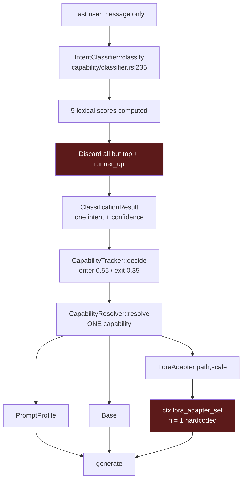
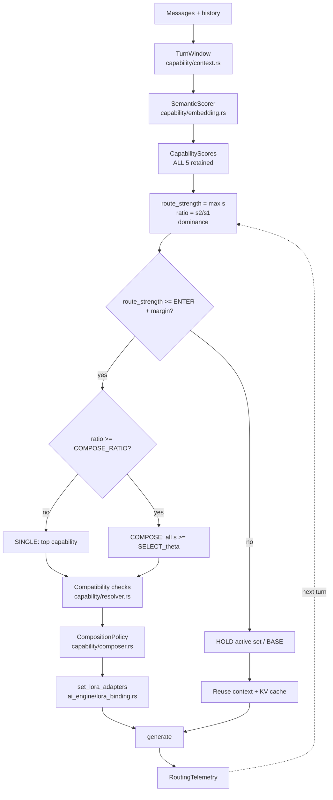
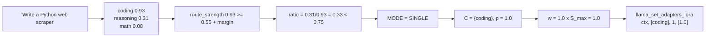
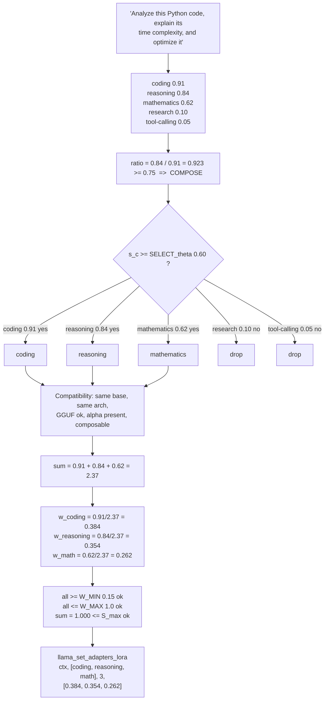
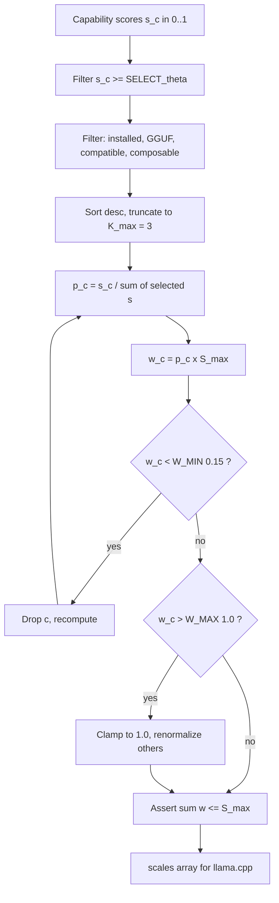
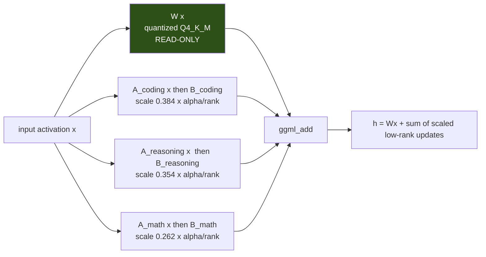
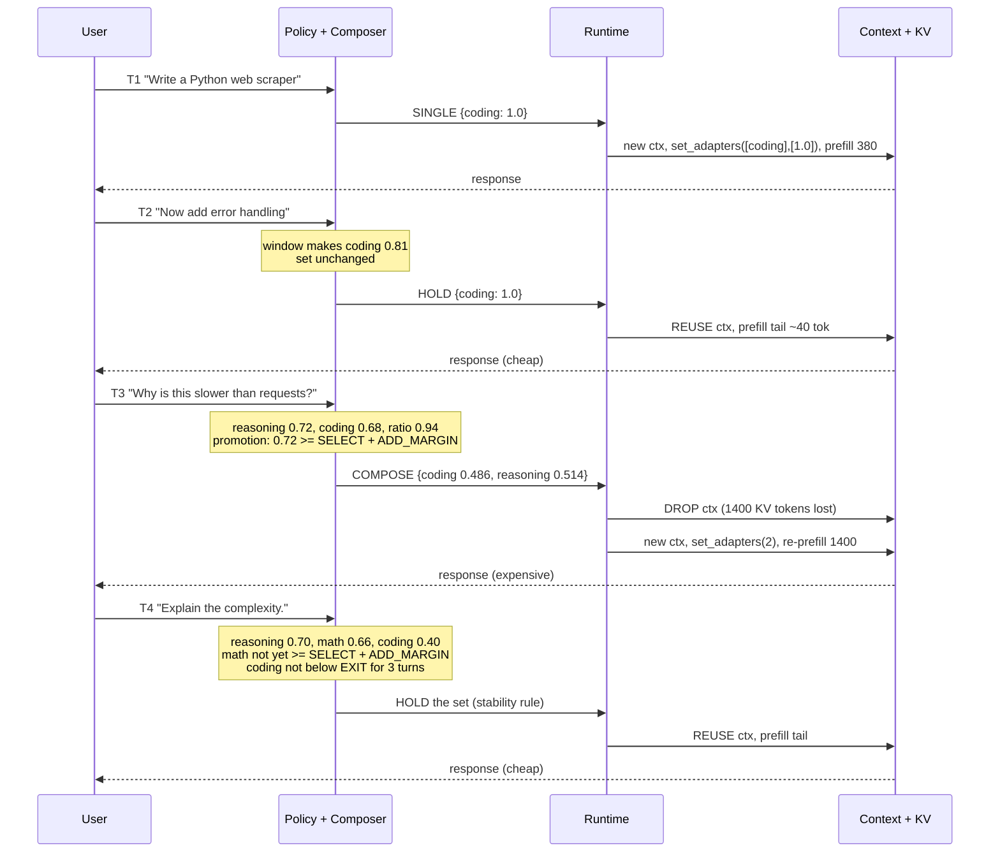
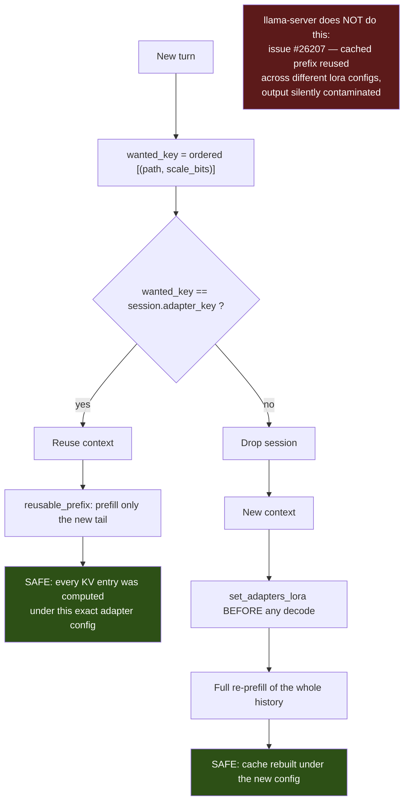
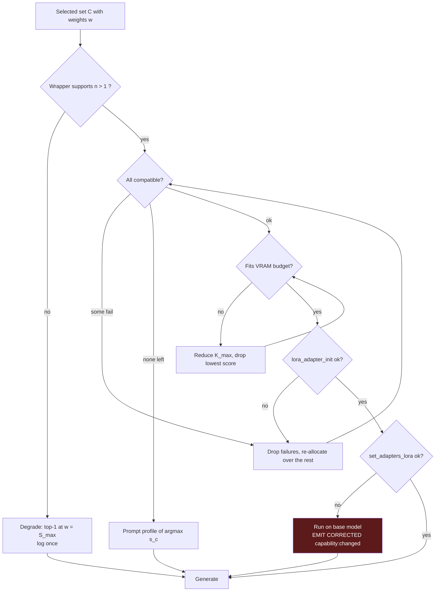

# Sarathi Semantic Multi-LoRA Routing and Composition — Design Investigation

**Status:** Investigation only. No source code modified.
**Date:** 2026-08-20

**Relationship to existing documents in this repository:**

| Document | Question it answered | Relationship |
|---|---|---|
| `docs/architecture/peft-lora-integration.md` (2026-08-09) | Can PEFT be Sarathi's runtime switching layer? | **No** — settled. Not revisited here |
| `docs/superpowers/specs/2026-08-10-lora-end-to-end-design.md` | How does one adapter get from HF to a bound context? | Built. It explicitly leaves composition "stubbed in `lora/traits.rs`" — **this document picks that up** |
| `docs/lora-routing-investigation.md` (round one) | What routing mechanism should Sarathi adopt? | **Partially superseded.** §33 lists six corrections |

Epistemic key, consistent with the two prior documents:

| Tag | Meaning |
|---|---|
| **[SARATHI]** | Directly observed in this repository |
| **[LLAMA.CPP]** | Read in the vendored upstream C++ source Sarathi actually compiles |
| **[RESEARCH]** | Supported by a paper or published experiment |
| **[INFERENCE]** | My own technical conclusion from the above |
| **[PROPOSED]** | A new design I am recommending |

**[LLAMA.CPP]** claims are read from
`~/.cargo/registry/src/index.crates.io-*/llama-cpp-sys-2-0.1.153/llama.cpp/` —
the exact source Sarathi links against, not master. They describe the running
system, not a future one.

---

## 1. Executive Summary

The question this investigation had to answer:

> If the user asks something requiring Coding + Reasoning + Mathematics, exactly
> how does Sarathi decide which LoRAs to use, what weights does each receive, how
> does llama.cpp apply them together, and what must change to make it work?

**Short answer.** llama.cpp already composes any number of LoRA adapters
additively at runtime with independent per-adapter scales, never merging them
into the base weights. The blocker is a single-adapter Rust wrapper. Once lifted,
Sarathi scores every capability semantically, selects those above a threshold,
allocates a bounded strength budget between them proportionally, and passes one
`(adapters[], scales[])` array. Full calculation in §12; worked examples in §25;
the direct answer in §31.

**Five findings that shape the design:**

1. **Multi-LoRA is real, additive, and unmerged.** **[LLAMA.CPP]**
   `llm_graph_context::build_lora_mm` (`src/llama-graph.cpp:1063`) loops over
   every loaded adapter: `res = ggml_add(res, ggml_scale(B·(A·x), s))`. Base
   weights are never touched. **Adapters of different ranks compose fine**,
   because they are never summed as matrices — only their outputs are. This makes
   llama.cpp's runtime composition **strictly more permissive than PEFT's
   `add_weighted_adapter(combination_type="linear")`, which requires equal
   rank.**

2. **The runtime scale is already rank/alpha-normalized — the router must not
   normalize again.** **[LLAMA.CPP]** `get_scale` returns
   `adapter_scale * alpha / rank`. Since PEFT trains with exactly `alpha/r`
   applied, a runtime scale of `1.0` reproduces training-time behaviour *for any
   rank and any alpha*. **`scale` means "fraction of trained strength", not
   "magnitude of ΔW".** This is the single most important fact for weight
   calculation, and it means **rank and alpha must NOT enter the router's
   arithmetic** (§18).

3. **Round one was wrong about KV-cache causality.** **[LLAMA.CPP]**
   `llama_context::set_adapters_lora` (`src/llama-context.cpp:1210`) touches
   nothing but the `loras` map and a `sched_need_reserve` flag. It does not
   invalidate the KV cache — llama.cpp has an **open bug**
   ([#26207](https://github.com/ggml-org/llama.cpp/issues/26207)) where
   llama-server reuses cached prefixes across different adapter configs and
   "output [is] silently contaminated by the previous adapter." Sarathi's
   `adapter_key` check (`ai_engine/runtime.rs:935`) is **not inherited behaviour —
   it is a correctness decision Sarathi makes that upstream llama-server does
   not.** It must be preserved and extended.

4. **Multi-label scoring is nearly free today.** **[SARATHI]**
   `IntentClassifier::classify` (`capability/classifier.rs:243`) already computes
   a score for all five intents into `scored: Vec<(PromptIntent, f32)>`, then
   discards everything but the top and runner-up. Multi-intent needs the vector
   returned, not a new algorithm.

5. **Two calibration traps block a naive semantic swap.** **[INFERENCE]**
   (a) `EVIDENCE_SATURATION = 1.5` is calibrated to lexical weights where one
   `CLEAR` signal is 2.0; feed it cosine similarities in `[0,1]` and confidence
   collapses far below the 0.55 enter threshold — **routing would silently stop
   firing entirely**. (b) The confidence formula multiplies by *dominance*, which
   deliberately collapses confidence when two intents tie — correct for
   single-label routing, exactly backwards for composition, where two strong
   intents are the signal to compose. Both addressed in §12.3.

**Recommendation.** Embedding-similarity routing over labelled utterance sets,
run through the **existing llama.cpp runtime** — `llama-cpp-2` already exposes
`embeddings_seq_ith` and pooling types, so **zero new dependencies** **[SARATHI]**;
multi-label scores; request-level weighted composition of ≤3 adapters under a
bounded strength budget; a forked or upstream-patched `llama-cpp-2` exposing
`llama_set_adapters_lora` with `n > 1`. **No LoRA retraining. No router training.
No new model architecture.**

---

## 2. Current Sarathi System

Re-verified this session. **[SARATHI]**

- **Inference:** `llama-cpp-2` 0.1.153, in-process (`src-tauri/Cargo.toml`).
  Latest on crates.io is 0.1.154 (2026-08-05) — checked on docs.rs, and it
  **still exposes only single-adapter `lora_adapter_set`**. Upgrading does not help.
- **Certified base:** `Qwen/Qwen2.5-7B-Instruct-GGUF::Q4_K_M::llama.cpp`
  (`certification.json`).
- **Hardware here:** RTX 5060 Laptop, **8151 MiB** (`nvidia-smi`, measured).
- **Scheduler:** `ai_engine/scheduler.rs` — one dedicated OS thread, strict
  queue, no cross-request batching.
- **Gateway:** `gateway/server.rs:382` submits `capability: None`;
  `GatewayConfig::apply_capabilities` defaults `false`.

### Capability layer, verified end to end

| Symbol | File | Behaviour |
|---|---|---|
| `IntentClassifier::classify` | `capability/classifier.rs:235` | Scores 5 intents from weighted lexical signals; returns top + runner-up only |
| `ClassificationResult` | `:200` | `intent`, `confidence`, `raw_score`, `runner_up` |
| `SwitchPolicy` | `capability/policy.rs:32` | `enter 0.55`, `exit 0.35`, `max_unsupported_turns 3` |
| `CapabilityTracker::decide` | `:141` | Manual override wins; reinforce if same; enter if confident; release after 3 unsupported |
| `CapabilityResolver::resolve` | `capability/resolver.rs:72` | `LoraAdapter → PromptProfile → Base`, never fails |
| `CapabilitySpec::builtin` | `capability/profile.rs:120` | 5 capabilities + general; directive + sampling overrides |
| `CapabilityLayer::resolve_turn` | `capability/mod.rs:136` | **Receives `prompt: &str` — one string, the last user message only** |
| `EVAL_SET` | `capability/eval.rs:38` | 64 cases, ≥85% asserted |

**Phase 1 questions, answered:**

- Intent is detected by **whole-token and phrase matching against five weighted
  keyword tables**, summed independently per intent.
- The classifier receives **one lowercased string** — no history, no roles, no
  turn boundaries.
- It produces **exactly one intent** plus a runner-up. `runner_up` is populated
  but **only feeds the dominance term**, never selection.
- Confidence is a **principled formula** (`evidence × (0.5 + 0.5·dominance)`) but
  **has never been validated against outcome frequency** — no reliability curve
  exists.
- Conversation history is **not used**. Hysteresis is the only cross-turn state
  and it operates on the *decision*, not the *input*.
- **No routing telemetry exists.** `capability/telemetry.rs` is absent; the only
  record is `log::info!` lines.

---

## 3. Current LoRA System

Full pipeline traced. **[SARATHI]**

```
HF discovery          model_providers/huggingface/adapter_provider.rs  (AdapterCapability: 5 keys)
  ↓ capability slot   capability/assign.rs        (Stated > Suggested; None rather than mis-file)
  ↓ download          commands/adapters.rs:128
  ↓ validate          lora/validator.rs           (Compatible|RequiresConversion|Incompatible|NotPresent)
  ↓ convert           lora/convert/mod.rs:84      (PEFT safetensors → GGUF, pure Rust)
      ├ peft_config.rs      refuse DoRA / non-LoRA; effective_alpha() compensates rsLoRA
      ├ arch.rs             read general.architecture from base GGUF
      ├ tensor_map.rs       PEFT names → llama.cpp names
      ├ safetensors_reader  bf16 widened to f32
      └ gguf_writer.rs      temp file → atomic rename
  ↓ register          adapter_manager/mod.rs      (HashMap<capability, AdapterManifestInfo>)
  ↓ resolve           capability/resolver.rs:126  (status, runtime status, .gguf, exists, magic, scale)
  ↓ init + cache      ai_engine/lora_binding.rs:95  (LoraAdapterCache, keyed by PathBuf)
  ↓ bind              ai_engine/lora_binding.rs:128 (ctx.lora_adapter_set — ONE adapter)
  ↓ inference         ai_engine/runtime.rs:946
```

**Converter facts that matter for composition:**

- Target modules (`tensor_map.rs:126`): `q_proj, k_proj, v_proj, o_proj,
  gate_proj, up_proj, down_proj`, plus standalone `embed_tokens`, `lm_head`.
  **All Sarathi-converted adapters therefore target the same tensor family** —
  they *will* interact (§14).
- Supported architectures (`tensor_map.rs:166`): `llama, mistral, qwen2, qwen3,
  gemma, gemma2, phi3`.
- **`adapter.lora.alpha` is written into the GGUF** (`convert/mod.rs:119`) from
  `PeftConfig::effective_alpha()`, which multiplies alpha by `sqrt(rank)` for
  rsLoRA so llama.cpp's fixed `alpha/rank` reproduces rsLoRA's intended
  `alpha/sqrt(rank)`. Correct, and it matches `get_scale` exactly.
- **Scale is checked for finiteness but not clamped** (`resolver.rs:184`). A
  manifest with `"scale": 50.0` binds at 50× trained strength. **[INFERENCE]** A
  real gap once composition multiplies the blast radius.

---

## 4. Current Limitations

| # | Limitation | Root cause | Fixable? |
|---|---|---|---|
| 1 | Lexical intent detection | `classifier.rs` keyword tables | Yes — §29 |
| 2 | Single intent forced | `ClassificationResult` discards the score vector | Yes, trivially |
| 3 | One active adapter | `llama-cpp-2` wrapper, **not** llama.cpp | Yes — §8 |
| 4 | Last message only | `resolve_turn(prompt: &str)` | Yes — §12 |
| 5 | Confidence never validated | No telemetry, no reliability curve | Yes |
| 6 | Adapter change → full re-prefill | **Correctness requirement** | **No** — §15 |
| 7 | Gateway unrouted | `server.rs:382` | Yes |
| 8 | Scale unclamped | `resolver.rs:184` | Yes |
| 9 | Adapter handles leak | No `Drop` in `llama-cpp-2` | Yes, same fork |

---

## 5. Semantic Intent Research

**[RESEARCH]** The production-validated pattern is a cheap classifier in front of
inference: the **vLLM Semantic Router** (Sept 2025) uses a ModernBERT classifier
to pick a serving path; **aurelio-labs/semantic-router** classifies utterances by
embedding distance with no LLM call. Both route to *models*; Sarathi routes to
*adapters* — identical mechanism, different target.

**[INFERENCE]** The key property is that embedding similarity generalizes over
vocabulary. "Make this run faster on large inputs" scores **zero on every one of
Sarathi's five keyword tables** — verified by reading them; it contains no listed
signal. An embedding router matches it by meaning. That is the concrete failure
the swap fixes.

---

## 6. Multi-Intent Research

Every serious composition method treats capability as multi-label:

- **LoraHub** (COLM 2024, [arXiv:2307.13269](https://arxiv.org/pdf/2307.13269),
  [sail-sg/lorahub](https://github.com/sail-sg/lorahub)) — CMA-ES search for a
  *scalar coefficient per adapter*, gradient-free, from a few labelled examples.
  **[RESEARCH]** Direct evidence that scalar-weighted composition of
  independently-trained LoRAs works without retraining — exactly Sarathi's
  mechanism.
- **Arrow** (ICML 2024, [proceedings](https://proceedings.mlr.press/v235/ostapenko24a.html))
  — zero-shot training-free routing from adapter parameter structure.
- **SpectR** (COLM 2025, [arXiv:2504.03454](https://arxiv.org/pdf/2504.03454)) —
  per-token, per-layer, no training, no data; +15% over other training-free
  methods.

Arrow and SpectR are the most attractive results in the field and are rejected on
mechanism, not quality (§8.4).

---

## 7. Multi-LoRA Research — capability matrix

| Method | Multi | Selection | Weights | Learned? | Granularity | Training | Transformers-only | GGUF | llama.cpp | Quantized | Custom kernels | Model mod | Reuse existing | Dynamic discovery |
|---|---|---|---|---|---|---|---|---|---|---|---|---|---|---|
| **llama.cpp native** | ✅ N | caller | caller | no | request | none | no | ✅ | ✅ | ✅ | no | no | ✅ | ✅ |
| **PEFT `add_weighted_adapter`** | ✅ | caller | caller | no | offline merge | none | ✅ | ❌ | ❌ | partial | no | no | ✅ | ⚠️ |
| **LoraHub** | ✅ | search | **learned (CMA-ES)** | offline | request | few-shot examples | ✅ | ❌ | ❌ | ⚠️ | no | no | ✅ | ⚠️ |
| **Arrow** | ✅ | param-space | derived | no | token/layer | none | ✅ | ❌ | ❌ | ⚠️ | no | no | ✅ | ✅ |
| **SpectR** | ✅ | eigenspace | derived | no | token/layer | none | ✅ | ❌ | ❌ | ⚠️ | no | no | ✅ | ✅ |
| **X-LoRA** | ✅ | learned gate | **learned** | **yes** | token/layer | classifier | ✅ | ❌ | ❌ | ⚠️ | no | dual pass | ✅ | ❌ |
| **MoLE / MixLoRA / LD-MoLE** | ✅ | learned gate | **learned** | **yes** | token/layer | gate training | ✅ | ❌ | ❌ | ⚠️ | no | ✅ | ✅ | ❌ |
| **LoRA-Mixer** | ✅ | attention routing | learned | **yes** | token | joint | ✅ | ❌ | ❌ | ⚠️ | no | ✅ | ⚠️ | ❌ |
| **PHATGOOSE** | ✅ | learned gate | learned | **yes** | token/layer | per-module gate | ✅ | ❌ | ❌ | ⚠️ | no | no | ✅ | ❌ |
| **S-LoRA / Punica** | ✅ 1000s | request tag | n/a | no | request | none | ✅ | ❌ | ❌ | ⚠️ | **✅ SGMV** | no | ✅ | ✅ |
| **TIES / DARE** | ✅ | caller | caller + trim/sign | no | offline merge | none | ✅ | ❌ | ❌ | ⚠️ | no | no | ✅ | ⚠️ |

**[INFERENCE]** Exactly one row is compatible with Sarathi's backend.

---

## 8. llama.cpp Capability Analysis

### 8.1 What the vendored C API provides **[LLAMA.CPP]**

`llama.cpp/include/llama.h:682`:

```c
// Set LoRa adapters on the context. Will only modify if the adapters
// currently in context are different.
LLAMA_API int32_t llama_set_adapters_lora(
        struct llama_context * ctx,
        struct llama_adapter_lora ** adapters,
        size_t n_adapters,
        float * scales);
```

Implementation, `src/llama-context.cpp:1210`:

```cpp
void llama_context::set_adapters_lora(llama_adapter_lora ** adapters,
                                      size_t n_adapters, float * scales) {
    if (adapters_lora_are_same(adapters, n_adapters, scales)) {
        return;                                   // idempotent — free no-op
    }
    loras.reset(new llama_adapter_loras());
    for (size_t i = 0; i < n_adapters; i++) {
        if (scales[i] != 0.0f) {                  // zero scale => NOT in the graph
            loras->insert({adapters[i], scales[i]});
        }
    }
    sched_need_reserve = true;                    // graph re-reserve, NOT a cache flush
}
```

Four properties:

1. **`n_adapters` is unbounded.** Any number composes.
2. **Re-setting an identical config is a free no-op.**
3. **Scale exactly `0.0` removes the adapter from the graph entirely** — not
   "applied with zero weight". Zero-scale adapters cost no compute. This is what
   makes `--lora-init-without-apply` cheap.
4. **The KV cache is not mentioned, read, or cleared.** See §15.

Also present: `llama_adapter_lora_free` (`llama.h:673`), and aLoRA invocation
tokens (`llama_adapter_get_alora_invocation_tokens`) — noted, out of scope.

### 8.2 What the Rust wrapper exposes **[SARATHI]**

`llama-cpp-2` 0.1.153 `src/context.rs:334`:

```rust
pub fn lora_adapter_set(&self, adapter: &mut LlamaLoraAdapter, scale: f32) -> ... {
    let mut adapters = [adapter.lora_adapter.as_ptr()];
    let mut scales   = [scale];
    llama_set_adapters_lora(self.context.as_ptr(), adapters.as_mut_ptr(), 1, scales.as_mut_ptr())
}
```

`n` is hardcoded to `1`. Because the C function **replaces** the set, calling it
twice evicts the first. `lora_adapter_remove` passes `(null, 0, null)` — it
clears everything.

`src/model.rs:38`: `pub(crate) lora_adapter: NonNull<llama_adapter_lora>` — the
handle is unreachable from outside the crate.

Verified on docs.rs that **0.1.154, the current latest, is identical here.**

### 8.3 Phase 3, answered

| # | Question | Answer |
|---|---|---|
| 1 | How does Sarathi load a LoRA? | `model.lora_adapter_init(path)`, cached by `PathBuf` **[SARATHI]** |
| 2 | How does it activate one? | `ctx.lora_adapter_set(adapter, scale)` before prefill, `runtime.rs:955` **[SARATHI]** |
| 3 | How many does the wrapper allow? | **Exactly one** **[SARATHI]** |
| 4 | What does the C API allow? | Any `n`, with a per-adapter scale array **[LLAMA.CPP]** |
| 5 | Does llama.cpp support simultaneous LoRAs? | **Yes** **[LLAMA.CPP]** |
| 6 | Different scales per adapter? | **Yes** — `float * scales` is per-adapter **[LLAMA.CPP]** |
| 7 | Per request? | Yes — llama-server exposes `"lora": [{"id":N,"scale":S}]` **[LLAMA.CPP]** |
| 8 | Loaded but selectively enabled? | **Yes** — scale `0.0` excludes from the graph while keeping the handle **[LLAMA.CPP]** |
| 9 | Does the binding prevent supported functionality? | **Yes, decisively** **[INFERENCE]** |

### 8.4 Why token- and layer-level routing remain out of reach **[INFERENCE]**

`build_lora_mm` reads `lora.second` — a single `float` per adapter, fixed for the
whole graph build. Per-token variation would require a scale *tensor* indexed by
position, changing `get_scale`, the `llama_adapter_loras` map, and every call
site, inside a vendored C++ tree. Per-layer is worse: the scale is a property of
the adapter, not of `(adapter, layer)`. Arrow and SpectR need exactly that. This
is a llama.cpp fork, not an integration.

---

## 9. PEFT / Transformers Capability Analysis

**[RESEARCH]** PEFT's `add_weighted_adapter` offers `linear`, `cat`, `svd`,
`ties`, `dare_linear`, `dare_ties`:

- `linear` performs a weighted sum of LoRA deltas and **assumes all participating
  adapters share the same rank `r`**.
- `cat` concatenates: **merged rank is the sum of all ranks**, with OOM risk.
- `svd` is unsupported in fp16/bf16.

**[INFERENCE]** These are **offline merges** producing one new adapter.
llama.cpp's runtime composition is a different operation with a better constraint
profile:

| | PEFT `linear` merge | llama.cpp runtime composition |
|---|---|---|
| Same rank required | **Yes** | **No** |
| Produces a new artifact | Yes | No |
| Reversible per request | No | Yes |
| Adapters stay independent | No | **Yes** |
| Cost | offline, one-time | ~1% compute per adapter |

They agree mathematically — `(Σ sᵢBᵢAᵢ)x = Σ sᵢBᵢ(Aᵢx)` — but llama.cpp never
materializes `ΔW`, so the rank constraint never arises. **This is a genuine
advantage of Sarathi's backend that the literature does not discuss, because the
literature works in PEFT.**

TIES and DARE address merge interference by trimming and sign-election on the
deltas. They **cannot run at llama.cpp inference time** — they need materialized
deltas. They *could* run offline in Sarathi's Rust converter to precompute a
merged adapter, at the cost of per-request dynamism. Recorded as a future option,
not a recommendation.

---

## 10. LoRA Composition Mathematics

### 10.1 Standard LoRA

A LoRA replaces a frozen `W ∈ ℝ^{d_out×d_in}` with

```
W' = W + ΔW,       ΔW = (α/r) · B A
```

`A ∈ ℝ^{r×d_in}`, `B ∈ ℝ^{d_out×r}`, `r ≪ d`. PEFT applies `α/r` during
**training**, so `α/r` is the adapter's trained operating point.

### 10.2 What llama.cpp actually computes **[LLAMA.CPP]**

`src/llama-graph.cpp:1063`, verbatim:

```cpp
ggml_tensor * res = ggml_mul_mat(ctx0, w, cur);          // base, quantized, untouched

for (const auto & lora : *loras) {
    llama_adapter_lora_weight * lw = lora.first->get_weight(w);
    if (lw == nullptr) { continue; }                     // adapter doesn't target w

    const float adapter_scale = lora.second;
    const float scale = lw->get_scale(lora.first->alpha, adapter_scale);

    ggml_tensor * ab_cur = ggml_mul_mat(ctx0, lw->b,
                               ggml_mul_mat(ctx0, lw->a, cur));
    ab_cur = ggml_scale(ctx0, ab_cur, scale);
    res    = ggml_add(ctx0, res, ab_cur);                // ADDITIVE
}
```

and `src/llama-adapter.h:53`:

```cpp
float get_scale(float alpha, float adapter_scale) const {
    const float rank  = (float) b->ne[0];
    const float scale = alpha ? adapter_scale * alpha / rank : adapter_scale;
    return scale;
}
```

So for `n` adapters with runtime scales `s₁…sₙ`:

```
h = W x  +  Σᵢ  sᵢ · (αᵢ / rᵢ) · Bᵢ (Aᵢ x)
```

Equivalently in weight space:

```
W' = W + Σᵢ sᵢ · (αᵢ/rᵢ) · Bᵢ Aᵢ
```

but **the weight-space form is never computed.** Everything happens on the
activation.

### 10.3 Every Phase-5 question, answered from the source

| Question | Answer |
|---|---|
| What does `scale` mean? | A **multiplier on trained strength**. `s = 1.0` reproduces PEFT training exactly, for any rank/alpha |
| Is it a multiplier? | Yes — `adapter_scale * alpha / rank` |
| Are scales additive? | The **contributions** are added; the scales are independent coefficients |
| Are adapters merged? | **No.** Never. `W` is read-only |
| Do adapters stay separate? | **Yes** — each keeps its own `a`, `b`, `alpha` |
| Does each contribute its own low-rank update? | Yes, as `B(Ax)`, never as `ΔW` |
| Where is it applied? | In `build_lora_mm`, on the output of every adapted matmul |
| Same scale for every target tensor of one adapter? | **Yes.** One `float` per adapter, applied at every tensor it targets |
| Can scales differ per adapter? | **Yes** — the point of the `scales` array |
| Can scales differ per layer? | **No.** The scale is a property of the adapter |
| Can scales differ per token? | **No.** Fixed for the graph build |
| Is the base contribution unchanged? | **Yes** — `ggml_mul_mat(w, cur)` runs on untouched quantized weights; adapters only add |

**[INFERENCE]** Two consequences worth stating plainly:

- The base model's quantized weights are read-only, so composition **cannot
  corrupt the model**. The worst case is a bad output for one request, fixed by
  changing the scales.
- The LoRA path runs on `f32`/`f16` tensors while the base runs `Q4_K_M` — the
  correction is computed at higher precision than the thing it corrects.

---

## 11. LoRA Weight / Scale Analysis

**[RESEARCH]** On safe scale ranges, work on LoRA-based safety alignment
([arXiv:2507.17075](https://arxiv.org/pdf/2507.17075)) reports that "models begin
to significantly lose utility ... for scaling factors above 1.0", while "in the
range between 0 and 1, utility is not significantly degraded, with values between
0.5 and 1.0 yielding good performance with minimal utility losses." That study is
domain-specific, so treat it as a **direction, not a constant** — but it points
the same way as the mathematics: `s > 1` extrapolates beyond anything the adapter
was trained at.

**[INFERENCE]** `W_MAX = 1.0` is therefore the correct hard clamp. Not because
1.0 is magic, but because it is the *only* value with a guarantee attached: it is
exactly the training-time configuration.

**A trap Sarathi must detect.** **[INFERENCE]** `get_scale` falls back to raw
`adapter_scale` when `alpha == 0`. Sarathi's converter always writes
`adapter.lora.alpha` (`convert/mod.rs:119`), but a third-party GGUF adapter from
`gguf-my-lora` or a hand-built file may not. Such an adapter is silently applied
at `s` instead of `s·α/r` — typically **half strength** for a common `α=32, r=16`
adapter, with no error. Sarathi should read `adapter.lora.alpha` back via
`llama_adapter_meta_val_str` after init and warn when it is absent or zero.

---

## 12. Intent Score → LoRA Scale Design

The core of the investigation.

### 12.1 Confidence is not scale (Phase 7)

| | Intent confidence | LoRA scale |
|---|---|---|
| Question answered | "How sure am I the user wants coding?" | "How hard should the coding adapter push?" |
| Type | Epistemic — a probability | Physical — a magnitude |
| Range meaning | 0.5 = coin flip | 0.5 = half trained strength |
| Right response to a low value | **Don't act** | Act gently |

**[INFERENCE] Why `scale = confidence` is technically wrong**, with the decisive
case: the same coding request phrased tersely might score 0.62 and phrased
explicitly might score 0.95. Under `scale = confidence` the *identical task*
receives 0.62× versus 0.95× adapter strength — the model's behaviour changes
because of **how the user phrased the request, not what they asked for**. That is
not adaptation; it is non-determinism driven by an irrelevant variable.

Worse, 0.62 sits at the weak end of the band the research above flags, so the
least-confident decisions would *also* get the least-effective adapter,
compounding the error rather than hedging it.

**[PROPOSED]** The correct separation:

```
confidence     →  SELECTION   (binary: use this capability, or don't)
relative score →  ALLOCATION  (how the strength budget is divided)
fixed budget   →  MAGNITUDE   (how much total perturbation is applied)
```

### 12.2 Evaluating the six approaches (Phase 6)

Given `coding 0.90, reasoning 0.80, mathematics 0.40`:

| Approach | Result | Verdict |
|---|---|---|
| **A — direct scores** | 0.90, 0.80, 0.40 → Σ = 2.10 | ❌ **Rejected.** Total perturbation 2.1× a single adapter's trained operating point — straight into the >1.0 degradation zone. Plus the phrasing flaw above |
| **B — normalized** | 0.429, 0.381, 0.190 → Σ = 1.0 | ⚠️ Close, but forces Σ=1 always: a *single* adapter is pinned to 1.0 with no gentler option, and a weak third intent steals budget from a strong first |
| **C — normalized × global strength** | B scaled by `S_max` | ✅ **Basis of the recommendation.** One user-facing dial; decouples allocation from magnitude |
| **D — confidence-weighted** | conf × score × reliability | ⚠️ The `reliability` term is right and kept as a **filter**; the confidence multiplier reintroduces the phrasing flaw |
| **E — learned weighting** | CMA-ES over telemetry | ⚠️ **Correct destination, wrong starting point.** Needs logged outcomes that do not exist yet. This is LoraHub applied to Sarathi — the right Phase-9 upgrade |
| **F — adapter default scale** | router × `alpha/rank` | ❌ **Rejected as a double-correction.** llama.cpp *already* multiplies by `alpha/rank` in `get_scale`. Applying it again squares the term — an `α=32, r=16` adapter would land at 4× instead of 2×. §18 |

**Recommendation: C, with D's reliability as a pre-filter and E as the deferred
upgrade.** **[PROPOSED]**

### 12.3 The two calibration traps **[INFERENCE]**

**Trap 1 — the saturation constant.** `EVIDENCE_SATURATION = 1.5` is documented
as calibrated to lexical weights where one `CLEAR` signal is 2.0. Feed it a cosine
similarity of 0.91 and `evidence = 0.91/(0.91+1.5) = 0.378`, so
`confidence ≤ 0.378` — **permanently below the 0.55 enter threshold.** A naive
swap to embeddings would silently disable routing entirely. For scores in `[0,1]`
the constant needs to be roughly `K_sim ≈ 0.35`, giving `evidence(0.91) = 0.72`.
It must be a **distinct named constant**, not a retuned one, so the two scales
cannot be confused.

**Trap 2 — dominance is backwards for composition.** The formula multiplies by
`(0.5 + 0.5·dominance)`, so two equally strong intents *reduce* confidence.
Correct for "which single capability?"; wrong for "should I specialize at all?" —
two strong intents are the strongest possible signal to compose. Round one missed
this.

**[PROPOSED]** Split the single confidence into signals with distinct jobs:

```
route_strength = max_c s_c                      # is ANY capability strongly present?
dominance      = s_top / Σ_c s_c                # existing — how contested?
ratio          = s_runner_up / s_top            # NEW — how close is #2?
```

- `route_strength` gates **specialize vs. base**
- `ratio` decides **single vs. compose**
- `dominance` is retained for telemetry and the single-capability path

### 12.4 The algorithm **[PROPOSED]**

```
INPUT   turn window T, manifest M, manual override O, live KV tokens n_kv, ctx N

 1 SCORE       s_c = SemanticScorer(T)  for every capability c          # s_c ∈ [0,1]
 2 SIGNALS     route_strength = max s_c ;  ratio = s_2nd / s_top
 3 OVERRIDE    if O set → selected := O (with user weights) ; goto 9
 4 GATE        margin := λ · min(1, n_kv / N)                            # switch-cost penalty
               if route_strength < ENTER              → HOLD active, else BASE
               if set(candidate) ≠ set(active)
                  and route_strength < ENTER + margin → HOLD active
 5 MODE        if ratio < COMPOSE_RATIO → SINGLE   else → COMPOSE
 6 SELECT      C := { c : s_c ≥ SELECT_θ }, sorted desc, truncated to K_max
               filter: Installed ∧ .gguf ∧ magic ok ∧ compatible (§13) ∧ composable
               if C = ∅ → prompt profile of argmax s_c, else BASE
 7 ALLOCATE    p_c := s_c / Σ_{k∈C} s_k                                  # Σp = 1
 8 SCALE       w_c := clamp(p_c · S_max, W_MIN, W_MAX)
               if any w_c fell below W_MIN → drop c, goto 7              # ≤ K iterations
               if Σw > S_max → renormalize w ← w · S_max / Σw
 9 VERIFY      Σw ≤ S_max ;  ∀c: W_MIN ≤ w_c ≤ W_MAX ;  |C| ≤ K_max
10 BIND        if (C, w) == session.adapter_key → reuse context and KV cache
               else → drop session, new context,
                      llama_set_adapters_lora(ctx, C, |C|, w), then prefill
```

Formally:

```
        ⎧ 0                                                    if s_c < SELECT_θ or c ∉ C
w_c  =  ⎨
        ⎩ clamp( S_max · s_c / Σ_{k∈C} s_k , W_MIN, W_MAX )     otherwise
```

and llama.cpp then applies

```
h  =  W x  +  Σ_{c∈C}  w_c · (α_c / r_c) · B_c (A_c x)
```

### 12.5 Parameters — with provenance, not invention

| Parameter | Default | Provenance |
|---|---|---|
| `ENTER` | 0.55 | **[SARATHI]** existing, `policy.rs:46` — keep |
| `EXIT` | 0.35 | **[SARATHI]** existing — keep |
| `MAX_UNSUPPORTED` | 3 | **[SARATHI]** existing — keep |
| `K_sim` (saturation) | 0.35 | **[INFERENCE]** derived §12.3; must be benchmarked |
| `SELECT_θ` | 0.60 | **[PROPOSED]** above `ENTER`, so a composed adapter clears a higher bar than a switched one |
| `COMPOSE_RATIO` | 0.75 | **[PROPOSED]** — *unvalidated*; §27 sweeps it |
| `K_max` | 3 | **[INFERENCE]** — no evidence base beyond 3 at this library size; a tunable, not a finding |
| `S_max` | 1.0 | **[RESEARCH]**-anchored: 1.0 is the trained operating point; >1 degrades |
| `W_MIN` | 0.15 | **[INFERENCE]** — below this an adapter costs a full re-prefill and contributes ~nothing |
| `W_MAX` | 1.0 | **[RESEARCH]** — never exceed trained strength |
| `λ` (switch cost) | 0.25 | **[PROPOSED]** — *unvalidated*; §27 sweeps it |

Four are honest guesses, labelled as such. §27 is the plan that replaces them
with measurements.

---

## 13. Multi-LoRA Compatibility (Phase 23)

**[PROPOSED]** Staged, cheapest first, at selection time:

| # | Check | Source of truth | On failure |
|---|---|---|---|
| 1 | Same base model | `base_model_match` vs loaded package | **Hard reject** |
| 2 | Same architecture | `.architecture` vs `arch::read_architecture(base)` | **Hard reject** |
| 3 | GGUF and present | extension + `verify_gguf_magic` (`resolver.rs:178`) | **Hard reject** |
| 4 | Runtime status | `≠ requires_conversion / incompatible` | Degrade to prompt profile |
| 5 | Tensor shapes | `llama_adapter_lora_init` errors on mismatch | **Hard reject**, caught at init |
| 6 | Alpha present | `llama_adapter_meta_val_str("adapter.lora.alpha")` | **Warn** — silently under-applied (§11) |
| 7 | `composable` flag | new manifest field | Exclude from multi, allow alone |
| 8 | Target-module overlap | `target_modules` intersection | **Advisory only** |
| 9 | Rank / alpha differences | `rank`, `alpha` | **No check needed** — §9 |

**[INFERENCE]** Checks 1, 2, and 5 are the only real safety gates. Tokenizer
assumptions and training objective are *not* checkable from a GGUF adapter and
should not be pretended otherwise — that is what `composable` and telemetry are
for.

**"Can Coding + Vision be composed?"** **[INFERENCE]** Two answers, and the
distinction matters:

- *Mechanically*: if both target the same architecture and base, yes —
  `llama_adapter_lora_init` accepts them and `build_lora_mm` sums them. Nothing
  crashes.
- *Sensibly*: no. A vision adapter typically targets projector or cross-attention
  tensors a text-only GGUF base does not have, so `get_weight(w)` returns
  `nullptr` for every tensor and the adapter contributes **exactly nothing**
  while still costing a full context rebuild. And Sarathi's taxonomy has no
  `vision` slot — `AdapterCapability` has five variants, none of them vision — so
  this cannot arise through automatic routing, only a manual override.

**[PROPOSED]** Detect the degenerate case: if an adapter's `ab_map` matches zero
tensors of the loaded model after init, refuse it with a clear reason rather than
binding a no-op.

---

## 14. Adapter Interference (Phase 15)

**Is `A×0.5 + B×0.5` safe?** **[INFERENCE]** Safe in that it cannot crash or
corrupt the model — §10 proves the base is read-only. **Not** safe in the sense of
guaranteed quality.

| Risk | Mechanism | Mitigation |
|---|---|---|
| **Scale explosion** | `Σ sᵢ` grows with count; perturbation leaves the trained regime | **`Σw ≤ S_max` budget** — the primary safeguard (§17) |
| **Sign conflict** | Two adapters push a weight in opposite directions; TIES exists for this **[RESEARCH]** | Not resolvable at runtime. Bounded by the budget; detected by §27.4 |
| **Same target modules** | All Sarathi adapters hit `q/k/v/o/gate/up/down` **[SARATHI]** — they *always* overlap | Accepted; the normal case, not an anomaly |
| **Rank differences** | A problem for PEFT `linear` merge | **Not a problem here** — §9 |
| **Alpha differences** | Different trained operating points | **Already normalized** by `get_scale` — §18 |
| **Base-model mismatch** | Wrong deltas entirely | Hard reject, checks 1–2 |
| **Negative transfer** | B degrades A's task | Detected only by evaluation; `composable = false` opt-out |
| **Over-specialization** | Composite drifts from general ability | `S_max` bounds total drift; base contribution unchanged |

**[RESEARCH]** MergeRepair ([arXiv:2408.09568](https://arxiv.org/abs/2408.09568))
studied exactly this — merging task-specific adapters in code LLMs, comparing
weight-averaging against TIES and DARE-TIES — and found the *order and weight* of
merged adapters matters significantly. Empirical support for two things:
composition is worth doing, and naive equal weighting is not automatically best.
It is also why §27.4's weight sweep exists rather than a hard-coded constant.

**[INFERENCE] The honest position:** there is no published result guaranteeing
that composing two arbitrary third-party LoRAs improves output. The design is
therefore built so composition is *bounded, reversible, observable, and
individually disableable* — not so that it is assumed correct.

---

## 15. KV-Cache Behaviour (Phase 21)

Round one asserted that changing adapters invalidates the KV cache "because an
adapter is baked into everything already decoded." That was wrong about **who**
invalidates. Corrected here.

### 15.1 What llama.cpp does **[LLAMA.CPP]**

`set_adapters_lora` (quoted §8.1) touches only the `loras` map and
`sched_need_reserve`. **It never reads, clears, or flags the KV cache.** Confirmed
by absence: grepping `src/llama-context.cpp` for KV-cache operations near adapter
code returns nothing.

### 15.2 Why that is a bug, not a feature **[LLAMA.CPP]**

A KV entry for token *t* was produced by running the model **with whatever adapter
set was active at the time**. Reusing it under a different set mixes two different
models in one attention computation.

llama.cpp issue [#26207](https://github.com/ggml-org/llama.cpp/issues/26207) —
*"server: prompt cache is reused across requests with different per-request
`lora` — output silently contaminated by the previous adapter"* — is the empirical
demonstration. The reproduction shows request 2 using adapter B returning output
influenced by adapter A, with `timings.prompt_n` proving the prefix was never
re-evaluated. The issue is **open**, and the reporter's proposed fix is exactly
what Sarathi already does: *"treat a change in the resolved per-request lora
config like a prompt mismatch: invalidate the slot's cached prefix (or key the
cache on the lora config)."*

### 15.3 What Sarathi does **[SARATHI]**

`ai_engine/runtime.rs:935`:

```rust
let reuse_session = session.as_ref()
    .is_some_and(|s| s.n_ctx == ctx_size.get() && s.adapter_key == wanted_adapter);
```

**Sarathi keys the session on the adapter configuration** — precisely the fix
#26207 asks for, implemented before upstream did it. **[INFERENCE]** It must be
kept and extended to an ordered multi-adapter key, never weakened.

### 15.4 Phase 21, answered

| # | Question | Answer |
|---|---|---|
| 1 | Does changing scale invalidate the cache? | **llama.cpp: no** (bug). **Sarathi: yes** — `adapter_key` includes `scale.to_bits()` (`runtime.rs:924`). **Correct: a different scale is a different model** |
| 2 | A → B? | Must invalidate. Sarathi does |
| 3 | **A → A+B?** | **Must invalidate.** Adding an adapter changes every subsequent computation; prior KV entries were computed without B. **Not cheaper than a swap.** Round one did not address this case |
| 4 | Weights only? | Must invalidate — see 1 |
| 5 | Reuse when config identical? | **Yes, fully safe** — the common case. `adapters_lora_are_same` makes re-setting free **[LLAMA.CPP]**, and `reusable_prefix` (`runtime.rs:1014`) then prefills only the new tail |
| 6 | Can different configs share a cache? | **No.** #26207 is the proof |

**[INFERENCE] Design consequence.** Because *adding* an adapter costs the same
full re-prefill as *swapping* one, composition must be decided **once, at the
start of a turn, over the whole selected set** — never incrementally. And set
changes must be hysteresis-damped as aggressively as switches (§19).

---

## 16. Performance

**MEASURED [SARATHI]**
- GPU: RTX 5060 Laptop, 8151 MiB (`nvidia-smi`)
- Adapter init logged in **ms**, bind logged in **µs** (`lora_binding.rs:110,138`)
- In-tree note: *"on a CPU-only build a coding agent's system prompt measured
  ~98s"* prefill (`runtime.rs:999`)
- `EVAL_SET` = 64 cases, ≥85% asserted (`eval.rs:250`)

**COMPUTED** from Qwen2.5-7B geometry (28 layers, `d_model` 3584, 4 KV heads ×
128, `d_ff` 18944), LoRA `r=16` on all seven projections:

| Module | Params (A+B) |
|---|---|
| q_proj, o_proj | 114,688 each |
| k_proj, v_proj | 65,536 each |
| gate_proj, up_proj, down_proj | 360,448 each |
| **Per layer** | **1,441,792** |
| **× 28 layers** | **≈ 40.4 M params** |

- **f32 (what Sarathi's converter writes** — `safetensors_reader.rs:13-19` widens
  bf16 → f32**): ≈ 161 MB per adapter**
- f16: ≈ 81 MB · `r=32`: ≈ 323 MB (f32)

**Compute overhead, computed:** for `q_proj`, base is 3584×3584 ≈ 12.8 M MACs;
the LoRA path is 3584×16 + 16×3584 ≈ 0.115 M MACs = **0.89% of base**. Similar
ratio across the other projections.

| Cost | Value | Class |
|---|---|---|
| Semantic classification (small encoder, CPU) | 5–20 ms | **ESTIMATED** |
| Lexical classification (today) | <1 ms | **ESTIMATED** |
| Adapter first init | 50–300 ms | **ESTIMATED** (logged in ms **[SARATHI]**) |
| `llama_set_adapters_lora` | <1 ms; **free if unchanged** | **[LLAMA.CPP]** |
| 1 adapter, FLOP overhead | +0.9% | **COMPUTED** |
| 3 adapters, FLOP overhead | +2.7% | **COMPUTED** |
| 1 adapter, wall-clock | +2–5% | **ESTIMATED** — extra graph nodes, kernel launches, and an f16/f32 path beside a Q4 base cost more than the FLOP ratio |
| 5 adapters, wall-clock | +10–25% | **ESTIMATED** |
| Re-prefill 1k tokens (GPU, 7B Q4) | 1–2.5 s | **ESTIMATED** (400–1000 tok/s) |
| Re-prefill 2k | 2–5 s | **ESTIMATED** |
| Re-prefill 4k | 4–10 s | **ESTIMATED** |
| Re-prefill 8k | 8–20 s | **ESTIMATED** |

**Which cost dominates — unambiguously the context rebuild.** **[INFERENCE]**
Routing is milliseconds; binding is microseconds; composition adds single-digit
percent. **A single unnecessary adapter change at 4k context costs more than every
routing decision in an entire session.** This is why §19's set-stability rules
matter more than any other optimization here.

---

## 17. VRAM (Phase 19)

**[LLAMA.CPP]** `llama_adapter_lora_init` allocates backend buffers, so adapters
occupy **VRAM** when the model is GPU-offloaded. They are **not** merged and
**not** deduplicated — 5 adapters means 5× adapter memory.

Budget on this machine, using `vram_planner.rs`'s own accounting
(`OS_RESERVE_BYTES = 900 MB`, `COMPUTE_OVERHEAD_FRACTION = 0.12`) **[SARATHI]**:

```
Total VRAM                            8151 MiB   MEASURED
− OS reserve                          − 900
= 7251 MiB
− compute overhead (12%)              − 870
= ~6381 MiB for weights + KV + adapters       COMPUTED
```

| Item | Size | Running total |
|---|---|---|
| Qwen2.5-7B Q4_K_M weights | ~4400 MiB | 4400 |
| KV cache @ 8k ctx | ~900 MiB | 5300 |
| 3 adapters, r=16, **f32** @ 161 MiB | 483 | 5783 |
| 5 adapters, r=16, **f32** | 805 | 6105 |
| 5 adapters, r=32, **f32** | 1615 | 6915 ❌ **over budget** |
| 5 adapters, r=16, **f16** | 403 | 5703 |

**[INFERENCE] Conclusions:**

- **3 adapters at r=16 fit comfortably.** 5 fit with ~276 MiB headroom — thin.
- **r=32 at 5 adapters does not fit** alongside an 8k context.
- **Sarathi's f32 widening doubles adapter VRAM for no runtime benefit.** The
  converter widens bf16 → f32 as "the safe move for a format conversion"
  (`safetensors_reader.rs:15`), and `GgmlType::F16` is already implemented
  (`gguf_writer.rs:63`). **Writing f16 would halve adapter VRAM**, turning
  5×r=32 from over-budget into borderline. Worth a measured accuracy comparison
  first — flagged as an open question (§26), not a recommendation.
- **Adapters with scale 0.0 still consume VRAM** (the handle is loaded) but
  **zero compute** (excluded from `loras` — §8.1). Preloading all installed
  adapters and gating by scale is viable *if* VRAM permits, and removes all
  first-switch init latency.
- **`K_loaded` must be VRAM-budgeted**, computed from `vram_planner`'s existing
  reserve arithmetic rather than a fixed constant.

---

## 18. Rank, Alpha, and What the Router Must Ignore (Phase 18)

**[LLAMA.CPP]** The chain:

```
PEFT training:        h = Wx + (α/r) · B(Ax)
llama.cpp inference:  h = Wx + [s · α/r] · B(Ax)
                                └─ get_scale, llama-adapter.h:53
```

At `s = 1.0` these are **identical**. Therefore:

> **`s` is a dimensionless multiplier on trained strength, already normalized
> across adapters of any rank and any alpha.**

**[INFERENCE]** What this means for routing — and it is counter-intuitive:

| Quantity | Enters the router's arithmetic? | Why |
|---|---|---|
| **rank** | **No** | `get_scale` divides by it; dividing again squares the correction |
| **alpha** | **No** | Same |
| **`alpha/rank` ratio** | **No** | This *is* the normalization. Approach F is a double-correction |
| **rsLoRA flag** | **No** | Already compensated at conversion (`effective_alpha`) **[SARATHI]** |
| **alpha *presence*** | **Yes — as a validity check** | Missing alpha ⇒ silent under-application (§11) |
| **rank** | **Yes — as a VRAM input** | §17: rank drives adapter size linearly |
| **`composable` flag** | **Yes — as a filter** | Author/operator opt-out |

Rank and alpha influence **whether an adapter can be loaded** and **how many
fit**, but **never how strongly it is weighted**. Round one did not distinguish
these and would have led to Approach F.

---

## 19. Switching Policy (Phase 22)

**[PROPOSED]** Five outcomes:

```
BASE     route_strength < ENTER  and  no active capability
HOLD     route_strength < ENTER + margin,  or  a set change fails stability
SINGLE   route_strength ≥ ENTER + margin  and  ratio < COMPOSE_RATIO
COMPOSE  route_strength ≥ ENTER + margin  and  ratio ≥ COMPOSE_RATIO  and |C| ≥ 2
OVERRIDE user named a capability or set — unconditional

margin = λ · min(1, n_kv / n_ctx)
```

### Set stability — the rule composition requires **[PROPOSED]**

§15.4 established that *adding* an adapter costs a full re-prefill, identical to
*swapping* one. Composition therefore expands the decision space from 6 states to
2⁵ subsets, and **thrashing risk grows with it**. Hysteresis must apply to the
*set*:

```
change the active set only if EITHER
  (a) some c ∉ active has  s_c ≥ SELECT_θ + ADD_MARGIN            # promotion
  (b) some c ∈ active has  s_c < EXIT for MAX_UNSUPPORTED turns   # demotion
otherwise HOLD the current set, regardless of score reordering
```

**Reordering alone must never trigger a rebuild.** If `{coding 0.9, reasoning
0.7}` becomes `{reasoning 0.8, coding 0.75}` next turn, the *set* is unchanged;
only weights would shift. And since a weight change also invalidates the cache
(§15.4 #1), **weights must be frozen for as long as the set is held.** This is a
real constraint composition imposes, and it is the price of KV-cache correctness.

---

## 20. Failure Handling (Phase 24)

| Failure | Detection | Behaviour **[PROPOSED]** | User sees |
|---|---|---|---|
| Adapter missing on disk | `resolver.rs:172` | Drop from `C`, re-allocate over the rest | Reason in tooltip |
| Adapter corrupt | GGUF magic (`resolver.rs:178`) | Drop, mark `Failed` | "file is corrupt" |
| Incompatible | checks 1–2, §13 | Hard reject | "not for this base model" |
| Conversion failed | `lora/convert` error | Stay `requires_conversion`, use prompt profile | Named reason |
| Init failed | `lora_adapter_init` error | Drop from `C`, re-allocate | Degraded badge |
| **Bind failed** | `runtime.rs:964` warns | **Currently the badge still claims `lora` — a real bug.** Emit a corrected `capability:changed` | Honest backend label |
| Adapters conflict | Output quality, telemetry | Not auto-detectable. `composable = false` + one-click regenerate-on-base | Escape hatch |
| Weights too high | Step 9 assertion | Renormalize to `S_max`; log | Nothing |
| VRAM insufficient | `vram_planner` budget | Reduce `K_max`, drop lowest-scored first | "using 2 of 3 skills" |
| Classifier uncertain | `route_strength < ENTER` | HOLD or BASE | Nothing |
| Classifier wrong | User dissatisfaction | Manual override; telemetry | Override control |
| User picks explicitly | §21 | Unconditional | Pinned badge |
| Repeated switching | Switch rate in telemetry | Set-stability (§19); adaptively raise `λ` | Stable behaviour |
| **Multi selected, only single supported** | Wrapper capability probe at startup | **Degrade to top-1 at `w = S_max`**, log once | Single-adapter badge |

The last row matters most: **the whole design must run correctly on the unpatched
`llama-cpp-2`.** Composition is detected and used if present, never assumed.

---

## 21. Explicit User Override (Phase 25)

**[SARATHI]** Already implemented and correct: `policy.rs:147` short-circuits
classification for a manual capability; `"auto"`/`"none"`/empty fall through.

**[PROPOSED]** Extend, preserving the existing contract:

| Input | Meaning |
|---|---|
| `"auto"` / `null` / `""` | Automatic routing (today's default) |
| `"none"` | Force base model, no adapter |
| `"coding"` | Pin single adapter at `w = S_max` |
| `"coding,reasoning"` | Pin the set; allocate by §12.4 steps 7–8 over the named set only |
| `"coding:0.7,reasoning:0.3"` | Pin set **and** weights; still clamped and budget-checked |

**Should explicit choice override automatic routing? Yes, unconditionally.**
**[INFERENCE]** A user naming an adapter has information the classifier does not.
But `W_MAX`, `S_max`, and §13's compatibility checks **still apply** — those are
safety invariants, not routing preferences. An override may choose *which*
adapters and *how they divide the budget*; it may not exceed it. A requested
weight above `W_MAX` should be clamped with a visible warning — not silently
honoured, and not refused.

---

## 22. Proposed Sarathi Architecture

```
User message
  ↓
memory_engine::injector                          [existing]
  ↓
capability::context::TurnWindow                  [NEW]  exponentially-weighted last N user turns
  ↓
capability::embedding::SemanticScorer            [NEW]  GGUF encoder via the existing llama.cpp runtime
  ↓
capability::classifier::CapabilityScores         [MODIFIED]  multi-label, all 5 scores retained
  ↓
capability::policy::CapabilityTracker            [MODIFIED]  set stability + switch-cost margin
  ↓
capability::composer::CompositionPolicy          [NEW]  select → allocate → clamp → budget
  ↓
capability::resolver::CapabilityResolver         [MODIFIED]  resolve_many(); containment + clamp
  ↓
capability::profile::CapabilityBackend           [MODIFIED]  + LoraComposition { Vec<(PathBuf, f32)> }
  ↓
ai_engine::lora_binding::bind_adapters           [MODIFIED]  set_lora_adapters(&[(adapter, scale)])
  ↓
ai_engine::runtime::generate_with_capability     [MODIFIED]  ordered multi-adapter adapter_key
  ↓
llama_set_adapters_lora(ctx, adapters, n, scales)
  ↓
generation
  ↓
capability::telemetry::RoutingTelemetry          [NEW]  feeds the NEXT turn's policy
```

---

## 23. Mermaid Diagrams

### Diagram 1 — Current routing **[SARATHI]**



Red = where capability is thrown away.

### Diagram 2 — Proposed semantic routing **[PROPOSED]**



### Diagram 3 — Single-LoRA selection



**[INFERENCE]** The single-adapter case reduces to exactly today's behaviour
(`w = 1.0`). The design is backward-compatible by construction.

### Diagram 4 — Multi-LoRA selection



### Diagram 5 — Weight calculation



### Diagram 6 — The actual mathematical effect **[LLAMA.CPP]**



Green = never modified. Weights are **never merged**; only outputs are summed.

### Diagram 7 — Adapter switching across turns



T4 is the point: **without the set-stability rule this rebuilds twice in two
turns.** **[PROPOSED]**

### Diagram 8 — KV-cache behaviour



### Diagram 9 — Fallback and error handling



---

## 24. Real Sarathi File Mapping (Phase 28)

| File | Current role | Required modification | New symbols | Reason |
|---|---|---|---|---|
| `capability/classifier.rs` | Lexical scoring, single result | Return **all** scores; delegate to `embedding.rs`; **new saturation constant for `[0,1]`** | `CapabilityScores { scores: BTreeMap<String,f32>, route_strength, ratio, dominance }` | §12.3 traps 1 & 2 |
| `capability/embedding.rs` | — | **NEW** | `SemanticScorer`, `CapabilityCentroids`, `cosine_similarity` | §29 |
| `capability/context.rs` | — | **NEW** | `TurnWindow`, `extract_routing_context(&[ChatMessage], n)` | Only the last message is seen today |
| `capability/composer.rs` | — | **NEW** | `CompositionPolicy`, `AdapterComposition`, `derive_weights` | §12.4 |
| `capability/policy.rs` | `SwitchPolicy`, `decide` | Add `switch_cost_lambda`, `add_margin`, **set stability**; `decide` takes `n_kv` | `SwitchDecision::Compose { set, weights }` | §19 |
| `capability/profile.rs` | `CapabilityBackend` | Add composition variant | `LoraComposition { adapters: Vec<(PathBuf, f32)> }`, `label() -> "lora-composed"` | §22 |
| `capability/resolver.rs` | `resolve`, `try_bind_adapter` | `resolve_many`; **path containment check**; **clamp scale to `W_MAX`** | `resolve_many`, `assert_within_package` | §13, §20 |
| `capability/mod.rs` | `resolve_turn(prompt: &str)` | Take `&[ChatMessage]` + `n_kv`; blended directives; payload lists adapters | `CapabilityPayload.adapters: Vec<AdapterBinding>` | §22 |
| `capability/eval.rs` | 64 cases | Grow to ≥300; multi-label labels; reliability curve | `MultiLabelCase`, `calibration_report()` | §27 |
| `capability/telemetry.rs` | — | **NEW** | `RoutingEvent`, `RoutingTelemetry` | Nothing is measured today |
| `capability/utterances.rs` | — | **NEW** | Labelled routing utterances per capability | §29 |
| `ai_engine/lora_binding.rs` | `LoraAdapterCache`, `bind_adapter` | **`bind_adapters` (plural)**; `preload`; `Drop` once upstream allows; **read back `adapter.lora.alpha` and warn if absent** | `bind_adapters`, `AdapterHandleSet` | §8, §11 |
| `ai_engine/runtime.rs` | `adapter_key: Option<(PathBuf, u32)>` | **Ordered `Vec<(PathBuf, u32)>`**; emit corrected payload on bind failure | — | §15, §20 |
| `ai_engine/manager.rs` | `prepare_capability_turn` | Pass turn window and live KV token count | — | §19 |
| `ai_engine/vram_planner.rs` | Layer offload planning | Expose remaining budget so `K_loaded` is computed, not constant | `adapter_budget_bytes()` | §17 |
| `ai_engine/scheduler.rs` | Serial queue | Bounded adapter-affinity reordering | — | §16 |
| `adapter_manager/mod.rs` | `AdapterManifestInfo` | Add `capabilities: Vec<String>`, `routing_utterances: Vec<String>`, `composable: bool` — all `serde(default)` | — | §13, §29 |
| `gateway/server.rs` | `capability: None` (`:382`) | Honour `apply_capabilities` | — | §4 |
| `src-tauri/Cargo.toml` | `llama-cpp-2 = "0.1"` | `[patch.crates-io]` fork until upstream lands | — | §8.2 |
| **DELETE** `lora/traits.rs` | All stubs | Remove | — | Dead |
| **DELETE** `model_intelligence/intent.rs`, `adapter_router.rs` | Legacy router | Remove; move `PromptIntent` into `capability/` | — | Superseded |
| **DELETE** `src/services/lora.service.ts` | Empty stubs | Remove | — | Dead |

---

## 25. Example Walkthroughs

### 25.1 Phase 31 — "Analyze this Python code, explain why it is slow, calculate its time complexity, and optimize it."

| Step | Value |
|---|---|
| **1. Raw message** | As above |
| **2. Context** | Turn 1 — window = this message only |
| **3. Analysis** | `SemanticScorer` embeds the window, cosine against each capability's utterance set, max per capability |
| **4. Scores** | `coding 0.91` · `reasoning 0.84` · `mathematics 0.62` · `research 0.10` · `tool-calling 0.05` |
| **5. Signals** | `route_strength = 0.91` · `ratio = 0.84/0.91 = 0.923` · `dominance = 0.91/2.52 = 0.361` |
| **6. Gate** | `n_kv = 0` ⇒ `margin = 0`. `0.91 ≥ 0.55` ✓ |
| **7. Mode** | `0.923 ≥ 0.75` ⇒ **COMPOSE** |
| **8. Select** | `≥ 0.60`: coding, reasoning, mathematics. research and tool-calling dropped |
| **9. Compatibility** | all three: same base `qwen2`, `.gguf`, magic ok, `alpha` present, `composable` |
| **10. Allocate** | `Σ = 2.37` → `p = 0.384, 0.354, 0.262` |
| **11. Scale** | `× S_max 1.0` → `w = 0.384, 0.354, 0.262`; all in `[0.15, 1.0]`; `Σw = 1.000 ≤ 1.0` ✓ |
| **12. llama.cpp** | `llama_set_adapters_lora(ctx, [coding, reasoning, math], 3, [0.384, 0.354, 0.262])` |
| **13. Effective math** | `h = Wx + 0.384·(α_c/r_c)·B_c(A_c x) + 0.354·(α_r/r_r)·B_r(A_r x) + 0.262·(α_m/r_m)·B_m(A_m x)` |
| **14. KV decision** | `adapter_key` changed (was `None`) ⇒ new context, `set_adapters_lora` **before** prefill |
| **15. Directive** | Blended in weight order: coding → reasoning → mathematics, appended to the existing system message so memory context survives (`apply_directive`) |
| **16. Sampling** | Top capability's profile, unblended — see §26.1 |
| **17. Response** | Generated |
| **18. Telemetry** | `RoutingEvent { set, weights, route_strength, ratio, mode: Compose, kv_discarded: 0, prefill_tokens }` |

### 25.2 Phase 32 — "Write a Python implementation of Dijkstra's algorithm and prove its time complexity."

| Step | Value |
|---|---|
| Scores | `coding 0.88` · `mathematics 0.85` · `reasoning 0.71` · `research 0.09` · `tool-calling 0.03` |
| Signals | `route_strength 0.88` · `ratio 0.85/0.88 = 0.966` |
| Mode | `0.966 ≥ 0.75` ⇒ **COMPOSE** |
| Select | coding, mathematics, reasoning (all ≥ 0.60); `Σ = 2.44` |
| Weights | `coding 0.361` · `mathematics 0.348` · `reasoning 0.291`; `Σ = 1.000` ✓ |
| llama.cpp | `set_adapters_lora(ctx, [coding, math, reasoning], 3, [0.361, 0.348, 0.291])` |

**Why these weights make sense** **[INFERENCE]**: the request is genuinely
balanced between writing code and proving a bound, and the near-equal split
reflects that. Crucially, the *total* perturbation equals a single adapter at full
strength — so the composite is no further from the base model's trained regime
than the ordinary single-adapter case that already works. The model gets all
three specializations at reduced individual intensity rather than one at full
intensity and two at zero.

### 25.3 Phase 33 — "Hello, how are you?"

| Step | Value |
|---|---|
| Scores | `research 0.14` · `reasoning 0.11` · `coding 0.05` · `mathematics 0.03` · `tool-calling 0.02` |
| Signals | `route_strength = 0.14` |
| Gate | `0.14 < ENTER 0.55` ⇒ not specialized |
| No active capability | ⇒ **BASE** |
| Result | `CapabilityBackend::Base`, no adapter, no directive, caller's sampling untouched |
| KV | If the previous turn was also base, the context is reused and only the tail is prefilled |

**Why no LoRA is right** **[INFERENCE]**: every LoRA is a perturbation away from
the base model's general behaviour. For a request the base handles well, any
adapter is pure downside — and it would cost a full re-prefill to apply. The
`general` capability is explicitly a no-op (`CapabilitySpec::builtin("general")`
satisfies `is_noop()`), which is the correct encoding of "do nothing."

### 25.4 Phases 10–12 — edge cases

**"What is the capital of France?" mid-coding-session.** `route_strength ≈ 0.12
< ENTER`. There *is* an active capability (coding). The policy **HOLDs coding**
and increments `unsupported_turns`. **[INFERENCE]** Correct and non-obvious:
switching to base would cost a full re-prefill to remove an adapter that barely
affects a one-line factual answer. Holding is cheaper and nearly harmless.
Release happens after 3 such turns — by which point the conversation really has
moved on.

**"Make this better."** All scores flat and low; `route_strength ≈ 0.2` ⇒ **HOLD**
the active set. **[INFERENCE]** Correct, because the referent lives in the
previous turn. The message is uninterpretable alone, and the turn window is what
lets a follow-up like this inherit the right specialization instead of collapsing
to base.

**Phase 12's four-turn conversation** is Diagram 7 in full. The routing input
should be an **exponentially-weighted turn window** over the last N *user* turns,
not the current message alone (misses "now add error handling"), not the previous
turn alone (arbitrary), and not the rolling full context (dominated by old,
irrelevant content and expensive to embed). Geometric decay makes recent turns
dominate while keeping enough history for a pronoun-only follow-up to resolve.

---

## 26. Open Questions I Could Not Settle

Stated rather than papered over. **[INFERENCE]**

1. **Sampling under composition.** Each `CapabilitySpec` carries sampling
   overrides; coding wants `temperature 0.20`, research something looser.
   Blending by weight is arithmetically easy and semantically unjustified — there
   is no evidence a weighted temperature is right. **Recommendation: use the
   top-scoring capability's profile unblended**, and revisit with data.
2. **Whether `S_max = 1.0` is too conservative for `n ≥ 2`.** If two adapters'
   deltas are near-orthogonal their combined perturbation grows in *quadrature*
   (`√Σw²`), not linearly, so an L1 budget of 1.0 under-uses them. The truth
   depends on the specific adapters. §27.4 is designed to answer it.
3. **f16 vs f32 adapter storage.** Halves VRAM (§17); accuracy impact unmeasured.
4. **`COMPOSE_RATIO = 0.75` and `λ = 0.25`** are guesses. §27 measures them.
5. **Whether composition helps at all for a given adapter pair.** No published
   result guarantees it (§14). This is why every composition is bounded,
   reversible, and individually disableable.

---

## 27. Testing and Benchmarking Strategy

### 27.1 Routing accuracy

- **≥100 single-intent prompts** (≥50/class across 5 capabilities + general)
- **≥100 multi-intent prompts** labelled with a *set*; score precision/recall over
  sets, not accuracy over labels
- **Ambiguous prompts** — correct behaviour is low `route_strength`, not a guess
- **Short follow-ups** ("now add error handling", "why?") — measured **with and
  without** the turn window, to quantify what §12 buys
- **Adversarial cross-domain vocabulary** — keep every existing case in
  `eval.rs`, especially `regression_api_no_longer_hijacks_coding_prompts`
- **Calibration** — bucket predictions by `route_strength`, plot observed
  correctness. `0.8` should mean ~80%. **This has never been done**, and it is the
  only way to justify the thresholds

### 27.2 Adapter selection

Four-way confusion per prompt: correct adapter · wrong adapter · **unnecessary
adapter** (composed when single was right) · **missing adapter** (single when
composition was right). The middle two are the composition-specific failure modes
and neither is visible in ordinary accuracy.

### 27.3 Composition quality

Per capability pair, generate on a held-out task set under **Base** · **A alone** ·
**B alone** · **A+B composed**. If A+B does not beat `max(A, B)` on tasks needing
both, composition is not earning its cost for that pair — record it and set
`composable = false`.

### 27.4 The weight sweep — the experiment that sets the constants

For a fixed two-adapter pair, sweep

```
(1.0, 0.0) (0.8, 0.2) (0.7, 0.3) (0.5, 0.5) (0.3, 0.7) (0.0, 1.0)
```

and separately sweep total budget `S_max ∈ {0.6, 0.8, 1.0, 1.2, 1.5}`.

**What to look for** **[INFERENCE]**: if quality varies *smoothly* across the
allocation sweep, the deltas are largely non-interfering and the design is sound.
If it is **non-monotonic or collapses at intermediate values**, that is direct
evidence of destructive interference for that pair — the signature TIES and DARE
were built to address **[RESEARCH]** — and that pair must be excluded from
composition. The `S_max` sweep answers open question §26.2 directly.

### 27.5 Performance

Per adapter count `n ∈ {0,1,2,3,5}`: tokens/sec, first-token latency, prefill
latency, VRAM, RAM, GPU utilization. Expected from §16: **+2–5% wall-clock per
adapter**. If measured cost is materially higher, graph-node overhead dominates
the FLOP count and `K_max` should come down.

Separately: re-prefill wall-clock at 1k/2k/4k/8k, to fit `λ` in §12.5.

### 27.6 Regression — non-negotiable

- **Zero adapters installed ⇒ output identical to today** for the same prompt,
  sampling, and seed
- **Single adapter ⇒ `w = 1.0`**, identical to today (Diagram 3)
- **Unpatched `llama-cpp-2` ⇒ degrades to top-1**, never fails (§20)
- `ui_thread_stays_free.rs` still passes — routing must never touch the Tauri
  main thread
- `a_failed_request_never_looks_like_an_empty_answer.rs` still passes

---

## 28. Final Recommendation (Phase 34)

| # | Question | Answer |
|---|---|---|
| 1 | Semantic intent detection? | **Embedding similarity to labelled utterance sets**, encoder run through the **existing llama.cpp runtime** — `llama-cpp-2` already exposes `embeddings_seq_ith` and pooling types **[SARATHI]**. Zero new dependencies |
| 2 | Multi-intent support? | Return the score vector `classifier.rs:243` already computes. `ratio = s₂/s₁` decides single vs. compose |
| 3 | Multiple LoRAs simultaneously? | **Yes — llama.cpp supports it fully.** Phase 4 answer **B**: supported upstream, not exposed by the Rust wrapper |
| 4 | Exactly how? | `llama_set_adapters_lora(ctx, adapters[], n, scales[])`; `build_lora_mm` sums `sᵢ·(αᵢ/rᵢ)·Bᵢ(Aᵢx)` onto the untouched base result **[LLAMA.CPP]** |
| 5 | What must change? | `lora_adapter_set` hardcodes `n = 1` (`context.rs:334`) and `LlamaLoraAdapter.lora_adapter` is `pub(crate)` (`model.rs:38`). **0.1.154 is identical.** Fix: upstream PR adding `set_lora_adapters(&[(adapter, scale)])` + `Drop`; `[patch.crates-io]` fork meanwhile. Raw `llama-cpp-sys-2` FFI is possible — the crate is already a transitive dependency and exposes all three symbols **[SARATHI]** — but it duplicates handle ownership and undermines the existing `unsafe impl Send` reasoning. **The fork is safest** |
| 6 | How are scales calculated? | `w_c = clamp(S_max · s_c / Σ_{k∈C} s_k, W_MIN, W_MAX)` — §12.4 |
| 7 | Should scales sum to 1? | **No — they should be *bounded*: `Σw ≤ S_max`, default 1.0.** Forcing `Σw = 1` pins a lone adapter to full strength with no gentler option and lets a weak third intent steal budget from a strong first. Bounding preserves what matters: total perturbation never exceeds one adapter at trained strength |
| 8 | Does confidence equal scale? | **No.** Different types, different jobs. Equating them makes behaviour depend on *phrasing* rather than *task* — §12.1 |
| 9 | Should alpha/rank affect routing? | **No — and this is counter-intuitive.** `get_scale` already multiplies by `alpha/rank` **[LLAMA.CPP]**, so `s = 1.0` means "as trained" for every adapter regardless of rank. Applying it again squares the correction. Alpha/rank affect **VRAM** and **validity**, never **weight** — §18 |
| 10 | How many simultaneously? | **`K_max = 3` for composition** (tunable, no evidence base beyond it at this library size). **`K_loaded` VRAM-budgeted** — 3×r=16 fits comfortably on 8 GB, 5 fit thinly, 5×r=32 does not — §17 |
| 11 | What prevents interference? | The `Σw ≤ S_max` budget (primary), `W_MAX = 1.0`, `K_max`, the `W_MIN` drop, compatibility checks, and the `composable` opt-out. **Interference cannot be resolved at runtime** — TIES/DARE need materialized deltas — so it is *bounded and measured*, not eliminated |
| 12 | When adapters conflict? | Not auto-detectable. Detected by §27.3/27.4; excluded via `composable = false`; user gets one-click regenerate-on-base |
| 13 | When VRAM is insufficient? | `vram_planner`'s budget shrinks `K_max`; lowest-scored adapters drop first; the user is told "using 2 of 3 skills" |
| 14 | When confidence is low? | `route_strength < ENTER` ⇒ HOLD the active set, or BASE if none. Never guess |
| 15 | When the user changes intent? | Needs `ENTER + λ·(n_kv/n_ctx)`. **Set-stability** rules govern promotion and demotion so score reordering alone never rebuilds — §19 |
| 16 | What happens to the KV cache? | **Any change to the adapter set or any weight invalidates it and forces a full re-prefill.** Non-negotiable: llama.cpp does *not* do this itself, and #26207 shows the silent-contamination result when it is skipped. Sarathi already does it correctly — §15 |
| 17 | What happens to inference speed? | **+0.9% FLOPs per r=16 adapter (computed); +2–5% wall-clock estimated.** Negligible against the re-prefill cost, which dominates everything — §16 |
| 18 | Does this require retraining? | **No.** Not the LoRAs, not a router, not a gate — §29 |
| 19 | What files change? | §24 — 18 modified, 5 new, 4 deleted |
| 20 | What first? | **Semantic scoring behind the unchanged `ClassificationResult` contract**, with the recalibrated saturation constant. Independently valuable, needs no fork, de-risks everything after it |

---

## 29. Does LoRA Training Need to Change? (Phase 30)

**No. Existing LoRAs can be used exactly as they are.** **[INFERENCE]**

| Requirement | Needed? | Why |
|---|---|---|
| Special metadata | **No** — two optional fields help | `capabilities`, `routing_utterances`, `composable` are `serde(default)`; absence means today's behaviour |
| Special training | **No** | Adapters are bound unmodified |
| Common rank | **No** | llama.cpp never sums matrices — §9. Where Sarathi's backend beats PEFT's `linear` merge |
| Common alpha | **No** | `get_scale` normalizes it away — §18 |
| Common target modules | **No** | `get_weight(w)` returns `nullptr` for untargeted tensors and skips them **[LLAMA.CPP]** |
| Common base model | **Yes** — hard requirement | Deltas are meaningless against different weights. Already checked |
| Router training | **No** | Nearest-utterance cosine similarity: no gradient step, no checkpoint, no drift |
| Adapter training | **No** | — |
| Composition training | **No** | Weights are computed analytically |

**Optional, strictly-improves-things, explicitly not required:**

- **`routing_utterances` per adapter** — lets a domain adapter the built-in
  five-slot taxonomy never anticipated route correctly. Cheap, highest value.
- **LoraHub-style offline coefficient refinement** — once §27 telemetry exists,
  CMA-ES over composition coefficients using logged accepted turns as the few-shot
  set **[RESEARCH]**. This is Approach E from §12.2 and the natural destination.
  It refines defaults; it never becomes a prerequisite.

### The router model choice (Phase 29)

| Option | Accuracy | Latency | VRAM | Explainable | Offline | Complexity | Verdict |
|---|---|---|---|---|---|---|---|
| **A — Keyword** | Poor on paraphrase; **scores 0** on unseen vocabulary **[SARATHI]** | <1 ms | 0 | ✅ High | ✅ | Very low | Current; the floor |
| **B — Embedding similarity** | Good | 5–20 ms | 20–90 MB | ✅ "closest to these utterances" | ✅ | Low | ✅ **Recommended** |
| **C — Small trained classifier** | Best | 5–15 ms | ~150 MB | ⚠️ Opaque | ✅ | **High** — needs a corpus and a training pipeline | Later, if B proves insufficient |
| **D — LLM-based** | Very good | **300–2000 ms**, and **contends for the single model thread** | 0 extra | ✅ | ✅ | Medium | ❌ **Rejected** — would roughly double every request's latency on a serialized scheduler |
| **E — Hybrid (lexical prefilter + embedding)** | ≈ B | ~1 ms fast path | Same as B | ✅ | ✅ | Medium | ⚠️ Premature; revisit only if B's latency shows up in §27.5 |

**B, for three Sarathi-specific reasons** **[INFERENCE]**: the encoder runs
through the **llama.cpp runtime that is already loaded and already exposed in the
Rust binding**, adding no dependency and no new failure domain; it keeps the "why
did it choose coding?" answer human-readable, which X-LoRA and every learned gate
cannot provide; and adding a capability means adding sentences to a file rather
than retraining anything.

---

## 30. Implementation Roadmap (Phase 35)

| Phase | Goal | Files | Dependencies | Tests | Expected result | Risk |
|---|---|---|---|---|---|---|
| **0** *(anytime)* | Cleanup | Delete `lora/traits.rs`, `model_intelligence/{intent,adapter_router}.rs`, `lora.service.ts`; wire gateway | none | Compile-clean | One router, no dead stubs | None |
| **1** | Semantic intent detection | `capability/embedding.rs`, `utterances.rs`, `context.rs` (new); `classifier.rs` | GGUF encoder via existing runtime | Accuracy ≥90% on the grown set; **calibration curve**; existing classifier tests pass | Better paraphrase and follow-up routing; otherwise identical | **The saturation trap (§12.3) silently disables routing.** Mitigate with a test asserting a known coding prompt still clears `ENTER` |
| **2** | Multi-intent classification | `classifier.rs`, `capability/mod.rs` | Phase 1 | Multi-label precision/recall over sets | Scores surfaced; **still single-adapter** | Low — additive |
| **3** | Multi-LoRA infrastructure | `llama-cpp-2` fork; `Cargo.toml`; `lora_binding.rs` | **Upstream PR / `[patch.crates-io]`** | Two adapters bound with distinct scales; `Send` proof; `Drop` frees | Composition becomes *possible* | **Fork maintenance.** Keep the patch minimal and upstream it |
| **4** | Weight calculation | `capability/composer.rs` (new); `profile.rs` | Phase 2 | Normalization; `W_MIN` drop + recompute; `W_MAX` clamp; `Σw ≤ S_max`; **single adapter ⇒ exactly 1.0** | Deterministic, bounded weights | Low — pure arithmetic, fully unit-testable |
| **5** | llama.cpp integration | `lora_binding.rs`, `resolver.rs`, `runtime.rs` | 3 + 4 | Correct `(adapters, scales)` reach the FFI; alpha read-back warning | **Multi-intent handled correctly** | Medium — FFI lifetime correctness |
| **6** | KV-cache-safe switching | `runtime.rs`, `policy.rs` | Phase 5 | Ordered complete `adapter_key`; set stability through reordering; **no reuse across differing configs** | No silent contamination; fewer rebuilds | **Highest correctness risk in the project** — this is #26207's failure mode. Test a deliberate A→B→A sequence asserting distinct outputs |
| **7** | Conflict handling | `resolver.rs`, `adapter_manager/mod.rs` | Phase 5 | Containment check; scale clamp; `composable`; zero-tensor-match refusal | Bad adapters cannot poison a composition | Low |
| **8** | Performance | `vram_planner.rs`, `scheduler.rs`, `lora_binding.rs` | Phase 6 | Preload; VRAM-budgeted `K_loaded`; adapter affinity without starvation | First-switch latency removed; fewer rebuild storms | Medium — affinity must not starve |
| **9** | Testing and benchmarking | `eval.rs`, `telemetry.rs`, `tests/lora_routing_end_to_end.rs` | All | §27 in full, including the **weight sweep** | **The four guessed constants replaced by measurements** | Low, but this is what makes the rest defensible |

---

## 31. Answering the Required Question

> **If the user asks something requiring Coding + Reasoning + Mathematics, exactly
> how does Sarathi decide which LoRAs to use, exactly what weights does each LoRA
> receive, exactly how does llama.cpp apply them together, and exactly what
> changes are required in Sarathi to make this work reliably?**

**Which LoRAs.** The turn window is embedded and compared by cosine similarity to
each capability's labelled utterance set, yielding a score per capability —
`coding 0.91, reasoning 0.84, mathematics 0.62, research 0.10, tool-calling 0.05`.
`route_strength = 0.91` clears `ENTER = 0.55` plus the switch-cost margin, so
Sarathi specializes. `ratio = 0.84/0.91 = 0.923 ≥ COMPOSE_RATIO 0.75`, so it
composes rather than picking one. Every capability scoring `≥ SELECT_θ 0.60` is
selected — coding, reasoning, mathematics — capped at `K_max = 3`, then filtered
for same base model, same architecture, valid GGUF, present `adapter.lora.alpha`,
and `composable`.

**What weights.** Scores are normalized over the *selected* set only —
`Σ = 2.37` — giving shares `0.384, 0.354, 0.262`, then multiplied by the global
budget `S_max = 1.0` and clamped to `[0.15, 1.0]`. Final scales:
**coding 0.384, reasoning 0.354, mathematics 0.262, summing to 1.000.** Confidence
never becomes a scale, and rank and alpha never enter this arithmetic — llama.cpp
has already normalized them away.

**How llama.cpp applies them.** Sarathi calls
`llama_set_adapters_lora(ctx, [coding, reasoning, math], 3, [0.384, 0.354, 0.262])`
**before any token is decoded**. During every adapted matmul,
`llm_graph_context::build_lora_mm` computes the base result from the untouched
Q4_K_M weights, then for each adapter adds `get_scale(αᵢ, sᵢ) · Bᵢ(Aᵢx)` where
`get_scale = sᵢ·αᵢ/rᵢ`:

```
h = W x  +  0.384·(α_c/r_c)·B_c(A_c x)
         +  0.354·(α_r/r_r)·B_r(A_r x)
         +  0.262·(α_m/r_m)·B_m(A_m x)
```

Nothing is merged. The base weights are read-only. Each adapter keeps its own
rank, its own alpha, and its own low-rank factors, and only their *outputs* are
summed. Because the adapter configuration differs from the live session's
`adapter_key`, the context is rebuilt and the history re-prefilled — required for
correctness, and something llama-server itself gets wrong (#26207).

**What must change**, in order:

1. **`llama-cpp-2` must expose `llama_set_adapters_lora` with `n > 1`.** The one
   hard blocker: `lora_adapter_set` hardcodes `n = 1` at `context.rs:334`, and
   `LlamaLoraAdapter.lora_adapter` is `pub(crate)` at `model.rs:38`, so the
   pointer cannot be reached around it. 0.1.154 is unchanged. Upstream PR
   preferred; `[patch.crates-io]` fork meanwhile; the same patch should expose
   `llama_adapter_lora_free` and close the documented handle leak.
2. **`ai_engine/lora_binding.rs`** — `bind_adapters` taking a slice; read back
   `adapter.lora.alpha` and warn when absent.
3. **`ai_engine/runtime.rs`** — `adapter_key` becomes an **ordered**
   `Vec<(PathBuf, u32)>` so a set or weight change invalidates correctly.
4. **`capability/profile.rs`** — `CapabilityBackend::LoraComposition`.
5. **`capability/classifier.rs`** — return all scores; **new saturation constant
   for `[0,1]` similarities**, or routing silently stops firing.
6. **`capability/composer.rs`** (new) — the §12.4 algorithm.
7. **`capability/policy.rs`** — set stability, so composition does not thrash.
8. **`capability/resolver.rs`** — `resolve_many`, path containment, scale clamp.

**And what does not change:** the base model, the adapters themselves, the
conversion pipeline, the manifest format (two `serde(default)` additions), the
scheduler, the memory engine, the degrading-resolution guarantee, and — when zero
or one adapter is selected — the observable behaviour, which is identical to
today by construction.

---

## 32. Research Sources

**Primary — llama.cpp, read in the vendored tree Sarathi compiles**
(`llama-cpp-sys-2-0.1.153/llama.cpp/`):
`include/llama.h:649-686` (adapter API) ·
`src/llama-adapter.h:50-66` (`get_scale`) ·
`src/llama-graph.cpp:1063-1092` (`build_lora_mm`) ·
`src/llama-context.cpp:1210-1252` (`set_adapters_lora`, `adapters_lora_are_same`) ·
`src/llama-context.cpp:3688` (`llama_set_adapters_lora`)

**Primary — llama.cpp upstream**
- [Issue #26207 — prompt cache reused across different per-request `lora`, output silently contaminated](https://github.com/ggml-org/llama.cpp/issues/26207)
- [llama.cpp server README — `--lora`, `--lora-scaled`, `--lora-init-without-apply`, `/lora-adapters`, batching limitation](https://github.com/ggml-org/llama.cpp/blob/master/tools/server/README.md)
- [Introducing GGUF-my-LoRA](https://huggingface.co/blog/ngxson/gguf-my-lora)

**Primary — Rust bindings**
`llama-cpp-2-0.1.153/src/context.rs:334-383`, `src/model.rs:38`,
`src/context.rs:148-200` (embeddings API) ·
[docs.rs llama-cpp-2 0.1.154 `LlamaContext`](https://docs.rs/llama-cpp-2/0.1.154/llama_cpp_2/context/struct.LlamaContext.html) —
confirms the single-adapter signature is unchanged in the latest release

**Primary — PEFT**
- [PEFT model merging — `add_weighted_adapter`, `linear`/`cat`/`svd`/`ties`/`dare`](https://huggingface.co/docs/peft/developer_guides/model_merging)
- [PEFT X-LoRA reference — trained classifier, dual forward pass, Transformers-only](https://huggingface.co/docs/peft/package_reference/xlora)

**Papers**
- [LoraHub (COLM 2024, arXiv:2307.13269)](https://arxiv.org/pdf/2307.13269) · [sail-sg/lorahub](https://github.com/sail-sg/lorahub)
- [Towards Modular LLMs by Building and Reusing a Library of LoRAs — Arrow (ICML 2024)](https://proceedings.mlr.press/v235/ostapenko24a.html) · [arXiv:2405.11157](https://arxiv.org/pdf/2405.11157)
- [SpectR (COLM 2025, arXiv:2504.03454)](https://arxiv.org/pdf/2504.03454)
- [X-LoRA (arXiv:2402.07148)](https://arxiv.org/abs/2402.07148), *APL Machine Learning* 2(2):026119
- [PHATGOOSE (ICML 2024, arXiv:2402.05859)](https://arxiv.org/abs/2402.05859)
- [Mixture of LoRA Experts (arXiv:2404.13628)](https://arxiv.org/pdf/2404.13628) · [DynMoLE (arXiv:2504.00661)](https://arxiv.org/pdf/2504.00661) · [LD-MoLE (arXiv:2509.25684)](https://arxiv.org/pdf/2509.25684) · [LoRA-Mixer (arXiv:2507.00029)](https://arxiv.org/pdf/2507.00029)
- [S-LoRA (arXiv:2311.03285)](https://arxiv.org/abs/2311.03285) · [S-LoRA/S-LoRA](https://github.com/S-LoRA/S-LoRA)
- [MergeRepair — merging task-specific adapters in code LLMs (arXiv:2408.09568)](https://arxiv.org/abs/2408.09568)
- [LoRA is All You Need for Safety Alignment of Reasoning LLMs (arXiv:2507.17075)](https://arxiv.org/pdf/2507.17075) — scale >1.0 degrades utility; 0.5–1.0 safe

**Semantic routing**
- [vLLM Semantic Router (Sept 2025)](https://vllm-project.github.io/2025/09/11/semantic-router.html) · [vllm-project/semantic-router](https://github.com/vllm-project/semantic-router)
- [aurelio-labs/semantic-router](https://github.com/aurelio-labs/semantic-router)

**Sarathi source, read directly this session**
`capability/{mod,classifier,policy,resolver,profile,assign,eval}.rs` ·
`ai_engine/{lora_binding,runtime,manager,scheduler,vram_planner}.rs` ·
`lora/{validator,traits}.rs`, `lora/convert/{mod,peft_config,tensor_map,gguf_writer,safetensors_reader,arch}.rs` ·
`adapter_manager/{mod,state_machine}.rs` · `model_intelligence/{intent,adapter_router}.rs` ·
`gateway/{server,state}.rs` · `commands/{inference,intelligence,adapters}.rs` · `lib.rs` ·
`Cargo.toml`, `Cargo.lock` · `certification.json` · `src/services/{ai,lora}.service.ts` ·
`docs/architecture/peft-lora-integration.md` · `docs/superpowers/specs/2026-08-10-lora-end-to-end-design.md`

**Measured environment**
`nvidia-smi` — NVIDIA GeForce RTX 5060 Laptop GPU, **8151 MiB**.

---

## 33. Corrections to Round One

Stated plainly, because round one is in the repository and someone will read it.

| Round one said | Correct position | Why it matters |
|---|---|---|
| Adapter change invalidates the KV cache "because an adapter is baked into everything already decoded" | **llama.cpp does not invalidate it at all.** Sarathi's `adapter_key` check is a Sarathi correctness decision, and upstream llama-server has an open bug (#26207) for exactly the case Sarathi handles | Reframes a perceived limitation as a strength to preserve and extend, not work around |
| Composition weights should normalize and cap at `MAX_COMPOSED = 3` | Right shape, but **the rank/alpha question was left open and Approach F was listed as viable.** It is a double-correction — `get_scale` already applies `alpha/rank` | Would have produced adapters at up to 4× intended strength |
| Adapter file size "~80–160 MB" | **≈161 MB at r=16 in f32**, computed from Qwen2.5-7B geometry; f16 would be ~81 MB, and Sarathi's converter chooses f32 | Turns a range into a budget, and surfaces a halvable VRAM cost |
| Composition "needs an upstream PR or fork" | Still true and still recommended — but **`llama-cpp-sys-2` is already a transitive dependency exposing all three symbols**, so raw FFI is more feasible than implied. Rejected on ownership-safety grounds, not availability | Honest statement of the options |
| Did not address `A → A+B` | **Adding an adapter costs exactly the same full re-prefill as swapping one** | Drives the set-stability design in §19, which round one had no reason to invent |
| The confidence formula could be reused for semantic scores | **Two calibration traps** would silently disable routing (saturation constant) or suppress exactly the multi-intent cases composition exists to serve (dominance) | Would have shipped a router that never fires |
