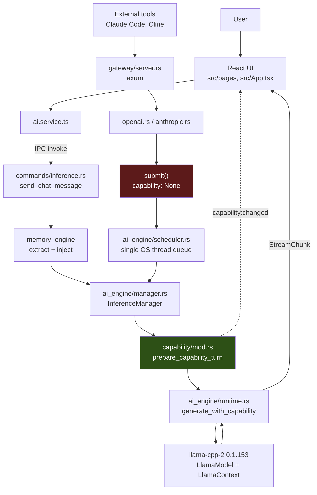
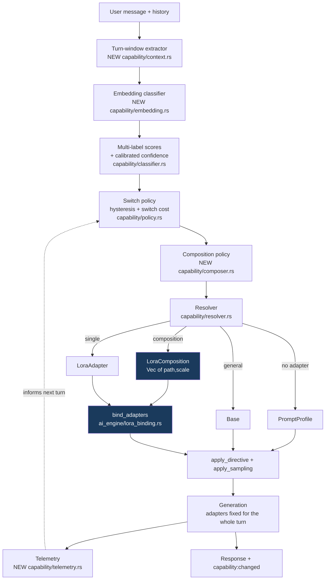
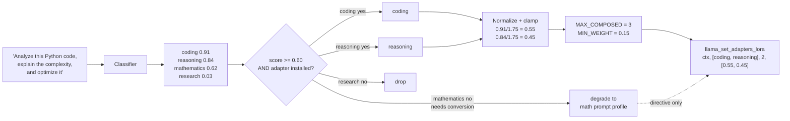
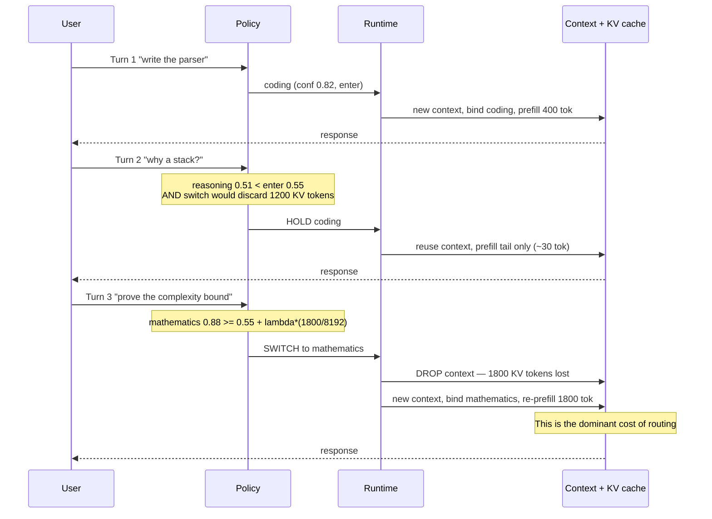
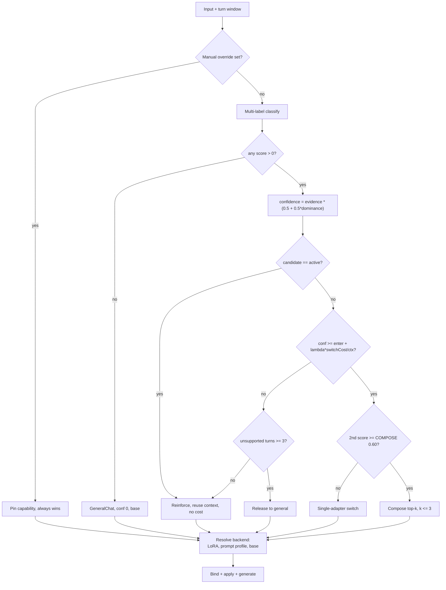

# Sarathi Autonomous LoRA Routing — Architecture Investigation

**Status:** Investigation only. No code was modified.
**Date:** 2026-08-20
**Scope:** What Sarathi has today, what the research ecosystem offers, and what
Sarathi should actually build.

---

## 1. Executive Summary

**Sarathi already has a working automatic LoRA routing engine, and it is better
than the question implied.** `src-tauri/src/capability/` classifies intent with
calibrated confidence, applies Schmitt-trigger hysteresis across conversation
turns, resolves a capability to a real backend, and binds a GGUF LoRA adapter
into a live llama.cpp context with no model reload and no process restart. The
frequently-cited "restart llama-server with a new `--lora` flag" cost does not
apply here.

What is missing is narrower and more specific than "a routing mechanism":

| Gap | Where |
|---|---|
| Only **one** adapter can be active at a time | `llama-cpp-2` 0.1.153 API limit, not a Sarathi design choice |
| Classification is **lexical**, not semantic | `capability/classifier.rs` — keyword tables |
| An adapter switch **destroys the KV cache** | `ai_engine/runtime.rs:929-942` |
| Gateway traffic **bypasses routing entirely** | `gateway/server.rs:382` |
| Two parallel, competing routers exist | `capability/` vs `model_intelligence/` |
| Three dead stub layers claim to be the LoRA system | `lora/traits.rs`, `src/services/lora.service.ts` |

**Recommendation:** do *not* adopt X-LoRA, MoLE, LoRA-Mixer, PHATGOOSE, SpectR,
or S-LoRA. Every one of them is structurally unreachable from a GGUF +
llama.cpp backend — traced in §9. Instead:

- **Tier 1 (no new research, ~2 weeks):** replace the keyword classifier with a
  local embedding-similarity router behind the *same* `ClassificationResult`
  contract; unify the two routers; wire the gateway; add switch-cost-aware
  hysteresis.
- **Tier 2 (one upstream patch, ~2 weeks):** patch `llama-cpp-2` to expose
  `llama_set_adapters_lora` with `n > 1`, which llama.cpp already supports, and
  add **request-level weighted composition** of up to 5 adapters. This is the
  single change that unlocks genuine multi-intent handling.
- **Explicitly out of scope:** token-level and layer-level routing. They require
  per-token host-side control of adapter scalings inside the decode loop, which
  GGUF/ggml does not expose at any price short of writing custom kernels.

---

## 2. Sarathi Current Architecture

### 2.1 Stack

- **Frontend:** React 19 + TypeScript + Vite (`src/`)
- **Backend:** Rust, Tauri 2 (`src-tauri/`)
- **Inference:** `llama-cpp-2` **0.1.153**, in-process (`src-tauri/Cargo.toml:63`)
- **Sidecars:** Python — memory engine and MCP research server only. **No Python
  is in the inference path.**

There is **no** vLLM, no Transformers, no PyTorch, no Ollama runtime, and no
PEFT at inference time. GGUF via llama.cpp is the only execution path.

### 2.2 Model lifecycle

`ai_engine/manager.rs` (`InferenceManager`) owns:

- `load_model` → reads GGUF metadata (`ai_engine/gguf_meta.rs`), plans GPU
  offload (`ai_engine/vram_planner.rs`), records package context, calls
  `self.capability.reset()` (`manager.rs:515`)
- `unload_model` → drops package context and capability stickiness
  (`manager.rs:543`)
- `send_chat_message(app_handle, messages, params, manual_capability)`
  (`manager.rs:586`) → `prepare_capability_turn` → `generate_with_capability`

`ai_engine/runtime.rs` (`LlamaCppRuntime`) holds the `LlamaModel`, a cached
`GenerationSession` (context + token list + `adapter_key`), and a
`LoraAdapterCache`.

`ai_engine/scheduler.rs` (`GenerationScheduler`) serializes all generation onto
**one dedicated OS thread**. Callers get a queue position. Cancellation is
lock-free via a cloned `AtomicBool`.

### 2.3 GPU / VRAM

- GPU support is **compile-time opt-in**: `cuda` / `vulkan` cargo features
  (`Cargo.toml:46-48`). A CPU-only binary can never use a GPU.
- `vram_planner.rs` reserves `OS_RESERVE_BYTES = 900 MB`, then a
  `COMPUTE_OVERHEAD_FRACTION = 0.12` of the remainder, then fits layers against
  exact KV-cache cost `n_layer × n_head_kv × (k_len + v_len) × 2` from GGUF
  metadata.
- This machine (measured, `nvidia-smi`): **NVIDIA GeForce RTX 5060 Laptop GPU,
  8151 MiB**.
- Certified reference package (`certification.json`):
  **`Qwen/Qwen2.5-7B-Instruct-GGUF::Q4_K_M::llama.cpp`**, tier `Certified`,
  confidence 92.9.

### 2.4 Context management

`runtime.rs` reuses the live context across turns and only prefills the
divergent tail (`reusable_prefix`, `runtime.rs:1014`), trimming the KV cache
with `clear_kv_cache_seq`. Prefill is chunked to `ctx.n_batch()` — both to avoid
llama.cpp's process-aborting oversized-batch path and to create cancellation
points.

### 2.5 Request path

```
Desktop:  Chat UI → ai.service.ts → send_chat_message (IPC)
            → memory extraction + injection (memory_engine)
            → InferenceManager::send_chat_message
            → prepare_capability_turn  ← ROUTING HAPPENS HERE
            → runtime.generate_with_capability

Gateway:  external tool → axum (gateway/server.rs) → openai.rs / anthropic.rs
            → submit() → GenerationJob { capability: None }   ← ROUTING SKIPPED
            → scheduler → InferenceManager
```

---

## 3. Current LoRA Architecture

### 3.1 What genuinely works

**Binding** — `ai_engine/lora_binding.rs`:

```rust
model.lora_adapter_init(path)          // → LlamaLoraAdapter, cached by PathBuf
ctx.lora_adapter_set(adapter, scale)   // → llama_set_adapters_lora(ctx, [p], 1, [s])
```

Bound *before* prefill so the prompt is processed against adapted weights
(`runtime.rs:951-974`). Logged init time in ms, bind time in **µs**.

**Caching** — `LoraAdapterCache` keyed by absolute path. Cleared on model unload.
The module documents a real leak: `LlamaLoraAdapter` has no `Drop` in
llama-cpp-2 0.1.153 and its pointer is `pub(crate)`, so
`llama_adapter_lora_free` is unreachable. Handles are dropped; the underlying
allocation is not freed until process exit.

**Conversion** — `lora/convert/` converts PEFT safetensors → GGUF in **pure
Rust**, no Python, no torch, no network. `bf16` is widened to `f32` (doubling
file size). Written to a temp name and atomically renamed. This closes the gap
that makes almost every HuggingFace adapter unusable, since virtually all ship
as PEFT safetensors and llama.cpp loads only GGUF.

**Validation** — `lora/validator.rs` → `Compatible | RequiresConversion |
Incompatible | NotPresent`. `capability/resolver.rs` re-verifies the GGUF magic
bytes before binding, so a truncated download fails in Rust instead of aborting
inside llama.cpp.

**Registry** — `adapter_manager/`. `ModelPackageManifest.adapters` is
`HashMap<String, AdapterManifestInfo>` **keyed by capability**. Metadata already
carried: `capability`, `status`, `adapterRuntimeStatus`, `repoId`, `localPath`,
`adapterFile`, `sizeBytes`, `baseModelMatch`, `targetModules`, `peftType`,
`checksum`, `scale`, `rank`, `alpha`, `architecture`, `source`,
`assignmentConfidence`.

**Lifecycle** — `adapter_manager/state_machine.rs`:
`NotFound → Searching → Found → Downloading → Verifying → Installing →
Registering → Ready`, with `Failed`/`Unavailable`. `validate_transition` blocks
automatic `READY → anything` regressions; only a user action may demote.

**Assignment** — `capability/assign.rs` maps a HuggingFace adapter to a
capability slot, preferring the author's declared tags (`Stated`) over a guess
from the repo name (`Suggested`), and returns `None` rather than mis-filing.

### 3.2 The capability layer (the actual router)

`capability/mod.rs` states its own purpose plainly: *"the working replacement for
what the build plan called the Dynamic LoRA Switching Engine."*

```
prompt → classify (confidence) → switch policy (hysteresis)
       → resolve backend → apply (directive + sampling, and/or LoRA binding)
```

**`classifier.rs`** — weighted lexical signals across 5 intents, scored
independently (not first-match-wins). Confidence combines two orthogonal terms:

```
dominance  = top_score / total_score           // contested vs clean
evidence   = top_score / (top_score + 1.5)     // thin vs well-supported
confidence = evidence × (0.5 + 0.5 × dominance)
```

Single-word signals match whole tokens (so `reason` does not fire on
"reasonable"). Returns `intent`, `confidence`, `raw_score`, `runner_up`.

**`policy.rs`** — `SwitchPolicy { enter_threshold: 0.55, exit_threshold: 0.35,
max_unsupported_turns: 3 }`. `validate()` rejects an inverted band. Manual
override short-circuits everything. Release from a capability requires 3
consecutive unsupported turns.

**`resolver.rs`** — degrading resolution:
`LoraAdapter { path, scale } → PromptProfile → Base`. A capability is *never*
dropped; only its fidelity varies. Rejection reasons are propagated to the UI.

**`profile.rs`** — `CapabilitySpec { directive, sampling }` per capability. Code
mode runs `temperature 0.20 / top_p 0.90 / top_k 40 / min_p 0.05 / repeat 1.05`.
`SamplingOverrides::apply_to` deliberately carries `tools` through, so a
capability profile cannot silently disarm tool-calling.

**`eval.rs`** — 64 labelled cases, `classifier_meets_accuracy_target` asserts
≥85%, plus a test requiring ≥5 cases per class. The module is candid that the
build plan's claimed "500 developer queries" never existed.

**Observability** — `CapabilityPayload` is emitted on `capability:changed`
*after* the capability is applied, carrying `badge`, `backend`, `confidence`,
`switched`, `reason`, `backendReason`, `adapterPath`, and the **effective**
sampling values. The frontend subscribes via
`ai.service.ts:listenCapabilityChanged`.

### 3.3 Dead and duplicated code

Three layers advertise LoRA functionality that does not exist:

1. **`lora/traits.rs`** — `LoRAManager`, `LoRARegistry`, `LoRARouter`,
   `LoRAComposer`. **Every method returns `Err("Not yet implemented")`.** Nothing
   implements them. `LoRAComposition { adapters: Vec<(String, f32)> }` is the
   shape composition would take, unimplemented.
2. **`src/services/lora.service.ts`** — four functions, all empty:
   `getLoRAs()` returns `[]`, `loadAdapter`/`switchAdapter`/`composeAdapters`
   return `undefined`.
3. **`model_intelligence/intent.rs` + `adapter_router.rs`** — the *legacy*
   router. `IntentDetector::classify` is the exact first-match-wins substring
   scan that `capability/classifier.rs` was written to replace, and
   `AdapterRouter::select_adapter_for_prompt` reimplements resolution without
   confidence, hysteresis, GGUF verification, or degradation. **It is still
   live**, exposed as the `route_prompt_capability` IPC command
   (`lib.rs`, `commands/intelligence.rs:74`), and `capability/classifier.rs`
   still imports `PromptIntent` from it.

---

## 4. Sarathi Requirements (Phase 2 answers)

| # | Question | Answer | Evidence |
|---|---|---|---|
| 1 | Base model(s) | Any GGUF; certified reference is Qwen2.5-7B-Instruct Q4_K_M | `certification.json` |
| 2 | Inference backend | llama.cpp via `llama-cpp-2` 0.1.153, in-process | `Cargo.toml:63`, `Cargo.lock` |
| 3 | Adapter format | **GGUF only** at runtime; PEFT safetensors accepted and converted locally | `resolver.rs:161-170`, `lora/convert/` |
| 4 | Current LoRA impl | Single-adapter hot bind to live context, path-keyed cache | `lora_binding.rs` |
| 5 | VRAM | 8151 MiB measured here; planner reserves 900 MB OS + 12% compute | `nvidia-smi`, `vram_planner.rs` |
| 6 | RAM | Not separately budgeted; adapters are small (§17) | — |
| 7 | Latency | No measured figures in repo. Adapter init logged in ms, bind in µs | `lora_binding.rs:110,138` |
| 8 | Dynamic adapter loading | **Yes** — `lora_adapter_init` at first use, no reload | `lora_binding.rs:95` |
| 9 | Multiple adapters in memory | **Yes** — cache holds many concurrently | `LoraAdapterCache` |
| 10 | Switch without base reload | **Yes** — model stays loaded; only the *context* is rebuilt | `runtime.rs:935-942` |
| 11 | Token-level routing | **No.** Requires per-token host control of scalings inside decode. Not exposed | §9 |
| 12 | Layer-level routing | **No.** ggml applies one scalar per adapter across all its tensors | §9 |
| 13 | Per-request routing | **Yes** — already how it works | `prepare_capability_turn` |
| 14 | Mid-generation switching | **No, and it should stay that way.** Would require discarding the KV cache mid-answer | `runtime.rs:934` |
| 15 | Concurrent users | Queued, **not batched**. One generation at a time | `scheduler.rs:1-19` |
| 16 | Key limitation | **Exactly one adapter may be active**, because `llama-cpp-2` hardcodes `n=1` | §4.1 |

### 4.1 The two hard constraints

**Constraint A — one adapter at a time (fixable).**

`llama-cpp-2` 0.1.153, `src/context.rs:334-355`:

```rust
pub fn lora_adapter_set(&self, adapter: &mut LlamaLoraAdapter, scale: f32) -> ... {
    let mut adapters = [adapter.lora_adapter.as_ptr()];
    let mut scales   = [scale];
    llama_set_adapters_lora(self.context.as_ptr(), adapters.as_mut_ptr(), 1, scales.as_mut_ptr())
}
```

The underlying llama.cpp call **replaces the entire adapter set**. Calling it
twice does not compose two adapters — the second call evicts the first. The C
API accepts `n > 1` (the llama.cpp server exposes exactly this as
`--lora-scaled` and per-request `"lora": [{"id":0,"scale":0.5}, ...]`), but the
Rust wrapper never passes it. And `LlamaLoraAdapter.lora_adapter` is
`pub(crate)` (`llama-cpp-2/src/model.rs:38`), and Sarathi has **no direct
`llama-cpp-sys-2` dependency**, so the raw pointer cannot be reached to call the
FFI directly. Composition therefore requires a **fork or an upstream PR**. That
is the single highest-leverage change available.

**Constraint B — a switch costs a full prefill (not fixable).**

`runtime.rs:929-942`:

```rust
let reuse_session = session.as_ref()
    .is_some_and(|s| s.n_ctx == ctx_size.get() && s.adapter_key == wanted_adapter);
```

A different adapter means `reuse_session == false`, the session is dropped, and
a new context is built. The comment is correct: *"an adapter is baked into
everything already decoded."* Every switch discards the whole conversation KV
cache and re-prefills the entire history. **The cost of routing is dominated by
this, not by classification.** The code already notes a real measurement:
*"on a CPU-only build a coding agent's system prompt measured ~98s"* of prefill.

---

## 5. The Problem Sarathi Must Solve (Phase 3)

Assessed against the two constraints above:

| Case | Support now? | Verdict |
|---|---|---|
| Single-intent ("write Python to sort this") | ✅ Works | Ship as-is |
| Reasoning ("explain why this is O(n²)") | ✅ Works | Ship as-is |
| **Mixed intent** ("analyze this code, explain the complexity, optimize it") | ❌ Picks one | **Tier 2 — the main gap** |
| Context-dependent drift (code → debug → explain) | ✅ Hysteresis handles it | Tune the thresholds |
| Ambiguous intent | ✅ Low confidence → hold/base | Ship as-is |
| General request | ✅ `GeneralChat` → base model | Ship as-is |
| Conversation-level adaptation | ⚠️ Last-turn only | **Tier 1 — add turn-window context** |
| Mid-generation switching | ❌ | **Do not build.** Cost is a full re-prefill |

**Realistic now:** single-intent, ambiguity handling, drift, explicit override.
**Tier 2:** multi-intent weighted composition.
**Never:** mid-generation and token-level switching on this backend.

---

## 6. Research Findings (Phase 4)

Grouped by what they actually require of the runtime.

### 6.1 Learned token/layer-level gating — requires Transformers

| Method | Source | Requires |
|---|---|---|
| **X-LoRA** | [arXiv:2402.07148](https://arxiv.org/abs/2402.07148), APL Mach. Learn. 2(2):026119; official [PEFT `XLoraModel`](https://huggingface.co/docs/peft/package_reference/xlora) | A **trained classifier**, and **two forward passes per step** (one to get hidden states, one to generate). PEFT docs: *"only works with models with a transformer architecture."* |
| **MoLE / MixLoRA / DynMoLE / LD-MoLE** | [arXiv:2404.13628](https://arxiv.org/pdf/2404.13628), [2504.00661](https://arxiv.org/pdf/2504.00661), [2509.25684](https://arxiv.org/pdf/2509.25684) | Trained top-k gating networks inside every adapted layer. Experts frozen, **gates trained**. |
| **LoRA-Mixer** | [arXiv:2507.00029](https://arxiv.org/pdf/2507.00029) | Serial attention routing; replaces projection matrices. Architectural surgery. |
| **PHATGOOSE** | [arXiv:2402.05859](https://arxiv.org/abs/2402.05859), ICML 2024 | Post-hoc **but still trains a gate per module**. Validated on T5-family. |

Maturity: X-LoRA is the only one with a first-party implementation in a
mainstream library (PEFT). The MoLE family is research-grade.

### 6.2 Training-free routing — still requires per-token host control

| Method | Source | Note |
|---|---|---|
| **Arrow** | [Ostapenko et al., ICML 2024](https://proceedings.mlr.press/v235/ostapenko24a.html), [arXiv:2405.11157](https://arxiv.org/pdf/2405.11157) | Zero-shot, training-free routing over a LoRA library using adapter parameter structure. **No gate training.** |
| **SpectR** | [arXiv:2504.03454](https://arxiv.org/pdf/2504.03454), COLM 2025 | Per-token, per-layer, **no training and no data**; eigenspace projection alignment. Reports up to +15% over other training-free methods. |

These are the most *conceptually* attractive results in the field — genuinely
training-free. Both still need to compute a routing decision **inside the
forward pass, per token, per layer**. §9.2 traces why that is unreachable here.

### 6.3 Optimization-based composition — offline, per task

| Method | Source | Note |
|---|---|---|
| **LoraHub** | [arXiv:2307.13269](https://arxiv.org/pdf/2307.13269), COLM 2024, [sail-sg/lorahub](https://github.com/sail-sg/lorahub) | CMA-ES gradient-free search for composition coefficients from **a few labelled examples of the target task**. No new parameters, no gradients. |

Not a runtime router — it is an offline weight-finder. But its output shape
(a coefficient per adapter) is exactly what Tier 2 needs, and its premise —
that a *scalar weight per adapter* is enough to get useful composition — is the
evidence that Sarathi's Tier 2 plan is sound.

### 6.4 Serving systems — solve a problem Sarathi does not have

| System | Source | Why it does not apply |
|---|---|---|
| **S-LoRA** | [arXiv:2311.03285](https://arxiv.org/abs/2311.03285), [S-LoRA/S-LoRA](https://github.com/S-LoRA/S-LoRA) | Thousands of adapters, unified paging, custom CUDA kernels, heterogeneous batching. Sarathi has **≤5 adapters and no batching**. |
| **Punica** | SGMV kernel | Same: batching many adapters in one matmul. |
| **dLoRA** | Dynamic merge + request migration across replicas | Sarathi is single-process, single-GPU, single-user-ish. |

These target multi-tenant datacenter serving. Sarathi is a local desktop app
with one loaded model and a serialized queue.

### 6.5 Semantic request routing — directly applicable

| System | Source | Note |
|---|---|---|
| **vLLM Semantic Router** | [blog](https://vllm-project.github.io/2025/09/11/semantic-router.html), [vllm-project/semantic-router](https://github.com/vllm-project/semantic-router) | Production intent-aware routing using a **ModernBERT classifier** in front of inference. Released Sept 2025. |
| **aurelio-labs/semantic-router** | [GitHub](https://github.com/aurelio-labs/semantic-router) | Embedding-distance classification of utterances into intent routes, **no LLM call**. |

This is the closest analogue to what Sarathi does — and it validates the
architecture Sarathi already chose: *a cheap classifier in front of the model,
deciding how the request is served*. The difference is only that these route to
**models**, while Sarathi routes to **adapters**.

### 6.6 llama.cpp native capability (primary source)

From the [llama.cpp server README](https://github.com/ggml-org/llama.cpp/blob/master/tools/server/README.md)
and [GGUF-my-LoRA](https://huggingface.co/blog/ngxson/gguf-my-lora):

- `--lora FNAME` (repeatable), `--lora-scaled FNAME:SCALE`
- `--lora-init-without-apply` — load at scale 0, activate later
- `GET/POST /lora-adapters` — adjust global scales; scale 0 disables
- Per-request `"lora": [{"id":0,"scale":0.5},{"id":1,"scale":1.1}]`
- Works with a **quantized** base (`Meta-Llama-3.1-8B-Instruct-Q4_K_M.gguf` is
  the doc's own example)
- Stated limitation: *"Requests with different LoRA configurations will not be
  batched together, which may result in performance degradation."*

**llama.cpp itself supports everything Tier 2 needs.** The gap is purely in the
Rust binding.

---

## 7. Candidate Comparison (Phase 5)

`Current+` = the existing capability layer with an embedding classifier
(Tier 1); `LC-multi` = llama.cpp native multi-adapter composition (Tier 2).

| Criterion | X-LoRA | MoLE family | PHATGOOSE | Arrow | SpectR | LoraHub | S-LoRA | Semantic router | **Current+** | **LC-multi** |
|---|---|---|---|---|---|---|---|---|---|---|
| Intent understanding | High (learned) | High | High | Med | High | n/a | n/a | High | Med→High | High |
| Semantic routing | Implicit | Implicit | Implicit | Param-space | Param-space | n/a | n/a | **Explicit** | **Explicit** | **Explicit** |
| Single-intent | ✅ | ✅ | ✅ | ✅ | ✅ | ✅ | ✅ | ✅ | ✅ | ✅ |
| Multi-intent | ✅ | ✅ | ✅ | ✅ | ✅ | ✅ | ❌ | ❌ | ❌ | ✅ |
| Multi-adapter active | ✅ | ✅ | ✅ | ✅ | ✅ | ✅ | ✅ | ❌ | ❌ | ✅ |
| Token-level | ✅ | ✅ | ✅ | ✅ | ✅ | ❌ | ❌ | ❌ | ❌ | ❌ |
| Layer-level | ✅ | ✅ | ✅ | ✅ | ✅ | ❌ | ❌ | ❌ | ❌ | ❌ |
| Runtime switching | ✅ | ✅ | ✅ | ✅ | ✅ | ❌ | ✅ | ✅ | ✅ | ✅ |
| Composition | ✅ | ✅ | ✅ | ✅ | ✅ | ✅ | ❌ | ❌ | ❌ | ✅ (weighted sum) |
| Confidence-aware | ⚠️ softmax | ⚠️ | ⚠️ | ⚠️ | ⚠️ | ❌ | n/a | ✅ | ✅ **calibrated** | ✅ |
| "No adapter" option | ⚠️ | ⚠️ | ⚠️ | ⚠️ | ⚠️ | ❌ | ✅ | ✅ | ✅ **explicit** | ✅ |
| Conversation awareness | ❌ | ❌ | ❌ | ❌ | ❌ | ❌ | ❌ | ⚠️ | ✅ **hysteresis** | ✅ |
| Latency | **2× forward** | +gate | +gate | +proj | +proj | offline | low | ~10 ms | **<1 ms** | <1 ms + prefill |
| VRAM | base + N + classifier | + gates | + gates | + N | + N | + N | paged | +0 | +1 adapter | + N adapters |
| Impl. complexity | High | High | High | High | High | Med | Very high | Low | **Very low** | **Medium** |
| Compatible with Sarathi | ❌ | ❌ | ❌ | ❌ | ❌ | ❌ | ❌ | ✅ | ✅ | ✅ |
| Compatible with llama.cpp | ❌ | ❌ | ❌ | ❌ | ❌ | ❌ | ❌ | ✅ | ✅ | ✅ |
| Maturity | Med (in PEFT) | Low | Low | Low | Low | Med | High | Med | **Shipping** | **In llama.cpp** |
| Official impl. | ✅ PEFT | partial | ✅ | ✅ | ✅ | ✅ | ✅ | ✅ | — | ✅ C API |
| Community support | Med | Low | Low | Low | Low | Med | Med | Growing | — | High |
| Research evidence | Strong | Strong | Strong | Strong | Strong | Strong | Strong | Applied | Weak (64 cases) | n/a |
| Production suitability | Low | Low | Low | Low | Low | Med | High | High | **High** | **High** |
| Debuggability | Poor (opaque scalings) | Poor | Poor | Poor | Poor | Med | Med | **Good** | **Good** | **Good** |
| Maintainability | Low | Low | Low | Low | Low | Med | Low | High | **High** | **High** |

The right-hand columns are not better research. They are the only columns whose
"Compatible with llama.cpp" cell is a ✅.

---

## 8. Recommended Approach

**Name: Confidence-Gated Semantic Capability Routing with Request-Level
Weighted Adapter Composition.**

It is a *combination*, deliberately:

1. **Architecture from the vLLM Semantic Router / aurelio semantic-router
   pattern** — a cheap explicit classifier in front of inference, deciding how
   the request is served. Already Sarathi's architecture; §6.5 confirms it is
   the production-validated one.
2. **Composition semantics from LoraHub** — a scalar coefficient per adapter,
   summed. LoraHub's result is the evidence that scalar-weighted composition of
   independently-trained LoRAs produces useful behaviour without retraining.
3. **Mechanism from llama.cpp's native multi-adapter API** — `--lora-scaled` /
   `llama_set_adapters_lora(ctx, adapters, n, scales)`. Already implemented
   upstream in C; needs a Rust binding.
4. **Conversation policy from Sarathi's own `capability/policy.rs`** — hysteresis
   is Sarathi-original and, notably, is *absent from every paper surveyed*.
   None of X-LoRA, MoLE, Arrow, SpectR, or PHATGOOSE models conversation-level
   stability at all. Keep it; it is a genuine advantage.

### Why this and not the alternatives

- **Not X-LoRA:** doubles forward-pass cost, needs a trained classifier per
  adapter set, and PEFT's own docs restrict it to Transformers models. On an
  8 GB laptop GPU running a Q4 7B, a 2× forward pass is not a tuning
  regression — it is the difference between usable and unusable.
- **Not MoLE / LoRA-Mixer / PHATGOOSE:** all require *training a gate*. Sarathi's
  adapters are third-party HuggingFace downloads discovered at runtime. There is
  no training corpus, no training loop, and no reason to add one.
- **Not Arrow / SpectR:** the most tempting, because they are genuinely
  training-free. They are rejected on a mechanical ground traced in §9.2, not a
  quality one.
- **Not S-LoRA / Punica / dLoRA:** they optimize batched multi-tenant serving.
  Sarathi has ≤5 adapters and a serialized single-job queue.
- **Not LoraHub directly:** it needs labelled examples of the target task at
  composition time. Sarathi has a user typing one message.

---

## 9. Direct Compatibility Analysis (Phase 6)

### 9.1 Why multi-adapter is *nearly* usable — and exactly what blocks it

The blocker is three lines of Rust, and it is fully traceable:

```
llama.cpp C API            llama_set_adapters_lora(ctx, adapters**, n, scales*)   ← supports n > 1
        ↓
llama-cpp-2 context.rs:334 lora_adapter_set(adapter, scale)                       ← hardcodes n = 1
        ↓
llama-cpp-2 model.rs:38    lora_adapter: NonNull<...>  is pub(crate)              ← pointer unreachable
        ↓
Sarathi Cargo.toml         no llama-cpp-sys-2 dependency                          ← cannot bypass
        ↓
lora_binding.rs:135        ctx.lora_adapter_set(adapter, scale)                    ← one adapter, always
```

Each of the four rows independently prevents composition. Fixing the top one
fixes all of them.

**Fix (in order of preference):**
1. Upstream PR to `llama-cpp-2` adding
   `LlamaContext::set_lora_adapters(&[(&mut LlamaLoraAdapter, f32)])`. Small,
   mechanically obvious, and useful to every consumer of the crate. This is
   also the natural place to expose `llama_adapter_lora_free` and close the
   leak documented in `lora_binding.rs:12-22`.
2. `[patch.crates-io]` fork pinned in `src-tauri/Cargo.toml` while the PR lands.
3. Add `llama-cpp-sys-2` as a direct dependency and re-init adapters through raw
   FFI. **Not recommended** — it duplicates handle ownership and would make the
   existing `unsafe impl Send for SendAdapter` reasoning harder to keep sound.

**Expected performance after the fix:** `llama_set_adapters_lora` is a scale-
array assignment, not a weight merge. ggml applies each adapter as an extra
low-rank matmul during the forward pass. N adapters ⇒ N extra low-rank matmuls
per adapted tensor. For rank 16–32 on a 7B, this is a small percentage of the
base matmul cost. VRAM grows by the sum of adapter sizes (§17), not by anything
proportional to N².

### 9.2 Why token/layer-level routing is genuinely unreachable

Trace it mechanically:

1. **The routing signal lives inside the graph.** X-LoRA, Arrow, and SpectR all
   compute per-token scalings from hidden states *between* layers.
2. **llama.cpp evaluates the whole graph in one `llama_decode` call.** Sarathi's
   loop is `batch.add(...); ctx.decode(&mut batch)?;` — the host regains control
   only after **all** layers of **all** tokens in the batch have run.
3. **Adapter scales are set outside the graph.** `llama_set_adapters_lora`
   assigns a scalar per adapter, applied uniformly to every tensor that adapter
   touches, and it takes effect on the *next* decode.
4. **Therefore the finest granularity reachable from the host is one scale-set
   per `decode` call.** Per-token would mean `n_batch = 1` — destroying prefill
   throughput, the dominant cost — *and* still could not vary the scale per
   layer within that single token.
5. **Layer-level is worse:** the ggml adapter representation carries one scale
   per adapter, not one per layer. Layer-wise scalings would require changing
   ggml's adapter struct and every kernel that reads it.

The only route to token- or layer-level routing on this stack is writing custom
ggml kernels and a parallel graph-building path. That is a multi-month effort in
C++ inside a vendored llama.cpp fork, for a capability whose benefit over
request-level weighted composition is unproven **on a 5-adapter library**. All
of the token-level papers evaluate on libraries of dozens to hundreds of
experts, where the routing problem is genuinely hard. Sarathi's routing problem
is picking a weighting over ≤5 slots.

**This is the central honest finding of the investigation: the research
frontier is solving a harder problem than Sarathi has.**

---

## 10. Required Modifications

### Tier 1 — no new dependencies on research

| # | Change | Files |
|---|---|---|
| T1.1 | Replace lexical scoring with local embedding-similarity classification behind the unchanged `ClassificationResult` contract | `capability/classifier.rs` (new `capability/embedding.rs`) |
| T1.2 | Classify over a **turn window**, not just the last message | `capability/mod.rs:143` |
| T1.3 | Delete the legacy router; move `PromptIntent` into `capability/` | `model_intelligence/intent.rs`, `adapter_router.rs`, `commands/intelligence.rs`, `lib.rs` |
| T1.4 | Delete the stub trait layer and stub frontend service | `lora/traits.rs`, `src/services/lora.service.ts` |
| T1.5 | Switch-cost-aware hysteresis: require higher confidence when a switch would discard more cached tokens | `capability/policy.rs` |
| T1.6 | Wire the gateway behind the existing `apply_capabilities` flag | `gateway/server.rs:382`, `gateway/state.rs` |
| T1.7 | Grow `eval.rs` from 64 to ≥300 cases, including multi-intent labels | `capability/eval.rs` |
| T1.8 | Routing telemetry: decision, confidence, switch, prefill tokens discarded | new `capability/telemetry.rs` |

### Tier 2 — composition

| # | Change | Files |
|---|---|---|
| T2.1 | Upstream/patch `llama-cpp-2` for `n > 1` adapters + `Drop` | external, then `Cargo.toml` |
| T2.2 | `bind_adapters(ctx, &[(adapter, scale)])` | `ai_engine/lora_binding.rs` |
| T2.3 | `CapabilityBackend::LoraComposition { adapters: Vec<(PathBuf, f32)> }` | `capability/profile.rs` |
| T2.4 | Multi-label classification output + weight derivation | `capability/classifier.rs` |
| T2.5 | Composition policy: how many, minimum weight, normalization, cap | new `capability/composer.rs` |
| T2.6 | `adapter_key` becomes an ordered multi-adapter fingerprint | `ai_engine/runtime.rs:922-937` |
| T2.7 | Directive blending for composed capabilities | `capability/mod.rs:186` |

---

## 11. Proposed Architecture (Phase 8)

The pipeline in the brief is close to correct, with two changes: **routing runs
once per turn, never mid-generation**, and **monitoring feeds the *next* turn,
not a re-route of the current one**. Re-routing mid-answer would discard the KV
cache, which is precisely the cost this design exists to avoid.

```
User message
  ↓
Memory injection (existing, memory_engine)
  ↓
Turn-window context extraction        ← T1.2
  ↓
Capability analysis (multi-label + confidence)
  ↓
Switch policy (hysteresis + switch cost)   ← T1.5
  ↓
Composition policy (how many, what weights) ← T2.5
  ↓
Resolution (LoRA composition → single LoRA → prompt profile → base)
  ↓
Bind adapters + apply directive + apply sampling
  ↓
Inference (single decode loop, adapters fixed for the whole turn)
  ↓
Telemetry → feeds next turn's policy       ← T1.8
  ↓
Response
```

---

## 12. Intent / Capability Representation (Phase 9)

The example format in the brief is close. Two corrections.

**Correction 1 — `capabilities` must be multi-label scores, not a softmax.**
"Analyze this Python code and explain its complexity" is genuinely *both*
coding and reasoning. A softmax forces them to compete for one probability mass
and understates both. Use independent per-capability scores in `[0,1]`.

**Correction 2 — adapter weights must be separated from capability scores.**
Scores describe the *request*. Weights describe *how strongly to bind an
adapter*, and are bounded by VRAM, availability, and a stability cap. Conflating
them means an unavailable adapter silently changes the interpretation of the
request.

```jsonc
{
  "capabilities": { "coding": 0.91, "reasoning": 0.84, "mathematics": 0.62, "research": 0.03 },
  "confidence": 0.88,              // calibrated, existing evidence × dominance formula
  "dominant": "coding",
  "runnerUp": ["reasoning", 0.84],

  "decision": {
    "kind": "compose",             // hold | switch | compose | base
    "reason": "coding 0.91 and reasoning 0.84 both exceed compose threshold 0.60",
    "previous": "coding",
    "switchCostTokens": 0          // KV tokens this decision discards
  },

  "selectedAdapters": [
    { "capability": "coding",    "path": "adapters/coding/adapter.gguf",    "weight": 0.55, "source": "manifest" },
    { "capability": "reasoning", "path": "adapters/reasoning/adapter.gguf", "weight": 0.35, "source": "manifest" }
  ],
  "degraded": [
    { "capability": "mathematics", "backend": "prompt-profile",
      "reason": "adapter is PEFT safetensors and needs GGUF conversion" }
  ]
}
```

### Design decisions, argued

**Classification vs embedding similarity → embedding similarity, then a linear
head.** The current lexical classifier's failure mode is structural, not a
tuning problem: it cannot score a prompt whose vocabulary it has never seen.
"Make this run faster on large inputs" contains no signal in any table and
scores 0 across all five intents. An embedding router handles it because
*meaning*, not vocabulary, drives the match. This is exactly what
aurelio-labs/semantic-router and the vLLM Semantic Router do.

**Learned vs deterministic → deterministic, with learned representations.**
Store a small set of labelled utterances per capability (the `eval.rs` set is
already half of one), embed them once at startup, and classify by
max-cosine-similarity to each capability's utterance set. No training loop, no
checkpoint, no drift. Adding a capability means adding utterances to a file.
This keeps the property that makes the current system debuggable: you can always
answer *"why did it choose coding?"* with *"because it was closest to these
three utterances."* X-LoRA cannot answer that question at all.

**Single-label vs multi-label → multi-label.** Required for the mixed-intent
case, which is the actual gap.

**Confidence → keep the existing `evidence × (0.5 + 0.5 × dominance)`
formulation.** It is well-reasoned and already calibrated against the policy
thresholds. Recompute the two terms from similarity scores rather than keyword
weights.

**Thresholding → three bands, not two.**
`≥ enter (0.55)` switch · `compose ≥ 0.60` add a second adapter ·
`< exit (0.35)` count toward release.

**Fallback → keep the existing degrading resolver.** It is the best-designed
piece in the module: a capability is never dropped, only downgraded, and the
reason is surfaced.

**Adapter weighting → normalize scores over selected adapters, then cap.**
```
raw_i    = capability_score_i  for selected i
w_i      = raw_i / Σ raw       (sums to 1.0)
w_i      = clamp(w_i × GLOBAL_SCALE, MIN_WEIGHT, MAX_WEIGHT)
```
with `GLOBAL_SCALE ≈ 1.0`, `MAX_WEIGHT = 1.0` (never exceed trained strength),
`MIN_WEIGHT = 0.15` (below this, drop the adapter rather than bind it — a
near-zero adapter costs a full re-prefill and buys nothing).

**Context-aware routing → exponentially-weighted turn window.** Score the last
N user turns with geometrically decaying weight. "ok now add error handling"
carries almost no signal alone; with the previous turn weighted in, it is
unambiguously coding.

**Token-level → not applicable.** §9.2.

---

## 13. Adapter Management Design

Largely already built. Additions:

- **Registry:** `ModelPackageManifest.adapters` is already
  `HashMap<capability, AdapterManifestInfo>`. Keep the one-adapter-per-slot
  invariant — it bounds the library to 5, which is what makes deterministic
  composition tractable.
- **Cache:** `LoraAdapterCache` is unbounded and leaks by design (documented).
  With ≤5 adapters at tens of MB each this is acceptable *today*. Add an LRU
  bound and a real `Drop` **only after** T2.1 exposes
  `llama_adapter_lora_free` — until then, eviction frees nothing and only
  forces re-initialization.
- **Preloading:** initialize all `Installed`+`Compatible` adapters on model load.
  At ≤5 adapters this is a one-off cost of a few hundred ms that removes first-
  switch latency entirely.
- **Memory-mapped adapters:** llama.cpp handles this internally; nothing for
  Sarathi to do.

---

## 14. Dynamic Switching Design

Switching happens **at turn boundaries only**. The mechanism:

1. Compute `wanted = ordered list of (path, scale)` for this turn.
2. If `wanted == session.adapter_key`, reuse the context. **No cost.**
3. Otherwise, weigh the switch: `switch_cost = live.tokens.len()` — the KV
   tokens that will be discarded. Require
   `confidence ≥ enter_threshold + λ · min(1, switch_cost / ctx_size)`.
   A switch early in a conversation is nearly free; a switch 6k tokens in must
   clear a much higher bar. **This is the single most valuable Tier-1 change**,
   because it directly attacks the dominant cost identified in §4.1B.
4. On switch: drop the session, build a new context, bind the new set *before*
   prefill, re-prefill.

---

## 15. Multi-Intent Design

```
scores = { coding: 0.91, reasoning: 0.84, mathematics: 0.62, research: 0.03 }

selected = scores
  .filter(score >= COMPOSE_THRESHOLD 0.60)
  .filter(adapter is Installed && Compatible)
  .sorted desc
  .take(MAX_COMPOSED 3)

if selected.len() == 0  → prompt profile of the dominant capability, or base
if selected.len() == 1  → single-adapter bind (current behaviour)
if selected.len() >= 2  → weighted composition (Tier 2)
```

`MAX_COMPOSED = 3` is a judgement call, not a measured optimum: beyond three
independently-trained low-rank deltas summed onto the same weights, interference
is likely and there is no evidence base at this scale. Treat it as a tunable
with a default, and measure it in Phase H.

**Directive blending:** concatenate the selected capabilities' directives in
weight order. The `apply_directive` function already appends to an existing
system message rather than overwriting, so memory context survives — that
property must be preserved.

---

## 16. Fallback Design (Phase 10)

| Case | Behaviour |
|---|---|
| **1. No specialized intent** | `GeneralChat`, confidence 0 → base model, unmodified. Already correct. |
| **2. Two equally strong intents** | Dominance ≈ 0.5 collapses confidence below `enter`. Tier 1: hold. Tier 2: if both clear `COMPOSE_THRESHOLD`, compose — which is the *right* answer and why Tier 2 matters. |
| **3. Three or more intents** | Take top 3 by score. Beyond that, weights fall below `MIN_WEIGHT` anyway. |
| **4. Very low confidence** | Hold the active capability (hysteresis). Never switch on a guess. |
| **5. User changes task midway** | Requires `≥ enter` plus the switch-cost margin (§14). Sustained drift releases after `max_unsupported_turns = 3`. |
| **6. Adapter produces poor output** | **Not automatically detectable, and Sarathi should not pretend otherwise.** Output-quality-triggered re-routing needs a judge model — more expensive than the generation it is judging. Instead: surface the badge (already done) and give the user a one-click "switch to base and regenerate". Honest and cheap. |
| **7. Adapter unavailable** | Degrade to prompt profile with a stated reason. Already implemented in `resolver.rs`. |
| **8. VRAM-constrained** | Adapters are small relative to the base (§17); the realistic constraint is composed count, not any single adapter. Reuse `vram_planner`'s reserve accounting to cap `MAX_COMPOSED` dynamically. |
| **9. Concurrent different adapters** | The scheduler already serializes. Add **adapter affinity**: among queued jobs, prefer one whose adapter set matches the live context, so a burst of mixed traffic does not re-prefill on every job. Bound the reordering (max N jumps) so no job starves. Matches llama.cpp's own note that differing LoRA configs cannot be batched. |
| **10. Multiple capabilities in one request** | Tier 2 composition. |
| **11. General knowledge + specialization** | Inherent: LoRA is a *delta* on the base. Scaling below 1.0 moves further toward base behaviour — a knob, not a problem. |
| **12. Explicit user selection** | **Overrides automatic routing, unconditionally.** Already implemented (`policy.rs:147-154`) and correct: a user who names an adapter has information the classifier does not. Extend to accept an explicit *set* with weights in Tier 2. |

---

## 17. Performance Analysis (Phase 11)

**Measured (this environment):**
- GPU: RTX 5060 Laptop, **8151 MiB** (`nvidia-smi`)
- Adapter init and bind are instrumented — `lora_binding.rs:110` logs init in
  **ms**, `:138` logs bind in **µs**
- Prefill cost is documented in-tree: *"on a CPU-only build a coding agent's
  system prompt measured ~98s"* (`runtime.rs:999-1001`)
- `EVAL_SET` = **64 cases**, asserted ≥85% accuracy (`eval.rs:250-257`)

**Estimated** — clearly labelled as such:

| Quantity | Estimate | Basis |
|---|---|---|
| Adapter file size (Qwen2.5-7B, r=16, 7 target modules) | **~80–160 MB** | 28 layers × 7 modules × r16 × dims × 4 bytes (converter widens bf16→**f32**, `safetensors_reader.rs:13-19`) |
| Adapter file size (r=32) | ~160–320 MB | linear in rank |
| Adapter init (`lora_adapter_init`) | **50–300 ms** first use | file read + upload; cached thereafter |
| `lora_adapter_set` bind | **<1 ms** | scale-array assignment, no merge; module logs µs |
| Classification (lexical, current) | **<1 ms** | tokenize + 5 table scans |
| Classification (embedding, Tier 1) | **5–20 ms** | one small-encoder forward on CPU |
| **Adapter switch — total** | **dominated by re-prefill** | see below |
| Re-prefill, 2k-token history, GPU-offloaded 7B Q4 | **~2–6 s** | est. 400–1000 tok/s prefill |
| Re-prefill, 8k-token history | **~8–20 s** | linear |
| Re-prefill, CPU-only | **tens of seconds to minutes** | the in-tree ~98s figure |
| Composition overhead (N adapters vs 1) | **a few % per adapter** | N extra rank-r matmuls per adapted tensor |
| VRAM: base Qwen2.5-7B Q4_K_M | ~4.4 GB | quantized weights |
| VRAM: + KV @ 8k ctx | ~+0.9 GB | `vram_planner` exact formula |
| VRAM: + 5 preloaded adapters | **~+0.4–0.8 GB** | 5 × 80–160 MB |
| **Total on an 8 GB card** | ~5.7–6.1 GB vs ~7.2 GB usable after the 900 MB OS reserve | fits, with margin |

**The single most important performance conclusion:** classification cost is
irrelevant (µs–ms). Adapter binding cost is irrelevant (µs). **Switch cost is
everything, and it is a KV-cache cost, not a LoRA cost.** Any optimization
effort that does not reduce the *frequency* of switches is misdirected. That is
why switch-cost-aware hysteresis (T1.5) and adapter affinity in the scheduler
(Case 9) are ranked above every other performance item.

Batching implications: n/a — Sarathi does not batch across requests, and
llama.cpp explicitly cannot batch differing LoRA configs anyway.

---

## 18. Failure Modes (Phase 18)

| Failure | Cause | Detection | Recovery | User sees |
|---|---|---|---|---|
| Adapter thrashing | Alternating intents near threshold | Switch rate in telemetry (T1.8) | Hysteresis + switch-cost margin | Nothing — stable behaviour |
| Silent base-model fallback | Bind fails at runtime | `runtime.rs:964-972` logs a warning but **does not tell the UI** | **Gap:** emit a corrected `capability:changed` after a failed bind | Currently a badge claiming `lora` while running base — **a real bug to fix** |
| Wrong capability slot | Adapter misassigned from tags | `assignmentConfidence: suggested` | User reassigns via `set_adapter_capability` | Confidence shown in the details panel |
| Corrupt adapter | Truncated download | GGUF magic check, `resolver.rs:178` | Degrade to prompt profile with reason | "needs conversion" / "missing on disk" |
| Base-model mismatch | Adapter for a different architecture | `baseModelMatch`, converter's `arch.rs` | Refuse at conversion | Install fails with a reason |
| Adapter leak | No `Drop` in llama-cpp-2 | Cache size in telemetry | Bounded (≤5 × ~100 MB); real fix is T2.1 | Nothing at this scale |
| Context rebuild storm | Mixed-adapter gateway burst | Prefill tokens/minute in telemetry | Adapter affinity in scheduler | Queue positions grow |
| Routing loop | Composition policy oscillating between sets | Same-turn re-entry counter | Hard cap: one routing decision per turn | Nothing |
| Hallucinated adapter name | Manual override naming a nonexistent capability | `CapabilitySpec::builtin` → `is_noop()` | Falls back to base (`resolver.rs:82-88`) | Base model, logged |
| Sampling override breaks a client | Gateway capability routing enabled | — | Off by default (`apply_capabilities: false`) | — |

---

## 19. Security and Reliability (Phase 17)

Existing safeguards, verified in code:

- **Format validation before load** — magic-byte check keeps failures in Rust
  rather than aborting inside llama.cpp (`resolver.rs:178`)
- **Runtime-status gating** — `requires_conversion` / `incompatible` are honoured
  even when `status == Installed` (`resolver.rs:142-152`)
- **State-machine protection** — automatic `READY → *` transitions are blocked;
  only user actions may demote (`state_machine.rs:80-95`)
- **Atomic conversion** — temp file + same-directory rename (`convert/mod.rs`)
- **Weight-file floor** — `MIN_ADAPTER_WEIGHT_BYTES = 100_000` rejects error
  pages and stubs
- **Unknown capability → base**, never a plausible-looking wrong slot
- **`SamplingOverrides::apply_to` carries `tools` through**, so a capability
  profile cannot silently disarm tool-calling

Gaps to close:

- **Arbitrary path loading:** `AdapterManifestInfo.adapter_file` is joined onto
  `package_dir` with no traversal check. A hand-edited or maliciously-crafted
  manifest containing `../../` reaches outside the package. **Canonicalize and
  assert containment before binding.**
- **Scale bounds:** `scale` comes from the manifest. `resolver.rs` notes a
  hand-edited manifest is the only way one gets there, but the clamp should be
  explicit — llama.cpp accepts negative and large scales (the GGUF-my-LoRA post
  demonstrates `-5.0`), which produces garbage output rather than an error.
- **Post-bind-failure UI correction** — see §18.

---

## 20. Mermaid Diagrams (Phase 12)

### Diagram 1 — Current architecture (actual paths)



Red node = routing is bypassed for gateway traffic today.

### Diagram 2 — Proposed routing architecture



### Diagram 3 — Multi-intent routing



### Diagram 4 — Runtime switching and its true cost



### Diagram 5 — Adapter lifecycle

```mermaid
stateDiagram-v2
    [*] --> NotFound
    NotFound --> Searching: HF discovery
    Searching --> Found: adapter matched to base
    Found --> Downloading
    Downloading --> Verifying: validator.rs
    Verifying --> Installing: RequiresConversion, lora/convert
    Verifying --> Registering: already GGUF
    Installing --> Registering: atomic rename adapter.gguf
    Registering --> Ready: written to manifest.json

    Ready --> Cached: lora_adapter_init (first use)
    Cached --> Bound: lora_adapter_set(scale)
    Bound --> Inference
    Inference --> Bound: same adapter next turn, context reused
    Bound --> Cached: different adapter, context dropped
    Cached --> Ready: model unload, LoraAdapterCache::clear

    Downloading --> Failed
    Verifying --> Failed
    Installing --> Failed
    Failed --> Searching: user retry
    Ready --> Unavailable: user removes
    Unavailable --> [*]

    note right of Cached
        Handle leaks until process exit:
        no Drop in llama-cpp-2 0.1.153
    end note
```

### Diagram 6 — Decision flow



---

## 21. Actual File and Symbol Mapping (Phase 13)

### Files that change

| Path | Exists today | Change |
|---|---|---|
| `src-tauri/src/capability/classifier.rs` | Weighted lexical signals, `IntentClassifier::classify` | Multi-label output; delegate scoring to `embedding.rs`; keep the `ClassificationResult` shape and confidence formula |
| `src-tauri/src/capability/policy.rs` | `SwitchPolicy`, `CapabilityTracker::decide`, `SwitchDecision` | Add `switch_cost_lambda`; add `SwitchDecision::Compose`; `decide` takes live KV token count |
| `src-tauri/src/capability/profile.rs` | `CapabilityBackend { Base, PromptProfile, LoraAdapter }` | Add `LoraComposition { adapters: Vec<(PathBuf, f32)> }`; `label()` → `"lora-composed"` |
| `src-tauri/src/capability/resolver.rs` | `CapabilityResolver::resolve`, `try_bind_adapter`, `verify_gguf_magic` | `resolve_many` for composition; **add path-traversal containment check**; **clamp scale** |
| `src-tauri/src/capability/mod.rs` | `CapabilityLayer::resolve_turn`, `apply_directive`, `apply_sampling`, `CapabilityPayload` | Accept turn window; blended directives; payload carries the adapter list |
| `src-tauri/src/capability/eval.rs` | 64 cases, `classifier_meets_accuracy_target` | Grow to ≥300; add multi-label cases and a composition-precision metric |
| `src-tauri/src/ai_engine/lora_binding.rs` | `LoraAdapterCache`, `bind_adapter` | Add `bind_adapters(ctx, &[(&mut LlamaLoraAdapter, f32)])`; `preload(paths)`; real `Drop` once upstream allows |
| `src-tauri/src/ai_engine/runtime.rs` | `generate_with_capability`, `GenerationSession { adapter_key }`, reuse check at `:935` | `adapter_key` → ordered `Vec<(PathBuf, u32)>`; **emit a corrected capability payload when a bind fails** |
| `src-tauri/src/ai_engine/manager.rs` | `prepare_capability_turn` (`:648`), `send_chat_message` (`:586`) | Pass turn window and live KV token count into `resolve_turn` |
| `src-tauri/src/ai_engine/scheduler.rs` | `GenerationJob { capability }`, single-thread queue | Bounded adapter-affinity reordering |
| `src-tauri/src/gateway/server.rs` | `submit()` with `capability: None` (`:382`) | Honour `GatewayConfig::apply_capabilities` |
| `src-tauri/src/adapter_manager/mod.rs` | `AdapterManifestInfo`, `ModelPackageManifest` | Add `capabilities: Vec<String>`, `routingUtterances: Vec<String>` (both `serde(default)`) |
| `src-tauri/src/lib.rs` | `invoke_handler![...]` | Remove `route_prompt_capability`; add capability status/override commands |
| `src/services/ai.service.ts` | `listenCapabilityChanged`, `manualCapability` | Handle multi-adapter payload |

### Files to delete

| Path | Why |
|---|---|
| `src-tauri/src/lora/traits.rs` | Every method returns `Err("Not yet implemented")`. Nothing implements them. |
| `src-tauri/src/model_intelligence/intent.rs` | Superseded by `capability/classifier.rs`; move `PromptIntent` into `capability/` |
| `src-tauri/src/model_intelligence/adapter_router.rs` | Superseded by `capability/resolver.rs` — no confidence, no hysteresis, no GGUF verification |
| `src/services/lora.service.ts` | Four empty stubs |
| `commands/intelligence.rs::route_prompt_capability` | Entry point to the legacy router |

### New files

| Path | Contents |
|---|---|
| `src-tauri/src/capability/embedding.rs` | `EmbeddingClassifier`, `CapabilityCentroids`, `cosine_similarity`, startup embedding of the utterance sets |
| `src-tauri/src/capability/context.rs` | `TurnWindow`, `extract_routing_context(messages, n) -> String` with geometric decay |
| `src-tauri/src/capability/composer.rs` | `CompositionPolicy { compose_threshold, max_composed, min_weight, global_scale }`, `AdapterComposition`, `derive_weights` |
| `src-tauri/src/capability/telemetry.rs` | `RoutingEvent`, `RoutingTelemetry` — switch rate, prefill tokens discarded, confidence distribution, cache size |
| `src-tauri/src/capability/utterances.rs` | Labelled routing utterances per capability (extends the `eval.rs` corpus) |
| `src-tauri/tests/lora_routing_end_to_end.rs` | Integration test: install → assign → route → bind → generate |

### Components, derived (Phase 14)

Assessed against the brief's suggested list — several already exist under other
names, and inventing parallel ones would be the single worst outcome of this
investigation:

| Suggested | Verdict |
|---|---|
| `IntentAnalyzer` | **Exists** as `IntentClassifier`. Keep the name. |
| `CapabilityRouter` | **Exists** as `CapabilityLayer` + `CapabilityTracker`. |
| `AdapterRegistry` | **Exists** in `adapter_manager/mod.rs`. |
| `AdapterManager` | **Exists**, split across `adapter_manager/` and `commands/adapters.rs`. |
| `AdapterCache` | **Exists** as `LoraAdapterCache`. |
| `AdapterComposer` | **New** — `capability/composer.rs`. The one genuinely missing piece. |
| `RoutingPolicy` | **Exists** as `SwitchPolicy`. |
| `RoutingDecision` | **Exists** as `SwitchDecision`. Extend with `Compose`. |
| `RoutingContext` | **New** — `capability/context.rs`. |
| `InferenceCoordinator` | **Exists** as `GenerationScheduler`. |
| `RoutingTelemetry` | **New** — `capability/telemetry.rs`. |

Three new components. Everything else already exists and should be extended.

---

## 22. Training Requirements (Phase 15)

**No model training is required. No LoRA retraining is required. Existing
adapters are reused as-is.**

Concretely:

- **Router training:** none. The embedding classifier is nearest-centroid over
  labelled utterances — no gradient step, no checkpoint.
- **Classifier training:** none.
- **Embedding model:** **yes, one dependency.** A small sentence encoder
  (e.g. a MiniLM-class model, ~20–90 MB) must be available locally. Two viable
  paths: (a) a GGUF embedding model loaded through the existing llama.cpp
  runtime — no new dependency at all; (b) the existing Python memory-engine
  sidecar, which already handles embeddings. **(a) is preferred** — it keeps
  routing inside the Rust process and out of the sidecar's failure domain.
- **Synthetic intent dataset:** not required, but ~30–60 hand-written utterances
  per capability materially improves accuracy. `eval.rs` already contains 64 —
  roughly a fifth of the way there.
- **Adapter metadata:** required (§23). No training.
- **Reinforcement learning / joint training:** not required and not recommended.
  Every method that needs it (X-LoRA, MoLE, PHATGOOSE) was rejected in §7 partly
  for that reason.
- **Modifications to existing LoRAs:** **none.** Adapters are bound unmodified.
  This is the decisive practical advantage over the entire MoE-LoRA family.

---

## 23. Adapter Metadata System (Phase 16)

`AdapterManifestInfo` already carries most of it. The minimum for reliable
automatic routing, with what is missing marked:

| Field | Status | Why required |
|---|---|---|
| `capability` | exists | Manifest key; the routing target |
| `status` | exists | Only `Installed` is bindable |
| `adapterRuntimeStatus` | exists | Distinguishes GGUF from PEFT-needing-conversion |
| `adapterFile` | exists | Bind path |
| `baseModelMatch` | exists | Prevents cross-architecture binding |
| `architecture` | exists | Set by the converter |
| `rank`, `alpha` | exists | Size estimation and scale sanity |
| `targetModules` | exists | Composition-interference analysis |
| `scale` | exists | Default bind strength |
| `checksum` | exists | Corruption detection |
| `assignmentConfidence` | exists | `stated` / `suggested` / `manual` |
| `source` | exists | Protects user assignments from the auto sweep |
| **`capabilities: Vec<String>`** | **add** | One adapter may serve several slots (a "code reasoning" adapter). The single-key map cannot express this. |
| **`routingUtterances: Vec<String>`** | **add** | Lets an adapter contribute its own routing examples, so a domain adapter the built-in taxonomy never anticipated still routes. |
| **`composable: bool`** | **add** | Some adapters (heavily-trained, high-alpha) interfere badly when summed. An opt-out is cheaper than discovering this in production. |

Deliberately **not** added: `priority` (redundant with confidence scores),
`version` (the checksum already identifies the artifact),
`compatible_backends` (there is exactly one backend).

Both new fields must be `#[serde(default)]` — `adapter_manager/mod.rs` already
documents the rule that a schema addition must never orphan an installed model.

---

## 24. Implementation Plan (Phase 20)

**No code is to be written from this document.** This is the roadmap for a
separate implementation request.

### Phase A — Infrastructure and cleanup
- **Files:** delete `lora/traits.rs`, `model_intelligence/intent.rs`,
  `model_intelligence/adapter_router.rs`, `src/services/lora.service.ts`;
  edit `lib.rs`, `commands/intelligence.rs`; move `PromptIntent` into
  `capability/`
- **New:** `capability/telemetry.rs`
- **Deps:** none
- **Tests:** compile-clean; existing capability tests still green
- **Behaviour:** identical, one router instead of two

### Phase B — Adapter registry extensions
- **Files:** `adapter_manager/mod.rs`, `capability/assign.rs`,
  `commands/adapters.rs`
- **Add:** `capabilities`, `routingUtterances`, `composable` (all `serde(default)`)
- **Tests:** old manifests deserialize unchanged; multi-capability assignment
- **Behaviour:** richer metadata, routing unchanged

### Phase C — Semantic capability router
- **New:** `capability/embedding.rs`, `capability/context.rs`,
  `capability/utterances.rs`
- **Files:** `capability/classifier.rs` (multi-label, same struct shape),
  `capability/eval.rs` (→ ≥300 cases)
- **Deps:** a local GGUF embedding model loaded via the existing runtime
- **Tests:** accuracy ≥90% on the grown set; multi-label precision/recall;
  the existing `regression_api_no_longer_hijacks_coding_prompts` still passes
- **Behaviour:** materially better on paraphrase and short follow-up turns

### Phase D — Adapter manager and cache
- **Files:** `ai_engine/lora_binding.rs`
- **Add:** `preload()`, LRU bound, VRAM accounting hook into `vram_planner`
- **Tests:** preload of 5 adapters; cache-clear on model unload; `Send` proof
- **Behaviour:** first-switch latency removed

### Phase E — Inference integration
- **Files:** `ai_engine/manager.rs`, `ai_engine/runtime.rs`,
  `capability/policy.rs`
- **Add:** switch-cost-aware hysteresis; corrected payload on bind failure
- **Tests:** switch requires higher confidence deeper into a conversation; a
  failed bind reports `base`, not `lora`
- **Behaviour:** fewer, better-justified switches; badge stops lying

### Phase F — Composition (the Tier 2 gate)
- **External:** PR or `[patch.crates-io]` fork of `llama-cpp-2` exposing
  `n > 1` adapters and `llama_adapter_lora_free`
- **New:** `capability/composer.rs`
- **Files:** `lora_binding.rs` (`bind_adapters`), `profile.rs`
  (`LoraComposition`), `resolver.rs` (`resolve_many`), `runtime.rs`
  (multi-adapter `adapter_key`)
- **Tests:** two adapters bound with correct scales; weight normalization;
  `MIN_WEIGHT` drop; `MAX_COMPOSED` cap; single-adapter path unchanged
- **Behaviour:** **multi-intent requests finally handled correctly**

### Phase G — Gateway, concurrency, testing
- **Files:** `gateway/server.rs`, `gateway/state.rs`, `ai_engine/scheduler.rs`
- **Add:** honour `apply_capabilities`; bounded adapter-affinity reordering
- **New:** `src-tauri/tests/lora_routing_end_to_end.rs`
- **Tests:** gateway routing on/off; affinity does not starve a job;
  **regression: zero adapters installed ⇒ behaviour identical to today**

### Phase H — Performance
- **Files:** `capability/telemetry.rs`, `capability/policy.rs`,
  `capability/composer.rs`
- **Measure:** switch rate, prefill tokens discarded per session, per-adapter
  tok/s delta, composition interference vs `MAX_COMPOSED`
- **Tune:** `enter_threshold`, `switch_cost_lambda`, `compose_threshold`,
  `max_composed` — against measurements, not intuition
- **Behaviour:** thresholds justified by data rather than by the current
  hand-calibrated estimates

---

## 25. Testing Plan (Phase 21)

**Routing accuracy** — extend `capability/eval.rs`:
- Per-class ≥50 cases for coding, mathematics, reasoning, tool-calling,
  research, general (currently ≥5 enforced, 64 total)
- Multi-intent cases with a *set* label; report precision and recall over sets
- Confidence calibration: a reliability curve, so `0.8` means ~80% correct
- Adversarial: cross-domain vocabulary (already present — keep every one)

**Adapter behaviour:**
- Correct adapter selected for each capability
- Correct adapter *bound* — assert on `adapter_key`, not on the log line
- Composition produces the expected `(path, scale)` set and ordering
- Unbinding: switching to `general` clears the adapter set

**Runtime behaviour:**
- Switching: context rebuild happens iff `adapter_key` differs
- Caching: second use of an adapter does not re-init
- Concurrency: mixed-adapter gateway burst; affinity reorders but nothing starves
- Low VRAM: `MAX_COMPOSED` shrinks under a constrained `vram_planner` budget
- Missing adapter: degrades to prompt profile, reason surfaced

**Regression (non-negotiable):**
- With **zero** adapters installed, output is identical to today's for the
  same prompt, sampling, and seed
- With `apply_capabilities: false`, gateway output is unchanged
- `ui_thread_stays_free.rs` still passes — routing must never run on the Tauri
  main thread
- `a_failed_request_never_looks_like_an_empty_answer.rs` still passes

---

## 26. Future Improvements

Ordered by expected value, not novelty:

1. **Adapter-provided routing utterances** — lets a domain adapter the built-in
   5-slot taxonomy never anticipated still route correctly. Cheap, high value.
2. **Learned weight refinement à la LoraHub** — once telemetry has real usage,
   CMA-ES over composition coefficients using logged user-accepted turns as the
   few-shot set. Offline, no gradients, directly reuses the published method.
3. **Speculative pre-prefill on a predicted switch** — if the policy is near the
   threshold, build the alternative context on a background thread during the
   current answer. Attacks the dominant cost directly. Costs VRAM for a second
   KV cache; only viable on larger cards.
4. **User-visible routing controls** — a per-capability strength slider, mapping
   straight onto the scale parameter. Already plumbed end to end.
5. **Extension beyond LoRA** — the `CapabilityBackend` enum is the right seam.
   `Base | PromptProfile | LoraAdapter | LoraComposition` extends naturally to
   `ToolSet`, `RagIndex`, or `AlternateModel` without touching the classifier or
   the policy. **This is the strongest architectural argument for the
   recommended design**: the routing decision is separated from the mechanism
   that realizes it, so RAG, tool selection, and model switching can reuse the
   whole classifier and hysteresis stack.
6. **Revisit token-level routing only if** llama.cpp gains host-controllable
   per-layer adapter scaling. Track upstream; do not build toward it.

---

## 27. Sources

**Primary — papers**
- [X-LoRA: Mixture of Low-Rank Adapter Experts (arXiv:2402.07148)](https://arxiv.org/abs/2402.07148) — Buehler & Buehler, *APL Machine Learning* 2(2):026119, 2024. [DOI](https://doi.org/10.1063/5.0203126)
- [Mixture of LoRA Experts (arXiv:2404.13628)](https://arxiv.org/pdf/2404.13628)
- [LoRA-Mixer: Coordinate Modular LoRA Experts Through Serial Attention Routing (arXiv:2507.00029)](https://arxiv.org/pdf/2507.00029)
- [DynMoLE: Hybrid Routing for Mixture of LoRA Experts (arXiv:2504.00661)](https://arxiv.org/pdf/2504.00661)
- [LD-MoLE: Learnable Dynamic Routing for Mixture of LoRA Experts (arXiv:2509.25684)](https://arxiv.org/pdf/2509.25684)
- [PHATGOOSE — Learning to Route Among Specialized Experts for Zero-Shot Generalization (arXiv:2402.05859)](https://arxiv.org/abs/2402.05859), ICML 2024
- [Towards Modular LLMs by Building and Reusing a Library of LoRAs (Arrow routing) — ICML 2024](https://proceedings.mlr.press/v235/ostapenko24a.html) · [arXiv:2405.11157](https://arxiv.org/pdf/2405.11157)
- [SpectR: Dynamically Composing LM Experts with Spectral Routing (arXiv:2504.03454)](https://arxiv.org/pdf/2504.03454), COLM 2025
- [LoraHub: Efficient Cross-Task Generalization via Dynamic LoRA Composition (arXiv:2307.13269)](https://arxiv.org/pdf/2307.13269), COLM 2024
- [S-LoRA: Serving Thousands of Concurrent LoRA Adapters (arXiv:2311.03285)](https://arxiv.org/abs/2311.03285)

**Primary — official implementations and documentation**
- [PEFT X-LoRA reference](https://huggingface.co/docs/peft/package_reference/xlora) — `XLoraConfig`, `XLoraModel`, dual-forward-pass requirement, Transformers-only constraint
- [llama.cpp server README](https://github.com/ggml-org/llama.cpp/blob/master/tools/server/README.md) — `--lora`, `--lora-scaled`, `--lora-init-without-apply`, `/lora-adapters`, per-request `lora`, batching limitation
- [Introducing GGUF-my-LoRA](https://huggingface.co/blog/ngxson/gguf-my-lora) — runtime application, quantized base, hot-reload, multiple adapters
- [sail-sg/lorahub](https://github.com/sail-sg/lorahub)
- [S-LoRA/S-LoRA](https://github.com/S-LoRA/S-LoRA)
- [vllm-project/semantic-router](https://github.com/vllm-project/semantic-router) · [launch post, Sept 2025](https://vllm-project.github.io/2025/09/11/semantic-router.html)
- [aurelio-labs/semantic-router](https://github.com/aurelio-labs/semantic-router)

**Primary — Sarathi source (read directly)**
`src-tauri/src/capability/{mod,classifier,policy,resolver,profile,assign,eval}.rs` ·
`src-tauri/src/ai_engine/{lora_binding,runtime,manager,scheduler,vram_planner}.rs` ·
`src-tauri/src/lora/{traits,validator}.rs`, `src-tauri/src/lora/convert/` ·
`src-tauri/src/adapter_manager/{mod,state_machine}.rs` ·
`src-tauri/src/model_intelligence/{intent,adapter_router}.rs` ·
`src-tauri/src/gateway/{server,state}.rs` · `src-tauri/src/lib.rs` ·
`src-tauri/Cargo.toml`, `Cargo.lock` · `certification.json` ·
`src/services/{ai,lora}.service.ts`

**Primary — dependency source**
`~/.cargo/registry/src/*/llama-cpp-2-0.1.153/src/context.rs:334-383` (the `n=1`
hardcode) and `model.rs:38` (the `pub(crate)` pointer).

**Measured environment**
`nvidia-smi` — NVIDIA GeForce RTX 5060 Laptop GPU, 8151 MiB.

---

## Claim provenance

Per the investigation's own rules:

- **Published research:** §6, §7 — all cited above.
- **Official implementation:** llama.cpp's multi-adapter C API and server
  endpoints; PEFT's X-LoRA.
- **Community implementation:** none relied upon.
- **Engineering inference (mine):** the §9.2 trace of why token/layer routing is
  unreachable; the §17 performance estimates (explicitly labelled); the
  `MAX_COMPOSED = 3` heuristic; the interference concern behind `composable`.
- **Proposed Sarathi modification:** switch-cost-aware hysteresis; the
  composition policy and weight-derivation formula; adapter affinity in the
  scheduler; `routingUtterances`; the turn-window extractor. **None of these
  exist in the literature or in Sarathi today.**

Nothing in this document describes a Sarathi feature that does not exist as an
existing one, and nothing describes a research result as a shipping capability.
