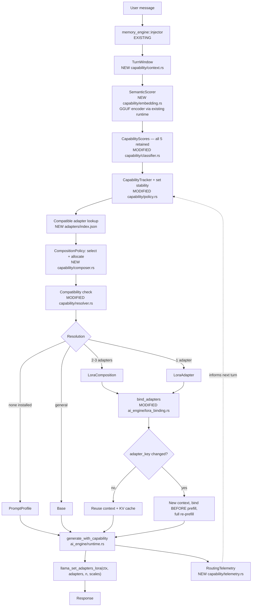
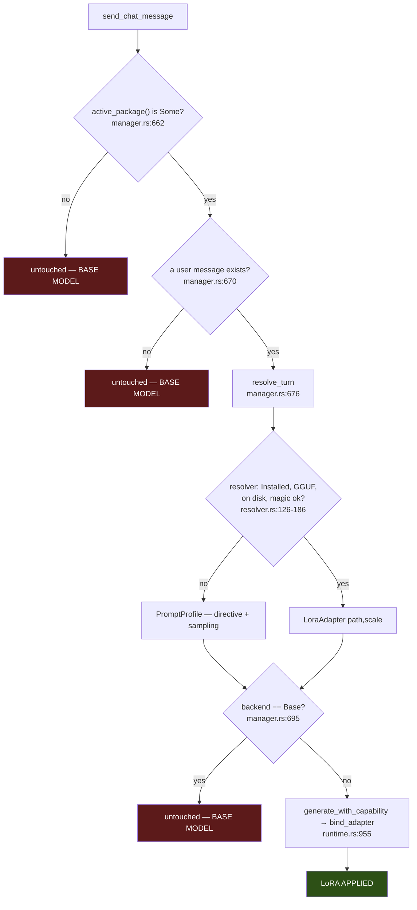
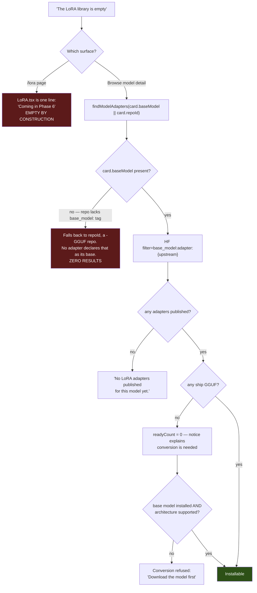
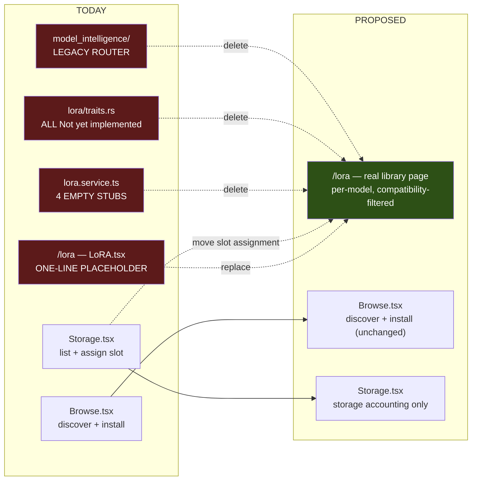

# Sarathi LoRA System — Runtime Verification and Library Design

**Status:** Investigation only. No source code modified.
**Date:** 2026-08-20

This document answers a question the earlier reports assumed rather than tested:
**does Sarathi actually apply a LoRA adapter when it generates a reply?** It then
traces why the LoRA library appears empty, and designs the multi-model adapter
library.

**Prior documents in this repository:**

| Document | Question answered |
|---|---|
| `docs/architecture/peft-lora-integration.md` (2026-08-09) | Can PEFT be the runtime switching layer? **No.** Also records 5 gaps — **its gap G6 already identified the `LoRA.tsx` stub**, confirmed independently here |
| `docs/superpowers/specs/2026-08-10-lora-end-to-end-design.md` | How does one adapter get from HF to a bound context? |
| `docs/lora-routing-investigation.md` (round 1) | Which routing mechanism should Sarathi adopt? |
| `docs/lora-multi-adapter-design.md` (round 2) | Composition mathematics and weight calculation |
| **This document (round 3)** | **Is it actually used? Why is the library empty? How should the library be structured?** |

Epistemic key, consistent with the prior documents:

| Tag | Meaning |
|---|---|
| **[SARATHI]** | Directly observed in this repository at the cited file and line |
| **[LLAMA.CPP]** | Read in the vendored upstream C++ source Sarathi compiles |
| **[RESEARCH]** | Supported by a paper or published experiment |
| **[INFERENCE]** | My own technical conclusion |
| **[PROPOSED]** | A new design I am recommending |

---

## 1. Is Sarathi Actually Using LoRA During Inference?

### Verdict: **2 — Partially implemented**, with a precise split

The mechanism is real and complete. What is missing is that it is gated behind
conditions rarely all true in practice, and one of the UI surfaces is a literal
placeholder.

| Layer | Classification | Evidence |
|---|---|---|
| **Inference binding** | **1 — fully working and actually used** | `runtime.rs:955` calls `bind_adapter` → `ctx.lora_adapter_set` |
| **Intent → capability routing** | **1 — fully working** | `manager.rs:676` → `capability::resolve_turn` |
| **Discovery + install (Browse)** | **1 — fully working** | `catalog.rs:684`, `adapters.rs:128` |
| **Manage + assign slot (Storage)** | **1 — fully working** | `Storage.tsx` → `listInstalledAdapters`, `setAdapterCapability` |
| **`/lora` page** | **4 — UI-only placeholder** | `src/pages/LoRA.tsx` is **one line** |
| **`lora.service.ts`** | **5 — not implemented** | four functions, all empty |
| **`lora/traits.rs`** | **5 — not implemented** | every method returns `Not yet implemented` |
| **Legacy `model_intelligence` router** | **3 — present but not used for inference** | reachable via IPC, never reaches the model |

### 1.1 The actual runtime path, traced end to end **[SARATHI]**

```
src/pages/Chat  →  ai.service.ts:sendChatMessage(messages, params, manualCapability)
  ↓ IPC "send_chat_message"
commands/inference.rs:109   send_chat_message
  ↓ memory extraction + injection (memory_engine)
commands/inference.rs:153   mgr.send_chat_message(&app_handle, final_messages, params, manual_capability)
  ↓
ai_engine/manager.rs:586    InferenceManager::send_chat_message
  ↓
ai_engine/manager.rs:648    prepare_capability_turn          ← ROUTING DECISION
  │   ├─ manager.rs:662     let Some(package) = self.active_package() else { return untouched() }  ← GATE 1
  │   ├─ manager.rs:670     find last message with role == "user" else { return untouched() }      ← GATE 2
  │   ├─ manager.rs:676     self.capability.resolve_turn(prompt, &package.package_dir,
  │   │                                                   &package.manifest, manual_capability)
  │   ├─ manager.rs:692     app_handle.emit("capability:changed", &payload)
  │   └─ manager.rs:695     if is_base { return untouched() }                                      ← GATE 3
  ↓ returns (messages, params, Some(CapabilityBackend::LoraAdapter { path, scale }))
ai_engine/manager.rs:605    runtime.generate_with_capability(messages, params, backend, cb)
  ↓
ai_engine/runtime.rs:730    generate_with_capability
  ├─ runtime.rs:922         wanted_adapter = Some((path, scale.to_bits()))
  ├─ runtime.rs:935         reuse_session = session.adapter_key == wanted_adapter
  ├─ runtime.rs:953         if let Some(LoraAdapter { path, scale }) = capability_backend
  ├─ runtime.rs:954             adapter_cache.get_or_init(model, path)                  ← LOAD
  └─ runtime.rs:955             lora_binding::bind_adapter(&mut ctx, adapter, *scale)   ← ACTIVATE
  ↓
ai_engine/lora_binding.rs:135   ctx.lora_adapter_set(adapter, scale)
  ↓ FFI
llama_set_adapters_lora(ctx, [ptr], 1, [scale])
  ↓ every adapted matmul, for every token
src/llama-graph.cpp:1063    build_lora_mm  →  res = ggml_add(res, ggml_scale(B·(A·x), s))
```

**The exact functions where a LoRA is applied to the model:**

1. **Loaded** — `LoraAdapterCache::get_or_init` (`ai_engine/lora_binding.rs:95`),
   calling `model.lora_adapter_init(path)`.
2. **Activated** — `bind_adapter` (`ai_engine/lora_binding.rs:128`), calling
   `ctx.lora_adapter_set(adapter, scale)`.
3. **Applied** — `llm_graph_context::build_lora_mm`
   (`llama.cpp/src/llama-graph.cpp:1063`) **[LLAMA.CPP]**, adding
   `scale · B(A·x)` to the base matmul result at every adapted tensor.

This is a real weight modification during generation, not a label. **[SARATHI]**

### 1.2 The three gates

A LoRA is applied only when **all** hold:

| Gate | Condition | Where |
|---|---|---|
| **1** | An active package is recorded — a model loaded from a Sarathi package directory with a `manifest.json` | `manager.rs:662` |
| **2** | The message list contains a `user` role message | `manager.rs:670` |
| **3** | The resolved backend is not `Base` | `manager.rs:695` |

And inside `resolve_turn`, further checks in `capability/resolver.rs:126`:

| Check | Line | On failure |
|---|---|---|
| `manifest.adapters[capability]` exists | `:131` | Prompt profile |
| `status == "Installed"` | `:136` | Prompt profile |
| `adapter_runtime_status != requires_conversion / incompatible` | `:142` | Prompt profile |
| `adapter_file` recorded | `:154` | Prompt profile |
| Extension is `.gguf` | `:161` | Prompt profile |
| File exists on disk | `:172` | Prompt profile |
| GGUF magic bytes valid | `:178` | Prompt profile |

**[INFERENCE]** So the honest answer is: **yes, whenever an adapter is installed
and assigned to the capability the turn routes to.** With an empty manifest — the
common case today (§2) — the answer is no, and the system falls back to a
*prompt profile* (system directive plus sampling overrides): a real behavioural
change, but not a weight change.

### 1.3 Answers to the specific questions in §1 of the brief

| Question | Answer |
|---|---|
| Is a LoRA actually loaded? | **Yes** — `lora_adapter_init` via `LoraAdapterCache::get_or_init`, cached by absolute path |
| Actually activated? | **Yes** — `ctx.lora_adapter_set` before any token is decoded |
| Actually applied during inference? | **Yes** — `build_lora_mm` adds the scaled low-rank delta at every adapted matmul |
| Under what conditions? | The three gates plus seven resolver checks |
| Which code activates it? | `ai_engine/lora_binding.rs:128` `bind_adapter` |
| Which model does it apply to? | The single loaded GGUF model in `LlamaCppRuntime` |
| Automatic or manual? | **Both.** Automatic by default; `manual_capability` pins a slot (`policy.rs:147`) |
| Selected based on intent? | **Yes** — `IntentClassifier::classify` → `CapabilityTracker::decide` → `CapabilityResolver::resolve` |
| Any automatic switching? | **Yes**, with hysteresis: enter 0.55, exit 0.35, release after 3 unsupported turns (`policy.rs:46`) |
| Can the selected model use the selected LoRA? | Only if converted against *that* base — enforced at conversion (§3) |
| UI-only or actually used? | **Actually used.** The badge is emitted *after* resolution (`manager.rs:692`) — with one exception, §1.4 |
| Can it use a LoRA already in the library? | **Yes**, if registered in `manifest.adapters` under a capability key |
| What if no LoRA is available? | Degrades to **prompt profile**, then **base** — never fails (`resolver.rs:104`) |

### 1.4 The one place the UI can lie **[SARATHI]**

`runtime.rs:964-972`: if `bind_adapter` fails at runtime, the code logs
`"[RUNTIME WARN] LoRA bind failed, continuing on base model"` and generates
anyway — but the `capability:changed` payload was already emitted at
`manager.rs:692` claiming backend `lora`. **The badge says `lora` while the model
runs unadapted.** The only case where the UI misrepresents runtime state.

---

## 2. Why the LoRA Library Appears Empty

**Not one cause. Five, traced, none assumed.**

### Cause 1 — The `/lora` page is a literal placeholder **[SARATHI]**

`src/pages/LoRA.tsx` is **one line**:

```tsx
export const LoRA = () => <div style={{...}}>LoRA Orchestration &mdash; Coming in Phase 6</div>;
```

Routed at `App.tsx:40` (`<Route path="lora" element={<LoRA />} />`), imported at
`App.tsx:13`. **If this is the page being looked at, it is empty by construction.**

`src/services/lora.service.ts` is the matching stub: `getLoRAs()` returns `[]`;
`loadAdapter`/`switchAdapter`/`composeAdapters` return `undefined`. Nothing calls it.

*This confirms gap **G6** already recorded in `peft-lora-integration.md:306`.*

### Cause 2 — The real adapter UI is somewhere else entirely **[SARATHI]**

Adapters are handled on two *different* pages, neither of which is `/lora`:

| Page | Calls | Purpose |
|---|---|---|
| `src/pages/Browse.tsx` | `findModelAdapters`, `downloadAdapter`, `getAdapterDetails` | Discover and install |
| `src/pages/Storage.tsx` | `listInstalledAdapters`, `setAdapterCapability` | List and assign capability slots |

Verified by grep: `listInstalledAdapters` appears only in `Storage.tsx` and its
service; `downloadAdapter` only in `Browse.tsx` and its service.

### Cause 3 — Most published adapters are not GGUF, so `readyCount` is 0 **[SARATHI]**

`commands/catalog.rs:691-703`:

```rust
let ready_count = adapters.iter().filter(|a| a.gguf_ready).count();
let notice = if adapters.is_empty() {
    Some("No LoRA adapters published for this model yet.")
} else if ready_count == 0 {
    Some(format!("{} adapter(s) found. None ship GGUF, so Sarathi converts them \
                  during install — which needs this base model installed and its \
                  family supported.", adapters.len()))
} else { None };
```

A *populated* result with `readyCount == 0` renders as a list plus an explanatory
notice — which can read as "nothing usable here."

### Cause 4 — Discovery keys on the *upstream* model id, which may be missing **[SARATHI]**

`Browse.tsx:1006`:

```tsx
findModelAdapters(card.baseModel || card.repoId)
```

→ `live_catalog::find_adapters` (`live_catalog.rs:278`) builds:

```
https://huggingface.co/api/models?filter=base_model:adapter:{base}&sort=downloads&limit=N&full=true
```

`card.baseModel` comes from `base_model_from_tags` (`discovery.rs:483`), which
reads `base_model:quantized:X` / `base_model:finetune:X` and returns `X`.

**The failure mode** **[INFERENCE]**: `base_model` is
`#[serde(skip_serializing_if = "Option::is_none")]` (`card.rs:404`), so a
quantized repo that carries **no** `base_model:` tag yields `undefined`, and the
JS `||` falls back to `card.repoId` — a `…-GGUF` repository. **No adapter author
declares a quantization repo as their base model**, so the query returns zero
results.

The download code documents this exact mismatch in another context
(`adapters.rs:196-205`):

> *"adapters are published against the original model
> (`Qwen/Qwen2.5-Coder-1.5B-Instruct`) while the GGUF weights come from whoever
> quantised it (`bartowski/...-GGUF`)"*

Also, `find_adapters` returns an empty vector if the id lacks a `/`
(`live_catalog.rs:284`) — a silent empty result, not an error.

### Cause 5 — Conversion requires the base model to already be installed **[SARATHI]**

For a PEFT adapter, `download_adapter` refuses without a resolvable base GGUF
(`adapters.rs:290`):

```rust
let base_gguf = base_gguf.ok_or_else(|| {
    let _ = std::fs::remove_dir_all(&target_dir);
    format!("No base model for '{model_id}' is installed. Download the model first — \
             an adapter is converted against the model it attaches to.")
})?;
```

And the architecture must be in the supported set (`tensor_map.rs:166`):
`llama, mistral, qwen2, qwen3, gemma, gemma2, phi3`.

### 2.1 A duplicated, UI-dead discovery engine **[SARATHI]**

There are **two** discovery implementations:

| Path | Reached from | Status |
|---|---|---|
| `live_catalog::find_adapters` → `commands/catalog.rs:684` | `Browse.tsx` | **Live** |
| `HuggingFaceAdapterProvider::discover_adapters` (`adapter_provider.rs:218`) → `commands/adapter.rs:13` | `download.service.ts` only | **No page calls it** — verified by grep across `src/pages` and `src/components` |

The second is the more sophisticated one: `extract_model_aliases`
(`adapter_provider.rs:112`), per-capability keyword search
(`search_keywords()`), and strict `base_model_name_or_path` verification (`:273`).
**[INFERENCE]** It contains precisely the alias-fallback logic that would fix
Cause 4, and it is unreachable from the UI.

---

## 3. Model ↔ LoRA Compatibility

### 3.1 In simple language

A LoRA is a small **patch** for one specific model's weights. It stores
*differences* from those exact weights. Applying it to a different model is like
applying a patch file to the wrong source tree — nothing lines up.

```
Qwen2.5-7B  +  LoRA trained on Qwen2.5-7B     →  ✅ works
Qwen2.5-7B  +  LoRA trained on Llama-3.1-8B   →  ❌ different shapes, refused
Qwen2.5-7B  +  LoRA trained on Qwen2.5-14B    →  ❌ same family, different size, refused
Qwen2.5-7B (Q4_K_M)  +  LoRA trained on Qwen2.5-7B (f16)  →  ✅ works — §3.3
```

### 3.2 What actually determines compatibility

| Factor | Matters? | Why | Enforced where |
|---|---|---|---|
| **Base model identity** | **Yes — decisive** | Deltas are relative to specific weights | `adapter_config.json` `base_model_name_or_path`; `adapter_provider.rs:273`; manifest `base_model_match` |
| **Architecture family** | **Yes — decisive** | Determines tensor names and layout | `arch::read_architecture`; `tensor_map::supports_architecture` (`:166`) |
| **Model size** | **Yes** | Sets `d_model`, `d_ff`, layer count — the shapes `A`/`B` must match | Caught at `llama_adapter_lora_init` **[LLAMA.CPP]** |
| **Tensor shapes** | **Yes — the ground truth** | `A: r×d_in`, `B: d_out×r` must match the target tensor | `llama_adapter_lora_init` errors |
| **Target modules** | **Partly** | `get_weight(w)` returns `nullptr` for untargeted tensors and **skips them** **[LLAMA.CPP]**. Extra targets are ignored, not fatal | — |
| **Rank** | **No** | Read from `b->ne[0]` at runtime; any rank works, and different-rank adapters compose fine | — |
| **Alpha** | **No** | `get_scale` normalizes it: `adapter_scale · alpha/rank` **[LLAMA.CPP]** | — |
| **Tokenizer** | **No, for binding** | LoRA touches weights, not vocabulary. A mismatched tokenizer implies a different base, which the base check already catches | — |
| **Quantization** | **No** | §3.3 | — |
| **Adapter format** | **Yes** | llama.cpp loads GGUF only; PEFT safetensors are converted first | `lora/validator.rs`; `resolver.rs:161` |

### 3.3 Why quantization does *not* break compatibility **[LLAMA.CPP]**

Counter-intuitive and worth stating plainly. From `build_lora_mm`:

```cpp
ggml_tensor * res = ggml_mul_mat(ctx0, w, cur);   // w is Q4_K_M — untouched
...
ab_cur = ggml_scale(ctx0, ab_cur, scale);
res    = ggml_add(ctx0, res, ab_cur);             // f32/f16 correction added
```

The adapter is **never merged into the quantized weights**. It is computed
separately, in higher precision, and added to the *output*. So a LoRA trained
against f16 weights applies to a Q4_K_M build of the same model with no shape or
format conflict. **[INFERENCE]** There is a *fidelity* argument — the adapter was
trained against slightly different weights — but not a compatibility one.

### 3.4 Does Sarathi already verify compatibility? **[SARATHI]** — Yes, at four points

1. **Discovery** — `verify_candidate` (`adapter_provider.rs:245`) does strict
   `base_model_name_or_path` matching. *(Dead from the UI — §2.1.)*
2. **Conversion** — `arch::read_architecture(base_gguf)` +
   `tensor_map::supports_architecture`; `convert/mod.rs:92` refuses unsupported
   families, and `peft_config.rs:110` refuses DoRA and non-LoRA PEFT types.
3. **Post-install** — `gguf::verify_is_lora_adapter` (`adapters.rs:322`) checks
   the file declares itself an adapter rather than being a whole model that
   happens to be GGUF.
4. **Bind time** — `resolver.rs:126-186` (seven checks), then
   `llama_adapter_lora_init`, which fails on any shape mismatch.

**[INFERENCE] The gap:** nothing re-checks that an adapter in
`manifest.adapters` was converted against *the currently loaded* base model.
`base_model_match` is recorded but never compared at bind time. A model replaced
in place would produce a stale record — caught by `llama_adapter_lora_init`, but
as an error at generation time rather than a clean pre-flight refusal.

---

## 4. LoRA Library Design

### 4.1 The core structural problem **[SARATHI]**

```rust
pub struct ModelPackageManifest {
    pub package_id: String,
    pub base_model: BaseManifestInfo,
    pub adapters: HashMap<String, AdapterManifestInfo>,   // keyed by CAPABILITY
    ...
}
```

One manifest **per model package**, `adapters` keyed by capability. Consequences:

- **At most one adapter per capability per model** — five slots, hard ceiling.
- **No cross-model view.** "What adapters do I have?" requires walking every
  package directory. `list_installed` (`store.rs:213`) takes a `package_dir` and
  only looks inside it.
- **No global listing for an unassigned adapter** — it exists as a directory and
  surfaces only when that package is queried.

**[INFERENCE]** This is why a *library* view does not exist: **there is no
library, only per-package folders.**

### 4.2 Proposed structure **[PROPOSED]**

Keep the per-package manifest as the **binding** record — the resolver reads it
and it works. Add a **library index** as a derived, rebuildable cache:

```
<app_data>/models/<provider>/<model>/manifest.json   ← unchanged, authoritative for binding
<app_data>/adapters/index.json                       ← NEW, derived, rebuildable
```

```jsonc
// adapters/index.json — a cache, never the source of truth
{
  "version": 1,
  "generatedAt": "2026-08-20T00:00:00Z",
  "adapters": [
    {
      "id": "qwen-coder-lora",                    // directory name, stable
      "repoId": "org/qwen-coder-lora",            // from source.txt
      "name": "Qwen Coder LoRA",
      "installedIn": "huggingface/Qwen_Qwen2.5-7B-Instruct-GGUF",
      "baseModel": "Qwen/Qwen2.5-7B-Instruct",    // upstream, for compatibility
      "architecture": "qwen2",                    // from conversion
      "capabilities": ["coding"],                 // ARRAY — see below
      "assignmentConfidence": "stated",
      "rank": 16,
      "alpha": 32.0,
      "targetModules": ["q_proj","k_proj","v_proj","o_proj","gate_proj","up_proj","down_proj"],
      "format": "gguf",
      "filePath": "adapters/qwen-coder-lora/adapter.gguf",
      "sizeBytes": 169869312,
      "checksum": "sha256:…",
      "defaultScale": 1.0,
      "enabled": true,
      "composable": true,
      "routingUtterances": ["refactor this function", "why does this fail to compile"]
    }
  ]
}
```

### 4.3 Minimum useful metadata — what earns its place

Assessed against what the code actually consumes, not what sounds complete:

| Field | Keep? | Justification |
|---|---|---|
| `id`, `repoId`, `name` | ✅ **Required** | Identity, provenance link, display |
| `baseModel` | ✅ **Required** | The only real compatibility key (§3) |
| `architecture` | ✅ **Required** | Second compatibility gate; already recorded by the converter |
| `capabilities` (**array**) | ✅ **Required, changed** | Today a single map key. An adapter can legitimately serve "coding" *and* "reasoning"; the map cannot express that |
| `filePath`, `sizeBytes` | ✅ **Required** | Binding and storage accounting |
| `format` | ✅ **Required** | `gguf` vs `safetensors` decides bindability |
| `checksum` | ✅ **Required** | Corruption detection; already present |
| `defaultScale` | ✅ **Required** | Per-adapter strength; already `scale` in the manifest |
| `assignmentConfidence` | ✅ **Keep** | Already present. Stops a guess being shown as a fact |
| `rank`, `alpha` | ✅ **Keep — for VRAM and diagnostics only** | **Must not enter weight calculation** — llama.cpp already normalizes them (§8.2) |
| `targetModules` | ⚠️ **Advisory** | Cannot gate compatibility (`get_weight` skips misses). Useful for interference analysis |
| `enabled` | ✅ **Add** | Turn off without deleting — scale 0 excludes from the graph at zero cost **[LLAMA.CPP]** |
| `composable` | ✅ **Add** | Opt-out for adapters that interfere badly |
| `routingUtterances` | ✅ **Add** | Lets an adapter outside the five-slot taxonomy still route |
| `version` | ❌ **Drop** | The checksum already identifies the artifact |
| `priority` | ❌ **Drop** | Redundant with capability scores |
| `compatibleBackends` | ❌ **Drop** | There is exactly one backend |
| `description` | ⚠️ **Optional** | Display only; `adapter_details.rs` already derives effects from tags |

**[INFERENCE]** The index must be **derived and rebuildable** from the package
manifests plus `source.txt`. `perform_startup_scan`
(`adapter_manager/mod.rs:372`) already walks packages and re-registers adapters —
extending it to emit the index means the library survives a deleted index file,
which a hand-authored one would not.

---

## 5. Automatic LoRA Selection

Already implemented (§1); this states what changes.

**Today** **[SARATHI]**: `IntentClassifier::classify` scores five intents from
weighted keyword tables, keeps the top plus a runner-up, and
`CapabilityTracker::decide` applies hysteresis. Exactly one capability, therefore
at most one adapter.

**Should Sarathi select no / one / multiple?** All three, gated by score
structure (design from round 2, §12):

```
route_strength = max_c s_c        ratio = s_2nd / s_top

route_strength < ENTER (0.55)                 → NO LoRA (base) or HOLD current
ratio < COMPOSE_RATIO (0.75)                  → ONE LoRA at w = S_max
ratio ≥ COMPOSE_RATIO, ≥2 above SELECT_θ 0.60 → MULTIPLE, weights per §8
```

The brief's examples:

| Request | Scores | Decision |
|---|---|---|
| "Write a Python program." | coding 0.93, others <0.35 | **One** — coding at 1.0 |
| "Explain this mathematical proof." | math 0.86, reasoning 0.79 | **Multiple** — ratio 0.92 |
| "Write Python code and explain the mathematical complexity." | coding 0.91, math 0.83, reasoning 0.78 | **Multiple** — three adapters |
| "What is the capital of France?" | all <0.2 | **None** — base model |

---

## 6. Multiple LoRA Support — verified, not assumed

### 6.1 Can the *current* Sarathi stack use multiple adapters? **No.** **[SARATHI]**

`ai_engine/lora_binding.rs:135` calls `ctx.lora_adapter_set(adapter, scale)` — one
adapter. `CapabilityBackend::LoraAdapter { path, scale }` holds exactly one path.

### 6.2 Does llama.cpp support it? **Yes, fully.** **[LLAMA.CPP]**

`llama.cpp/include/llama.h:682`, in the vendored tree Sarathi compiles:

```c
// Set LoRa adapters on the context. Will only modify if the adapters
// currently in context are different.
LLAMA_API int32_t llama_set_adapters_lora(
        struct llama_context * ctx,
        struct llama_adapter_lora ** adapters,
        size_t n_adapters,
        float * scales);
```

`n_adapters` is unbounded; `scales` is per-adapter. Implementation at
`src/llama-context.cpp:1210` — note a zero scale **excludes** the adapter from the
graph entirely, costing no compute:

```cpp
for (size_t i = 0; i < n_adapters; i++) {
    if (scales[i] != 0.0f) { loras->insert({adapters[i], scales[i]}); }
}
```

### 6.3 What blocks it — exactly **[SARATHI]**

```
llama.cpp C API              llama_set_adapters_lora(ctx, adapters**, n, scales*)  ← n unbounded
        ↓
llama-cpp-2 context.rs:334   lora_adapter_set(adapter, scale)                      ← hardcodes n = 1
        ↓
llama-cpp-2 model.rs:38      lora_adapter: NonNull<...>  is pub(crate)             ← pointer unreachable
        ↓
Sarathi lora_binding.rs:135  ctx.lora_adapter_set(adapter, scale)                   ← one adapter
```

The C call **replaces** the set, so calling it twice evicts the first rather than
composing.

**Checked this session:** `llama-cpp-2` **0.1.154**, current latest (2026-08-05),
still exposes only `lora_adapter_set` and `lora_adapter_remove`. Upgrading does
not fix it.

### 6.4 What needs to change **[PROPOSED]**

| Option | Assessment |
|---|---|
| **1. Upstream PR to `llama-cpp-2`** adding `set_lora_adapters(&[(&mut LlamaLoraAdapter, f32)])` | ✅ **Recommended.** Small, mechanically obvious, useful to every consumer. Also the natural place to expose `llama_adapter_lora_free` and close the leak documented at `lora_binding.rs:12-22` |
| **2. `[patch.crates-io]` fork** | ✅ Use while the PR lands |
| **3. Direct `llama-cpp-sys-2` FFI** | ⚠️ Possible — already a transitive dependency exposing `llama_adapter_lora_init`, `llama_adapter_lora_free`, and `llama_set_adapters_lora` (verified in the vendored `llama.h`). **Not recommended**: duplicates handle ownership and undermines the existing `unsafe impl Send for SendAdapter` reasoning |

---

## 7. How Multiple LoRAs Work

### 7.1 In simple language

A LoRA does not replace the model. It is a **small correction added on top**.

```
Base model answer  +  small coding nudge  +  small maths nudge  =  final answer
```

Each adapter computes its own nudge from the same input, each nudge is multiplied
by a strength dial, and all are added to what the base model produced. The base
model's weights are **never edited** — which is why nothing can be corrupted and
why turning an adapter off is instant.

### 7.2 The actual mathematics, verified from source **[LLAMA.CPP]**

The formula in the brief is close but not what the implementation computes. From
`src/llama-graph.cpp:1063`:

```cpp
ggml_tensor * res = ggml_mul_mat(ctx0, w, cur);          // base, quantized, untouched

for (const auto & lora : *loras) {
    llama_adapter_lora_weight * lw = lora.first->get_weight(w);
    if (lw == nullptr) { continue; }                     // adapter doesn't target this tensor

    const float adapter_scale = lora.second;
    const float scale = lw->get_scale(lora.first->alpha, adapter_scale);

    ggml_tensor * ab_cur = ggml_mul_mat(ctx0, lw->b,
                               ggml_mul_mat(ctx0, lw->a, cur));
    ab_cur = ggml_scale(ctx0, ab_cur, scale);
    res    = ggml_add(ctx0, res, ab_cur);
}
```

and `src/llama-adapter.h:53`:

```cpp
float get_scale(float alpha, float adapter_scale) const {
    const float rank  = (float) b->ne[0];
    const float scale = alpha ? adapter_scale * alpha / rank : adapter_scale;
    return scale;
}
```

So the true formula is:

```
h  =  W x  +  Σᵢ  sᵢ · (αᵢ / rᵢ) · Bᵢ (Aᵢ x)
```

**Three corrections to `W' = W + ΔW₁s₁ + …` as written in the brief**
**[INFERENCE]**:

1. **The `αᵢ/rᵢ` term is missing.** llama.cpp always applies it. Since PEFT
   *trains* with `α/r` applied, **`s = 1.0` reproduces training-time behaviour for
   any rank and any alpha** — `s` is a *fraction of trained strength*, not a
   magnitude.
2. **It is never computed in weight space.** `ΔW` is never materialized; `B(A·x)`
   acts on the activation. This is why adapters of **different ranks compose
   fine** — they are never summed as matrices.
3. **`get_weight(w)` returning `nullptr` skips the adapter for that tensor**, so
   adapters targeting different modules simply do not interact there.

Weight-space equivalent, for intuition only:

```
W' = W + Σᵢ sᵢ · (αᵢ/rᵢ) · Bᵢ Aᵢ
```

---

## 8. How the LoRA Weights Are Decided

Full derivation in `docs/lora-multi-adapter-design.md` §12; conclusions here.

### 8.1 Is `confidence = LoRA scale` correct? **No.** **[INFERENCE]**

| | Intent confidence | LoRA scale |
|---|---|---|
| Answers | "How sure am I this is a coding request?" | "How hard should the coding adapter push?" |
| Type | Epistemic — a probability | Physical — a magnitude |
| Right response to a low value | **Don't act** | Act gently |

**The decisive argument:** the same coding request phrased tersely might score
0.62 and phrased explicitly 0.95. Under `scale = confidence` the **identical
task** receives 0.62× versus 0.95× adapter strength — the model behaves
differently because of *how the user phrased it*, not *what they asked*. That is
not adaptation; it is non-determinism driven by an irrelevant variable.

### 8.2 The approaches, evaluated

Given `coding 0.90, reasoning 0.80, math 0.60`:

| Approach | Result | Verdict |
|---|---|---|
| **Direct scores** | 0.90, 0.80, 0.60 → Σ = 2.30 | ❌ 2.3× a single adapter's trained operating point. **[RESEARCH]** ([arXiv:2507.17075](https://arxiv.org/pdf/2507.17075)) reports utility loss above 1.0 |
| **Normalized** | 0.391, 0.348, 0.261 → Σ = 1.0 | ⚠️ Forces Σ=1 always: a lone adapter is pinned to 1.0 with no gentler option |
| **Normalized × global strength** | above × `S_max` | ✅ **Recommended** |
| **Confidence-weighted** | conf × score × reliability | ⚠️ Keep `reliability` as a *filter*; drop the confidence multiplier (§8.1) |
| **Learned (telemetry / LoraHub CMA-ES)** | — | ⚠️ Correct destination; needs logged outcomes that do not exist yet |
| **Adapter default scale × router score** | router × `α/r` | ❌ **Double-correction.** `get_scale` already applies `α/r`; applying it again squares the term |

### 8.3 The algorithm **[PROPOSED]**

```
w_c = clamp( S_max · s_c / Σ_{k∈C} s_k ,  W_MIN,  W_MAX )
```

with `C` = capabilities scoring ≥ `SELECT_θ`, compatible, installed, enabled.

| Parameter | Default | Provenance |
|---|---|---|
| `SELECT_θ` | 0.60 | **[PROPOSED]** above `ENTER` so a composed adapter clears a higher bar |
| `S_max` (total budget) | 1.0 | **[RESEARCH]**-anchored: 1.0 is the trained operating point |
| `W_MIN` | 0.15 | **[INFERENCE]** below this an adapter costs a full re-prefill for ~nothing |
| `W_MAX` | 1.0 | **[RESEARCH]** never exceed trained strength |
| `K_max` | 3 | **[INFERENCE]** no evidence base beyond 3 at this library size — a tunable, not a finding |

### 8.4 Should weights sum to 1? **No — they should be *bounded*.** **[INFERENCE]**

`Σw ≤ S_max`, not `Σw = 1`.

- Forcing `Σw = 1` pins a *single* adapter to full strength with no ability to
  apply it gently, and lets a weak third intent steal budget from a strong first.
- Leaving each `wᵢ` independent in `[0,1]` lets three adapters at 1.0 apply 3× the
  perturbation of the well-tested single-adapter case.
- A **budget** preserves the property that matters: total perturbation never
  exceeds one adapter at trained strength — the configuration that already works.

---

## 9. Worked Example

**"Analyze this Python code, explain its complexity, and optimize it."**

| Step | Simple language | Value |
|---|---|---|
| **1. Message** | What the user typed | *(above)* |
| **2. Context** | Turn 1, so just this message | window = 1 turn |
| **3. Intent detection** | Compare meaning to example phrases for each skill | cosine similarity per capability |
| **4. Scores** | How strongly each skill is called for | `coding 0.91` · `reasoning 0.84` · `mathematics 0.62` · `research 0.10` · `tool-calling 0.05` |
| **5. Signals** | Strongest skill, how close second place is | `route_strength 0.91` · `ratio = 0.84/0.91 = 0.923` |
| **6. Specialize?** | 0.91 clears the 0.55 bar | yes |
| **7. One or many?** | Second place is 92% of first — too close to ignore | `0.923 ≥ 0.75` ⇒ **compose** |
| **8. Selected** | Everything scoring ≥ 0.60 | coding, reasoning, mathematics |
| **9. Rejected** | Below the bar | research (0.10), tool-calling (0.05) |
| **10. Compatibility** | Same base model, same architecture, valid GGUF, alpha present, composable, enabled | all three pass |
| **11. Shares** | Divide 100% between the three, proportional to score | `Σ = 2.37` → `0.384, 0.354, 0.262` |
| **12. Final scales** | Multiply by the total strength budget (1.0) | **coding 0.384 · reasoning 0.354 · mathematics 0.262**; Σ = 1.000 ✓ |
| **13. llama.cpp call** | Hand all three to the engine at once | `llama_set_adapters_lora(ctx, [coding, reasoning, math], 3, [0.384, 0.354, 0.262])` |
| **14. What the model computes** | Base answer plus three weighted nudges | `h = Wx + 0.384·(α_c/r_c)·B_c(A_c x) + 0.354·(α_r/r_r)·B_r(A_r x) + 0.262·(α_m/r_m)·B_m(A_m x)` |
| **15. KV cache** | Adapter set changed, so the conversation must be re-read | rebuild + full re-prefill |
| **16. Response** | Generated with all three specializations active | — |

**Why the numbers are what they are, in plain terms:** the request genuinely needs
all three skills, so all three are switched on. But turning three adapters fully
on would push the model three times further from its normal behaviour than a
single adapter does — which is where quality breaks down. So the three *share*
one adapter's worth of strength, split in proportion to how strongly each skill
was called for.

---

## 10. LoRA Interference

**Can two adapters conflict? Yes.** **[INFERENCE]** Safe in that nothing can crash
or corrupt the model — §7.2 proves the base weights are read-only. **Not** safe in
the sense of guaranteed quality improvement.

| Risk | Mechanism | Safeguard **[PROPOSED]** |
|---|---|---|
| **Scale explosion** | `Σ sᵢ` grows with adapter count; perturbation leaves the trained regime | **`Σw ≤ S_max`** — the primary safeguard |
| **Sign conflict** | Two adapters push the same weight in opposite directions | Not resolvable at runtime; TIES/DARE need materialized deltas. Bounded by the budget, detected by benchmark |
| **Same target modules** | **All Sarathi-converted adapters hit `q/k/v/o/gate/up/down`** (`tensor_map.rs:126`) — they *always* overlap | Accepted; this is the normal case |
| **Rank differences** | A problem for PEFT `linear` merge | **Not a problem here** — never summed as matrices |
| **Alpha differences** | Different trained operating points | **Already normalized** by `get_scale` |
| **Training objective** | A "writing" adapter and a "coding" adapter may pull toward incompatible styles | Only detectable by evaluation; `composable = false` opt-out |
| **Negative transfer** | B degrades A's task | Benchmark sweep; per-pair exclusion |

**[RESEARCH]** MergeRepair ([arXiv:2408.09568](https://arxiv.org/abs/2408.09568))
merged task-specific adapters in code LLMs, comparing weight-averaging against
TIES and DARE-TIES, and found the *order and weight* of merged adapters matters
significantly. Support for two claims: composition is worth doing, and naive equal
weighting is not automatically best.

**[INFERENCE] The honest position:** no published result guarantees that composing
two arbitrary third-party LoRAs improves output. The design is therefore built so
composition is *bounded, reversible, observable, and individually disableable* —
not so that it is assumed correct.

---

## 11. LoRA Switching Across Turns

**[SARATHI]** Hysteresis already exists (`policy.rs`): enter 0.55, exit 0.35,
release after 3 unsupported turns, manual override wins.

**[PROPOSED]** Composition requires extending hysteresis from the *capability* to
the *set*, because the state space grows from 6 to 2⁵ subsets:

```
change the active set only if EITHER
  (a) some c ∉ active has  s_c ≥ SELECT_θ + ADD_MARGIN            # promotion
  (b) some c ∈ active has  s_c < EXIT for MAX_UNSUPPORTED turns   # demotion
otherwise HOLD, regardless of score reordering
```

**Score reordering alone must never trigger a rebuild.** And because a weight
change also invalidates the cache (§12), **weights must be frozen while the set is
held.**

| Turn | Request | Decision | Cost |
|---|---|---|---|
| 1 | "Write Python code." | SINGLE {coding 1.0} | New context, prefill |
| 2 | "Now explain why this algorithm works." | reasoning promoted → COMPOSE {coding, reasoning} | **Rebuild + full re-prefill** |
| 3 | "Prove the complexity mathematically." | math ≥ `SELECT_θ + ADD_MARGIN` → {reasoning, math} only if coding has been below EXIT for 3 turns; otherwise **HOLD** | Held = free |

Switching cost is the dominant cost in the entire system (§13).

---

## 12. KV Cache Behaviour

### 12.1 llama.cpp does *not* invalidate the cache **[LLAMA.CPP]**

`llama_context::set_adapters_lora` (`src/llama-context.cpp:1210`) rebuilds the
`loras` map and sets `sched_need_reserve`. **It never reads, clears, or flags the
KV cache.**

This is a bug, not a feature: a KV entry for token *t* was produced with whatever
adapter set was active then. llama.cpp issue
[#26207](https://github.com/ggml-org/llama.cpp/issues/26207) — *"prompt cache is
reused across requests with different per-request `lora` — output silently
contaminated by the previous adapter"* — is the empirical demonstration, and it is
**open**.

### 12.2 Sarathi does it correctly **[SARATHI]**

`runtime.rs:935`:

```rust
let reuse_session = session.as_ref()
    .is_some_and(|s| s.n_ctx == ctx_size.get() && s.adapter_key == wanted_adapter);
```

`adapter_key` includes `scale.to_bits()` (`runtime.rs:924`). **This is the exact
fix #26207 asks for, implemented before upstream did it.**

### 12.3 Every transition

| Transition | Cache | Why |
|---|---|---|
| **no LoRA → LoRA** | **Rebuild** | Prior entries computed unadapted |
| **LoRA A → LoRA B** | **Rebuild** | Different model |
| **LoRA A → A+B** | **Rebuild** | Adding B changes every subsequent computation. **Not cheaper than a swap** |
| **A+B → B** | **Rebuild** | Same reason |
| **A → A, different scale** | **Rebuild** | A different scale is a different model; `adapter_key` includes the scale bits |
| **A → A, same scale** | **Reuse — fully safe** | `adapters_lora_are_same` makes re-setting a free no-op **[LLAMA.CPP]**; `reusable_prefix` (`runtime.rs:1014`) then prefills only the new tail |

**[INFERENCE]** Because adding an adapter costs the same as swapping one,
composition must be decided **once per turn over the whole set**, never
incrementally.

---

## 13. Performance

**MEASURED [SARATHI]**
- GPU: RTX 5060 Laptop, **8151 MiB** (`nvidia-smi`)
- Adapter init logged in **ms**, bind logged in **µs** (`lora_binding.rs:110,138`)
- In-tree note: *"on a CPU-only build a coding agent's system prompt measured
  ~98s"* prefill (`runtime.rs:999`)

**COMPUTED** from Qwen2.5-7B geometry (28 layers, `d_model` 3584, 4 KV heads × 128,
`d_ff` 18944), `r=16` on seven projections: **≈ 40.4 M params ≈ 161 MB in f32**
(the converter widens bf16 → f32, `safetensors_reader.rs:15`); f16 would be ≈ 81 MB.
The LoRA path is **0.89% of base FLOPs** per adapter.

| Cost | Value | Class |
|---|---|---|
| Adapter first load | 50–300 ms | **ESTIMATED** (logged in ms) |
| Adapter activation (`set_adapters_lora`) | <1 ms; **free if unchanged** | **[LLAMA.CPP]** |
| Semantic classification | 5–20 ms | **ESTIMATED** |
| 1 / 3 adapters, FLOPs | +0.9% / +2.7% | **COMPUTED** |
| 1 / 5 adapters, wall-clock | +2–5% / +10–25% | **ESTIMATED** — graph nodes and kernel launches cost more than the FLOP ratio |
| **Re-prefill 1k / 2k / 4k / 8k tokens** | **1–2.5 s / 2–5 s / 4–10 s / 8–20 s** | **ESTIMATED** (400–1000 tok/s GPU) |
| VRAM: base Q4_K_M + KV @ 8k + 3 adapters | 4400 + 900 + 483 = **5783 MiB** of ~6381 usable | **COMPUTED** from `vram_planner` constants |
| VRAM: 5 adapters at r=32 | 6915 MiB | **COMPUTED — over budget** |

**[INFERENCE] Which cost dominates: the KV-cache rebuild, by one to two orders of
magnitude.** Classification is milliseconds, binding microseconds, composition
single-digit percent. **A single unnecessary adapter change at 4k context costs
more than every routing decision in an entire session.** Optimize switch
*frequency*; never optimize bind latency.

---

## 14. Model-Specific LoRA Library

**[PROPOSED]** The compatibility filter is a pure function of `baseModel` +
`architecture`, both already recorded:

```
compatible(adapter, loaded_model) :=
      adapter.baseModel    == loaded_model.upstreamBaseModel
   && adapter.architecture == loaded_model.architecture
   && adapter.format       == "gguf"
```

```
adapters/index.json
├── Qwen/Qwen2.5-7B-Instruct   (qwen2)
│   ├── coding      → qwen-coder-lora      r16 α32  161 MB
│   ├── mathematics → qwen-math-lora       r16 α32  161 MB
│   └── reasoning   → qwen-cot-lora        r32 α64  323 MB
├── meta-llama/Llama-3.1-8B    (llama)
│   ├── coding      → llama-code-lora
│   └── research    → llama-research-lora
└── google/gemma-2-9b          (gemma2)
    └── reasoning   → gemma-reason-lora
```

When the loaded model changes:

1. `InferenceManager::load_model` records the active package (`manager.rs:507`)
   and calls `self.capability.reset()` (`:515`) — **stickiness already clears
   correctly.** **[SARATHI]**
2. **[PROPOSED]** The library view filters `index.json` by the compatibility
   predicate; incompatible adapters are shown **greyed with a reason**, not
   hidden — a hidden adapter looks like a missing one.
3. The router only ever considers compatible adapters, because it reads
   `manifest.adapters` for the active package, which by construction contains only
   adapters installed against that base.

---

## 15. Download / Install Flow

**[SARATHI]** Current behaviour: `download_adapter` is **explicitly user-initiated**
from `Browse.tsx`. Nothing downloads automatically. Verification is thorough:
file-list pre-check, size ceiling (`MAX_ADAPTER_BYTES = 2 GB`), conversion,
`verify_is_lora_adapter`, and cleanup of `target_dir` on every failure path.

**[PROPOSED] Safest UX when a capability has no adapter: never download
automatically.**

```
Router wants "coding"
  ↓
Installed, assigned, enabled?  ──yes──► bind it
  ↓ no
Compatible adapter exists in the library but not installed?
  ↓ yes                                    ↓ no
Use the PROMPT PROFILE now (already        Use the prompt profile.
implemented, resolver.rs:109), and         Offer discovery in Browse.
surface a non-blocking suggestion:
"A coding skill is available for this
model — install it? (161 MB)"
```

**[INFERENCE] Why not auto-download:** an adapter is 80–320 MB; a router decision
is a *guess*; and the download would block the reply the user is waiting for. The
prompt-profile fallback already delivers the capability at reduced fidelity, so
there is no urgency. Auto-download turns a low-confidence classification into
hundreds of megabytes of unrequested network traffic.

**[PROPOSED] Verification before use** — the existing chain is right; extend it
with two checks:

1. ✅ File-list pre-check (`store::check_installable`)
2. ✅ Size ceiling
3. ✅ Conversion refuses DoRA / non-LoRA / unsupported architecture
4. ✅ `verify_is_lora_adapter` — declares itself an adapter, not a model
5. ✅ GGUF magic at bind time
6. ⬜ **Add:** `adapter.lora.alpha` present — a missing alpha is silently applied
   at raw scale, typically **half strength**, with no error
7. ⬜ **Add:** path containment — `adapter_file` is joined onto `package_dir` with
   no traversal check (`resolver.rs:159`)

---

## 16. User Control

**[SARATHI]** Today: `Storage.tsx` lists installed adapters and assigns capability
slots; `Browse.tsx` discovers and installs; `manual_capability` pins one slot.

| Capability | Today | Proposed **[PROPOSED]** |
|---|---|---|
| View installed | ✅ `Storage.tsx` | Move to a real `/lora` library page |
| View compatible-but-not-installed | ❌ | Library page, greyed with reason |
| Download | ✅ `Browse.tsx` | Also from the library page |
| Enable / disable without deleting | ❌ | `enabled: bool` — scale 0, which llama.cpp excludes from the graph at no cost **[LLAMA.CPP]** |
| Manually select one | ✅ `manual_capability` | unchanged |
| Manually select several | ❌ | `"coding,reasoning"` |
| Set strength | ❌ (manifest-only, hand-edited) | Per-adapter slider → `defaultScale`; global `S_max` dial |
| Disable automatic routing | ⚠️ `"none"` forces base | Explicit toggle |

**Should manual selection override automatic routing? Yes, unconditionally.**
**[INFERENCE]** A user naming an adapter has information the classifier does not —
and `policy.rs:147` already implements this correctly. But `W_MAX`, `S_max`, and
the §3 compatibility checks **still apply**: those are safety invariants, not
routing preferences. A requested weight above `W_MAX` should be clamped with a
visible warning — not silently honoured, and not refused.

Proposed override grammar:

| Input | Meaning |
|---|---|
| `"auto"` / `null` | Automatic routing (default) |
| `"none"` | Base model, no adapter |
| `"coding"` | Pin one adapter at `S_max` |
| `"coding,reasoning"` | Pin the set; allocate per §8 over the named set |
| `"coding:0.7,reasoning:0.3"` | Pin set and weights; still clamped and budget-checked |

---

## 17. Final Architecture



### Diagram — the three gates that decide whether a LoRA is applied today



### Diagram — why the library looks empty



### Diagram — current vs. proposed adapter surfaces



### Diagram — adapter lifecycle

```mermaid
stateDiagram-v2
    [*] --> Discovered: live_catalog::find_adapters
    Discovered --> Refused: check_installable — merged model / too large
    Discovered --> Fetching: download_adapter
    Fetching --> ConvertNeeded: PEFT safetensors
    Fetching --> Verifying: ships GGUF
    ConvertNeeded --> NoBase: base model not installed
    ConvertNeeded --> Converting: base GGUF resolved
    Converting --> Verifying: convert_adapter, atomic rename
    Converting --> Failed: DoRA / unsupported arch
    Verifying --> Registered: verify_is_lora_adapter, then assign::infer
    Verifying --> Failed: not an adapter
    Registered --> Unassigned: tags gave no capability
    Registered --> Ready: manifest.adapters[capability]
    Unassigned --> Ready: user picks a slot (set_adapter_capability)
    Ready --> Cached: lora_adapter_init on first use
    Cached --> Bound: lora_adapter_set(scale)
    Bound --> Bound: same set next turn — KV cache reused
    Bound --> Cached: different set — context dropped, full re-prefill
    Cached --> Ready: model unload — LoraAdapterCache::clear
    Failed --> [*]
    Refused --> [*]
    NoBase --> [*]

    note right of Unassigned
        Installed but never bound.
        The resolver can only bind what
        manifest.adapters[capability] names.
    end note
```

---

## 18. Actual File Mapping

| File | Currently does | Needs to change | New symbols |
|---|---|---|---|
| `src/pages/LoRA.tsx` | **One-line placeholder** | **Replace** with the real library page: per-model grouping, compatibility filter, install / enable / strength controls | `AdapterLibrary`, `AdapterCard`, `CompatibilityBadge` |
| `src/services/lora.service.ts` | 4 empty stubs | **Delete**; the page uses `adapters.service.ts` | — |
| `src-tauri/src/lora/traits.rs` | All `Not yet implemented` | **Delete** — nothing implements them | — |
| `model_intelligence/{intent,adapter_router}.rs` | Legacy router, live via `route_prompt_capability` | **Delete**; move `PromptIntent` into `capability/` | — |
| `commands/adapter.rs` + `adapter_provider.rs` | Sophisticated discovery, **no page calls it** | Wire its `extract_model_aliases` fallback into `live_catalog::find_adapters`, or delete | — |
| `model_providers/huggingface/live_catalog.rs:278` | `find_adapters` on the exact base id | **Add alias fallback** when the exact query returns nothing (Cause 4) | `find_adapters_with_fallback` |
| `adapter_manager/mod.rs` | `manifest.adapters: HashMap<capability, Info>` | Add `capabilities: Vec<String>`, `enabled: bool`, `composable: bool`, `routing_utterances: Vec<String>` — all `serde(default)` | — |
| `adapter_manager/store.rs:213` | `list_installed(package_dir, …)` — one package | **Add** a cross-package walk emitting the library index | `build_library_index`, `LibraryIndex` |
| `adapter_manager/mod.rs:372` | `perform_startup_scan` | Also emit `adapters/index.json` | — |
| `capability/resolver.rs:126` | 7 checks, single capability | `resolve_many`; **path containment**; **clamp scale**; **verify `base_model_match` against the loaded model** | `resolve_many`, `assert_within_package` |
| `capability/classifier.rs:243` | Computes 5 scores, discards 3 | **Return all**; new saturation constant for `[0,1]` similarities | `CapabilityScores` |
| `capability/policy.rs` | Capability hysteresis | **Set** stability; switch-cost margin | `SwitchDecision::Compose` |
| `capability/composer.rs` | — | **NEW** — §8 algorithm | `CompositionPolicy`, `derive_weights` |
| `capability/{embedding,context,utterances,telemetry}.rs` | — | **NEW** | `SemanticScorer`, `TurnWindow`, `RoutingTelemetry` |
| `ai_engine/lora_binding.rs:128` | `bind_adapter` — one adapter | **`bind_adapters`** (slice); `preload`; read back `adapter.lora.alpha` and warn if absent | `bind_adapters` |
| `ai_engine/runtime.rs:922` | `adapter_key: Option<(PathBuf, u32)>` | **Ordered `Vec<(PathBuf, u32)>`**; **emit a corrected `capability:changed` when bind fails** (§1.4) | — |
| `ai_engine/manager.rs:648` | `prepare_capability_turn`, last message only | Pass a turn window and the live KV token count | — |
| `gateway/server.rs:382` | `capability: None` | Honour `GatewayConfig::apply_capabilities` | — |
| `src-tauri/Cargo.toml` | `llama-cpp-2 = "0.1"` | `[patch.crates-io]` fork exposing `n > 1` + `Drop` | — |

---

## 19. Final Answers

| # | Question | Answer |
|---|---|---|
| 1 | Is Sarathi currently using LoRA during inference? | **Yes — when one is installed and assigned.** The mechanism is complete and real, gated behind three conditions plus seven resolver checks. Classification: **partially implemented** |
| 2 | If yes, exactly where and how? | `lora_binding.rs:95` loads (`lora_adapter_init`), `:135` activates (`lora_adapter_set`), `llama-graph.cpp:1063` applies it per token. Called from `runtime.rs:955`, decided by `manager.rs:648` |
| 3 | If no, what prevents it? | Nothing structural. In practice: no adapter installed, so `manifest.adapters` is empty and the resolver degrades to a prompt profile |
| 4 | Why does the library show no usable adapters? | **Five causes** (§2): the `/lora` page is a one-line placeholder; the real UI is in Browse/Storage; most HF adapters are PEFT so `readyCount == 0`; discovery falls back to a `-GGUF` repo id no adapter declares as its base; conversion requires the base model installed and a supported architecture |
| 5 | How should the library be structured? | Per-package `manifest.json` stays authoritative for binding; add a **derived, rebuildable** `adapters/index.json` for the cross-model view (§4.2) |
| 6 | How should adapters be associated with models? | `baseModel` (upstream id) + `architecture`, both already recorded. Compatibility is a pure function of the two (§14) |
| 7 | How should automatic intent-based selection work? | Semantic scores → `route_strength` gate → `ratio` decides single vs. compose → threshold + compatibility filter → weight allocation (§5, §8) |
| 8 | Can multiple LoRAs be active simultaneously? | **Not in Sarathi today. Yes in llama.cpp** — `llama_set_adapters_lora` takes an unbounded `n` with per-adapter scales |
| 9 | If yes, exactly how? | `h = Wx + Σᵢ sᵢ·(αᵢ/rᵢ)·Bᵢ(Aᵢx)` — additive, never merged, computed on activations (§7.2) |
| 10 | If no, can it be added? | **Yes.** `llama-cpp-2` hardcodes `n = 1` at `context.rs:334`; upstream PR or `[patch.crates-io]` fork. 0.1.154 is unchanged |
| 11 | How are multiple weights calculated? | `w_c = clamp(S_max · s_c / Σ s_k, W_MIN, W_MAX)` (§8.3) |
| 12 | Should weights sum to 1? | **No — bounded: `Σw ≤ S_max`, default 1.0** (§8.4) |
| 13 | Is confidence the same as LoRA strength? | **No.** Equating them makes behaviour depend on phrasing rather than task (§8.1) |
| 14 | How should conflicting LoRAs be handled? | Budget bound + `W_MAX` + `K_max` + `composable = false` opt-out. Interference cannot be resolved at runtime; it is bounded and measured (§10) |
| 15 | How should switching work? | Hysteresis on the **set**, not just the top capability; score reordering alone never rebuilds; weights frozen while the set is held (§11) |
| 16 | What happens to the KV cache? | **Every** adapter-set or weight change forces a full re-prefill. llama.cpp does not do this itself (#26207); Sarathi already does it correctly and must keep doing so (§12) |
| 17 | What happens to performance? | +0.9% FLOPs per r=16 adapter; +2–5% wall-clock estimated. **The re-prefill dominates by 1–2 orders of magnitude** (§13) |
| 18 | What changes are required? | §18 — 15 modified, 5 new, 4 deleted, plus one upstream patch |
| 19 | What can be reused? | **Most of it.** The binding path, adapter cache, PEFT→GGUF converter, validator, state machine, capability assignment, degrading resolver, hysteresis policy, download/verify/register pipeline, and the `capability:changed` event contract |
| 20 | What should be implemented first? | **Replace `LoRA.tsx` with a real library page, and add the discovery alias fallback.** Together they make adapters *findable and installable* — the precondition for everything else — and neither needs the fork |

---

## 20. Implementation Roadmap

| Phase | Goal | Files | Depends on | Expected result | Risk |
|---|---|---|---|---|---|
| **0** | Cleanup | Delete `lora/traits.rs`, `model_intelligence/{intent,adapter_router}.rs`, `lora.service.ts`; wire gateway | — | One router, no dead stubs | None |
| **1** | **Make adapters findable** | `live_catalog.rs` alias fallback; `commands/catalog.rs` notice wording | — | Discovery stops silently returning zero for `-GGUF` repos | Low |
| **2** | **Real library page** | Replace `src/pages/LoRA.tsx`; extend `adapters.service.ts` | Phase 1 | Per-model library with compatibility filter, install, slot assignment, strength | Low — UI only |
| **3** | Library index | `adapter_manager/store.rs`, `mod.rs:372` startup scan | Phase 2 | Cross-model view; survives index deletion | Low |
| **4** | Fix the badge lie | `runtime.rs:964`, `manager.rs:692` | — | Badge stops claiming `lora` after a failed bind | Low, high value |
| **5** | Semantic routing | `capability/{embedding,context,utterances}.rs` (new), `classifier.rs` | — | Paraphrase and follow-up routing works | **The saturation-constant trap would silently disable routing** — round 2 §12.3 |
| **6** | Multi-intent scores | `classifier.rs`, `capability/mod.rs` | Phase 5 | Scores surfaced; still single-adapter | Low |
| **7** | Multi-LoRA infrastructure | `llama-cpp-2` fork; `Cargo.toml`; `lora_binding.rs` | — | Composition becomes possible | Fork maintenance |
| **8** | Weight calculation | `capability/composer.rs` (new), `profile.rs`, `resolver.rs` | 6 + 7 | Bounded, deterministic weights | Low — pure arithmetic |
| **9** | KV-cache-safe switching | `runtime.rs`, `policy.rs` | Phase 8 | Ordered multi-adapter key; set stability | **Highest correctness risk** — #26207's failure mode |
| **10** | Safety + performance | `resolver.rs` (containment, clamp, base-model check), `vram_planner.rs`, `scheduler.rs` | Phase 9 | Preload, VRAM-budgeted adapter count, adapter affinity | Medium |
| **11** | Testing + benchmarking | `capability/eval.rs`, `telemetry.rs`, `tests/` | All | Guessed constants replaced by measurements | Low |

**Why Phases 1–2 come first** **[INFERENCE]**: the routing engine is already built
and working. What is missing is that users cannot easily find, install, or see
adapters — so the engine has nothing to route to. Fixing discovery and the library
page makes the *existing* system visibly work, requires no fork, and creates the
conditions under which composition is worth building.

---

## 21. Sources

**Primary — Sarathi source, read this session**
`ai_engine/{manager,runtime,lora_binding,scheduler,vram_planner}.rs` ·
`capability/{mod,classifier,policy,resolver,profile,assign,eval}.rs` ·
`adapter_manager/{mod,store,state_machine,gguf}.rs` ·
`lora/{validator,traits}.rs`, `lora/convert/{mod,peft_config,tensor_map,gguf_writer,safetensors_reader,arch}.rs` ·
`commands/{inference,adapter,adapters,adapter_details,catalog,intelligence}.rs` ·
`model_providers/huggingface/{live_catalog,adapter_provider,card,discovery}.rs` ·
`model_intelligence/{intent,adapter_router}.rs` · `gateway/{server,state}.rs` · `lib.rs` ·
`src/pages/{LoRA,Browse,Storage}.tsx` · `src/services/{adapters,catalog,lora,ai,intelligence}.service.ts` ·
`src/App.tsx` · `Cargo.toml`, `Cargo.lock` · `certification.json` ·
`docs/architecture/peft-lora-integration.md`

**Primary — llama.cpp, vendored tree Sarathi compiles**
(`llama-cpp-sys-2-0.1.153/llama.cpp/`):
`include/llama.h:649-686` · `src/llama-adapter.h:50-66` (`get_scale`) ·
`src/llama-graph.cpp:1063-1092` (`build_lora_mm`) ·
`src/llama-context.cpp:1210-1252` (`set_adapters_lora`)

**Primary — upstream**
- [llama.cpp issue #26207 — prompt cache reused across different per-request `lora`](https://github.com/ggml-org/llama.cpp/issues/26207)
- [llama.cpp server README](https://github.com/ggml-org/llama.cpp/blob/master/tools/server/README.md)
- [docs.rs llama-cpp-2 0.1.154 `LlamaContext`](https://docs.rs/llama-cpp-2/0.1.154/llama_cpp_2/context/struct.LlamaContext.html)
- [PEFT model merging](https://huggingface.co/docs/peft/developer_guides/model_merging)

**Research**
- [LoraHub (COLM 2024, arXiv:2307.13269)](https://arxiv.org/pdf/2307.13269)
- [MergeRepair (arXiv:2408.09568)](https://arxiv.org/abs/2408.09568)
- [LoRA is All You Need for Safety Alignment (arXiv:2507.17075)](https://arxiv.org/pdf/2507.17075) — scale >1.0 degrades utility
- [Arrow / Library of LoRAs (ICML 2024)](https://proceedings.mlr.press/v235/ostapenko24a.html) · [SpectR (arXiv:2504.03454)](https://arxiv.org/pdf/2504.03454) · [X-LoRA (arXiv:2402.07148)](https://arxiv.org/abs/2402.07148)

**Measured environment**
`nvidia-smi` — NVIDIA GeForce RTX 5060 Laptop GPU, **8151 MiB**.

---

## 22. Note on the Working Tree

`git status` shows three modified files: `commands/catalog.rs`,
`model_providers/huggingface/card.rs`, `src/pages/Browse.tsx`. The diff concerns
**quantization label quality notes** — adding `FP16`/`FP32`/`MXFP4`/`TQ` handling
to `quality_note` and `is_low_quality`. **Unrelated to adapters**, and it does not
affect any conclusion here.
